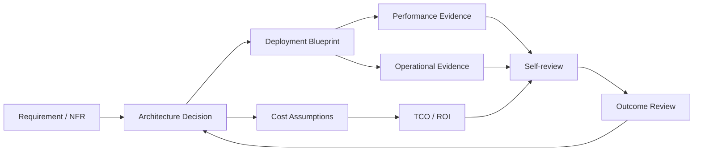

# ArchPilot — Product Charter

| Field | Value |
|---|---|
| Product | ArchPilot |
| Working category | Architecture and Technology Value Engineering Platform |
| Status | Initial proposal |
| Version | 0.1 |
| Date | 2026-09-18 |
| Primary language | Vietnamese; technical terms may remain English |

## 1. Product position

ArchPilot is a platform for managing the lifecycle of technology decisions across cloud, on-premises, bare-metal, Kubernetes, and hybrid environments. It connects architecture design, deployment planning, operational evidence, technology innovation, and investment value in one traceable workspace.

It answers five questions:

1. What problem are we solving?
2. Which architecture or technology option should we choose, and why?
3. How will we deploy and operate it?
4. What evidence shows that it performs and creates value?
5. Should we continue, optimize, replace, or invest further?

## 2. Problem statement

Technology decisions are commonly split across architecture documents, spreadsheets, procurement records, monitoring tools, test reports, tickets, and personal knowledge. This creates several failures:

- Architecture decisions lose their assumptions and evidence.
- Deployment designs drift from the reviewed architecture.
- Performance testing happens after major implementation decisions.
- Operational optimization is reactive and not linked to design decisions.
- New technology is evaluated from news or vendor claims without organizational context.
- TCO and ROI are calculated in isolated spreadsheets using inconsistent assumptions.
- Historical purchase prices and actual operating costs are difficult to reuse.

## 3. Target users

| Persona | Primary outcome |
|---|---|
| Enterprise / solution architect | A reviewable design with alternatives, assumptions, sizing, and decisions |
| Platform / DevOps lead | A deployable blueprint linked to automation, pipeline, and runbook evidence |
| SRE / operations lead | Prioritized optimization opportunities backed by service and cost data |
| Performance engineer | Repeatable workload tests with clear thresholds and evidence |
| Technology strategist | An organization-specific technology radar and PoC workflow |
| Finance / procurement | A defensible investment case using historical and forecast cost data |
| Individual architect | Consistent self-review, decision history, exceptions, and evidence |

## 4. Core value proposition

> ArchPilot turns fragmented technical and financial evidence into explainable technology decisions.

### Deployment neutrality

ArchPilot is not an AWS design tool. A deployment blueprint declares its target environment independently from the architecture decision. Supported target families include:

- Public cloud: AWS, Azure, and Google Cloud.
- Private cloud and virtualization: VMware, OpenShift, and other supported platforms.
- Kubernetes: managed or self-managed clusters.
- On-premises and bare metal: datacenter compute, network, storage, and security appliances.
- Hybrid: workloads and dependencies distributed across more than one target family.

AWS is the first reference adapter for the prototype because it provides a concrete example for pricing and IaC. The shared domain model, sizing engine, review rules, and knowledge base remain target-neutral. Terraform, Ansible, Helm, and provider-specific artifacts are generated through adapters rather than embedded in the architecture model.

The product differentiator is traceability:

## 5. Product boundaries

ArchPilot is an orchestration, analysis, and governance layer. It is not:

- An ERP, accounting, or procurement system.
- The authoritative CMDB.
- A replacement for APM, log analytics, or monitoring platforms.
- A replacement for Git, CI/CD, Terraform, Ansible, or Kubernetes.
- An autonomous production deployment system.
- An autonomous financial or architecture decision authority.

## 6. Product principles

1. **Evidence-first:** every material recommendation has sources, assumptions, and confidence.
2. **Architect-in-the-loop:** architecture, security, and investment decisions require explicit self-review and documented rationale.
3. **Scenario-based:** sizing and financial outcomes show conservative, expected, and optimistic cases.
4. **Organization-specific:** historical purchases, actual metrics, incidents, and skills improve recommendations.
5. **Reversible adoption:** export to Markdown, Mermaid, CSV, and existing delivery tools.
6. **Secure by default:** tenant isolation, least privilege, encryption, and immutable audit events.
7. **Decision before automation:** the platform may create a plan or pull request; production change remains governed by existing controls.

## 7. North-star outcome

A project team can produce a review-ready architecture and investment case for one real system in less time, with fewer unsupported assumptions, and can later compare the forecast with actual operational and financial outcomes.

## 8. Pilot success measures

Initial targets are hypotheses to validate during discovery:

- Reduce architecture or investment-review preparation time by at least 30%.
- At least 80% of material decisions have an owner, evidence, assumptions, and review date.
- At least two pilot systems have linked architecture, deployment, and cost records.
- TCO forecast variance is reported and remains within an agreed 15-20% target after the data baseline is trusted.
- At least three real decisions use an ArchPilot-generated report for self-review and decision logging.

## 9. Initial product risks

| Risk | Control |
|---|---|
| Scope becomes a super-portal | Build one complete decision loop first |
| Procurement data is incomplete or inconsistent | Import validation, data-quality status, and human confirmation |
| Users do not maintain decisions | Tie review dates to architecture governance and change workflows |
| ROI becomes false precision | Show ranges, confidence, formula, source, and sensitivity |
| Integrations consume the MVP | Start with CSV and links; add connectors after the domain stabilizes |
| Sensitive purchase data leaks | Tenant scoping, field-level access, encryption, audit, and export controls |
| AI gives plausible but unsupported advice | Add AI only with citations, confidence, and architect self-review |

## 10. Product decision gates

| Gate | Decision | Minimum evidence |
|---|---|---|
| G0 | Validate the problem | Sponsor, pilot system, users, sample data |
| G1 | Validate the domain | A user can create and trace a decision end-to-end |
| G2 | Validate the MVP | Architecture review and TCO/ROI case complete in the product |
| G3 | Validate value | Pilot metrics and user evidence meet agreed targets |
| G4 | Scale | Data quality, adoption, security, and operating cost justify expansion |
