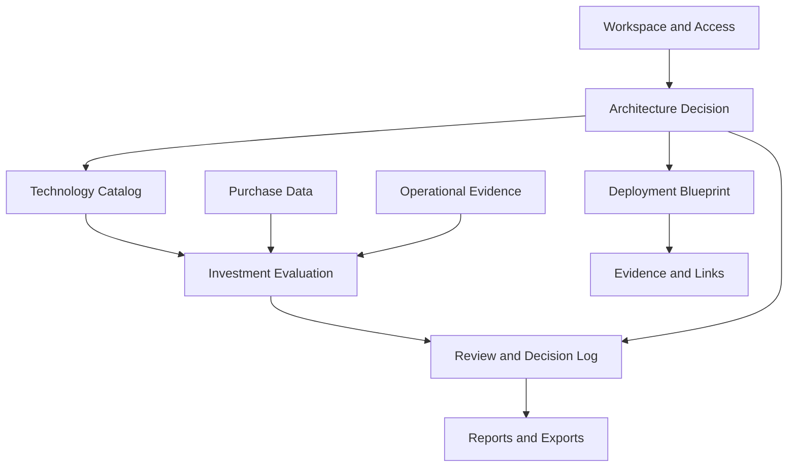
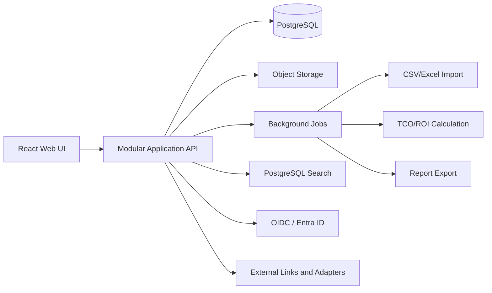

# ArchPilot — MVP Architecture and Delivery Plan

| Field | Value |
|---|---|
| Product | ArchPilot |
| Version | 0.1 |
| Status | Initial build plan |
| Scope | Architecture Decision + TCO/ROI pilot |
| Date | 2026-09-18 |

## 1. MVP objective

Build the smallest usable platform that supports two connected workflows:

1. Design and self-review an architecture decision for a real system.
2. Evaluate a new technology, solution, or device against a current baseline using purchase history and TCO/ROI.

The MVP must preserve evidence and produce useful reports. It does not need to provision production or automatically discover the whole enterprise. It must support both cloud and non-cloud designs; AWS is only the first concrete provider adapter.

## 2. MVP capabilities

### Required

- Organization, project, system, environment, and user access.
- Requirements and non-functional requirements.
- Components, dependencies, deployment nodes, and Mermaid export.
- Architecture Decision Records (ADR) with alternatives and trade-offs.
- Self-review checklist, comments, decision log, and audit history.
- Technology catalog with owner, lifecycle, capability, and status.
- CSV/Excel import for historical purchase records.
- Data normalization for supplier, product, currency, units, and dates.
- TCO for 3-year and 5-year scenarios.
- ROI, payback period, NPV when a discount rate is available.
- Conservative, expected, and optimistic scenarios.
- Sensitivity analysis for major variables.
- Markdown and CSV report export.
- Source, assumption, confidence, and version for every material result.
- Deployment target selection for AWS, Azure, GCP, VMware, Kubernetes, on-premises, or hybrid.
- Target-neutral architecture model with provider-specific Terraform, Ansible, Helm, and network artifacts generated by adapters.

### Evidence links in MVP

The MVP stores links or uploaded evidence for:

- Git repository and IaC.
- CI/CD pipeline.
- Performance test result.
- Monitoring dashboard.
- Incident or change record.
- Vendor quotation.
- Procurement document.

Automatic synchronization is a later phase.

## 3. Bounded contexts



| Context | Responsibility |
|---|---|
| Workspace | Organization, project, system, environment, roles |
| Requirements | Functional requirements, NFRs, assumptions, constraints |
| Architecture | Components, dependencies, diagrams, deployment views |
| Decision | ADR, options, criteria, scores, risks, self-review state |
| Technology | Technology profiles, lifecycle, owners, capabilities |
| Procurement | Purchase records, quotations, supplier and product normalization |
| Value | TCO, ROI, payback, NPV, scenarios, sensitivity |
| Evidence | Source files, links, provenance, confidence, validation state |
| Governance | Self-review checklist, comments, decision events, audit events |
| Reporting | Architecture pack, business case, CSV/Markdown exports |

### Deployment target abstraction

The architecture model stores intent and constraints first, then maps them to a target adapter:

```text
Architecture intent
  -> deployment target
    -> capability mapping
      -> Terraform / Ansible / Helm / network artifacts
```

Examples of target-specific mappings:

| Intent | AWS | On-premises / VMware | Kubernetes / hybrid |
|---|---|---|---|
| Compute pool | EC2 or EKS nodes | VM or bare-metal cluster | Node pool / worker group |
| Relational database | Aurora or RDS | PostgreSQL cluster or appliance | Operator-managed database |
| Object storage | S3 | Ceph or storage appliance | S3-compatible service |
| Load balancing | ALB/NLB | F5, HAProxy, or appliance | Ingress controller / MetalLB |
| Network boundary | VPC/subnet/security group | VLAN/VRF/firewall zone | NetworkPolicy/ingress/egress |

The target adapter must be replaceable without rewriting requirements, decisions, sizing assumptions, or review evidence.

## 4. Technical shape



Recommended initial choices:

- Frontend: React + TypeScript.
- Backend: TypeScript or .NET modular monolith.
- Database: PostgreSQL with JSONB only where the model is genuinely flexible.
- Object storage: S3-compatible storage for evidence and generated reports.
- Jobs: Redis-backed queue or an equivalent managed queue.
- Authentication: OIDC; local development may use a test identity provider.
- Diagrams: structured model rendered to Mermaid; do not store Mermaid as the only source of truth.
- Search: PostgreSQL full-text search in MVP; OpenSearch or vector search later if usage proves the need.
- Deployment: Docker Compose for development and a documented container deployment for pilot.

## 5. Core data model

```text
Organization
  -> Workspace
    -> Project
      -> System
        -> Environment
        -> Requirement / NFR
        -> Component / Dependency
        -> Deployment Blueprint
        -> Architecture Decision
        -> Evidence
        -> Investment Case

Investment Case
  -> Baseline Cost
  -> Purchase Record
  -> Candidate Option
  -> Cost Item
  -> Benefit Item
  -> Scenario
  -> Assumption
  -> Calculation Run
  -> SelfReview
```

Every mutable business object needs:

- Stable ID.
- Owner.
- Status.
- Created/updated timestamps.
- Version or revision.
- Source/provenance where applicable.
- Audit events for material changes.

## 6. Calculation engine rules

The calculation engine should be a deterministic domain module with versioned formulas. It must not depend on UI state.

### TCO

```text
TCO =
  purchase
  + implementation
  + migration
  + license
  + support
  + infrastructure
  + operations_staff
  + training
  + security
  + backup
  + upgrade
  + expected_downtime_cost
  - residual_value
```

### ROI

```text
ROI = (total_benefits - total_investment) / total_investment
```

### Payback

```text
PaybackMonths = initial_investment / monthly_net_benefit
```

The engine must support:

- Monthly or annual periods.
- Currency and exchange-rate metadata.
- Inflation or price-growth assumptions.
- One-time versus recurring cost.
- Conservative, expected, and optimistic values.
- Discount rate for NPV.
- Confidence per input.
- Formula version and calculation timestamp.
- Reproducible calculation output.

## 7. Security and governance baseline

- Organization and project-level authorization.
- Separate roles for Architect, Reviewer, Finance, Procurement, Operations, and Administrator.
- Tenant-scoped queries at the application and database layers.
- Encryption in transit and at rest.
- Immutable audit events for self-reviews, exports, formula changes, and data imports.
- Sensitive fields such as contract price and supplier terms subject to restricted access.
- Export authorization and watermark/provenance metadata.
- No production mutation from MVP.
- Backup and restore test for the product database before pilot release.

## 8. Delivery phases

### Phase 0 — Discovery, 2-3 weeks

Outputs:

- Pilot sponsor and pilot system.
- User interviews.
- Domain glossary.
- Sample architecture, procurement, and cost data.
- Agreed TCO scope and currency policy.
- Pilot acceptance criteria.

Gate: real data and a named owner for each data set.

### Phase 1 — Foundation, 4-6 weeks

Outputs:

- Authentication and workspace.
- RBAC and audit events.
- System profile.
- Technology catalog.
- Requirements/NFR model.
- API and database foundation.

Gate: a user can create a system and trace changes to a named user and source.

### Phase 2 — Architecture Decision, 6-8 weeks

Outputs:

- Component and deployment model.
- Mermaid export.
- ADR and options.
- Review checklist.
- Self-review workflow.
- Architecture report.

Gate: one architecture review completes end-to-end in the product.

### Phase 3 — TCO/ROI, 6-8 weeks

Outputs:

- Purchase import and validation.
- Cost normalization.
- TCO/ROI engine.
- Scenarios and sensitivity.
- Investment report.
- Finance/procurement evidence capture for future enterprise use.

Gate: one real investment case is reproducible from imported source data.

### Phase 4 — Pilot, 4-6 weeks

Outputs:

- Two or three real systems/cases.
- User feedback.
- Forecast-versus-actual review.
- Data quality report.
- Product adoption and value report.

Gate: continue, narrow, or expand based on evidence.

## 9. Post-MVP sequence

1. GitLab/GitHub and CI/CD adapters.
2. k6/JMeter performance test evidence integration.
3. Prometheus/Grafana operational evidence integration.
4. Technology innovation radar and lifecycle alerts.
5. Automation catalog for Terraform, Ansible, Helm, and runbooks.
6. AWS pricing adapter, followed by Azure, GCP, VMware, and on-premises cost templates.
7. AI assistant with citations, confidence, and architect self-review.
8. Actual-versus-estimated cost and performance feedback.

## 10. Non-goals and kill criteria

Stop or narrow the product if:

- No pilot team will provide real data and review decisions.
- Procurement data cannot be validated by an owner.
- Users only want a document generator with no decision workflow.
- The product cannot save meaningful review or business-case preparation time.
- Financial outputs are treated as authoritative accounting without Finance governance.
- Integration work consumes the roadmap before the core decision loop is used.
