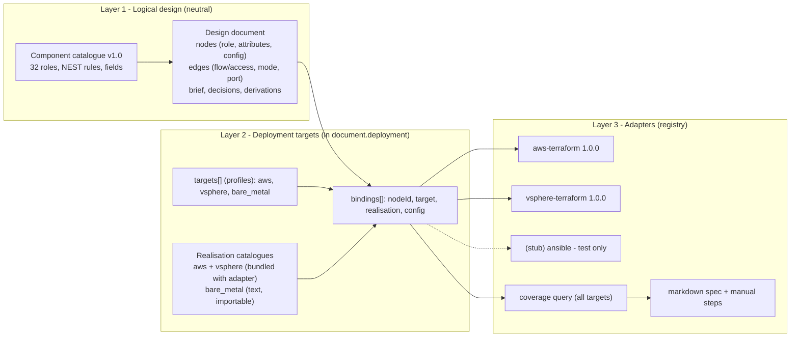
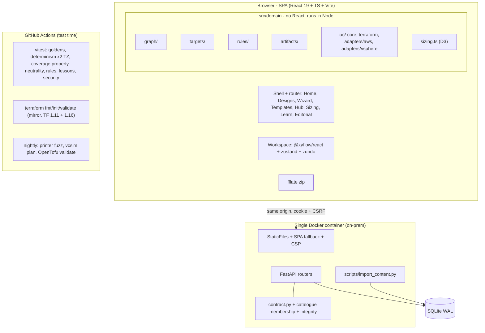
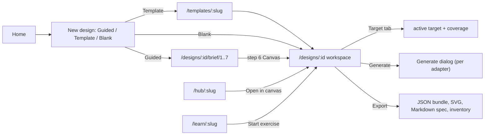
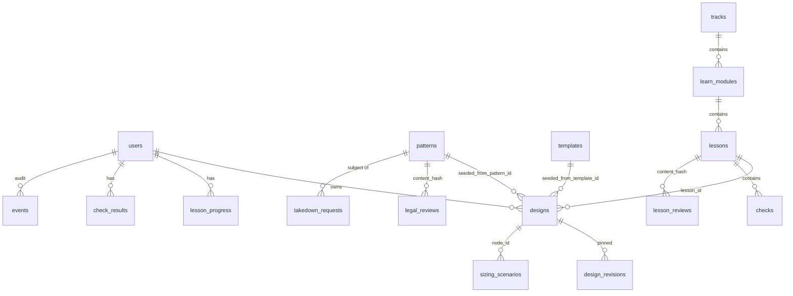
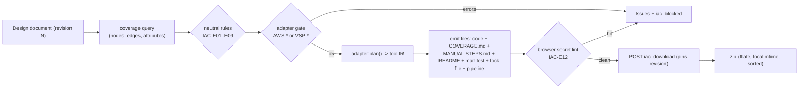
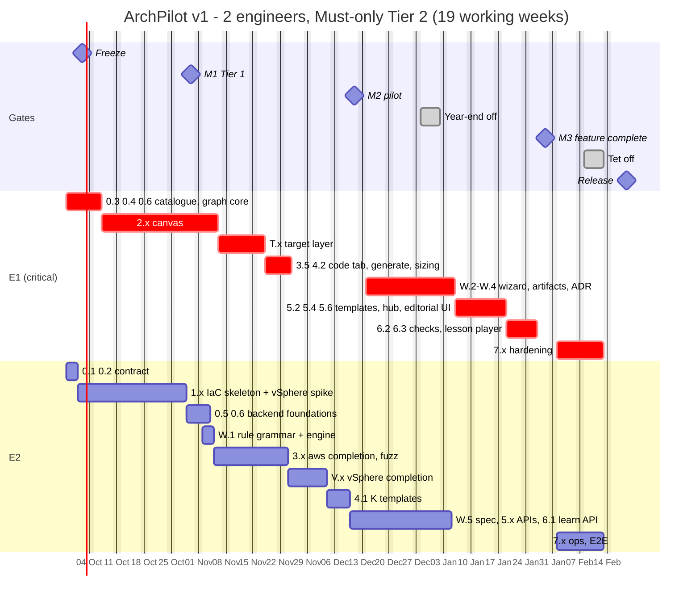

# ArchPilot v1 (re-scoped) — Design v2: provider-neutral design, deployment targets, hub, sizing, learning and IaC adapters

| | |
|---|---|
| **Title** | ArchPilot v1 (re-scoped) — Design v2 |
| **Author** | Solution Architect #1 (Proposer / Blue Team) |
| **Date** | 2026-09-24 |
| **Version** | 0.3 |
| **Status** | In Review (delta re-review by Solution Architect #2) |
| **Binding input** | `docs/requirements-v2.md` **v2.1** (provider-neutral, on-prem + multi-cloud, wizard, artifacts, adapters). Section 16 defaults are adopted unless this document says otherwise and flags it (section 2.7). |
| **Review addressed** | `docs/reviews/review-design-v2.md` v1.0 (approve-with-changes: 4 Blocker, 12 Major, 12 Minor). Disposition of every finding is in section 2.9. |
| **Related docs** | `docs/research/sysdesai-design-concept.md` · `docs/research/brainboard-feature-inventory.md` · `docs/research/sysdesai-gallery-analysis.md` · `docs/research/sysdesai-learn-analysis.md` · `docs/pattern-content-policy.md` (binding) · `docs/systemsarchitect-build-scope.md` v1.5 · `docs/prototype/systemsarchitect-demo.html` · `contracts/archgraph.schema.json` |
| **Reviewers** | Solution Architect #2, security-architect, dba-master, devops-master, ba-qa-analyst, Product Owner |
| **File location note** | The task asked for `docs/design-v2.md`. The repo keeps docs flat under `docs/`, so this file does not live in `docs/architecture/`. |

### Change log

| Version | Date | Change |
|---|---|---|
| 0.1 | 2026-09-24 | First proposal, AWS-centred palette. Superseded. |
| 0.2 | 2026-09-24 | Provider-neutral restructure after the PO correction: catalogue, target layer, pluggable adapters, wizard, outdated propagation, ADR, Markdown spec. Written against requirements v2.0. |
| **0.3** | 2026-09-24 | **Addresses the red-team review.** **B1:** reconciled with requirements v2.1 (v2.1 role ids, `zone` container, failure-domain level **and** label, `COVERAGE.md`, edges and attributes in the coverage report, v2.1 rule ids with new ids renumbered, templates carry no target, default target unset, stale-package banner, full REQ-ADP-001 metadata). **B2:** everything target-specific moves out of nodes into `deployment` **arrays of objects**; no data-keyed maps anywhere, so camelCase holds at every depth and nodes contain no provider token. **B3:** self-contained; every section previously referenced "as in 0.1" is written inline (AWS mapping and secure defaults, access matrix, IAM/SG derivation, gate rules, printer rules, zip guard, CSP, SPA fallback, STRIDE, rate limits, migrations, keyboard map, pipelines). **B4:** Tier-2 minimum releasable slice contains v2.1 Must items only. The plan is 147.5 pd of work plus 15% contingency (169.6 pd). It includes a thin vSphere spike in M1 and the rule grammar in week 6. The calendar accounts for the year-end and Tết weeks; release is 2027-02-19 (2 engineers) or 2027-01-15 (with E3). The critical path is the E1 UI chain, and a priced cut order puts design extras first and vSphere last. **Majors taken:** constrained printer + nightly fuzz with real `terraform fmt`, timezone-safe zip, pure-JS SHA-256 with JCS, provider pins + static lock file + filesystem mirror, TF 1.11/1.16 matrix, OpenTofu nightly, revision pinning, hash projections, edge/attribute/unknown-realisation coverage, 32-role palette with 3 catalogues, SPA fallback and CSP specified, browser secret lint, vSphere IP addressing, template-derived VM settings, edition awareness, MinIO removed, vcsim nightly. |

---

## 1. Executive summary

**English.** ArchPilot v1 lets a 2-4 person internal team design any IT system, on-prem or in a public cloud, and carry that design to reviewable documents and, where possible, deployable code. Users draw with **provider-neutral logical components** (for example relational database, firewall, SAN, hypervisor cluster). A separate **deployment-target layer** decides how each component is built on AWS, on VMware vSphere, or on bare metal. It shows every node and every connection as generatable, manual or unsupported, and nothing is silently dropped. A rule-based **wizard** (no AI) turns a questionnaire into sizing numbers and suggested components. It records every default as an assumption. Artifacts are marked **outdated** when their inputs change. A **decision log** and a **Markdown spec** support review and handoff. Code comes from pluggable adapters. v1 ships **Terraform for AWS** and **Terraform for vSphere**. Both run as deterministic TypeScript, and every template is proven by a pinned `terraform validate` in CI. The plan covers only the Must requirements: about 147 person-days of work plus 15% contingency. With 2 engineers it releases on **19 February 2027**, after the year-end and Tết breaks. With a third engineer from week 2 it releases on **15 January 2027**. The critical path is the user-interface work.

**Tiếng Việt.** ArchPilot v1 giúp một nhóm nội bộ 2-4 người thiết kế bất kỳ hệ thống CNTT nào, tại chỗ (on-prem) hoặc trên đám mây công cộng. Nhóm có thể đưa thiết kế đó thành tài liệu để rà soát và, khi có thể, thành mã triển khai được. Người dùng vẽ bằng các **thành phần logic trung lập với nhà cung cấp** (ví dụ cơ sở dữ liệu quan hệ, tường lửa, SAN, cụm hypervisor). Một **lớp đích triển khai** riêng quyết định mỗi thành phần được dựng thế nào trên AWS, VMware vSphere hay máy chủ vật lý. Lớp này cho biết từng nút và từng kết nối là sinh được mã, làm thủ công, hay chưa hỗ trợ; không có gì bị bỏ qua âm thầm. **Trình hướng dẫn** dựa trên quy tắc (không dùng AI) biến bảng câu hỏi thành số liệu sizing và các thành phần gợi ý, đồng thời ghi mọi giá trị mặc định thành giả định. Các sản phẩm thiết kế được đánh dấu **lỗi thời** khi đầu vào của chúng thay đổi. **Nhật ký quyết định** và **đặc tả Markdown** hỗ trợ rà soát và bàn giao. Mã được sinh qua các adapter cắm thêm. v1 có **Terraform cho AWS** và **Terraform cho vSphere**. Cả hai chạy bằng TypeScript tất định, và mọi mẫu đều được chứng minh bằng `terraform validate` với phiên bản cố định trong CI. Kế hoạch chỉ gồm các yêu cầu bắt buộc (Must): khoảng 147 ngày công cộng 15% dự phòng. Với 2 kỹ sư, ngày phát hành là **19/02/2027**, sau kỳ nghỉ cuối năm và Tết. Nếu có kỹ sư thứ ba từ tuần 2, ngày phát hành là **15/01/2027**. Đường găng nằm ở phần giao diện người dùng.

---

## 2. Context & objectives

### 2.1 Problem restated

The team designs systems that land on public cloud, on-prem virtualisation, bare metal, or a mix. They need one tool to:
1. Capture needs and NFRs (non-functional requirements).
2. Size the system.
3. Draw a neutral architecture.
4. Choose a deployment target and see honestly what can be generated.
5. Record decisions and export a spec.
6. Download IaC (infrastructure as code) that passes `fmt` and `validate` unedited, where an adapter exists.

ArchPilot writes files only. It never runs Terraform or Ansible, never holds credentials, never stores state, and uses no LLM.

### 2.2 Scope

| In scope | Out of scope (v2.1 non-goals and Later items) |
|---|---|
| Logical catalogue (32 roles in v1), containers, failure domains | Running IaC, state, drift, import (NG-1..NG-5) |
| Target layer: aws, vsphere, bare_metal catalogues; coverage for nodes, edges and attributes; design-wide target; retargeting | Azure, GCP, k8s_onprem catalogues (Should, v1.1); per-node override UI and hybrid packages (Should, v1.1) |
| Wizard (6 Must steps, 15 rules), artifacts, outdated propagation, manual decision log, Markdown spec, inventory | Compare view, API list, data model, flow steps, ADR auto-draft (Should/Could) |
| Adapter interface; Terraform AWS and Terraform vSphere adapters | Azure/GCP/Kubernetes/Ansible adapters (Later) |
| Templates, hub, sizing attach, learning L1/L3/L4, editorial gate | Should lessons L2/L5/L6/L9 (v1.1) |
| Backend API, SQLite, security, stack, plan | Cost estimation (NG-7); deep STRIDE (security-architect) |

### 2.3 What exists and is reused (verified in code)

| Asset | State | Decision |
|---|---|---|
| FastAPI + SQLite WAL backend, migrations 001-004, local auth (PBKDF2, opaque sessions), CSRF middleware, error envelope `{detail, requestId?}`, request ids | Built, 174 pytest | Reuse unchanged; add routers |
| `/api/designs` CRUD: owner-scoped 404, revision 409, contract-validated graph, 1 MiB cap | Built | Extend (section 4.5) |
| `patterns`, `legal_reviews`, `takedown_requests`, `patterns_fts`, publish-gate triggers | Schema built | Extend by migration 009; the B1 hash invariant is untouched |
| `sizing_scenarios` table | Schema built | Add `revision` |
| `contracts/archgraph.schema.json` + 16 fixtures; pytest and vitest both run them; `test_contracts.py` checks every live response is camelCase at every depth | Built | Extend additively; **the camelCase rule is kept, not weakened** (B2) |
| `src/domain/sizing.ts` v2.0 engine, `sizingCalculator.ts`, `benchmarks.ts`, `SizingScreen.tsx` | Built, 150 vitest | Reuse; engine unchanged (D3); extract an embeddable calculator |
| `src/api/client.ts`, async `store.ts` | Built | Reuse |
| `src/app/App.tsx`: 16-module state switch, no router | Built | Add a router and a Studio nav group |
| `src/domain/model.ts` `DeploymentTarget` (aws, azure, gcp, vmware, kubernetes, on_premises, bare_metal, hybrid) | Built (workspace field) | Kept for the old workspace; mapped to new target ids for the wizard's pre-fill (4.3.5) |
| `.github/workflows/ci.yml` | **In this repo** (review m1) | Extend: path filters, `iac-validate`, nightly jobs |
| `package.json` | Runtime deps `"latest"` (React resolves to 19.x) | Pin every dependency exactly, including React 19.x; commit the lock file |

### 2.4 Assumptions

| # | Assumption |
|---|---|
| A-1 | Team: E1 (frontend-leaning), E2 (backend/full-stack), C (content author, 50%), Q (BA/QA, 50%), PO, and **Infra Ian as on-prem SME for 3 pd in weeks 3-9**. Option: E3 (full-stack, TS-strong) from week 2. 4.5 productive pd per engineer per week. |
| A-2 | Week 1 starts Monday 2026-09-28. Non-working weeks: 2026-12-28 to 2027-01-01 (year end) and 2027-02-08 to 2027-02-12 (Tết; Lunar New Year is 2027-02-06). |
| A-3 | AWS users have an account, a state bucket and GitHub or GitLab. vSphere users have vCenter 8.x or 9.x, a Linux VM template with cloud-init (VMware guestinfo datasource), existing port groups, an S3-compatible state store, and a self-hosted CI runner that reaches vCenter. **Q-19 is confirmed with Infra Ian in week 1: platform, edition (Standard vs VVF/VCF), and whether server VLANs have DHCP.** |
| A-4 | Current browsers (Chrome, Edge, Firefox). The app may be served over plain HTTP on the intranet, so nothing depends on secure-context-only APIs (review M6). |
| A-5 | CI validation runs **without registry access** from a filesystem mirror (review M3). The runtime needs no internet (NFR2-DEP-001). |
| A-6 | Pins: Terraform CLI tested on **1.11.x (floor) and 1.16.x (current, 1.16.0 on 2026-08-26)**. Providers `hashicorp/aws >= 6.66.0, < 7.0.0` and `vmware/vsphere >= 2.17.1, < 3.0.0`, each with a committed lock file. |

### 2.5 Constraints (fixed)

- Internal use, 2-4 users, local auth.
- No LLM.
- On-prem single Docker container, SQLite.
- React + TS + Vite frontend, Python/FastAPI backend.
- Provider-neutral model covering on-prem and cloud; AWS is the first cloud adapter.
- Hub = original write-ups with attribution and link-out.
- Sizing arithmetic only in TypeScript (D3).
- Never run `apply`/`destroy`.
- VI/EN UI.
- Self-certify content policy with the `content_hash` publish invariant.

### 2.6 Measurable success criteria

| # | Criterion | Target | Evidence |
|---|---|---|---|
| S-1 | Per shipped adapter, every template it serves and every golden fixture passes `fmt -check`, `init -backend=false`, `validate`, with 0 diagnostics, on TF 1.11.x and 1.16.x | 100% | CI job `iac-validate` (AC-03) |
| S-2 | Byte-identical files and zip for the same inputs, across node order, positions, labels **and time zones** | 100% of fixtures; runs in two TZs | vitest determinism + TZ matrix (AC-04) |
| S-3 | Retarget round trip AWS to vSphere to AWS: identical design document and identical AWS package | 100% of template fixtures | SC-17 test |
| S-4 | Every node, edge and non-default neutral attribute appears in the coverage report with exactly one class | 0 violations over fixtures and 1,000 random designs x 3 targets | property test (AC-22, NFR2-COR-004) |
| S-5 | Neutral model, palette and templates contain no provider token | 0 hits | token scan (AC-21) |
| S-6 | Coverage query + badges after retarget, 100 nodes | < 500 ms | vitest benchmark (NFR2-PERF-002) |
| S-7 | Generate including validation, 100 nodes | p95 < 2 s (target < 300 ms in browser) | Playwright |
| S-8 | Outdated marker after an upstream change | < 1 s, no reload | Playwright timing (REQ-ART-003) |
| S-9 | Wizard: same answers and rule-set version give the same suggestions and canvas | 100% of golden answer sets | vitest (AC-24) |
| S-10 | Security: 0 secrets, 0 wildcard IAM actions, 0 unauthorised `0.0.0.0/0` ingress, no sensitive variable with a default | 0 findings | CI (AC-05) |

### 2.7 Requirement reconciliation items (for the BA; defaults applied)

| # | Item | This design | Needs |
|---|---|---|---|
| C-v2-1 | REQ-IAC-020 puts the **design revision** in the manifest, but a position-only move bumps the revision, and NFR2-DET-002 says a move changes nothing in the output | The manifest carries `designFingerprint`. The revision is pinned in `design_revisions` and in the `iac_generate` event. REQ-ART-004's banner reads it from there (4.3.10) | BA: amend REQ-IAC-020 wording |
| C-v2-2 | NFR2-SEC-002 forbids `0.0.0.0/0` outside internet-facing listeners. Fargate tasks need egress TCP 443 through NAT to pull images and reach AWS APIs | Read as ingress. One commented service egress exception (IAC-I02). VPC endpoints come in v1.1 | PO + security-architect (Q-2) |
| C-v2-3 | Q-2 says Terraform >= 1.10; `use_lockfile` became GA in 1.11 | `required_version = ">= 1.11.0, < 2.0.0"` | Fact correction |
| C-v2-4 | REQ-IAC-016 feeds engine storage (already multiplied by the replication factor) into a per-instance disk | Divide by the replication factor for both adapters | QA test TC-XP-05 |
| C-v2-5 | Must wizard rules (REQ-WIZ-006) suggest `key_management`, `siem_log_store` (Should roles) and `artifact_registry` (Could) | These 3 roles are in the v1 palette (32 roles) | BA: promote to Must (review B1) |
| C-v2-6 | REQ-ART-001 (Must) lists a "Checks report" artifact; REQ-ART-008 (Should) defines it | v1 ships a minimal checks report: the Issues list as an artifact with a status chip. Scalability notes stay Should | BA: note |
| C-v2-7 | New rule ids | IAC-E12 (secret literal in emitted files), IAC-W10 (stateful node in a public segment), IAC-W11 (sizing value clamped), IAC-I02 (service egress 443), TGT-E01 (unknown realisation id), TGT-I01 (attribute not expressed), AWS-E04 (private service without NAT), VSP-E03 (static IPs fewer than VMs), VSP-W01 (edition cannot enforce anti-affinity) | BA: add to 8.6 |
| C-v2-8 | NFR2-EXT-003 says the realisation catalogue is data added without a release. But a catalogue change for a **shipped adapter** changes generated code, so it must be versioned with the adapter (NFR2-DET-001) | Catalogues of shipped adapters: data file + image rebuild, no code edit. Text-only catalogues (bare_metal, later azure/gcp/k8s): importable from the content volume | BA: amend NFR2-EXT-003 (review M11) |
| C-v2-9 | Q-25 default backend "S3-compatible (works with MinIO)". The MinIO community repository was archived on 2026-02-12 | Default stays S3-compatible; the README names "an existing S3-compatible store (for example Ceph RGW)"; http and pg are alternatives | BA: reword Q-25 |
| C-v2-10 | REQ-TPL-004's "HA web app across two failure domains" | Two `zone` containers in one `site` | none |

### 2.8 sysdesai design-concept proposals: disposition

| # | Proposal | Verdict | Where |
|---|---|---|---|
| P1 | Rule-driven wizard with visible assumptions | Accept: 6 Must steps + Should review step; rules as data | 4.2.9, 4.3.9 |
| P2 | Outdated propagation with content hashes | Accept, with per-edge projections | 4.2.10, 4.3.10 |
| P3 | Light ADR log, auto-drafted | Accept manual log (Must); auto-draft is v1.1 (Should) | 4.2.11, 4.3.11 |
| P4 | Logical role + per-target realisation + failure domain | Accept as the core model | 4.3.1-4.3.8 |
| P5 | Target chosen late, coverage badges, Markdown export | Accept: design-wide target in v1; per-node override v1.1; 3 badges + detail | 4.2.7, 4.3.7, 4.2.12 |

### 2.9 Review disposition (Accept / Reject / Modify)

| Finding | Verdict | One-line reason / where |
|---|---|---|
| B1 reconcile with v2.1 | **Accept** | Role ids, `zone`, failure-domain label, `COVERAGE.md`, edge rows, rule ids, logical templates, unset default target, stale banner, ADP metadata: 2.7, 4.3, 4.4 |
| B2 no data-keyed maps; target data out of nodes | **Accept** | `deployment.targets/bindings/placements`, `derivations[]`, `artifactStates[]` are arrays: 4.3.2 |
| B3 self-contained | **Accept** | Content written inline (not a separate file) so one document is reviewed |
| B4 Must-only slice, contingency, Tết, converged plan | **Accept, one modification** | Plan in section 5. **Modify:** the template catalogue UI and editorial UI stay with E1. My re-estimate adds 4 pd to E2 (vSphere spike, filesystem mirror and TF matrix, revisions, fuzz job), so moving 5 pd of UI to E2 would make E2 the bottleneck. E1 remains the critical chain either way (5.5) |
| M1 printer constraints + fuzz | Accept | 4.4.4; 1.1 = 4.5 pd; WASM `hclwrite` only as a contingency fallback |
| M2 timezone-safe zip | Accept | Local-constructor mtime, fflate 0.8.3 pinned, TZ matrix: 4.4.11 |
| M3 pins, lock file, mirror, matrix, OpenTofu | Accept | 4.4.7, 4.4.13; the licensing call is in section 8 |
| M4 vSphere apply-time gaps | Accept; **Modify** vcsim | IP modes, template-derived settings, edition, tags deferred, MinIO removed: 4.4.9. vcsim `plan` is a **nightly, non-blocking signal**, not a release gate (the simulator's fidelity is limited). The release gate stays a manual sandbox `plan` per vSphere template (R-02) |
| M5 revision pinning | Accept | `design_revisions` on pin events: 4.3.10, migration 006 |
| M6 hash projections, JCS, pure-JS SHA-256, Mark as current | Accept | 4.3.10 |
| M7 edges, attributes, unknown realisations | Accept | 4.3.7 |
| M8 palette 32 roles, 3 catalogues, generic `vm_group` | Accept | 4.3.1, 4.3.6, 4.4.9; T.1 = 8 pd |
| M9 SPA fallback + CSP | Accept | 4.5.3 |
| M10 injection property tests + browser secret lint | Accept | 4.4.6 (IAC-E12 blocks download) |
| M11 adapter-coupled catalogues | Accept | C-v2-8 |
| M12 content load, freeze, grammar week 6, SME | Accept | 5.2, 5.10 |
| m1 stale facts (CI in repo, React 19, TF 1.16) | Accept | 2.3, 2.4 |
| m2 `if/then` instead of `oneOf`; open `brief.answers` | Accept | 4.3.3 |
| m3 ADR bounds, body guard | Accept | 4.3.3, 4.5.3 |
| m4 `đ` slug bug | Accept | 4.3.5 |
| m5 undo scopes per surface | Accept | 4.2.19 |
| m6 target vocabularies | **Modify** | One mapping table (4.3.5). No data migration of `workspaces.deployment_target`, because designs no longer inherit a target (default unset) |
| m7 layering cycle | Accept | Injected predicate registry: 4.3.9 |
| m8 event hygiene | Accept | 4.5.4 |
| m9 ADP metadata fields | Accept | 4.4.3 |
| m10 licence-shifting product names | Accept | Catalogue text says "Valkey or Redis", "existing S3-compatible storage" |
| m11 data classification | Accept | 4.5.5, runbook |
| m12 licensing sentence, OpenTofu nightly | Accept | Section 8, 4.4.13 |
| A6 one active target in the v1 UI | Accept | 4.2.7 |
| Review claim "E2 has about 1.5 weeks of float" | **Reject** | With the v0.3 E2 estimate (73.5 pd of work, 84.5 pd with its contingency share), E2 has under 0.5 week of float. It is protected by task order, not by float (5.5) |

---

## 3. Headline decisions

| # | Decision | Rationale | Trade-off |
|---|---|---|---|
| **D-01** | All generators (IaC, coverage report, manual steps, Markdown spec) are **deterministic TypeScript** in `src/domain/`, running in the browser and in Node for CI. The server never generates. | One implementation of resolution, coverage, rules and generators. Sizing is TS already (D3). Live preview with no round trip. | The audit is client-reported; mitigated by revision pinning (D-16). |
| **D-02** | Three layers: **logical design → deployment target → adapter**. | The PO's model; makes coverage and retargeting structural. | More concepts; the wizard and defaults hide most of them. |
| **D-03** | **Component catalogue as shared data** (`contracts/catalog/components.json`, v1.0.0, 32 roles). TS and Python both load it; Python checks membership. | Taxonomy growth is a data change. | The contract's `type` is a pattern-checked string plus a membership check. |
| **D-04** | **Nodes are neutral.** Everything target-specific lives in `deployment` as arrays of objects: `targets[]`, `bindings[{nodeId, target, realisation, config}]`, `placements[{nodeId, target}]` (v1.1 UI). | Neutrality scan passes (NFR2-NEUT-001); camelCase contract holds; bindings for all targets are kept, so retargeting is lossless. | Lookups go through an index built on load (O(n)). |
| **D-05** | **Coverage = 3 badges** (generatable / manual / unsupported) **+ a detail** (partial / implicit / reference) **+ a note**. Report classes for nodes: generatable, manual, unsupported, annotation, assigned_to_other_target. Edges: generatable, manual, no_code, assigned_to_other_target. Plus info rows for unconsumed attributes. | Meets v2.1 and US-D2 ("generatable (as rules)"), and keeps honesty. | The detail must be visible; it appears in the tooltip, Target tab and `COVERAGE.md`. |
| **D-06** | **Tool-agnostic adapter interface** with full REQ-ADP-001 metadata. v1 ships Terraform AWS and Terraform vSphere; stub Ansible and stub Terraform adapters prove extension. | Reuse of the Terraform toolchain; offline `validate` (4.4.9 justification). | vSphere software install is manual in v1 (detail `partial`). |
| **D-07** | **Constrained typed HCL IR + our own fmt-canonical printer**, shared by both Terraform adapters, with a nightly fuzz job against the real `terraform fmt`. | Escaping, ordering and alignment in one place; real formatter as oracle over random designs. | 4.5 pd; WASM `hclwrite` fallback in contingency. |
| **D-08** | **One design document** per design: graph + `deployment` + `brief` + `decisions` + `derivations` + `artifactStates`. | Keeps the designs API, revisions, conflict handling and undo simple. | Bounded free text (ADR 4,000 chars per field, 100 decisions). |
| **D-09** | Edges have `kind` (flow / access), `mode`, optional `protocol` and `port`. Only access edges produce code or manual firewall requests. | Explicit meaning; the same edge becomes security-group rules on AWS and a firewall request on-prem. | Two edge kinds to learn; defaults from a pair matrix. |
| **D-10** | **One rule engine** with an injected predicate registry for wizard suggestions, lesson checks and design lint. Rules are JSON. | REQ-WIZ-012; no layering cycle (review m7). | The predicate set must stay small (4.3.9). |
| **D-11** | Attached sizing summary stored in the node; staleness via outdated propagation. | Generators stay pure functions of the document. | Two copies of a number; hashes detect divergence. |
| **D-12** | Content (templates, patterns seed, lessons, wizard questions and rules, text catalogues) is files imported by an idempotent CLI; shipped-adapter catalogues are bundled with the adapter. | Golden-testable in CI; no code release for content. | Authors edit JSON in v1 (rule editor UI is Could). |
| **D-13** | Lesson checks run client-side; the server stores best result, attempts and last time. | C-4. | Answer keys visible (accepted). |
| **D-14** | `react-router` + a narrowly specified SPA fallback. | Deep links. | Shell change. |
| **D-15** | Zip built in the browser with `fflate` 0.8.3: mtime from the **local** constructor `new Date(2000, 0, 1, 0, 0, 0)`, sorted entries, level 6, LF. One zip per adapter per generate. | Byte-identical in every time zone (review M2). | None. |
| **D-16** | Generated files are never stored server-side. **Revisions are pinned** (full document snapshot) on generate, download, spec export, lesson check and snapshot. | Audit and "what did we generate" are answerable; REQ-ART-004 banner. | A few extra rows per design (bounded by pin events). |

---

## 4. Detailed design

### 4.1 Layers and system containers





**Placement rule.** Anything that interprets meaning lives in `src/domain/` and runs in both browser and Node. Python checks only:
- shape (contract);
- integrity (unique ids and codeNames, existing references, no parent cycles, depth);
- catalogue membership of `type`.

### 4.2 UI/UX

#### 4.2.1 Information architecture and navigation

| Route | Screen | Roles |
|---|---|---|
| `/` | Home: continue design, next lesson, recent patterns | all |
| `/designs` | My designs; **New design** dialog: Guided / Template / Blank (REQ-WIZ-001); "From hub" is reached through the hub | owner |
| `/designs/:id` (`?node=&tab=`) | Design workspace | owner (404 otherwise) |
| `/designs/:id/brief/:step` | Wizard steps of this design | owner |
| `/templates`, `/templates/:slug` | Template catalogue, preview | all |
| `/hub`, `/hub/:slug` | Knowledge hub | all (published only) |
| `/sizing` (`?preset=`) | Sizing calculator (built) | all |
| `/learn`, `/learn/:slug` | Track overview, lesson player | all |
| `/editorial/patterns`, `/editorial/lessons`, `/editorial/takedowns` | Editorial gate | editor, admin |
| `/m/:moduleKey` | Existing ArchPilot modules, unchanged | all |

Sidebar groups:
1. **STUDIO**: Home, Designs, Templates, Knowledge hub, Sizing, Learn.
2. **ARCHPILOT MODULES**: existing modules, collapsed by default.
3. **EDITORIAL**: editor and admin roles only.

On `/designs/:id` the sidebar collapses to a 56 px icon rail.



#### 4.2.2 Design workspace

The layout follows the approved demo (top bar, left Components/Layers, centre canvas) and REQ-DES-017 (right-panel tabs Inspector, Issues, Sizing, Target, Decisions, Code).

```
+----------------------------------------------------------------------------------------------------+
| [<] Designs / [Orders platform    ] rev 14 - Saved 3 s ago   [Undo][Redo]   Target: [DC1 vSphere v]|
|    Artifacts: [Requirements OK][Capacity OUTDATED][Components OK][Targets OK][Decisions 1 review]   |
|                                           [Validate E0 W3] [Export v] [Generate vsphere-terraform]  |
+----+-------------+---------------------------------------------------------+-----------------------+
|rail| LEFT 256 px | CANVAS                                                  | RIGHT 360 px          |
|    | [Components]|  +- site: dc1 --------------------------------------+   |[Inspector][Issues]    |
|    | [Layers]    |  | +- zone: room_a ----------+ +- zone: room_b ----+|   |[Sizing][Target]       |
|    | Search [   ]|  | | +- segment: app_a ----+ | | +- segment: app_b+||   |[Decisions][Code]      |
|    | EDGE        |  | | | [SVC] orders_api [G]| | | | [SVC] orders_ap||   | Relational database   |
|    |  DNS CDN    |  | | +---------------------+ | | +----------------+||   | Label [Orders DB    ] |
|    |  API gw     |  | +-------------------------+ +-------------------+|   | Code name orders_db   |
|    | NETWORK     |  | +- segment: data (stretched) ---------------------+| |   (locked) [Change..] |
|    |  LB  Firewall| | |  [RDB] orders_db x2 [G partial]                 || | Replicas [2]          |
|    | CONTAINERS  |  | +--------------------------------------------------+| | Stateful [yes]        |
|    |  Site Zone  |  +----------------------------------------------------+| | Failure domain        |
|    |  Segment    |  [Client] users ==access==> [LB] web_lb [M]            | |  level [zone v]       |
|    | COMPUTE     |  [SAN] san_a [M]    [FW] edge_fw [M]                   | |  labels room_a,room_b |
|    |  VM  Contai-|                                         [minimap][+][-]| | Engine [postgres v]   |
|    |  ner platf. |                                                         | | Storage [120] GiB [S] |
|    |  Hypervisor |                                                         | | Criticality [high v]  |
|    |  Bare metal |                                                         | | Data class [confid. v]|
+----+-------------+---------------------------------------------------------+-----------------------+
| 27 nodes - 34 edges - target vsphere: 9 generatable, 7 manual, 1 unsupported     0 E 3 W 4 I [VI|EN]|
+----------------------------------------------------------------------------------------------------+
```

| Region | Content | Behaviour |
|---|---|---|
| Top bar row 1 | Back, name, revision, save state, Undo/Redo, **Target select** (Logical only / aws / vsphere / bare_metal; default Logical only, REQ-TGT-003) | Save state: Saved / Saving / Not saved - offline [Retry] / Conflict [Resolve] |
| Top bar row 2 | **Artifact chips** (REQ-ART-001: word + icon), Validate, Export menu, **Generate `<adapter-id>`** | Generate is disabled in "Logical only" with the text "Choose a target"; for bare_metal it shows "Download manual checklist" (REQ-IAC-002) |
| Left panel | Components (catalogue palette) / Layers (tree = accessible list view, with badges) | 200-360 px, `Ctrl+B` |
| Canvas | Nodes, containers, edges, minimap; badge letter on each node in a target view | Pan, zoom, 8 px snap |
| Right panel | Inspector, Issues, Sizing, Target, Decisions, Code | Issues and Code can pop out to a bottom dock (`Ctrl+J`) for width |
| Status bar | Counts, coverage totals for the active target, problem totals, language | Totals open Target or Issues |

#### 4.2.3 Containers and nesting (logical; REQ-DES-004)

Containers:
- `site` (region or data centre);
- `zone` (availability zone, room, rack row);
- `network_segment` (VLAN, subnet, VPC/VNet segment);
- `hypervisor_cluster` (holds virtual machines);
- `container_platform` (holds services).

A `network_segment` directly inside a `site` is **stretched** across the site's zones. Inside a `zone` it is **zone-local**. This lets a multi-zone tier be drawn once.

| Rule | Child role | Allowed parents | Refusal message (EN; VI in catalogue) |
|---|---|---|---|
| NEST-01 | site | root | "A site is the outermost container." |
| NEST-02 | zone | site | "A zone must be inside a site." |
| NEST-03 | network_segment | site, zone | "A network segment belongs to a site (stretched) or a zone. Segments cannot contain segments." |
| NEST-04 | hypervisor_cluster | site, zone | "A hypervisor cluster sits in a site or zone." |
| NEST-05 | virtual_machine | hypervisor_cluster, network_segment | "A VM runs in a hypervisor cluster or is attached to a network segment." |
| NEST-06 | container_platform | network_segment, zone, site | — |
| NEST-07 | service | network_segment, container_platform | "A service runs in a network segment or on a container platform." |
| NEST-08 | load_balancer, firewall, relational_db, key_value_store, cache, queue, object_storage, block_storage, file_storage, backup_target, api_gateway, identity_provider, secrets_vault, key_management, siem_log_store, artifact_registry | root, site, zone, network_segment | "`<role>` cannot be placed inside `<parent>`." |
| NEST-09 | bare_metal_host, san | site, zone, network_segment | "Physical equipment sits in a site, zone or segment." |
| NEST-10 | client, external_service, dns, cdn | root, site | "`<role>` is outside your networks." |
| NEST-11 | note, shape, text | any | never refused |

**Cross-hierarchy references** (single-parent containment cannot express both):
- `networkSegmentRef`: a VM inside a hypervisor cluster names its segment.
- `hostClusterRef`: a service or database in a segment names the hypervisor cluster that hosts its VMs.

Both are neutral fields holding node ids and are checked for integrity (L1).

**Interactions:**
- Drop-target feedback uses border style + glyph + text, never colour alone.
- A refused drop snaps back and shows a toast with the rule id.
- Inspector **Parent** lists only valid containers (keyboard path).
- Deleting a container asks "Delete `app_a` and its 3 children" / "Move 3 children out" / Cancel (REQ-DES-006). Either choice is one undo step.
- Containers resize with handles and keep 24 px padding around children.
- Maximum depth 4 (site > zone > segment > component).

#### 4.2.4 Palette and Layers

The palette renders from the catalogue in layer groups: Edge and access, Network, Containers, Compute, Application, Data stores, Storage, Messaging, Security and identity, External and annotation.

Each item has a neutral label (VI/EN) and a one-line purpose; no vendor term appears (REQ-DES-002, NFR2-NEUT-001). Search folds VI diacritics and matches catalogue synonyms ("VLAN" finds network_segment; "NAS" finds file_storage; "appliance" finds load_balancer). Drag to add, or press `/` for the command menu "Add component..." (REQ-DES-003).

**Layers** is the containment tree. It is the screen-reader list view (NFR2-A11Y-002): `role="tree"`, arrows to move, Enter to select, F2 to rename, Delete to delete. Each row reads role, codeName, badge word and problem count.

#### 4.2.5 Inspector (neutral)

Sections, top to bottom:
1. **General:** label; **code name** (locked; *Change...* opens "Changing `orders_db` renames generated addresses such as `aws_db_instance.orders_db` and N others; existing deployments will plan destroy-and-create unless you add `moved` blocks" [Cancel] [Rename], REQ-DES-008); parent.
2. **Common attributes** (REQ-DES-024/025):
   - `replicas` (int >= 1);
   - `statefulness` (stateless / stateful; default from the catalogue);
   - **`failureDomainLevel`** (host / rack / zone / site / region);
   - **`failureDomainLabel`** (free text, defaulted from the enclosing zone or site);
   - `replicaDomainLabels` (optional list, one per replica, for spreading);
   - `tier`, `criticality` (low / medium / high), `dataClassification`, `owner` (Should fields, shipped because they are free).
3. **Role configuration**: typed fields from the catalogue descriptors. The table below lists them.
4. **Connections**: edges, plus "+ Add connection" with target, kind, mode, protocol, port (the keyboard path for REQ-DES-005).
5. **Origin**: wizard rule id if created by the wizard (REQ-WIZ-008).

| Role (Must) | Neutral config fields (default) |
|---|---|
| site | `addressSpace` CIDR (10.0.0.0/16), `zoneCount` when no zone nodes (2) |
| zone | — (label is its failure-domain label) |
| network_segment | `exposure` public / private (private), `cidr` (next free /20), `vlanId` (optional, on-prem) |
| load_balancer | `scheme` external / internal, `layer` L4 / L7 (L7), `protocol` http / https (https), `healthCheckPath` (/health) |
| firewall | `defaultPolicy` deny / allow (deny); rules come from access edges |
| service | `kind` web / api / worker / scheduler, `runtime` container / vm (container), `cpuMillis` (500), `memoryMiB` (1024), `port` (8080), `logRetentionDays` (30) |
| virtual_machine, bare_metal_host | `sizeClass` XS-XL (M), `osDiskGiB` (40), `dataDiskGiB` (0) |
| hypervisor_cluster, container_platform | `hostCount` (3) |
| relational_db | `engine` postgres / mysql, `engineMajor` (postgres 16, 17; mysql 8.0, 8.4), `storageGiB` (20), `backupRetentionDays` (7), `deletionProtection` (true) |
| key_value_store | `partitionKey`, `sortKey` (optional), `billing` on_demand / provisioned |
| cache | `engine` valkey_or_redis, `nodeCount` (2), `transitEncryption` (true) |
| queue | `fifo` (false), `visibilityTimeoutSec` (30), `retentionDays` (4), `deadLetter` (true), `maxReceiveCount` (5) |
| object_storage | `versioning` (true), `expireAfterDays` (empty) |
| block_storage, file_storage, san, backup_target | `capacityGiB`, `protocol` (iscsi / fc / nfs / smb as relevant), `retentionDays` (backup) |
| dns, cdn, api_gateway | `zoneName` (dns), `defaultRootObject` (cdn), `publicEndpoint` (api_gateway) |
| identity_provider, secrets_vault, key_management, siem_log_store, artifact_registry | `existing` (true: reference an existing enterprise service) |
| client, external_service | `baseUrl` (external_service; linted for secrets) |

#### 4.2.6 Edges (REQ-DES-005)

- Drag from a handle to a target. A popover asks for **kind**, **mode** and optionally **protocol/port**.
- The default kind is `access` when the (source role, target role) pair is in the access matrix (4.4.8), otherwise `flow`. Default ports come from the target role (relational_db postgres 5432, mysql 3306; cache 6379; https 443).
- Visuals: access = solid line + key glyph; flow = dashed, no glyph; the label text is always visible.
- The **edge inspector** shows the effect on the active target. On aws: "SG rule orders_api_sg to orders_db_sg tcp/5432; env ORDERS_DB_HOST". On vsphere: "Firewall request: allow tcp/5432 from app_a, app_b to data".
- An access edge between an unmapped pair (for example client to relational_db) is kept and saved, and raises IAC-E05 with a fix.

#### 4.2.7 Target tab: badges, retargeting, mapping, inventory

v1 has **one active target per design** (review A6). Per-node override (REQ-TGT-003 Should) is v1.1; its data shape (`placements[]`) already exists.

```
Target  [DC1 vSphere (vsphere) v]   [Manage targets...]
Coverage  9 generatable (6 partial, 2 reference)  7 manual  1 unsupported  3 annotation   edges: 12 gen, 5 manual, 17 no code
Not generatable:
  san_a        san         manual       Storage array configuration (checklist, 6 steps)
  edge_fw      firewall    manual       Firewall rules to request: 5 (from access edges)
  web_lb       load_balancer manual     Hardware or software LB; VIP and pool from edges
  users_cdn    cdn         unsupported  No realisation on vsphere
Selected node: orders_db (relational_db)
  Realisation  [PostgreSQL on VMs (vsphere.vm_group_postgres) v]  default - recorded as assumption
  Badge        generatable - partial: provisions 2 VMs; installing PostgreSQL 16 and replication is manual
  vSphere      vCPU [4]  Memory GiB [16]  Data disk GiB [120] [S]  Thin provisioned [yes]  IP mode [from segment]
  Hint         2 VMs x 4 vCPU / 16 GiB (size class M); host anti-affinity needs >= 3 hosts (N+1)
  Other targets  aws: Managed relational database (aws.rds, db.t4g.medium)   bare_metal: not configured
```

- **Badges** (REQ-TGT-004) show a letter + icon + tooltip: `G` generatable, `M` manual, `U` unsupported. The detail word (partial / implicit / reference) appears after the letter in the tooltip, the Target tab and `COVERAGE.md`. Colour is never the only signal.
- **Totals** cover nodes and edges, plus a list of non-generatable nodes with reasons.
- **Retargeting** (REQ-TGT-005): changing the Target select re-runs the coverage query (< 500 ms). Bindings are stored per target and never deleted by a switch, so switching back restores choices. No logical node, edge or attribute changes.
- **Mapping panel** (REQ-TGT-006): realisation choice with the default pre-selected and **recorded as an assumption** in the brief's assumption log. Binding fields render from the realisation's descriptors (REQ-ADP-011). A size hint comes from the attached sizing and `sizeClass`.
- **Manage targets**: add or edit targets (profiles) with adapter-declared variables (aws: region; vsphere: datacenter, cluster, datastore, vm template, folder, edition, state backend). Target cards use text names only (NFR2-LEGAL-003).
- **Inventory** (REQ-ART-005): a table sub-view with codeName, logical role, effective target, realisation, quantity, size class, failure domain and badge. Export as Markdown table or JSON.

#### 4.2.8 Issues and Code tabs

**Issues** (REQ-DES-011): one merged list from structural checks, NEST rules, the HA rule, coverage (TGT-*), and the active adapter's gate. Each row has a severity icon **and** word, rule id, node, message, fix, and [Go to node]. Sort: error, warning, info; then rule id; then codeName. `F8` / `Shift+F8` step through. Nothing blocks saving.

**Code** (REQ-IAC-010): the active adapter's file set, sorted as in the zip. Read-only Shiki highlighting (JavaScript regex engine, no WASM), line numbers, Copy. It regenerates 400 ms after the last change while visible. With errors it shows "Generation blocked by N errors" and never shows partial code.

**Stale banner** (REQ-ART-004): "Last generated from revision 14; design is now revision 21 [Regenerate]". The data comes from the last pinned `iac_download` event.

#### 4.2.9 Guided design wizard (REQ-WIZ-*, no LLM)

```
+-----------------------------------------------------------------------------------------------+
| Guided design: Orders platform                           [Save and exit] [Skip to canvas]       |
+----------------------------+-----------------------------------------------+------------------+
| STEPS                      | 2 NEEDS                                       | ASSUMPTIONS (3)  |
| 1 Context          current | Expected peak users      [ 200000 ] (use def.)|  peak factor 3   |
| 2 Needs            current | Peak factor              [    ] (o) use default|  retention 12 mo |
| 3 Capacity        outdated | Read : write             [ 9 ] : [ 1 ]        |  growth 20 %/yr  |
| 4 Suggestions     outdated | Data volume now / growth [ 500 GiB ] [ 20 % ] | RULES THAT WILL  |
| 5 Target          not st.  | Latency target p95 ms    [ 200 ]              | FIRE             |
| 6 Canvas          not st.  | Availability             [ 99.95 % v]         |  SUG-HA-LB       |
| 7 Review (Should) not st.  | RPO / RTO minutes        [ 15 ] / [ 60 ]      |  SUG-CACHE-READ  |
|                            | Consistency              [ strong v ]         |  SUG-RPO-BACKUP  |
| chips: word + icon         | Data sensitivity         [ confidential v ]   |                  |
|                            | Geographic spread        [ one site, 2 zones v]|                 |
|                            | Change frequency         [ weekly v ]         |                  |
|                            |                     [< Back]  [Next: Capacity >]|                 |
+----------------------------+-----------------------------------------------+------------------+
```

| Step | Content | Stored in |
|---|---|---|
| 1 Context (REQ-WIZ-002) | Name, purpose, hosting intent (cloud / on-prem / hybrid), data residency, air-gapped, existing platforms, team skills, budget class. Pick-lists or short text | `brief.answers` |
| 2 Needs (REQ-WIZ-003) | Expected users, peak factor, read:write, data volume and growth, latency, availability, RPO/RTO, consistency, sensitivity, geographic spread, change frequency; plus external API consumers, async work, file payloads, user authentication (inputs for rules). "Use default" stores an **assumption** with its value | `brief.answers`, `brief.assumptions[]` |
| 3 Capacity (REQ-WIZ-004) | Answers feed the **existing TS engine** per tier with a chosen benchmark. Cards show formula, substitution, assumptions and confidence; "Open in Sizing" deep-links with the preset (REQ-SIZ-009) | `brief.capacity` |
| 4 Suggestions (REQ-WIZ-005/006) | Each suggestion: component or edge, reason naming the triggering answers, Accept / Dismiss. Dismissals are stored | `brief.suggestions[]` |
| 5 Target (REQ-WIZ-007) | aws, vsphere, bare_metal or "decide later", each with a live coverage summary of the accepted components before commit | `deployment.activeTarget`, `deployment.targets[]` |
| 6 Canvas (REQ-WIZ-008) | Accepted components placed inside default containers (site, 2 zones when availability >= 99.9, segments web / app / data) with default edges from tier fragments, laid out by dagre; each node's `origin.ruleId` is set; capacity results attach as sizing | graph + sizing + `derivations` |
| 7 Review (REQ-WIZ-011, **Should**) | Unresolved suggestions, failing rules, outdated artifacts, non-generatable nodes; shortcut to Markdown export | derived |

- The wizard can be left at any time; answers stay linked to the design.
- Changing an answer marks dependants **outdated** (REQ-WIZ-010). **Re-run suggestions** shows a diff (new, no longer triggered) and **never deletes or edits user-edited nodes**; the user accepts each change.
- No free-text prompt, chat or network call (REQ-WIZ-016). Help texts are static catalogue content.
- Every control is keyboard operable (NFR2-A11Y-002).
- Step names, layout and rule text are our own (C-12, NFR2-LEGAL-002).

#### 4.2.10 Artifacts and outdated propagation (REQ-ART-001..003)

Artifact chips in the top bar show `not_started` / `current` / `outdated` / `blocked`, always as a word plus an icon. Clicking an outdated chip opens a panel:

```
Capacity sheet - OUTDATED
  Reason: Requirements sheet changed at revision 21 (peak factor 3 -> 4).
  Affected downstream: Components (2 attached sizings stale), Target mapping, Markdown spec.
  [Recompute capacity]  [Review]  [Mark as current]
```

"Mark as current" re-records the upstream hashes. Nothing is overwritten automatically (REQ-ART-002). The marker appears on the client within 1 s of the change (REQ-ART-003), before and after save.

#### 4.2.11 Decision log (REQ-ART-006, manual in v1)

The Decisions tab lists and edits decision records. Each has: number, title, context, options considered, decision, consequences, status (proposed / accepted / superseded), linked nodes, author, date.
- Selecting a decision highlights its linked nodes.
- The Inspector of a linked node lists its decisions.
- Decisions appear in the Markdown spec and in `MANUAL-STEPS.md` for linked manual nodes (REQ-IAC-026).
- Template decisions (REQ-TPL-005) are copied as accepted decisions when a template is used.
- Auto-drafting from suggestions and realisations (REQ-ART-007) is v1.1.

#### 4.2.12 Markdown spec export (REQ-ART-014)

Export > **Design spec (Markdown)** writes `<codeName>-design-spec.md`, deterministically. Sections, in our own order:
1. Context.
2. Needs and **assumptions**.
3. Capacity (inputs, formulas, results, confidence; REQ-SIZ-010).
4. Components and inventory; a Mermaid flowchart generated from the graph (no positions).
5. Target and coverage (nodes, edges, unconsumed attributes, manual steps).
6. Decisions.
7. Other artifacts present.
8. Checks.
9. Pointer to the last generated package (adapter, revision, manifest SHA-256).

Outdated artifacts are marked in the file. Exporting pins a revision (D-16).

#### 4.2.13 New design, templates

- **New design** offers Guided / Template / Blank (REQ-WIZ-001).
- The template catalogue (REQ-TPL-001/002): cards show name, one line, tags, complexity, component count, and **coverage per shipped adapter** ("aws 9/9 generatable; vsphere 6/9"), computed client-side from the coverage query. Filters: tag, "generatable on" (aws / vsphere), keyword with VI folding, sort by name or date. The preview (Should) shows a read-only diagram and the decisions.
- **Use** calls `POST /api/designs {name, source: {kind: "template", slug}}`. The server copies the logical document. The new design has **no target** (REQ-TGT-003 default unset).

#### 4.2.14 Sizing attach and hand-off (REQ-SIZ-005/006, REQ-DES-014)

- The Sizing tab embeds the built calculator (`SizingCalculator` in embedded mode), with the benchmark pre-selected by role.
- **Save & attach** writes a scenario (`POST /api/designs/{id}/sizings`) and an undoable graph command that sets `node.sizing`.
- The node badge reads "2 nodes - est. +/-50%" or "120 GiB", or "stale" when its projection hash changed.
- Detach keeps the scenario row.

| Role | Output used | aws variable | vsphere variable | Transform (clamp raises IAC-W11) |
|---|---|---|---|---|
| service | `nodeCount.point` | `<cn>_desired_count` | `<cn>_vm_count` | integer, 1..100 |
| relational_db | `storage.pointGiB` | `<cn>_allocated_storage_gib` | `<cn>_data_disk_gib` | `ceil(point / replicationFactor)` (C-v2-4); aws 20..65536, vsphere 10..62000 |
| cache | `nodeCount.point` | `<cn>_node_count` | `<cn>_vm_count` | aws 1..6 (non-cluster mode); vsphere 1..9 |

The comment above each variable default and tfvars line reads: `# From sizing "Orders peak" (formulaVersion 2.0, confidence estimated, range 3-6, point 4).`

Sizing never chooses an instance class, VM flavour or hardware model (REQ-SIZ-013).

#### 4.2.15 Knowledge hub

**Gallery:**
- 8 categories (no "Other"), company filter, "generatable on" filter.
- FTS search with VI folding; sort newest or A-Z.
- Cards show company as text only.

**Detail:**
- A sticky, non-collapsible **attribution strip** (company, original post title as an `https:` link-out with `rel="noopener noreferrer"`, publish date, date read, author of record).
- The 7 fixed sections as H2 headings rendered by `react-markdown` **without raw HTML**, with footnote citations for numbers (REQ-KH-008).
- A read-only diagram of the pattern's **logical** graph and per-target coverage (REQ-TGT-009).
- Actions: **Open in canvas** (server copy with `seededFromPatternId`; no target set) and **Report an issue**.
- Optional footer "discovered via sysdesai.com" (Could).
- Compare with my design is Should (v1.1).

#### 4.2.16 Learning

- **Track overview:** 3 modules, lesson rows with status, duration, a percent bar and "Next lesson". Prerequisites are advisory.
- **Lesson player:** goal, concept with one original diagram, worked example, exercise, checks, go deeper (links to unpublished patterns are hidden), summary, next.
- **Start exercise** (`POST /api/learn/lessons/{slug}/start`) creates the lesson design once (tagged `lessonId`) and opens it with a **pinned task card**: task text, check list with live status, [Check my design], [Back to lesson].
- Sizing checks take the answer in the lesson; "Open in Sizing" opens the calculator in a side sheet with the preset read-only.
- Failed rules show their canned hint and [Go to node]. Retries are unlimited.
- v1 content: L1, L3, L4.

#### 4.2.17 Generate dialog (J5)

```
+-- Generate vsphere-terraform - Orders platform (rev 21) ----------------------------- [x] --+
| 1 CHECK     0 errors - 3 warnings - 7 manual steps - 1 unsupported     [Show all v]         |
| 2 OPTIONS   Pipeline starter  ( ) GitHub Actions  (o) GitLab CI  ( ) None                   |
|             State backend     S3-compatible (partial config)   Edition  [VVF/VCF v]         |
| 3 FILES     orders-vsphere-terraform/                                                       |
|               .gitlab-ci.yml  .gitignore  .terraform.lock.hcl  COVERAGE.md  MANUAL-STEPS.md |
|               README.md  archpilot-manifest.json  backend.hcl.example  backend.tf  locals.tf|
|             > main.tf  outputs.tf  providers.tf  terraform.tfvars  variables.tf             |
|             [viewer: same bytes as the zip, Copy]                                           |
| Not generated: san_a, edge_fw, web_lb (manual); users_cdn (unsupported). See COVERAGE.md.  |
| ArchPilot writes files only. `validate` proves syntax, not that plan succeeds in your site. |
|                                   [Cancel]  [Download orders-vsphere-terraform.zip]        |
+---------------------------------------------------------------------------------------------+
```

1. **Check** runs neutral rules, then the adapter gate (REQ-ADP-008). Errors disable steps 2-3 and list node, rule id and fix. An `iac_blocked` event is sent.
2. **Options**: pipeline choice (REQ-IAC-013) and adapter options.
3. **Files and download**, in this order:
   1. Run the browser secret lint over all files (IAC-E12 blocks the download).
   2. POST the `iac_download` audit event, which pins the revision.
   3. Build the zip.
   4. Trigger the download.

If the audit POST fails (offline), it is queued and retried, and an "audit pending" note is shown (review m8).

For a target without a shipped adapter (bare_metal), the button reads **Download manual checklist** and produces `COVERAGE.md` + `MANUAL-STEPS.md` in a zip (REQ-IAC-002).

#### 4.2.18 Editorial

Tabs: Patterns, Lessons, Takedowns.
- Pattern editor shows editorial stages (candidate, source_confirmed, drafting, self_certified, published, unpublished).
- Attribution fields are required.
- The 5-box self-certification checklist: Publish is disabled until all five are ticked (REQ-KH-013).
- `content_hash` is displayed.
- Any edit reverts a published pattern to draft (existing trigger).
- Takedown queue with one-click unpublish (REQ-KH-014).
- Lessons use the same gate.

#### 4.2.19 Interaction details

**Keyboard map (workspace)**

| Keys | Action |
|---|---|
| `Ctrl+Z` / `Ctrl+Shift+Z`, `Ctrl+Y` | Undo / redo **in the focused surface** |
| `Ctrl+S` | Save now |
| `/` or `Ctrl+K` | Command menu: Add component, Go to node, Set target, Generate, Export spec |
| `Tab` / `Shift+Tab` | Next / previous node in containment order |
| `Enter` | Focus the Inspector's first field |
| Arrows / `Shift`+arrows | Nudge 8 / 40 px |
| `Delete` | Delete selection (container dialog when needed) |
| `Ctrl+D` | Duplicate selection (new codeNames with `_2`) |
| `F2` | Rename label |
| `F8` / `Shift+F8` | Next / previous issue |
| `Ctrl+B` / `Ctrl+J` / `Ctrl+\` | Toggle left panel / bottom dock / sidebar rail |
| `Esc` | Clear selection or close a popover |

**Undo/redo (REQ-DES-010, review m5).** Three `zundo` histories, each limited to 100 steps:
- **canvas**: nodes, edges, deployment bindings, target;
- **brief**: wizard answers;
- **decisions**: ADR text.

Selection, viewport and panel sizes are excluded. A node drag is one step (recorded on drag stop). Text edits coalesce per field within 1 s. Autosave does not clear history; reload does.

**Autosave and conflicts (REQ-DES-009).**
- Debounce 1.5 s after the last change, forced save every 10 s at most while editing; `Ctrl+S` saves immediately.
- PUT `{name, graph, revision}`. An identical canonical document is not re-sent.
- **409**: banner "Changed elsewhere (rev 15). [Load theirs] [Save mine as a copy]". There is no silent overwrite.
- **Unreachable**: the pending document is kept in memory and in `localStorage` under `archpilot.design.pending.<ownerId>.<designId>`, with "Not saved - offline [Retry]" and a `beforeunload` prompt.

**Empty states**

| Where | Text |
|---|---|
| Blank canvas | "Start with a site and a network segment, pick a template, or run the guided design." [Add site] [Templates] [Guided] |
| Target = Logical only | "No target chosen. Choose one to see what can be generated." |
| Issues, none | "No issues. Ready to generate." |
| Generate with no generatable node | IAC-E08 text + [Download manual checklist] |
| Hub, no results | "No patterns match your filters." [Clear filters] |

**Accessibility (NFR2-A11Y-001/002).**
- Nodes are focusable, with `aria-label` giving role, codeName, container, connections, badge word and issue count.
- Every canvas action has a keyboard path.
- axe-core runs on the canvas, wizard, hub, learn and Code tab (AC-13).

**Language (NFR2-I18N-001).**
- All strings, badge names and wizard questions go through `copy(vi, en)` or the VI/EN catalogues; a key-parity test is in CI.
- Generated files are English only.

### 4.3 Domain model

#### 4.3.1 Logical component catalogue v1.0 (32 roles)

| Layer | Roles in v1 palette | Container | Default statefulness |
|---|---|---|---|
| Edge and access | `dns`, `cdn`, `api_gateway` | — | stateless |
| Network | `load_balancer`, `firewall` | — | stateless |
| Containers | `site`, `zone`, `network_segment` | yes | — |
| Compute | `virtual_machine`, `container_platform`, `bare_metal_host`, `hypervisor_cluster` | container_platform, hypervisor_cluster | stateless |
| Application | `service` (config `kind`: web / api / worker / scheduler) | — | stateless |
| Data stores | `relational_db`, `key_value_store`, `cache` | — | stateful |
| Storage | `object_storage`, `block_storage`, `file_storage`, `san`, `backup_target` | — | stateful |
| Messaging | `queue` | — | stateful |
| Security and identity | `identity_provider`, `secrets_vault`, `key_management`*, `siem_log_store`* | — | stateful |
| Observability and ops | `artifact_registry`* | — | stateful |
| External and annotation | `client`, `external_service`, `note`, `shape`, `text` | — | — |

`*` = promoted for the Must wizard rules (C-v2-5). The Should and Could roles of v2.1 §4.1.1 (waf, reverse_proxy, ddos_protection, router, switch, vpn_link, service_mesh, function, batch_worker, integration_bus, document_db, search_index, time_series_db, data_warehouse, pubsub_topic, event_stream, certificate_authority, monitoring, ci_cd, rack, power_ups, cooling, out_of_band_mgmt) are data additions in v1.1 with no code change.

**Legacy aliases** (NFR2-EXT-004): `database` becomes `relational_db`, `object_store` becomes `object_storage`, `external_api` becomes `external_service`. The other v1.0 types keep their names.

**Catalogue entry shape:**
- `id`, `layer`, `label{vi,en}`, `purpose{vi,en}`, `synonyms[]`, `container`, `allowedParents[]`;
- `defaults{statefulness, replicas}`;
- `fields[]` (field descriptors);
- `accessModes{asSource[], asTarget[]}`, `defaultPort`;
- `codeBearing` (false for annotations, client and external_service).

#### 4.3.2 Design document (ArchGraph v2)

```ts
// src/domain/graph/types.ts  (all keys camelCase; no data-keyed maps anywhere)
export type ConfigValue = string | number | boolean | string[]
export type FailureDomainLevel = 'host' | 'rack' | 'zone' | 'site' | 'region'

export interface DesignDocV2 {
  schemaVersion: '2.0'
  settings: { codeName: string; environment: string; readmeMd?: string }
  nodes: NodeV2[]
  edges: EdgeV2[]
  deployment?: Deployment                // layer 2: the ONLY place provider tokens may appear
  brief?: Brief                          // wizard
  decisions?: Decision[]                 // ADR
  derivations?: Derivation[]             // outdated tracking (4.3.10)
  artifactStates?: ArtifactState[]       // last-changed revision per artifact
}

export interface NodeV2 {
  id: string                             // ^[A-Za-z0-9_-]{1,64}$
  type: string                           // logical role id from the catalogue
  label: string                          // NFC-normalised on input
  codeName: string                       // ^[a-z][a-z0-9_]{0,39}$
  position: { x: number; y: number }     // relative to parent when parentId is set
  size?: { width: number; height: number }
  parentId?: string
  attributes: {
    replicas: number
    statefulness: 'stateless' | 'stateful'
    failureDomainLevel: FailureDomainLevel
    failureDomainLabel: string
    replicaDomainLabels?: string[]
    tier?: string; criticality?: 'low' | 'medium' | 'high'
    dataClassification?: 'public' | 'internal' | 'confidential' | 'restricted'
    owner?: string
  }
  config?: { key: string; value: ConfigValue }[]    // neutral role config as an array (keys are catalogue field ids)
  networkSegmentRef?: string; hostClusterRef?: string
  origin?: { ruleId: string }
  rationale?: string
  sizing?: SizingAttachment
  annotation?: { text?: string; shape?: 'rect' | 'ellipse' }
}

export interface EdgeV2 {
  id: string; source: string; target: string
  label: string
  direction: 'forward' | 'bidirectional'           // access edges must be forward
  kind: 'flow' | 'access'
  mode?: 'connect' | 'read' | 'write' | 'readWrite' | 'send' | 'consume' | 'sendConsume' | 'replicate'
  protocol?: 'tcp' | 'udp' | 'http' | 'https'
  port?: number
  rationale?: string
}

export interface Deployment {
  activeTarget?: string                            // target id of targets[]; absent = logical only
  targets: { id: string; kind: string; label: string; adapterId?: string;
             options: { key: string; value: ConfigValue }[] }[]   // kind: 'aws' | 'vsphere' | 'bare_metal' | ...
  bindings: { nodeId: string; target: string; realisation: string;
              config: { key: string; value: ConfigValue }[] }[]   // kept for every target ever configured
  placements: { nodeId: string; target: string }[]  // per-node override (UI in v1.1)
}
```

**Why `config` is an array of `{key, value}`.** It keeps the contract's recursive camelCase rule intact. Catalogue field ids are camelCase anyway, but an array makes the rule hold by construction for adapter-supplied keys too. Arrays also give a canonical order for hashing (sorted by `key`).

**Neutrality (NFR2-NEUT-001).** The token scan runs over the contract schema, the catalogue, palette data, templates, and every fixture document **excluding the `deployment` subtree**. Templates and patterns ship **without** `deployment`.

Example (a node and its bindings):

```json
{ "nodes": [ { "id": "n7", "type": "relational_db", "label": "Orders DB", "codeName": "orders_db",
    "parentId": "n3", "position": { "x": 40, "y": 60 },
    "attributes": { "replicas": 2, "statefulness": "stateful", "failureDomainLevel": "zone",
                    "failureDomainLabel": "room_a", "replicaDomainLabels": ["room_a", "room_b"],
                    "criticality": "high", "dataClassification": "confidential" },
    "config": [ { "key": "engine", "value": "postgres" }, { "key": "engineMajor", "value": "16" },
                { "key": "storageGiB", "value": 120 } ] } ],
  "deployment": { "activeTarget": "dc1",
    "targets": [ { "id": "aws1", "kind": "aws", "label": "AWS Singapore", "options": [ { "key": "region", "value": "ap-southeast-1" } ] },
                 { "id": "dc1", "kind": "vsphere", "label": "DC1 vSphere",
                   "options": [ { "key": "datacenter", "value": "DC1" }, { "key": "cluster", "value": "prod" },
                                { "key": "edition", "value": "vvfVcf" } ] } ],
    "bindings": [ { "nodeId": "n7", "target": "aws1", "realisation": "aws.rds",
                    "config": [ { "key": "instanceClass", "value": "db.t4g.medium" } ] },
                  { "nodeId": "n7", "target": "dc1", "realisation": "vsphere.vm_group_postgres",
                    "config": [ { "key": "vcpu", "value": 4 }, { "key": "memoryGiB", "value": 16 } ] } ],
    "placements": [] } }
```

#### 4.3.3 Contract changes (`archgraph.schema.json` 1.0.0 → 1.1.0)

| Change | Detail |
|---|---|
| Version dispatch | `archGraph` uses `if {schemaVersion const "1.0"} then v1 else v2` (not `oneOf`; review m2) |
| `nodeV2.type` | `pattern ^[a-z][a-z0-9_]{0,39}$`; membership checked by L1 against `contracts/catalog/components.json` (aliases resolved) |
| Arrays not maps | `config`, `deployment.targets[].options`, `bindings[].config`, `placements`, `derivations`, `artifactStates`, `brief.assumptions`, `brief.suggestions` are arrays of closed objects |
| `brief.answers` | An **open object** of scalars and string arrays, keys camelCase (question ids); validated in TS against the question catalogue so a new question needs no contract release |
| Limits | nodes 500, edges 1,000, bindings 2,000, decisions 100, ADR text fields `maxLength` 4,000, labels 120, rationale 4,000 |
| Deliberately not in the contract | Required config fields, curated values, NEST rules, CIDR maths, coverage. These are TS (errors never block saving) |
| Envelope rules | Unchanged: camelCase at every depth, `{detail, requestId?}`, UTC timestamps |

New shared fixtures:
- valid: `v2-three-tier`, `v2-zones`, `v2-bindings-two-targets`, `v2-brief-decisions`;
- invalid: `v2-bad-codename` (pattern), `v2-edge-kind` (enum), `v2-config-map-not-array` (type), `v2-missing-failure-domain` (required);
- `integrity-*` fixtures (dangling edge, unknown role, placement to a missing node);
- migration pair `v1-legacy.input` / `v1-legacy.expected`.

Each fixture is run by pytest (jsonschema), vitest (ajv) and a live POST.

#### 4.3.4 Validation layering

| Layer | Where | What | Blocks |
|---|---|---|---|
| L0 Contract | Python runtime, both suites | Shape, types, enums, limits, camelCase | Save (422) |
| L1 Integrity | Python `graph_integrity.py` + TS `validateGraph()` | Unique node/edge ids and codeNames; edge endpoints, `parentId`, `networkSegmentRef`, `hostClusterRef`, binding and placement node ids exist; no parent cycles; depth <= 4; `type` in catalogue | Save (422) |
| L2 Design | TS | NEST-01..11, orphan nodes, unlabeled edges, IAC-W03 HA rule (neutral, REQ-DES-026) | nothing |
| L3 Target | TS coverage query | TGT-E01 (unknown realisation), TGT-I01 (attribute not expressed), IAC-W07/W08/W09 | nothing, except it feeds the gate |
| L4 Adapter gate | TS per adapter | IAC-E01..E09, IAC-E12, AWS-E01..E04, VSP-E01..E03, adapter warnings | Generation for that adapter |

#### 4.3.5 Migration, versioning and vocabularies

`migrateGraph()` (TS, pure) converts 1.0 to 2.0 on load:
- `settings.codeName` comes from the design name.
- Node `codeName` comes from the label via the slug below.
- Aliases are applied to `type`.
- `props` become `config[]`.
- `sizingScenarioId` becomes `sizing` with a stale marker.
- Edges get `kind: "flow"` (old edges never produce code).
- Attributes get defaults: replicas 1; statefulness from the catalogue; `failureDomainLevel: "host"`; `failureDomainLabel: ""`.
- **No `deployment` is added** (default target unset, REQ-TGT-003).

The result is saved as 2.0 on the next save. The shared migration fixture pair is asserted in both suites.

**Slug for codeName (review m4).** NFC-normalise, then map `đ`→`d` and `Đ`→`D`. Then NFD, strip combining marks, lowercase, turn non-`[a-z0-9]` into `_`, collapse and trim `_`. Prefix `n_` if the first character is not a letter. Cut to 40 characters. Append `_node` for reserved words (`count`, `for_each`, `depends_on`, `provider`, `lifecycle`, `locals`, `module`, `data`, `var`, `local`, `each`, `self`, `path`, `terraform`). Collisions get `_2`, `_3`. Example: "Cơ sở dữ liệu đơn hàng" gives `co_so_du_lieu_don_hang`.

**Versions.**
- `components.json` has a semver. Additions are minor. A rename needs an alias plus a migration step.
- Realisation catalogues of shipped adapters are versioned **with the adapter**. A default-realisation change is an adapter version bump, because it changes output (C-v2-8).
- Golden changes require an adapter or generator version bump in the same PR (a vitest check compares the golden hash index with `__golden__/VERSION`).

**Target vocabulary mapping (review m6).**
- Old workspace `deployment_target` values (aws, azure, gcp, vmware, kubernetes, on_premises, bare_metal, hybrid) map to wizard hosting intent and target kinds: vmware→vsphere, kubernetes→k8s_onprem (v1.1), on_premises→vsphere, hybrid→hosting intent "hybrid".
- This is a read-time mapping; no data migration is needed because designs do not inherit a target.

#### 4.3.6 Deployment targets and realisation catalogues (REQ-TGT-*)

**Targets in v1:** `aws`, `vsphere`, `bare_metal` (REQ-TGT-001 Must). `azure`, `gcp` and `k8s_onprem` catalogues (Should) arrive in v1.1 as importable text catalogues; `custom` (Could) likewise.

**Realisation catalogue entry** (one JSON file per target):

```json
{ "id": "vsphere.vm_group_postgres", "role": "relational_db", "when": [ { "configKey": "engine", "in": ["postgres"] } ],
  "label": { "en": "PostgreSQL on VMs", "vi": "PostgreSQL trên máy ảo" }, "default": true,
  "badge": "generatable", "detail": "partial", "adapterId": "vsphere-terraform", "generator": "vmGroup",
  "consumes": ["engineMajor", "storageGiB", "replicas", "failureDomainLevel", "replicaDomainLabels"],
  "fields": [ { "key": "vcpu", "kind": "int", "min": 1, "max": 64, "default": 4 },
              { "key": "memoryGiB", "kind": "int", "min": 1, "max": 1024, "default": 16 },
              { "key": "thinProvisioned", "kind": "bool", "default": true } ],
  "sizeHints": [ { "sizeClass": "M", "vcpu": 4, "memoryGiB": 16 } ],
  "manualSteps": [
    { "id": "install", "text": { "en": "Install PostgreSQL {engineMajor} on every VM of {codeName}." } },
    { "id": "replication", "when": { "attr": "replicas", "gte": 2 },
      "text": { "en": "Configure streaming replication and failover for {codeName}." } },
    { "id": "backup", "when": { "configKey": "backupRetentionDays", "gte": 1 },
      "text": { "en": "Schedule backups kept {backupRetentionDays} days." } } ] }
```

**Resolution** (pure TS, deterministic, for node `n` and active target `t`):
1. Effective target = placement for `n` if present (v1.1 UI), else `deployment.activeTarget`. If absent, the view is logical only.
2. Stored binding for (`n`, `t`)? If its realisation id is **unknown** to the catalogue (after aliases), then the badge is `unsupported` with **TGT-E01**. There is **never a silent fallback** (review M7).
3. No binding: the catalogue default for (role, `when` predicates) is used and **recorded as an assumption** (REQ-TGT-006). No entry at all gives `unsupported`.
4. Badge = the entry's badge. If its `adapterId` is not registered and shipped, `generatable` becomes `manual`.

**v1 catalogue scope (M8):** aws and vsphere realisations for all 32 roles (each role has an entry or an explicit "unsupported" row), bare_metal text realisations for all 32. The generic **`vmGroup` generator** serves every "X on VMs" realisation (service, relational_db, cache, queue, key_value_store, object_storage via an existing S3-compatible service text, artifact_registry, container_platform nodes), parameterised by catalogue data.

#### 4.3.7 Coverage query and report (REQ-ADP-002/004)

```ts
export interface CoverageReport {
  target: string; adapterId?: string
  nodes: { nodeId: string; codeName: string; role: string
           class: 'generatable' | 'manual' | 'unsupported' | 'annotation' | 'assignedToOtherTarget'
           detail?: 'partial' | 'implicit' | 'reference'; realisation?: string; note: string; reason?: string }[]
  edges: { edgeId: string; class: 'generatable' | 'manual' | 'noCode' | 'assignedToOtherTarget'; note: string }[]
  attributes: { nodeId: string; key: string; value: string; note: string }[]   // TGT-I01 rows
  totals: { generatable: number; manual: number; unsupported: number; annotation: number; other: number }
}
```

**Edge classes:**
- `access` edges between generatable endpoints are `generatable` on aws (SG rules, IAM, env references); on vsphere they are `manual` (a firewall request).
- `flow` edges are `noCode`.
- Edges touching an annotation are `noCode`.
- Cross-target edges are `manual` (connectivity item).

**Attribute rows:** every non-default neutral field that the realisation does not list in `consumes` gives a row, for example "`backupRetentionDays=7` not expressed by `vsphere.vm_group_postgres`; see manual step backup".

**Invariant (AC-22, NFR2-COR-004):** every node and edge appears exactly once. A property test over 1,000 random designs x {aws, vsphere, bare_metal} x catalogue versions {current, current-with-renamed-entry} checks this and checks the attribute accounting. The same report feeds badges, the Target tab, template and pattern coverage summaries, `COVERAGE.md` and the spec.

#### 4.3.8 Failure domains and the HA rule (REQ-DES-025/026, REQ-ADP-010, AC-27)

**Defaults:**
- A node inside a `zone` gets level `zone` and label = the zone's codeName.
- A node inside a `site` (not a zone) gets level `site` and label = the site's codeName.
- Otherwise level `host` and an empty label.

**Effective replica domains:**
1. `replicaDomainLabels` if set.
2. Else, when the parent is a **stretched** segment and the level is `zone`: the site's zone labels, assigned round-robin.
3. Else, `[failureDomainLabel]` for every replica.

**IAC-W03** (neutral, all targets): a node that is stateful or high-criticality warns when `replicas == 1`, or when all effective replica domains are the same label. Two replicas labelled rack-1 and rack-1 warn; rack-1 and rack-2 do not (US-D2).

**Adapter-supported levels:**
- aws: `zone`, `region`;
- vsphere: `host` (anti-affinity rule; needs DRS: edition VVF/VCF) and `site` (separate targets);
- bare_metal: none.

A level the adapter cannot express gives **IAC-W08** plus a coverage note.

#### 4.3.9 Rule engine, wizard questions and rules (REQ-WIZ-005/006/009/012)

**Predicate language** (`src/domain/rules/`) with an **injected registry** (review m7). Core predicates:
- Answers: `answer` with `eq`, `gte`, `lte`, `in`, `answered`.
- Graph: `hasNode`, `noNode`, `countAtLeast`, `edgeExists`, `noEdge`, `pathExists`, `nodeInside`, `attrAtLeast`, `configEquals`, `onReadPath`, `asyncViaQueue`, `distinctDomains`.
- Combinators: `all`, `any`, `not`.

Lessons additionally register `iacErrorFree` and `coverageAtLeast` from `iac/`, so `rules/` never imports `iac/` or `targets/`.

The **grammar spec is frozen in week 6** so that lesson checks and wizard rules can be authored against it (review M12).

**Rule format** (content file `content/wizard/rules/*.json`; `ruleSetVersion` in `content/wizard/ruleset.json`):

```json
{ "id": "SUG-CACHE-READ",
  "when": { "all": [ { "answer": "readWriteRatio", "gte": 4 }, { "answer": "latencyP95Ms", "lte": 200 } ] },
  "then": { "suggest": [ { "role": "cache", "between": ["service", "relational_db"], "attributes": { "replicas": 2 } } ] },
  "because": { "en": "Reads outnumber writes {readWriteRatio}:1 and the p95 target is {latencyP95Ms} ms.",
               "vi": "Số lượt đọc gấp {readWriteRatio} lần ghi và mục tiêu p95 là {latencyP95Ms} ms." } }
```

**v1 rule set (15 rules; REQ-WIZ-006 needs 12):**

| Rule | When | Suggests |
|---|---|---|
| SUG-HA-LB | availability >= 99.9 | load_balancer; service replicas 2 spread at zone (cloud) or host (on-prem); relational_db replicas 2 |
| SUG-CACHE-READ | read:write >= 4 and latency <= 200 ms | cache on the read path |
| SUG-QUEUE-ASYNC | async or bursty work = yes | queue + service kind worker |
| SUG-FILES-OBJECT | file payloads = yes | object_storage |
| SUG-SENSITIVE-SECRETS | sensitivity in (confidential, restricted) | secrets_vault + key_management |
| SUG-MULTISITE | spread in (multi-site, multi-region) | second site, `replicate` edge between relational_db replicas, dns |
| SUG-REGULATED-AUDIT | compliance class != none | siem_log_store |
| SUG-ONPREM-BASE | hosting in (on-prem, hybrid) | firewall + segments web/app/data + backup_target |
| SUG-AIRGAP-REGISTRY | air-gapped = yes | artifact_registry |
| SUG-PUBLIC-EDGE | public users = yes | cdn + dns |
| SUG-API-CONSUMERS | external API consumers = yes | api_gateway |
| SUG-RPO-BACKUP | RPO <= 60 min | backup_target; replicas >= 2 on stateful nodes |
| SUG-AUTH-IDP | users authenticate = yes | identity_provider |
| SUG-ONPREM-VIRT | hosting on-prem and existing platform includes virtualisation | hypervisor_cluster; target suggestion vsphere |
| SUG-TARGET-CLOUD | hosting = cloud | target suggestion aws |

Suggestions are ordered by rule id, then role (REQ-WIZ-009). Each rule has one triggering and one non-triggering unit test. Golden answer sets pin the full suggestion list (AC-24, SC-13).

#### 4.3.10 Artifacts, outdated propagation and revision pinning (REQ-ART-001..004, 017)

**Artifacts:** `requirementsSheet` (brief answers + assumptions), `capacitySheet`, `components` (canvas), `targetMapping` (bindings + inventory), `decisionLog`, `checksReport`. The Markdown spec and packages are derived on demand.

**Dependency edges and projections** (each projection is a pure, versioned function; `hashVersion: 1`):

| Upstream → downstream | Projection hashed (only what the downstream reads) |
|---|---|
| requirementsSheet → capacitySheet | `capacityInputs(answers)`: users, peak factor, read:write, payload, volume, growth, retention |
| requirementsSheet → components (suggestions) | `ruleInputs(answers)`: exactly the answer keys referenced by the rule set, plus `ruleSetVersion`, `catalogueVersion` |
| capacitySheet → components (node sizing) | per node: the capacity result feeding its attachment |
| components → targetMapping | `semanticGraph`: roles, attributes, config, edges (no positions, sizes, labels, rationale), plus catalogue and adapter versions |
| components → decisionLog | per decision: `semanticGraph` restricted to linked nodes |
| components, targetMapping → checksReport | `semanticGraph` + bindings |

**Hashing.** Strings are NFC-normalised, then canonicalised with **RFC 8785 JCS** (our 40-line implementation), then hashed with **SHA-256 from `@noble/hashes`**. This is pure JS, synchronous, and gives the same bytes in Node and in a non-secure context (review M6). The same function produces the manifest SHA-256s.

**Stored state.**
- `derivations[]` = `{artifact, upstream, hash, hashVersion}` recorded when a downstream artifact is computed or marked current.
- `artifactStates[]` = `{artifact, hash, changedAtRevision}` updated on save when an artifact's own projection changes.

An artifact is `outdated` when any recorded upstream hash differs from the current projection. The reason text is "Requirements sheet changed at revision {changedAtRevision}". It is `blocked` when a required upstream is `not_started`. **Mark as current** re-records hashes (REQ-ART-002).

**No-noise test table (R-18).** Moving, relabelling or resizing a node, editing rationale or ADR text, and changing answers not read by any projection (budget class, team skills) must outdate nothing.

**Revision pinning (review M5, REQ-ART-004/017).**
- Every save is a revision (existing counter).
- Table `design_revisions` stores a full document copy **only** for pin events: generate, download, spec export, lesson check, explicit snapshot.
- The `iac_download` event references the pinned revision and manifest SHA-256.
- The stale-package banner compares it with the current revision.
- REQ-DES-018 snapshots (Should) reuse this table later.

#### 4.3.11 Decisions (REQ-ART-006)

```ts
export interface Decision {
  id: string; number: number; title: string
  status: 'proposed' | 'accepted' | 'superseded'
  context: string; options: { name: string; pros?: string; cons?: string }[]
  decision: string; consequences: string
  linkedNodeIds: string[]; author: string; date: string        // ISO date
  source: { kind: 'manual' | 'template' | 'suggestion' | 'realisation'; ref?: string }
  supersedes?: string
}
```

Limits: 100 decisions per design, 4,000 characters per text field. A size meter warns at 70% of the 1 MiB document cap.

#### 4.3.12 Templates and patterns

**Templates** (`content/templates/<slug>/template.json` + `README.md`) are **logical v2 documents without `deployment`** (REQ-TPL-004, NFR2-NEUT-001), with decisions (REQ-TPL-005) and optional pattern attribution. The five Must templates:
1. `static-site`: object_storage + cdn + dns + client.
2. `three-tier-web`: site, 2 zones, stretched segments, LB, service, relational_db.
3. `three-tier-cache`: adds a cache on the read path.
4. `async-worker`: service, queue, worker service, object_storage.
5. `ha-web`: two zones, replicas spread, HA data tier.

**Per-adapter test bindings** live in `tests/fixtures/iac/<template>.<adapter>.json` (a `deployment` block only). All five are 100% generatable on aws. `three-tier-web` and `ha-web` are generatable for their infrastructure nodes on vsphere; the rest are flagged manual.

**Patterns:** migration 009 adds `primary_category`, `tags_json`, `source_read_date`, `editorial_stage`, `discovery_ref_json`, `sysdesai_consulted`. The seven sections are H2 headings in `body_md`; the editor API returns 422 on the move to self-certified if one is missing. The hash payload gains the new content columns. Migration 009 aborts if `legal_reviews` already has rows (true today: zero). Pattern graphs are logical v2 without `deployment`.

#### 4.3.13 Lessons and progress

File layout: `content/learn/fundamentals/track.json` and per lesson `lesson.json`, `body.md`, `checks.json`, `solution.json`.

**Check kinds:**
- `canvasRule`: rules in the shared grammar.
- `sizing`: preset workload; expected value computed by the engine at check time; tolerance 15% by default; unit normalisation.
- `mcq`: keyed answer, explanation per option.
- `reflect`: self-marked.

Every `solution.json` passes all its checks in CI (REQ-LRN-016, SC-13).

**Progress tables:**
- `lesson_progress(user, lesson, status, completed_content_hash, design_id, ...)`;
- `check_results(user_id, check_id, best_passed, attempts, last_attempt_at, last_detail_json)`, upserted.

Module and track progress are derived.

#### 4.3.14 Sizing attachment

```ts
export interface SizingAttachment {
  scenarioId: string; scenarioRevision: number; scenarioName: string
  formulaVersion: string; confidence: 'measured' | 'declared' | 'estimated' | 'unverified'
  replicationFactor: number
  nodeCount?: { point: number; low: number; high: number }
  storageGiB?: { point: number; low: number; high: number }
}
```

Staleness comes from the outdated mechanism: the projection of the node's sizing-relevant fields (`replicas`, `sizeClass`, role config used by the engine) plus the scenario revision.

#### 4.3.15 SQLite (new migrations, forward-only, backup-before-migrate as built)

| # | File | Content |
|---|---|---|
| 005 | `005_designs_v2.sql` | `designs` + `lesson_id TEXT`, `seeded_from_template_id TEXT`; index `(owner_id, lesson_id)` |
| 006 | `006_design_revisions.sql` | `design_revisions(id, design_id, revision, graph_json, reason CHECK IN ('generate','download','spec_export','lesson_check','snapshot'), created_by, created_at, UNIQUE(design_id, revision))` |
| 007 | `007_sizing_revision.sql` | `sizing_scenarios.revision INTEGER NOT NULL DEFAULT 1` |
| 008 | `008_templates.sql` | `templates(id, slug UNIQUE, title, summary, tags_json, complexity CHECK S/M/L, graph_json, readme_md, author, derived_from_pattern_id, scope CHECK ('starter','team'), owner_id, status CHECK ('draft','published','unpublished'), content_hash, created_at, updated_at)` |
| 009 | `009_patterns_v2.sql` | Guard (`RAISE(ABORT)` if `legal_reviews` has rows); new columns (4.3.12); recreate `trg_patterns_reset_status_on_content_change` with the new hashed columns |
| 010 | `010_learning.sql` | `tracks`, `learn_modules`, `lessons` (+ `content_hash`), `lesson_prereqs`, `lesson_pattern_links`, `lesson_sources` (non-blank CHECKs), `checks`, `lesson_reviews` (append-only triggers), publish-gate triggers mirroring 003, `lesson_progress`, `check_results` |



### 4.4 IaC generation

#### 4.4.1 Where generators run

| Criterion | **TS in browser + Node CI (chosen)** | Python backend | Node sidecar |
|---|---|---|---|
| One implementation of resolution, coverage, gate, rules | Yes | No: duplicated in two languages | Yes, but a second runtime |
| Consistent with D3 | Yes | Partly | Yes |
| Live Code tab and badges | < 50 ms locally | Round trips | Round trips |
| CI proof | vitest emits, pinned Terraform validates | Same | Same |
| Runtime image | Unchanged | Unchanged | +Node, +60 MB, +1 process |
| Audit authority | Client-reported, revision pinned server-side | Server | Server |

#### 4.4.2 Generation pipeline



#### 4.4.3 Adapter interface (REQ-ADP-001..011)

```ts
// src/domain/iac/core/adapter.ts
export type Badge = 'generatable' | 'manual' | 'unsupported'
export interface IacAdapter {
  readonly id: string                          // 'aws-terraform', 'vsphere-terraform'
  readonly version: string                     // semver
  readonly tool: string                        // 'terraform' | 'ansible' | ...
  readonly targetKinds: string[]               // ['aws'] | ['vsphere']
  readonly toolConstraint: string              // '>= 1.11.0, < 2.0.0'
  readonly providerPins: { source: string; constraint: string }[]
  readonly supportedFailureDomainLevels: FailureDomainLevel[]      // REQ-ADP-010
  readonly variableSchema: FieldDescriptor[]   // target options UI (REQ-ADP-011)
  readonly emittedFiles: string[]              // fixed list, used by the zip path guard
  readonly pipelineTemplates: ('github' | 'gitlab')[]
  readonly validationCommands: string[][]      // CI harness runs these per fixture (REQ-ADP-006)
  readonly catalogue: RealisationCatalogue     // bundled, versioned with the adapter (C-v2-8)
  coverage(doc: DesignDocV2, targetId: string): CoverageReport     // no files (REQ-ADP-002)
  gate(ctx: TargetContext): Problem[]
  plan(ctx: TargetContext): ToolIr             // { tool: 'terraform', module } | { tool: 'ansible', ... }
  manualSteps(ctx: TargetContext): ManualStep[]
  files(ir: ToolIr, ctx: TargetContext, options: ExportOptions): GeneratedFile[]
}
export function registerAdapter(adapter: IacAdapter, status: 'shipped' | 'test'): void
```

- Registering as `shipped` fails unless the adapter has golden fixtures and CI `validationCommands` (REQ-ADP-006; a registry test asserts this).
- The UI's adapter list comes from the registry (REQ-ADP-005).
- Stub adapters (`ansible` with YAML output, `acme-terraform`) are registered with status `test` in a vitest suite that proves no core module changes (SC-18, NFR2-EXT-001, REQ-ADP-009).
- Shared code:
  - `iac/core/` (registry, coverage, gate runner, packaging, common Markdown files);
  - `iac/terraform/` (IR, printer, naming, escaping, variable/output emitters, lock-file data);
  - `iac/adapters/aws/` and `iac/adapters/vsphere/` (one mapping module per realisation or generic generator).

#### 4.4.4 Terraform IR and fmt-canonical printer (D-07, review M1)

```ts
type Expr =
  | { k: 'str'; v: string } | { k: 'num'; v: number } | { k: 'bool'; v: boolean }
  | { k: 'ref'; path: string }                         // aws_vpc.main.id, var.x, local.y, data.z.id
  | { k: 'list'; items: Expr[] } | { k: 'obj'; entries: { key: string; value: Expr }[] }
  | { k: 'call'; fn: 'cidrsubnet' | 'jsonencode' | 'yamlencode' | 'base64encode' | 'merge' | 'substr' | 'max' | 'element'; args: Expr[] }
  | { k: 'tmpl'; parts: (string | Expr)[] }             // "${local.name_prefix}-orders"
```

**IR constraints** (these make fmt-canonical output tractable):
1. A `tmpl` with exactly one expression part and no literal text collapses to the bare expression (fmt unwraps interpolation-only strings).
2. No heredocs.
3. Comments only as `#` lines above blocks or attributes, never inside expressions.
4. Every multi-line value (object, multi-line list, nested block) is preceded and followed by a blank line, so `=` alignment runs contain only single-line attributes.
5. Object literals print one entry per line, with keys aligned within the object.
6. Numbers are integers or plain decimals, never exponent form.
7. Two-space indent, LF, one blank line between top-level blocks, one trailing newline.
8. Attribute order inside a block: meta-arguments (`count`), then attributes in the mapping's declared order, then nested blocks, then `tags`, then `lifecycle`.

**Proof.** Goldens + `terraform fmt -check` in CI for every fixture. Plus a **nightly fuzz job**: 300 random valid designs x 2 adapters, emitted, then real `terraform fmt -check -diff` and `validate`; a diff fails the job and writes a minimal reproducer. The same job asserts escaped strings round-trip through `terraform console` (M10).

**Fallback** (contingency only): if more than 3 printer defect classes appear by week 8, post-format with Go `hclwrite.Format` compiled to WASM, lazy-loaded, and add `'wasm-unsafe-eval'` to the CSP.

#### 4.4.5 Naming and determinism

| Rule | Detail |
|---|---|
| Labels | Primary resource label = `codeName`. Companions = `codeName` + fixed suffix (`_sg`, `_exec`, `_task`, `_logs`, `_subnets`, `_dlq`, `_oac`, `_pab`, `_sse`, `_versioning`, `_lifecycle`, `_policy`, `_tg`, `_https`, `_http`, `_spread`). Shared: `aws_ecs_cluster.this`, vSphere data sources `this` |
| Uniqueness | After planning, all `<type>.<label>` addresses must be unique. A collision (a node called `orders_sg` next to `orders`) raises IAC-E04 naming both |
| Resource names | `"${local.name_prefix}-<kebab(codeName)>"`, `name_prefix = "${var.project_name}-${var.environment}"`, `project_name` validated to 1-16 lowercase characters; 32-character types (`aws_lb`, `aws_lb_target_group`) use `substr(…, 0, 32)`; S3 uses `bucket_prefix`; FIFO queues end in `.fifo`; vSphere VM names end in `-<n>` |
| Order | Containment, then a fixed role order, then codeName, compared by code unit (never `localeCompare`). Inputs that never change output: node and edge array order, positions, sizes, labels, rationale, decision text (except where `MANUAL-STEPS.md` lists linked decisions) |
| Text | UTF-8 without BOM, LF, trailing newline, no tabs |
| Version header | First two lines of each `.tf`: generator and adapter version. No dates |
| Stability | A label rename changes no address (NFR2-DET-003). Retarget away and back gives identical output (NFR2-DET-002, SC-17) |

#### 4.4.6 Secret safety and injection safety (REQ-IAC-015, NFR2-SEC-001, review M10)

| Threat | Control |
|---|---|
| Secrets in code | No field accepts a secret. AWS RDS uses `manage_master_user_password = true`. vSphere `vsphere_user` and `vsphere_password` are `sensitive = true` variables with no default and no tfvars value (supplied as `TF_VAR_*` from CI secrets). No guest passwords: cloud-init user-data carries only an optional SSH **public** key variable. There are no free-form environment variables; env vars come only from access edges |
| Secret pasted into a field (IAC-E06) | Every string config value is scanned before generation |
| Secret anywhere in the output (**IAC-E12**) | Browser-side lint over every emitted file before download: `AKIA|ASIA[0-9A-Z]{16}`, `-----BEGIN [A-Z ]*PRIVATE KEY-----`, `ghp_[A-Za-z0-9]{36}`, `glpat-[A-Za-z0-9_-]{20}`, `xox[baprs]-`, JWT `eyJ[A-Za-z0-9_-]+\.eyJ`, `(?i)(password|secret|token)\s*=\s*"[^"]{6,}"`. A hit blocks the download and names the file and line |
| HCL interpolation injection (`${file("~/.aws/credentials")}` in a label or datacenter name) | (1) Identifiers only from `codeName`. (2) Every user string goes through `hclString()`: escape `\`, `"`, `\n`, `\r`, `\t`; `${` becomes `$${`; `%{` becomes `%%{`; strip other control characters. (3) Labels appear only in `#` comments, reduced to one printable line. (4) Tags carry `archpilot_node = "<codeName>"`, never labels. (5) Property test over a hostile-string corpus, plus the nightly `terraform console` round-trip |
| YAML expression injection (`${{ }}` in workflows) | Pipeline files contain only `codeName`, adapter constants and fixed text |
| Markdown injection in `COVERAGE.md`, `MANUAL-STEPS.md`, README, spec | User text is escaped (backticks, pipes, angle brackets, leading `#`) |

#### 4.4.7 Common package files (REQ-IAC-003, 8.5)

| File | Content |
|---|---|
| `COVERAGE.md` | Per node: codeName, role, badge, detail, realisation, note, reason. Per edge: id, endpoints, kind, class, note. Unconsumed attribute rows. Totals |
| `MANUAL-STEPS.md` | Per manual or partial node: role, target, realisation, checklist from the catalogue with placeholders filled, linked decisions (REQ-IAC-026). Firewall requests from access edges. Cross-target items. Least-privilege permission suggestions (vSphere) |
| `README.md` | Summary, file list, prerequisites, `init` with `-backend-config`, `validate`, `plan`, required variables, companion resources, warnings, sizing summary with ranges and assumptions, coverage totals, the egress exception (aws), and the statement that ArchPilot did not run the code against a real environment (NFR2-COR-003) |
| `archpilot-manifest.json` | Sorted keys: adapter id and version, generator version, `designId`, `designFingerprint`, provider pins, `pipeline`, coverage totals, files `[{path, sha256}]` (excludes itself). No timestamps, revision or user names (C-v2-1) |
| `.terraform.lock.hcl` | **Static per adapter version**. Produced once in CI with `terraform providers lock -platform=linux_amd64 -platform=darwin_arm64 -platform=windows_amd64`, committed as adapter data, emitted byte-for-byte |
| `.gitignore` | `.terraform/`, `*.tfstate`, `*.tfstate.*`, `*.tfplan`, `tfplan`, `crash.log`, `crash.*.log`, `*.auto.tfvars`, `override.tf`, `override.tf.json`, `*_override.tf` (the lock file is **not** ignored) |
| Pipeline | `.github/workflows/terraform.yml` or `.gitlab-ci.yml`, or none (REQ-IAC-013) |
| `backend.hcl.example`, `locals.tf` | Partial backend example; `name_prefix` and common tags |

#### 4.4.8 AWS Terraform adapter `aws-terraform` 1.0.0

**Pins:** `required_version = ">= 1.11.0, < 2.0.0"`; `hashicorp/aws` `>= 6.66.0, < 7.0.0`. **Supported failure-domain levels:** zone, region. **Target options:** `region` (default `ap-southeast-1`), `nat` none / single / perZone (single), `projectName`, `environment`.

| Logical role (realisation id) | Badge / detail | Primary resources | Companions | Key arguments and secure defaults (REQ-IAC-019) |
|---|---|---|---|---|
| site with segments (`aws.vpc`) | generatable | `aws_vpc`, `aws_internet_gateway` | data `aws_availability_zones` | `cidr_block = var.<site>_cidr`, `enable_dns_support = true`, `enable_dns_hostnames = true` |
| zone (`aws.az`) | generatable / implicit | — | — | Zones map to `data.aws_availability_zones.available.names[i]` in codeName order |
| network_segment (`aws.subnets`) | generatable | `aws_subnet` (stretched: `count = zone count`; zone-local: 1) | `aws_route_table`, `aws_route_table_association`, `aws_route` (public: IGW; private: NAT), `aws_nat_gateway` + `aws_eip` (single or per zone) | `cidr_block = cidrsubnet(var.<seg>_cidr, 2, count.index)`, **`map_public_ip_on_launch = false`** |
| load_balancer (`aws.alb`) | generatable | `aws_lb`, `aws_lb_target_group` (`target_type = "ip"`), `aws_lb_listener` (HTTPS 443 + HTTP→HTTPS redirect when `protocol = https`, else HTTP 80 with IAC-W02) | `aws_security_group`, `aws_vpc_security_group_ingress_rule`, `aws_vpc_security_group_egress_rule` | **`drop_invalid_header_fields = true`**, `ssl_policy = "ELBSecurityPolicy-TLS13-1-2-2021-06"`, `certificate_arn = var.<lb>_certificate_arn` |
| firewall (`aws.sg_rules`) | generatable / implicit ("as rules") | none of its own | Rules on the SGs of the endpoints of access edges through it | Default deny; only the needed ports |
| service, runtime container (`aws.ecs_fargate`) | generatable | `aws_ecs_cluster.this` (or the enclosing container_platform's), `aws_ecs_task_definition`, `aws_ecs_service` | `aws_iam_role` execution (+ task role only if access statements exist), `aws_iam_role_policy`, `aws_cloudwatch_log_group`, SG + rules; data `aws_iam_policy_document`, `aws_region`, `aws_caller_identity` | Fargate, `awsvpc`, **`assign_public_ip = false`** in private segments, `containerInsights` enabled, `image = var.<cn>_image` (tfvars `"CHANGE_ME"` with a validation that fails at `plan`), **`retention_in_days = var.<cn>_log_retention_days`** |
| container_platform (`aws.ecs_cluster`) | generatable | `aws_ecs_cluster` | — | `containerInsights` enabled |
| relational_db (`aws.rds`) | generatable | `aws_db_instance` | `aws_db_subnet_group`, SG + rules | **`manage_master_user_password = true`**, **`storage_encrypted = true`**, **`publicly_accessible = false`**, **`deletion_protection = var.<cn>_deletion_protection`** (true), `skip_final_snapshot = false`, `final_snapshot_identifier = "${local.name_prefix}-<kebab>-final"`, `backup_retention_period`, `multi_az = replicas >= 2 and level zone`, `copy_tags_to_snapshot = true`, `engine_version` = major only, `instance_class` from the curated list (db.t4g.micro, db.t4g.small, db.t4g.medium, db.m7g.large, db.r7g.large) |
| cache (`aws.elasticache`) | generatable | `aws_elasticache_replication_group` | `aws_elasticache_subnet_group`, SG + rules | engine `valkey` or `redis` (curated versions), **`at_rest_encryption_enabled = true`**, **`transit_encryption_enabled = true`**, `num_cache_clusters = var.<cn>_node_count`, `automatic_failover_enabled` and `multi_az_enabled` when count >= 2 (variable validation enforces >= 2 in that case), `node_type` curated (cache.t4g.small, cache.t4g.medium, cache.m7g.large, cache.r7g.large) |
| queue (`aws.sqs`) | generatable | `aws_sqs_queue` | DLQ `aws_sqs_queue` `<cn>_dlq`; inline `redrive_policy = jsonencode(…)` | **`sqs_managed_sse_enabled = true`**, FIFO suffix, `visibility_timeout_seconds`, `message_retention_seconds` |
| object_storage (`aws.s3`) | generatable | `aws_s3_bucket` (`bucket_prefix`) | `aws_s3_bucket_public_access_block` (**all four true**), `aws_s3_bucket_server_side_encryption_configuration` (**AES256**), `aws_s3_bucket_versioning`, `aws_s3_bucket_lifecycle_configuration` (if expiry set, else IAC-W05), `aws_s3_bucket_policy` (**always**: deny when `aws:SecureTransport = false`; plus the CloudFront grant) | `force_destroy = false` |
| cdn (`aws.cloudfront`) | generatable (object_storage origin) | `aws_cloudfront_distribution` | `aws_cloudfront_origin_access_control`; data `aws_cloudfront_cache_policy` ("Managed-CachingOptimized") | **`viewer_protocol_policy = "redirect-to-https"`**, default certificate, `price_class` |
| key_value_store (`aws.dynamodb`) | manual in v1 (mapping is Should) | — | — | Checklist text |
| dns, secrets_vault, key_management (`aws.route53`, `aws.secrets_manager`, `aws.kms`) | manual (Could mappings) | — | — | RDS's managed secret is generated implicitly |
| virtual_machine (`aws.ec2`) | manual (Should mapping) | — | — | — |
| identity_provider, siem_log_store, artifact_registry, api_gateway, block_storage, backup_target | manual (catalogue text) | — | — | — |
| bare_metal_host, hypervisor_cluster, san, file_storage | **unsupported** (v2.1 8.3) | — | — | — |
| external_service | annotation-class (no code) | optional `variable "<cn>_base_url"` | — | — |
| client, note, shape, text | annotation | — | — | — |

**Access-edge matrix (aws; source uses target).** Anything not listed raises IAC-E05.

| Source → target | Modes (default) | Generated |
|---|---|---|
| client → load_balancer (external) | connect | LB SG ingress `0.0.0.0/0` on listener port(s): the **only** allowed ingress exception |
| client → cdn | connect | none |
| cdn → object_storage | read | OAC; bucket policy grant `s3:GetObject` on `<bucket>/*` to `cloudfront.amazonaws.com` with condition `AWS:SourceArn = distribution ARN` |
| load_balancer → service | connect | target group via `aws_ecs_service.load_balancer`; LB egress to service SG; service ingress from LB SG on `port` |
| service → load_balancer (internal) | connect | SG service → LB listener; env `<T>_URL` |
| service → relational_db | connect | SG service → DB port; env `<T>_HOST`, `<T>_PORT`, `<T>_NAME`; container secret `<T>_SECRET` = `aws_db_instance.<t>.master_user_secret[0].secret_arn`; execution role `secretsmanager:GetSecretValue` **on that ARN only** |
| service → cache | connect | SG service → 6379; env `<T>_HOST` (primary endpoint), `<T>_PORT`, `<T>_TLS = "true"` |
| service → queue | send / consume / sendConsume (send) | task role: send = `sqs:SendMessage`, `sqs:GetQueueUrl`, `sqs:GetQueueAttributes`; consume = `sqs:ReceiveMessage`, `sqs:DeleteMessage`, `sqs:ChangeMessageVisibility`, `sqs:GetQueueUrl`, `sqs:GetQueueAttributes`; resource = queue ARN; env `<T>_URL` |
| service → object_storage | read / write / readWrite (readWrite) | task role `s3:GetObject` and/or `s3:PutObject` on `<arn>/*`, `s3:ListBucket` on `<arn>`; env `<T>_BUCKET` |
| service → external_service | connect | env `<T>_BASE_URL = var.<t>_base_url` |
| queue → service | — | IAC-E05 fix: "Draw the edge from the consumer to the queue with mode consume" |

`<T>` is the target codeName in upper case (`ORDERS_DB_HOST`), so two databases never collide. Env vars are sorted.

**IAM and security groups (REQ-IAC-018, NFR2-SEC-002):**
- IAM uses `data "aws_iam_policy_document"`, one statement per (edge, action group), with `sid` in PascalCase.
- **No action contains `*`.**
- `Resource "*"` appears only for `ecr:GetAuthorizationToken`, commented `# AWS requires "*" for this action`. ECR pulls are scoped to `arn:aws:ecr:${region}:${account}:repository/*`; logs to `${log_group_arn}:*`.
- Principal `"*"` appears only in the S3 TLS-deny statement.
- SG rules use `aws_vpc_security_group_ingress_rule` / `_egress_rule` with `referenced_security_group_id`, labelled `<src>_to_<dst>_<port>`.
- `0.0.0.0/0` appears only for (a) external LB listener ingress and (b) the **service egress TCP 443** exception (`# Image pulls and AWS API calls through NAT; ArchPilot exception`, IAC-I02, C-v2-2).
- The IR marks both cases so the security test can tell them from mistakes.

**AWS files**

```hcl
# providers.tf
terraform {
  required_version = ">= 1.11.0, < 2.0.0"

  required_providers {
    aws = {
      source  = "hashicorp/aws"
      version = ">= 6.66.0, < 7.0.0"
    }
  }
}

provider "aws" {
  region = var.aws_region

  default_tags {
    tags = merge(var.tags, {
      project     = var.project_name
      environment = var.environment
      managed_by  = "archpilot"
      design_id   = "dsg_7f3c2a"
    })
  }
}
```

```hcl
# backend.tf (partial configuration; values come from -backend-config=backend.hcl)
terraform {
  backend "s3" {
    encrypt      = true
    use_lockfile = true
  }
}
```

- `backend.hcl.example`: `bucket = "REPLACE-with-state-bucket"`, `key = "<codeName>/<environment>/terraform.tfstate"`, `region = "ap-southeast-1"`.
- `variables.tf`: globals (`project_name`, `environment`, `aws_region`, `tags`), then per node in `main.tf` order, each with type, description and validation (CIDR via `can(cidrhost(…))`, counts, enums, lengths).
- `outputs.tf` per v2.1 8.5 baseline (`db_master_secret_arn` has `sensitive = true`).
- Emission order in `main.tf`: sites, zones and segments (public before private), then nodes in segments by role order, then root nodes. Each group has a header comment `# --- orders_db (relational_db) ---`.

#### 4.4.9 vSphere Terraform adapter `vsphere-terraform` 1.0.0 (on-prem reference)

**Why Terraform vSphere, not Ansible, for v1** (v2.1 8.4 and Q-19 agree):

| Criterion | Terraform vSphere | Ansible |
|---|---|---|
| Reuse of IR, printer, gate, zip, pipelines, CI harness | About 70% | New YAML IR, harness, pipelines |
| Offline CI proof | `terraform validate` without vCenter | `--syntax-check` / `ansible-lint`; real proof needs Molecule per role |
| Change preview | `plan` | Check mode, module-dependent |
| Produces | VMs, disks, networks refs, anti-affinity: what the diagram shows | Guest software and hardware config |
| Effort | About 11 pd incl. spike | About 16-20 pd for 5 service roles |
| Next | Ansible v1.1 consumes VM outputs to install software (turns `partial` into full) | — |

**Condition:** Infra Ian confirms in week 1 that the platform is VMware and names the edition (review §9 Q2). If it is Hyper-V, KVM or Proxmox, the same interface takes that platform's Terraform provider, and the M1 spike is re-pointed.

**Pins:** `vmware/vsphere >= 2.17.1, < 3.0.0` (supports vSphere 8 and 9). **Supported failure-domain levels:** host (anti-affinity; edition VVF/VCF only), site (separate targets). **Target options:** `server`, `datacenter`, `cluster`, `datastore`, `vmTemplate`, `vmFolder` (existing), `edition` (standard / vvfVcf), `allowUnverifiedSsl` (false), state backend.

| Logical role (realisation) | Badge / detail | Terraform | Notes |
|---|---|---|---|
| site (`vsphere.datacenter`) | generatable / reference | data `vsphere_datacenter` | Existing |
| hypervisor_cluster (`vsphere.compute_cluster`) | generatable / reference | data `vsphere_compute_cluster`, data `vsphere_datastore` | Existing; creating clusters is out of scope |
| zone | manual | — | Rooms and rows are physical; host placement uses DRS groups (manual step) |
| network_segment (`vsphere.port_group_existing`) | generatable / reference | data `vsphere_network` (port group name variable per segment) | VLAN and switch configuration are manual steps. Creating a DV port group is v1.1 (Should, edition-dependent) |
| virtual_machine (`vsphere.vm`) | generatable | `vsphere_virtual_machine` | Clone from template (below) |
| service, relational_db, key_value_store, cache, queue, artifact_registry, container_platform nodes (`vsphere.vm_group_*`) | generatable / partial | `vsphere_virtual_machine` x `<cn>_vm_count` (+ data disk sized from sizing) + `vsphere_compute_cluster_vm_anti_affinity_rule` when level host, replicas >= 2 and edition vvfVcf | Software install, replication and cluster bootstrap are manual steps |
| object_storage (`vsphere.existing_s3_compatible`) | manual | — | "Existing S3-compatible service (for example Ceph RGW)"; no MinIO default (C-v2-9) |
| load_balancer, firewall, san, file_storage, block_storage (array side), backup_target, bare_metal_host, identity_provider, secrets_vault, key_management, siem_log_store, dns, api_gateway | manual | — | Checklists; firewall and LB steps derived from access edges |
| cdn | unsupported | — | — |
| client, external_service, annotations | annotation | — | — |

**VM clone with template-derived settings and IP modes (review M4):**

```hcl
resource "vsphere_virtual_machine" "orders_db" {
  count            = var.orders_db_vm_count
  name             = "${local.name_prefix}-orders-db-${count.index + 1}"
  resource_pool_id = data.vsphere_compute_cluster.this.resource_pool_id
  datastore_id     = data.vsphere_datastore.this.id
  folder           = var.vm_folder
  num_cpus         = var.orders_db_vcpu
  memory           = var.orders_db_memory_mib
  guest_id         = data.vsphere_virtual_machine.template.guest_id
  scsi_type        = data.vsphere_virtual_machine.template.scsi_type
  firmware         = data.vsphere_virtual_machine.template.firmware

  network_interface {
    network_id   = data.vsphere_network.data.id
    adapter_type = data.vsphere_virtual_machine.template.network_interface_types[0]
  }

  disk {
    label            = "os"
    size             = max(var.orders_db_os_disk_gib, data.vsphere_virtual_machine.template.disks[0].size)
    thin_provisioned = var.orders_db_thin_provisioned
  }

  disk {
    label            = "data"
    unit_number      = 1
    size             = var.orders_db_data_disk_gib
    thin_provisioned = var.orders_db_thin_provisioned
  }

  clone {
    template_uuid = data.vsphere_virtual_machine.template.id
  }

  extra_config = {
    "guestinfo.metadata"          = base64encode(local.orders_db_metadata[count.index])
    "guestinfo.metadata.encoding" = "base64"
    "guestinfo.userdata"          = base64encode(local.cloud_init_userdata)
    "guestinfo.userdata.encoding" = "base64"
  }
}
```

- **IP mode per network segment** (`dhcp` / `static`, target binding of the segment):
  - static adds `<seg>_ipv4_addresses` (list), `<seg>_prefix_length`, `<seg>_gateway`, `<seg>_dns_servers`;
  - per-VM cloud-init `network-config` (netplan v2) is built with `yamlencode` in `locals.tf`;
  - **VSP-E03** fires when static is chosen and the address list is shorter than the VMs on the segment (checked on tfvars defaults and as a variable validation);
  - dhcp keeps `wait_for_guest_net_timeout` at its default, and the README warns that a VLAN without DHCP makes `apply` wait and fail.
- **Template-derived settings:** `guest_id`, `scsi_type`, `firmware` and the NIC adapter type always come from the template; the OS disk is `max(requested, template)` so a clone is never smaller.
- **Thin/thick** is always explicit (REQ-IAC-019).
- **User-data** has no passwords. It holds an optional SSH public key variable and the hostname.
- **Edition:** with `edition = standard`, no anti-affinity rule is emitted, and **VSP-W01** ("host spread cannot be enforced without DRS; place VMs on different hosts manually") plus a manual step are added.
- **Tags and categories** are v1.1 (they are global in vCenter; a later version will reference an existing category).
- **Provider block:** `provider "vsphere" { user = var.vsphere_user, password = var.vsphere_password, vsphere_server = var.vsphere_server, allow_unverified_ssl = var.vsphere_allow_unverified_ssl }`. The two credential variables are `sensitive = true` with no default. `allow_unverified_ssl` defaults to `false`; relaxing it raises IAC-W05.
- **Backend** (Q-25, C-v2-9): `backend "s3" {}` fully partial. `backend.hcl.example` shows `bucket`, `key`, `region`, `endpoints = { s3 = "https://s3.example.internal" }`, `use_path_style = true`, `skip_credentials_validation = true`, `skip_region_validation = true`, `skip_requesting_account_id = true`, `skip_metadata_api_check = true`, `encrypt = true`, `use_lockfile = true`. The README notes that `use_lockfile` needs conditional-write support in the store and lists `http` (GitLab-managed state) and `pg` as alternatives.
- **Outputs:** VM names and IP addresses per node (the seed for the v1.1 Ansible inventory).
- **Manual steps generated:**
  - firewall requests from access edges ("Allow tcp/5432 from segment app_a, app_b (orders_api VMs) to data (orders_db VMs)");
  - LB VIP and pool members;
  - DNS records;
  - software install and replication per partial realisation;
  - DRS host groups for rack or site spread;
  - a least-privilege vCenter role suggestion listing the privileges needed to clone VMs into the folder, resource pool, datastore and port groups (REQ-IAC-018).

#### 4.4.10 Validation rules before generation (complete list)

| Rule | Scope | Severity | Condition |
|---|---|---|---|
| IAC-E01 | All | Error | Code-bearing node missing a required attribute or binding field |
| IAC-E02 | All | Error | Invalid containment (NEST rule) for a node being generated |
| IAC-E03 | All | Error | CIDR malformed, outside its parent, overlapping, or prefix too long for 2 newbits (segment prefix must be /26 or shorter; site /16 to /28) |
| IAC-E04 | All | Error | `codeName` missing, invalid, duplicate, or generated-address collision |
| IAC-E05 | All | Error | Edge to a missing node; access edge between an unmapped pair; access edge bidirectional or without a mode |
| IAC-E06 | All | Error | Secret-flagged or secret-looking literal in a config field |
| IAC-E07 | All | Error | Value outside the curated list or range |
| IAC-E08 | All | Error | No node is generatable by this adapter (manual checklist still downloadable) |
| IAC-E09 | All | Error | No target chosen |
| **IAC-E12** | All | Error | Secret pattern found in an emitted file (blocks download) |
| **TGT-E01** | All | Error | Stored realisation id unknown to the catalogue (node treated as unsupported; generation blocked until rebound) |
| AWS-E01 | aws | Error | Load balancer has fewer than 2 zones, or no access edge to a service |
| AWS-E02 | aws | Error | relational_db subnet group would span fewer than 2 zones |
| AWS-E03 | aws | Error | VPC-bound node (LB, service, relational_db, cache) not inside a network_segment |
| **AWS-E04** | aws | Error | Service in a private segment of a site with `nat = none` (cannot pull images) |
| VSP-E01 | vsphere | Error | VM lacks template, cluster, datastore or network reference |
| VSP-E02 | vsphere | Error | Replicas > 1 with host anti-affinity requested but only one host-level domain defined |
| **VSP-E03** | vsphere | Error | Static IP mode with fewer addresses than VMs on the segment |
| IAC-W01 | All | Warning | Orphan code-bearing node |
| IAC-W02 | All | Warning | Listener HTTP only |
| IAC-W03 | All | Warning | Stateful or high-criticality node with 1 replica or one effective failure domain |
| IAC-W04 | All | Warning | No sizing attached, or attached sizing outdated |
| IAC-W05 | All | Warning | Secure default relaxed |
| IAC-W06 | All | Warning | Cost-relevant choice (NAT per zone) |
| IAC-W07 | All | Warning | Manual or unsupported nodes exist; listed and excluded from code |
| IAC-W08 | All | Warning | Failure-domain level not expressible by this adapter |
| IAC-W09 | All | Warning | Nodes assigned to another target are excluded (v1.1 UI) |
| **IAC-W10** | All | Warning | Stateful node in a public segment |
| **IAC-W11** | All | Warning | Sizing-derived value clamped |
| **VSP-W01** | vsphere | Warning | Edition standard: anti-affinity not enforceable |
| IAC-I01 | All | Info | Annotation nodes ignored |
| **IAC-I02** | aws | Info | Service egress TCP 443 to the internet opened (C-v2-2) |
| **TGT-I01** | All | Info | Non-default attribute not expressed by the realisation |

Every E rule has a blocking test; every W rule has a warning-and-allow test (AC-06). Messages and fixes are in the VI/EN catalogue.

#### 4.4.11 Packaging

- Zip file name: `<codeName>-<adapterId>.zip`, for example `orders-aws-terraform.zip` (REQ-IAC-009). It holds one root folder of the same name.
- `fflate` 0.8.3 pinned exactly; `zipSync(entries, { level: 6, mtime: new Date(2000, 0, 1, 0, 0, 0) })`. The **local** constructor makes the local-time getters return the same DOS fields in every time zone, so it never throws west of UTC (review M2). Entries are inserted in sorted path order.
- **Path guard:** each path must be in the adapter's `emittedFiles` list and match `^[A-Za-z0-9._-]+(/[A-Za-z0-9._-]+)*$`, with no `..`, no leading `/`, no `\`, and at most 200 characters; otherwise the export throws (tested).
- Determinism is tested by two runs, 5 permutations with position jitter, a label rename, and the **whole suite run under `TZ=Asia/Ho_Chi_Minh` and `TZ=America/Los_Angeles`** with SHA-256 compared. Zip bytes are golden-tested, so an fflate bump is a reviewed diff.

#### 4.4.12 Starter pipelines (REQ-IAC-011/012; no destroy anywhere)

`TF_VERSION` comes from one constant `TERRAFORM_VERSION` in `src/domain/iac/versions.ts`, set to the current 1.16.x patch on day 1. The same constant drives our CI.

**GitHub Actions, aws** (`.github/workflows/terraform.yml`):

```yaml
name: terraform

on:
  pull_request:
    branches: [main]
  push:
    branches: [main]

permissions:
  contents: read
  id-token: write

concurrency:
  group: terraform-${{ github.ref }}
  cancel-in-progress: false

env:
  TF_VERSION: "<TERRAFORM_VERSION>"
  TF_IN_AUTOMATION: "true"
  TF_INPUT: "false"

jobs:
  validate:
    runs-on: ubuntu-24.04
    steps:
      - uses: actions/checkout@v4
      - uses: hashicorp/setup-terraform@v3
        with:
          terraform_version: ${{ env.TF_VERSION }}
      - run: terraform fmt -check -recursive
      - run: terraform init -backend=false
      - run: terraform validate

  plan:
    needs: validate
    runs-on: ubuntu-24.04
    steps:
      - uses: actions/checkout@v4
      - uses: hashicorp/setup-terraform@v3
        with:
          terraform_version: ${{ env.TF_VERSION }}
      - uses: aws-actions/configure-aws-credentials@v4
        with:
          role-to-assume: ${{ vars.AWS_PLAN_ROLE_ARN }}
          aws-region: ${{ vars.AWS_REGION }}
      - run: terraform init -backend-config=backend.hcl
      - run: terraform plan -out=tfplan
      - if: github.event_name == 'push'
        uses: actions/upload-artifact@v4
        with:
          name: tfplan
          path: tfplan
          retention-days: 5

  apply:
    if: github.event_name == 'push' && github.ref == 'refs/heads/main'
    needs: plan
    runs-on: ubuntu-24.04
    environment: production   # add required reviewers to this environment in repo settings
    steps:
      - uses: actions/checkout@v4
      - uses: hashicorp/setup-terraform@v3
        with:
          terraform_version: ${{ env.TF_VERSION }}
      - uses: aws-actions/configure-aws-credentials@v4
        with:
          role-to-assume: ${{ vars.AWS_APPLY_ROLE_ARN }}
          aws-region: ${{ vars.AWS_REGION }}
      - uses: actions/download-artifact@v4
        with:
          name: tfplan
      - run: terraform init -backend-config=backend.hcl
      - run: terraform apply tfplan
```

**GitLab CI, aws** (`.gitlab-ci.yml`):

```yaml
stages: [validate, plan, apply]

variables:
  TF_VERSION: "<TERRAFORM_VERSION>"
  TF_IN_AUTOMATION: "true"
  TF_INPUT: "false"

default:
  image:
    name: hashicorp/terraform:$TF_VERSION
    entrypoint: [""]

.aws_oidc:
  id_tokens:
    AWS_ID_TOKEN:
      aud: sts.amazonaws.com
  before_script:
    - echo "$AWS_ID_TOKEN" > /tmp/web_identity_token
    - export AWS_WEB_IDENTITY_TOKEN_FILE=/tmp/web_identity_token
    - export AWS_ROLE_SESSION_NAME="gitlab-$CI_PIPELINE_ID"

validate:
  stage: validate
  script:
    - terraform fmt -check -recursive
    - terraform init -backend=false
    - terraform validate
  rules:
    - if: $CI_PIPELINE_SOURCE == "merge_request_event"
    - if: $CI_COMMIT_BRANCH == $CI_DEFAULT_BRANCH

plan:
  stage: plan
  extends: .aws_oidc
  variables:
    AWS_ROLE_ARN: $AWS_PLAN_ROLE_ARN
  script:
    - terraform init -backend-config=backend.hcl
    - terraform plan -out=tfplan
  artifacts:
    paths: [tfplan]
    expire_in: 1 week
  rules:
    - if: $CI_PIPELINE_SOURCE == "merge_request_event"
    - if: $CI_COMMIT_BRANCH == $CI_DEFAULT_BRANCH

apply:
  stage: apply
  extends: .aws_oidc
  needs: [plan]
  variables:
    AWS_ROLE_ARN: $AWS_APPLY_ROLE_ARN
  environment: production
  resource_group: terraform-production
  script:
    - terraform init -backend-config=backend.hcl
    - terraform apply tfplan
  rules:
    - if: $CI_COMMIT_BRANCH == $CI_DEFAULT_BRANCH
      when: manual
  allow_failure: false
```

**vSphere differences** (same stages and manual apply, no destroy):
- Jobs run on a **self-hosted runner** in the network: GitHub `runs-on: [self-hosted, linux, vsphere]`; GitLab `tags: [vsphere]`.
- No OIDC step. `TF_VAR_vsphere_user`, `TF_VAR_vsphere_password` and the backend store credentials come from protected, masked CI secrets. `TF_VAR_vsphere_server` comes from a CI variable.
- The README recommends a dedicated least-privilege service account, rotation, and a vault integration where available (Q-12).

**Both:**
- Optional scanner steps (`tflint`, `trivy config .`) are emitted commented out (REQ-IAC-021, Should).
- Action versions are major tags; the README advises SHA pinning (Q-10).
- A test parses both YAML files, asserts no `destroy`, no `AWS_ACCESS_KEY_ID` / `AWS_SECRET_ACCESS_KEY`, and no label text.

#### 4.4.13 Test strategy

| Layer | Tool | What | When |
|---|---|---|---|
| Printer | vitest | Alignment runs, object literals, interpolation collapse, escapes; hostile-string property test | PR |
| Mappings | vitest | One suite per realisation / generator: IR shape, companions, variables, outputs | PR |
| Goldens | vitest | Per adapter: one fixture per Must and Should mapping row, 5 templates on aws, 2 on vsphere, `injection`, `unsupported-only` (E08), `static-ip`, `edition-standard`, `sizing-attached`; zip bytes golden; `UPDATE_GOLDEN=1` rewrites; version bump enforced | PR |
| Determinism | vitest | Double run, 5 permutations, jitter, label rename, retarget round trip (SC-17), **TZ matrix** (TC-DET-TZ) | PR |
| Coverage | vitest | Property test: nodes, edges, attributes, renamed realisation (TC-COV-EDGE, TC-COV-ATTR, TC-COV-UNKNOWN) | PR |
| Neutrality | vitest | Token scan of schema, catalogue, palette, templates, fixtures excluding `deployment` (TC-NEUT) | PR |
| Artifacts | vitest | Propagation per dependency edge; no-noise table (TC-ART-NOISE) | PR |
| Rules | vitest | Trigger / non-trigger per rule; golden answer sets; lesson reference solutions | PR |
| Security | vitest | IAM no `*` in actions; `Resource "*"` only when marked; SG `0.0.0.0/0` only when marked; secret scan; sensitive without default; YAML checks | PR |
| **Terraform** | Actions `iac-validate` | vitest emits `build/iac/*`. `providers mirror` into a cache keyed by the lock hash; CLI config `provider_installation { filesystem_mirror { path = "…" } direct { exclude = ["registry.terraform.io/*/*"] } }` and `plugin_cache_dir`. Per folder, 4 in parallel, runs the adapter's `validationCommands`: `fmt -check -recursive -diff`, `init -backend=false -input=false`, `validate -json` checked with `jq -e '.valid and .error_count == 0 and .warning_count == 0'`. **Matrix TF 1.11.x and 1.16.x.** No credentials in the job | PR (path filter: `src/domain/iac/**`, `src/domain/targets/**`, `contracts/**`, `content/templates/**`) + nightly |
| Nightly | Actions | Printer fuzz (300 x 2) with real `fmt` and `terraform console` round trip; **vcsim** `plan` for the 2 vSphere templates (non-blocking signal); OpenTofu 1.12.x `validate` (Could, REQ-IAC-029) | Nightly |
| Contract | pytest + vitest | v2 fixtures, integrity fixtures, migration pair, live POST | PR |
| API | pytest | Owner 404, 409, CSRF, rate limits 429, SPA fallback (`/api/nope` gives a JSON 404; `/assets/missing.js` gives a 404, not HTML; TC-SPA-404), import idempotence, lesson gate, revision pinning | PR |
| E2E | Playwright + axe | J0-J7, SC-01..14, SC-16..20, keyboard-only J0/J1/J5, fails on any `securitypolicyviolation` | PR smoke, nightly full |
| Release gate (manual) | Team, outside ArchPilot | One real `plan` per template per adapter (AWS sandbox account, lab vCenter) | Before release |

### 4.5 Backend and API

#### 4.5.1 Module boundaries

```
src/domain/                       # pure TS; boundary test forbids React, DOM, fetch
  graph/     types, catalogue loader, codeName, migrate, containment, validate, commands
  targets/   catalogue loading, resolution, coverage query, HA rule, inventory, size hints
  rules/     predicate engine (injected registry), rule loader
  artifacts/ projections, jcs, hash (@noble/hashes), derivations, decisions, markdown spec
  iac/       core/ (registry, gate runner, packaging, common md)  terraform/ (IR, printer, naming)
             adapters/aws/  adapters/vsphere/  versions.ts  __golden__/
  learn/     check kinds on rules/
  sizing.ts sizingCalculator.ts benchmarks.ts    # existing
src/features/  designs/ canvas/ wizard/ targets/ templates/ hub/ learn/ editorial/ sizing/ home/
src/api/       designs sizings templates patterns learn events revisions (+ existing)
backend/app/   routers: templates, patterns, admin_patterns, learn, admin_lessons, sizings, events
               repositories: templates, patterns, lessons, progress, sizings, revisions
               graph_integrity.py  rate_limit.py  spa.py  migrations/005..010
backend/scripts/import_content.py
contracts/     archgraph.schema.json  catalog/components.json  fixtures/
content/       templates/ patterns/ learn/ wizard/ targets/bare_metal.json
```

#### 4.5.2 API additions

| Method | Path | Auth | Purpose | Req |
|---|---|---|---|---|
| POST | `/api/designs` | session | `{name, graph}` or `{name, source: {kind: template / pattern / lesson, slug}}`; the server copies and sets provenance (never client-supplied) | TPL-003, KH-009, LRN-008 |
| GET | `/api/designs?lessonId=` | session | Filter | LRN-008 |
| POST | `/api/designs/{id}/revisions` | owner | Pin `{revision, reason}`; stores a document copy in `design_revisions`; idempotent per (design, revision) | ART-004/017 |
| GET | `/api/designs/{id}/revisions/{rev}` | owner | Pinned copy | audit |
| GET / POST | `/api/designs/{id}/sizings` | owner | Scenarios for nodes; the snapshot is checked against `benchmarks` rows | SIZ-005 |
| GET / PUT / DELETE | `/api/sizings/{id}` | owner | Revisioned (409 on stale) | SIZ-005 |
| POST | `/api/events` | session | Closed enum (below), 4 KB cap; `iac_*` events require `designId` (owner-checked) and `revision`, and **pin** that revision | IAC-022, OBS-001 |
| GET | `/api/designs/{id}/last-generation` | owner | Last `iac_download`: revision, adapter, manifest SHA-256 (stale banner) | ART-004 |
| GET | `/api/templates?q&tag&sort` | session | Published; includes `roleSummary` for coverage badges | TPL-001/002 |
| GET | `/api/templates/{slug}` | session | With the logical graph | TPL-009 |
| GET | `/api/patterns?q&category&company&sort` | session | Published only, FTS via `search_published_patterns()` | KH-001..004 |
| GET | `/api/patterns/{slug}` | session | Detail | KH-005/006 |
| POST | `/api/patterns/{slug}/report` | session | Takedown request | KH-014 |
| GET/POST/PUT | `/api/admin/patterns[/{id}]` | editor/admin | CRUD, stages | KH-013 |
| POST | `/api/admin/patterns/{id}/legal-review` | editor/admin | 5 boxes against `content_hash` | KH-013 |
| POST | `/api/admin/patterns/{id}/publish` / `unpublish` | editor/admin | 409 on hash mismatch / one-click takedown | KH-013/014 |
| GET/PATCH | `/api/admin/takedowns[/{id}]` | admin | Queue | KH-014 |
| GET | `/api/learn/tracks` | session | Tree + derived progress | LRN-001/009 |
| GET | `/api/learn/lessons/{slug}` | session | Lesson, checks with keys, my results; links to unpublished patterns removed | LRN-002/012 |
| POST | `/api/learn/lessons/{slug}/start` | session | Create or return the lesson design | LRN-008 |
| POST | `/api/learn/checks/{checkId}/results` | session | `{passed, detail, lessonContentHash, designRevision?}`: upsert best, attempts + 1; pins the revision for canvas checks | LRN-007/015 |
| POST | `/api/admin/lessons/{id}/review`, `/publish`, `/unpublish` | editor/admin | Lesson gate | LRN-014 |
| CLI | `python -m scripts.import_content --dir /srv/content [--dry-run]` | host | Idempotent import; never overwrites `published`/`unpublished` without `--force` **and** `CONFIRM_OVERWRITE_REVIEWED=1` | TPL-007, LRN-013, EXT-003 |

**Event enum:** `wizard_started`, `wizard_completed`, `suggestion_accepted`, `suggestion_dismissed`, `template_used`, `pattern_opened`, `sizing_attached`, `retarget`, `iac_generate`, `iac_blocked`, `iac_download`, `spec_export`, `decision_created`, `lesson_check`. Events are kept 180 days (nightly purge).

#### 4.5.3 SPA fallback, CSP, cache headers, body guard (review M9, m3)

**SPA fallback** (`backend/app/spa.py`). Serve `index.html` only when **all** of these hold:
- the method is `GET` or `HEAD`;
- the path does not start with `/api/` or `/assets/`;
- the path is not an existing file;
- `Accept` includes `text/html`.

Every other request gets the standard JSON 404 envelope or a plain 404 for assets.

**Headers:**
- `index.html`: `Cache-Control: no-store`.
- `/assets/*` (hashed): `Cache-Control: public, max-age=31536000, immutable`.
- Existing `nosniff`, `DENY` and `no-referrer` headers stay.

**CSP (all responses):**
```
default-src 'self'; script-src 'self'; style-src 'self' 'unsafe-inline'; img-src 'self' data: blob:;
connect-src 'self'; font-src 'self'; object-src 'none'; base-uri 'none'; frame-ancestors 'none'
```
- `'unsafe-inline'` styles are needed by React Flow and Shiki's inline `style=`.
- `blob:` and `data:` are needed by SVG export and the zip download.
- Shiki uses its JavaScript regex engine, so no `'wasm-unsafe-eval'` is needed.

**Body guard:** an ASGI middleware rejects bodies over 1.5 MiB with 413 before parsing. The 1 MiB graph cap stays. The TLS proxy also sets `client_max_body_size 2m`.

#### 4.5.4 Rate limits

An in-process sliding window per (user, bucket). A breach returns 429 with the envelope.

| Bucket | Limit |
|---|---|
| events | 60 per minute |
| learn results | 120 per minute |
| other writes | 300 per minute |

Login throttling stays as built.

#### 4.5.5 Security considerations (STRIDE-lite; the deep pass goes to security-architect)

| STRIDE | Threat | Control |
|---|---|---|
| Spoofing | Session theft | Existing HttpOnly/Secure/SameSite cookies, CSRF double-submit, 12 h TTL |
| Tampering | HCL or YAML injection through user strings | 4.4.6 escaping, codeName-only identifiers, property tests, nightly `terraform console` check |
| Tampering | Forged provenance | Server-side copy from `source.slug` |
| Tampering | Zip path traversal | Adapter `emittedFiles` allowlist + path regex |
| Repudiation | "Who generated what" | Pinned revisions + `iac_download` with manifest SHA-256 |
| Information disclosure | Generated code | Never stored server-side; owner-only designs (404) |
| Information disclosure | Infrastructure reconnaissance data in designs (vCenter names, CIDRs) | Designs classified **Internal-Confidential**; backups on an encrypted volume; stated in the runbook (review m11) |
| Information disclosure | Answer keys | Accepted (D-13) |
| Denial of service | Large bodies, event floods | Body guard, 1 MiB cap, contract limits, rate limits |
| Elevation of privilege | Editorial endpoints | `require_role('editor','admin')` per route, with tests |
| Supply chain | Generated pipelines | OIDC (aws), protected secrets (vsphere), manual apply, saved plan, no destroy, SHA-pinning advice, short artifact retention |
| Content IP | Hub and lessons | Unchanged B1 invariant; lessons get the same gate |

### 4.6 Stack and libraries

| Need | Choice (pinned exactly) | Licence | Why |
|---|---|---|---|
| UI | React 19.x (pin current patch) | MIT | Already resolved by `"latest"`; now pinned |
| Canvas | `@xyflow/react` 12.x | MIT | Sub-flows via `parentId`, resizer, minimap, ARIA |
| Store + undo | `zustand` 5, `zundo` 2, `immer` 10 | MIT | Per-surface histories, `limit`, `partialize` |
| Router | `react-router` 7 | MIT | Deep links |
| Code viewer | `shiki` 3 (`hcl`, `yaml`, `json`, `markdown`; JavaScript regex engine; lazy chunk) | MIT | Accurate HCL; no WASM |
| Markdown render | `react-markdown` 10 + `remark-gfm` 4 | MIT | No raw HTML; tables; footnotes |
| Zip | `fflate` 0.8.3 | MIT | Small; deterministic with local mtime |
| Hash | `@noble/hashes` 1.x (SHA-256) + own JCS | MIT | Synchronous, same bytes everywhere, no secure-context need |
| Layout | `@dagrejs/dagre` 1.x | MIT | Wizard fragments, legacy import |
| SVG export | `html-to-image` 1.x | MIT | React Flow's documented path |
| Tests | vitest, ajv, jsdom (existing); `yaml` 2 (ISC); Playwright (Apache-2.0); `@axe-core/playwright` (MPL-2.0) | dev only | — |
| CI tools | Terraform CLI (BUSL-1.1), OpenTofu 1.12 (MPL-2.0, nightly), vcsim (Apache-2.0), providers aws and vsphere (MPL-2.0) | test time | — |
| Python | No new runtime dependency (stays at 4) | — | stdlib `unicodedata`, `json`, `hashlib` |

Rejected: Monaco (weight, workers), CodeMirror (no official HCL mode), JSZip (heavier), CDKTF (archived 2025-12-10), `*.tf.json` output (`fmt` ignores it; hard to review), tldraw (SDK licence key).

### 4.7 Traceability (v2.1 Must requirements to design)

| Requirement group | Design element |
|---|---|
| REQ-DES-001, 003, 006, 008, 009, 010, 011, 013 | 4.2.2, 4.2.5, 4.2.8, 4.2.19, 4.3.5 |
| REQ-DES-002 (neutral palette), NFR2-NEUT-001, AC-21 | 4.2.4, 4.3.1, 4.3.2 (neutrality), 4.4.13 |
| REQ-DES-004 (nesting incl. zone, hypervisor_cluster) | 4.2.3 |
| REQ-DES-005 (edge kind, protocol, port) | 4.2.6, 4.3.2 |
| REQ-DES-007, 024, 025; AC-27 | 4.2.5, 4.3.8 |
| REQ-DES-014 | 4.2.14, 4.3.14 |
| REQ-DES-016 | 4.3.7 (annotation class) |
| REQ-DES-017 | 4.2.2 |
| REQ-TGT-001, 002, 011 | 4.3.6, C-v2-8 |
| REQ-TGT-003 (design-wide), 004, 005, 006; US-D2, AC-23 | 4.2.7, 4.3.6, 4.3.7 |
| REQ-TGT-009 | 4.2.13, 4.2.15 |
| REQ-WIZ-001..010, 016; AC-24 | 4.2.9, 4.3.9 |
| REQ-ART-001..006, 014, 015, 017; AC-25, AC-26 | 4.2.10-4.2.12, 4.3.10, 4.3.11 |
| REQ-TPL-001..007 | 4.2.13, 4.3.12 |
| REQ-KH-001..003, 005, 006, 008, 009, 011, 013, 014, 017 | 4.2.15, 4.2.18, 4.3.12, 4.5.2 |
| REQ-SIZ-005, 006, 009, 010, 013 | 4.2.14, 4.2.9, 4.2.12, 4.4.7 |
| REQ-LRN-001..014, 016, 018 | 4.2.16, 4.3.13 |
| REQ-ADP-001..006, 008..010; SC-18, AC-16 | 4.4.3, 4.3.7, 4.3.8 |
| REQ-IAC-001..016, 018, 019, 022..026; AC-03..07 | 4.2.17, 4.4.4-4.4.12 |
| NFR2-COR-001..004, DET-001..004, SEC-001..004 | 4.4.5, 4.4.6, 4.4.11, 4.4.13 |
| NFR2-PERF, A11Y, I18N, OBS, DEP | 2.6, 4.2.19, 4.5.2 |

---

## 5. Step-by-step implementation plan

### 5.1 Existing code: reuse and required changes

| Area | Change |
|---|---|
| `contracts/` | Schema 1.1.0 (4.3.3), `catalog/components.json`, 12+ new fixtures |
| `backend/app/schemas.py`, `repositories/designs.py`, `routers/designs.py` | Source copy, `lessonId`, integrity + catalogue checks, revisions |
| `backend/app/main.py` | New routers, `spa.py` fallback replacing the bare StaticFiles mount, CSP and cache headers, body guard, rate limiter |
| `backend/app/content_hash.py`, `repositories/patterns.py` | New hashed columns; search function; stages |
| `backend/Dockerfile` | Copy `contracts/catalog/` and `content/` to `/srv/`; still no Terraform |
| `src/app/App.tsx`, `navigation.ts` | Router, Studio group, focus rail; keep the 6 shell tests green |
| `src/features/sizing/SizingScreen.tsx` | Extract `SizingCalculator` (standalone / embedded / lesson) |
| `src/domain/architecture.ts` | Retired; one-time legacy import kept in `graph/migrate.ts` |
| `src/domain/sizing.ts` | No change (D3) |
| `package.json` | Pin all versions; add 4.6 libraries; scripts `iac:emit`, `e2e` |
| `.github/workflows/ci.yml` | Path filters, `iac-validate` with mirror and TF matrix, TZ determinism job, nightly jobs |
| Build-scope tasks | 1.5 becomes 0.4; 2.x becomes Phase 2; 3.6 becomes 4.1/4.2; **3.7 dropped** (hints are client-side); 4.x/5.x become Phase 5; 6.1 becomes 0.5; 6.2 Compare is v1.1; **6.4 share link cut**; 7.x becomes Phase 7 |

### 5.2 Task list (Tier 2 = v2.1 Must only)

Person-days (pd) are **work before contingency**. Owners assume the 2-engineer baseline.

**Phase 0 — Freeze and foundations (week 1-2)**

| # | Task | Owner | Prereq | pd | Outcome | Verification |
|---|---|---|---|---|---|---|
| 0.0 | Joint SA#1 + BA mapping pass; v0.3 approved; Q-19 answered by Infra Ian | SA#1, BA, Ian | — | (SA time) | **Freeze end of week 1**: catalogue v1.0, contract v2 | Sign-off note |
| 0.1 | Pin `package.json`, lock file; CI path filters | E2 | — | 0.5 | Reproducible builds | Green run |
| 0.2 | Contract 1.1.0 (if/then, arrays, open answers, limits), fixtures, neutrality scan, migration pair | E2 | 0.0 | 2 | Both suites green | Negative controls fail as intended |
| 0.3 | Catalogue `components.json` v1.0 (32 roles, aliases, NEST, fields, synonyms) | E1 | 0.0 | 1.5 | Shared data | Schema test; both loaders |
| 0.4 | `domain/graph`: types, loader, codeName (đ fix), migrate, containment, validate, commands with 3 undo scopes | E1 | 0.2, 0.3 | 4.5 | Pure core | Unit tests per NEST rule; migration pair |
| 0.5 | Backend: integrity + membership, source copy, migrations 005/006, revisions API | E2 | 0.2 | 3 | Server rejects corrupt documents; pins revisions | pytest |
| 0.6 | Router, Studio nav, focus rail (E1 1); SPA fallback, CSP, cache headers, body guard (E2 1) | E1 + E2 | — | 2 | Deep links; headers | TC-SPA-404; CSP test |

**Phase 1 — IaC skeleton and vSphere spike (weeks 1-5, E2) → M1**

| # | Task | pd | Verification |
|---|---|---|---|
| 1.1 | Constrained HCL IR, printer, `hclString()`, naming | 4.5 | Printer + escape property tests |
| 1.2 | Adapter interface with full metadata, registry (shipped/test), coverage query skeleton, stub ansible + stub terraform adapters | 2.5 | SC-18 test |
| 1.3 | aws network: site, zones, segments, NAT modes, CIDR maths | 2.5 | Goldens |
| 1.4 | aws LB, service (ECS), relational_db, firewall-as-rules; access edges; IAM/SG | 4 | Goldens; IAM/SG unit tests |
| 1.5 | Common files (`COVERAGE.md`, `MANUAL-STEPS.md`, README, manifest, `.gitignore`, static lock file), zip (local mtime) | 2 | Manifest and zip determinism |
| 1.6 | Golden harness, determinism incl. TZ matrix, `iac-validate` with mirror and TF 1.11/1.16 | 2 | CI green; a broken golden fails |
| 1.7 | **vSphere spike**: data sources + VM for the three-tier app tier; `validate` green | 2 | CI green for the vsphere fixture |
| | **Phase 1 total** | **19.5** | **M1** |

**Phase 2 — Canvas workspace (weeks 2-8, E1)**

| # | Task | pd |
|---|---|---|
| 2.1 | Workspace shell, right-panel tabs, dock pop-out, store | 2 |
| 2.2 | Catalogue palette (layers, synonyms search), drag-drop, command menu | 2 |
| 2.3 | Containers: site, zone, stretched/zone-local segments, hypervisor_cluster, container_platform; drop feedback; re-parent; delete dialog; cross-hierarchy references | 6 |
| 2.4 | Edges (kind, mode, protocol, port, pair defaults, edge inspector) | 1.5 |
| 2.5 | Inspector: neutral forms, common attributes, failure domain, codeName rename | 3.5 |
| 2.6 | Undo (3 scopes), autosave, 409, offline | 3 |
| 2.7 | Layers tree with badges, keyboard map | 1.5 |
| 2.8 | Issues tab (merged, scoped, F8) | 1 |
| 2.9 | Export JSON bundle and SVG; import; legacy import | 1 |
| | **Phase 2 total (E1)** | **21.5** |

Verification: US-D2 nesting cases, 50-step undo, 409, keyboard-only add/connect/delete, list view.

**Phase T — Target layer (weeks 3-10)**

| # | Task | Owner | pd | Verification |
|---|---|---|---|---|
| T.1 | Realisation catalogues aws, vsphere, bare_metal (entries, fields, `consumes`, size hints, manual-step text VI/EN) | C 3 + Q 2 + Ian 2 (SME) + E1 1 | E1 1 (content 7) | Every role x target has an entry or explicit unsupported |
| T.2 | Resolution, coverage query (nodes, edges, attributes), TGT-E01/I01, HA rule, levels, retarget | E1 | 3 | S-3, S-4 property test; < 500 ms |
| T.3 | Target tab: select, badges, totals, mapping panel, manage targets, inventory export | E1 | 3.5 | US-D2 and AC-23 Playwright |

**Phase 3 — AWS completion and export (weeks 5-10)**

| # | Task | Owner | pd |
|---|---|---|---|
| 3.1 | aws cache, queue + DLQ, object_storage, cdn, external service variable; edges | E2 | 4.5 |
| 3.2 | Gate: IAC-E01..E09/E12, AWS-E01..E04, W01..W11, I01/I02, TGT rules | E2 | 2.5 |
| 3.3 | GitHub/GitLab starters (aws and vsphere variants), full README | E2 | 2 |
| 3.4 | Security suite, browser secret lint | E2 | 1.5 |
| 3.5 | Code tab, Generate dialog, stale banner, manual-checklist download (E1 2.5); events endpoint with pinning (E2 0.5) | E1 + E2 | 3 |
| 3.6 | Sizing hand-off for both adapters | E2 | 1 |
| 3.7 | Nightly fuzz job + `terraform console` round trip | E2 | 1 |

**Phase V — vSphere completion (weeks 8-11, E2)**

| # | Task | pd |
|---|---|---|
| V.1 | Generic `vmGroup` generator, template-derived settings, disks from sizing, IP modes and cloud-init metadata, anti-affinity by edition | 4.5 |
| V.2 | VSP gate; manual steps (firewall, LB, DNS, installs, DRS groups, privilege list) | 1.5 |
| V.3 | S3-compatible backend, self-hosted runner pipelines, README; vcsim nightly | 2 |

**Phase 4 — Sizing attach (weeks 10-11)**: 4.1 sizings API (E2 1.5); 4.2 embedded calculator, attach, badge, staleness (E1 2.5).

**K — Templates (week 10-11)**: five logical templates + per-adapter bindings fixtures (E2 2; C 2 for texts and decisions). **M2 at the end of week 11.**

**Phase W — Wizard and artifacts (weeks 6, 12-15)**

| # | Task | Owner | Week | pd |
|---|---|---|---|---|
| W.1 | **Rule grammar spec + engine** (injected registry) | E2 | **6** | 3 |
| W.2 | Wizard UI (6 Must steps), question catalogue binding, capacity via engine, suggestions, target step with coverage, canvas seeding with origin | E1 | 12-14 | 7 |
| W.3 | Artifacts: projections, JCS + SHA-256, chips, reasons, Mark as current | E1 | 14 | 3 |
| W.4 | Decision log (manual), node linking, template decisions | E1 | 15 | 2 |
| W.5 | Markdown spec export | E2 | 12 | 2.5 |
| W.6 | 15 wizard rules + golden answer sets (content by C with E2 review) | E2 | 12 | included in W.1 |

**Phase 5 — Templates, hub, editorial (weeks 12-16)**: 5.1 migrations 008/009 + import CLI (E2 3); 5.2 templates API (E2 1) + catalogue UI with coverage and New design dialog (E1 2.5); 5.3 patterns API + FTS (E2 2.5); 5.4 hub UI (E1 4); 5.5 editorial API (E2 3); 5.6 editorial UI (E1 2.5).

**Phase 6 — Learning (weeks 15-17)**: 6.1 migration 010 + learn API + gate (E2 3); 6.2 check kinds on the shared engine + reference-solution harness (E1 2); 6.3 lesson player + task card (E1 4).

**Phase 7 — Hardening (weeks 17-19)**: 7.1 a11y (E1 2); 7.2 performance (E1 0.5, E2 0.5); 7.3 i18n parity (E1 1.5); 7.4 Playwright J0-J7 and SCs (E1 2, E2 2); 7.5 ops: compose, TLS proxy, encrypted backups, Litestream, runbook with data classification (E2 2); 7.6 release checklist against AC-01..27 (E2 0.5).

### 5.3 Roll-up

| Phase | E1 | E2 | Total |
|---|---|---|---|
| 0 Freeze and foundations | 7 | 6.5 | 13.5 |
| 1 IaC skeleton + vSphere spike | — | 19.5 | 19.5 |
| 2 Canvas | 21.5 | — | 21.5 |
| T Target layer | 7.5 | — | 7.5 |
| 3 AWS completion + export + fuzz | 2.5 | 13 | 15.5 |
| V vSphere completion | — | 8 | 8 |
| 4 Sizing attach | 2.5 | 1.5 | 4 |
| K Templates | — | 2 | 2 |
| W Wizard + artifacts | 12 | 5.5 | 17.5 |
| 5 Templates, hub, editorial | 9 | 9.5 | 18.5 |
| 6 Learning | 6 | 3 | 9 |
| 7 Hardening | 6 | 5 | 11 |
| **Work** | **74** | **73.5** | **147.5** |
| Contingency 15% | 11.1 | 11 | 22.1 |
| **Planned** | **85.1** | **84.5** | **169.6** |

The work total (147.5 pd) matches the review's converged figure (about 147 pd). At 4.5 pd per week, E1 needs 18.9 weeks and E2 18.8 weeks including contingency, which gives 19 working weeks. The contingency is held centrally and drawn by the PO at gates, not pre-spread.

**Content track (outside engineering pd):**

| Item | pd |
|---|---|
| C total: catalogue text (3), wizard questions and rule text VI/EN (2.5), 12 patterns (11), source confirmation with Q (1), lessons L1/L3/L4 with checks and solutions (4.5), template texts and decisions (2), self-certification (1) | 25 |
| Q | 2 catalogue |
| Ian (SME) | 2-3 |
| G3 audit (PO + Q) | 1 |

C's capacity over 19 weeks at 50% is about 47 pd, so there are about 22 pd of float. Should lessons (L2, L5, L6, L9) stay v1.1 unless the PO pulls them in after M2.

### 5.4 Calendar and milestones (2-engineer baseline)

| Working week | Dates | Note |
|---|---|---|
| 1-13 | 2026-09-28 to 2026-12-25 | |
| — | 2026-12-28 to 2027-01-01 | Year-end week off |
| 14-18 | 2027-01-04 to 2027-02-05 | |
| — | 2027-02-08 to 2027-02-12 | Tết week off (Lunar New Year 2027-02-06) |
| 19 | 2027-02-15 to 2027-02-19 | Release week |

| Milestone | Week (date) | Exit criterion |
|---|---|---|
| **Freeze** | end wk 1 (2026-10-02) | v0.3 approved; catalogue v1.0 (32 roles, v2.1 ids) and contract 1.1.0 frozen; CI mirror job green; Q-19 answered |
| **M1 / Tier 1** | end wk 5 (2026-10-30) | Three-tier on aws: generate, zip, `fmt`/`init`/`validate` green on TF 1.11 and 1.16. **vSphere spike** green. Canvas shows nodes, edges, basic containers and badges from the coverage query |
| **Rule grammar** | wk 6 (2026-11-06) | W.1 merged; C writes L3/L4 checks and wizard rules against it |
| **M2 internal pilot** | end wk 11 (2026-12-11) | Canvas complete; target layer; aws complete with gate and pipelines; vSphere Must rows with IP modes and manual steps; 5 templates (2 on vSphere) green; sizing attach; Generate dialog |
| **M3 feature complete** | end wk 17 (2027-01-29) | Wizard (6 steps, 15 rules), outdated propagation, decision log, Markdown spec, hub (12 patterns), editorial gate, L1/L3/L4, revision pinning |
| G3 audit + hardening | wk 18-19 | a11y, i18n parity, E2E, k6, remediation from contingency |
| **Release (M4)** | end wk 19 (**2027-02-19**) | All AC-01..AC-27 evidenced |



### 5.5 Critical path

The critical path is the **E1 user-interface chain**:
1. catalogue and graph core (weeks 1-2);
2. canvas containers and inspector (weeks 2-8);
3. target tab, Code tab, Generate dialog and sizing attach (weeks 8-11);
4. wizard, outdated propagation and decision log (weeks 12-15);
5. template catalogue, hub and editorial UI (weeks 15-17);
6. lesson player (week 17);
7. a11y and E2E (weeks 18-19).

Every later UI depends on the canvas and the target tab, and E1 carries 74 pd of work.

E2 is loaded almost as heavily (73.5 pd), but its late tasks (APIs) have no UI-blocking successors after week 16, so it has under half a week of float. It is protected by **ordering**: the contract and IaC skeleton come first, grammar in week 6, and the vSphere spike inside M1 so the interface is proven by two providers early.

**Content** is off the critical path (about 22 pd float) as long as the week-1 freeze and the week-6 grammar hold.

### 5.6 Option: third engineer (E3) from week 2 (recommended to the PO)

E3 (full-stack, TS-strong) takes W.1 (3), W.5 (2.5), V.1-V.3 (8), 3.7 (1), T.2 (3), 6.2 (2), the template catalogue and editorial UI (5), and 4 pd of hardening: **28.5 pd plus 2 pd of ramp-up**.

E1 drops to about 62 pd, E2 to about 57 pd, and contingency is shared across three. The release lands at the end of working week 15, **2027-01-15** (counting the year-end week), before Tết. Cost: about 30 extra pd to gain 5 calendar weeks.

### 5.7 Cut order and gates

**Not cuttable:** per-adapter CI gate, coverage flagging including edges, determinism, no secrets, legacy load, owner-only access, neutrality.

| # | Cut (most expendable first) | Saves | Approver |
|---|---|---|---|
| 1 | Per-target size-hint block and inventory totals (design extras beyond REQ-ART-005) | 1.5 pd | SA |
| 2 | vSphere Should rows other than anti-affinity (folder resource, separate virtual-disk resource) | 1 pd | SA |
| 3 | Focus rail, dock pop-out, `Alt`-shortcut extras | 1 pd | SA |
| 4 | Editorial UI reduced to checklist, publish, unpublish, takedown; pattern edits via files and import | 1.5 pd | PO |
| 5 | Wizard review step and MoSCoW list (Should) | 1 pd | PO |
| 6 | Wizard rules 15 to 12 (the REQ-WIZ-006 minimum) | 0.5 pd | PO |
| 7 | Templates 5 to 4 | 0.5 pd + content | PO |
| 8 | Hub patterns 12 to 8 (changes decision 1) | about 4 pd C | PO |
| 9 | **Last resort (PO re-scope of a v2.1 Must):** vSphere adapter to v1.1; on-prem ships as catalogue, badges, `MANUAL-STEPS.md` and spec | about 10 pd | PO |

**Gates:**
- If M1 slips past week 6: take cuts 1-3 immediately.
- If M2 slips past week 12: take cuts 4-7 to the PO.
- Cuts 8-9 are PO decisions only.
- Contingency draws are logged against the gate that triggered them.

### 5.8 Minimum releasable slice (Tier 2 = v2.1 Must only)

- **Canvas:** 32-role neutral palette, nesting (site > zone > network_segment; hypervisor_cluster > virtual_machine), edges with kind/mode/protocol/port, inspector with common attributes and failure domain (level + label), codeName, save/reload with conflicts, undo 50+, Issues, JSON and SVG export, sizing badge, annotation handling, right-panel tabs.
- **Targets:** aws, vsphere, bare_metal catalogues; design-wide active target; badges and totals for nodes and edges; retargeting (lossless); realisation choice with default recorded; per-target coverage on templates and patterns.
- **Wizard:** Guided/Template/Blank; context, needs, capacity, suggestions (at least 12 rules), target, canvas; assumptions; determinism; outdated on change; no LLM.
- **Artifacts:** chips, outdated propagation < 1 s, stale-package banner, inventory export, manual decision log, Markdown spec, JSON bundle, revisions.
- **IaC:** adapter interface and registry; aws-terraform and vsphere-terraform with goldens and CI gates; coverage and manual-steps files; pipelines; secrets and least privilege; sizing hand-off; audit.
- **Templates** 5 (aws 100%, 2 on vsphere); **hub** 12 patterns with the editorial gate and takedown; **sizing** attach; **learning** L1, L3, L4.
- **NFRs:** performance, a11y, VI/EN, on-prem container.

### 5.9 Deferred to v1.1

| Item | Requirement priority |
|---|---|
| Per-node target override UI, hybrid packages, cross-target rules | Should (REQ-TGT-003 override, REQ-IAC-027) |
| Azure, GCP, k8s_onprem, custom catalogues | Should / Could (REQ-TGT-001/002) |
| Compare view (targets) and Compare with pattern | Should (REQ-TGT-008, REQ-KH-010) |
| ADR auto-draft; checks-report extras; scalability notes; API list; data model; flow steps | Should / Could (REQ-ART-007..012) |
| Ansible adapter; Azure/GCP/Kubernetes adapters | Later |
| aws mappings for key_value_store, virtual_machine, function, pubsub_topic; dns, secrets_vault, key_management | Should / Could (8.3) |
| vSphere DV port-group creation, tags, folder resource | Should |
| Should/Could roles in the palette | Should / Could |
| Lessons L2, L5, L6, L9 (L7, L8 Could) | Should |
| Team templates, snapshots UI, design readme, duplicate, template preview, workload profiles, review step, rule editor UI, colour-by-target, air-gap target filter | Should / Could |
| Rule-based assistant panel (not in v2.1) | — |
| VPC endpoints option (removes the egress exception) | C-v2-2 follow-up |
| Share link (old 6.4) | Cut |

### 5.10 Content track

| # | Task | Owner | Weeks | Depends on |
|---|---|---|---|---|
| C.0 | sysdesai Terms re-read in a browser, date recorded (Q-15) | PO | 1 | — |
| C.1 | Confirm 12 primary sources (6+ categories) | C + Q | 1-2 | C.0 |
| C.2 | Catalogue text: realisations, manual steps, size hints (aws, vsphere, bare_metal) | C + Q + Ian | 2-9 | Freeze (wk 1) |
| C.3 | 12 patterns as Markdown + logical graphs | C | 2-8 | Freeze (wk 1) |
| C.4 | Wizard questions and 15 rules text VI/EN | C | 6-8 | Grammar (wk 6) |
| C.5 | Lessons L1, L3, L4 with checks and solutions | C | 7-10 | Grammar (wk 6) |
| C.6 | Template texts and decisions | C | 10-11 | K |
| C.7 | Self-certification of patterns and lessons | C | 16-17 | 5.6 |
| C.8 | G3 audit (PO + Q, independent of C) | PO + Q | 18 | C.7 |

---

## 6. Risks, trade-offs and mitigations

| # | Risk | Likelihood | Impact | Mitigation | Owner |
|---|---|---|---|---|---|
| R-01 | Printer output not fmt-canonical on unseen shapes | Med | High | IR constraints, goldens, nightly fuzz with real `fmt`; WASM fallback in contingency | E2 |
| R-02 | Code validates but fails at `plan`/`apply` (quotas, templates, missing DHCP, privileges) | High | Med | Curated values, validations, `CHANGE_ME`, IP modes, template-derived settings, edition flag, vcsim signal; manual sandbox `plan` per template per adapter before release | E2 + Dana + Ian |
| R-03 | Schedule: both engineers about 97% including contingency | High | High | E3 option; M1 and M2 gates with priced cuts; contingency held centrally | PO |
| R-04 | On-prem platform is not VMware, or is vSphere Standard (no DRS/vDS) | Med | High | Q-19 answered in week 1; spike re-pointed; edition flag; cut 9 | PO + Ian |
| R-05 | Taxonomy sprawl | Med | Med | 32 roles in v1, catalogue owner, aliases, synonyms | SA#1 |
| R-06 | "Manual" or "partial" read as product gaps | Med | Med | Honest badges, generated manual steps and firewall requests, spec; Ansible in v1.1 | PO |
| R-07 | False "outdated" noise | Med | Med | Per-edge projections; no-noise test table | E1 |
| R-08 | vSphere static credentials in CI | Med | Med | Sensitive variables, protected secrets, least-privilege role list, rotation guidance (Q-12) | security-architect |
| R-09 | Registry or provider drift | Med | Low | Filesystem mirror, exact lock files, pins with floor, TF matrix; upgrades are reviewed tasks | E2 |
| R-10 | Client-reported audit skipped | Low | Low | Download waits for or queues the audit event; revision pinned server-side | E2 |
| R-11 | Content IP drift toward sysdesai wording | Low | High | Primary sources, note field, G3 audit independent of C | PO + Q |
| R-12 | Changing hash columns after reviews exist | Low | High | Migration 009 guard | E2 |
| R-13 | Starter `apply` misused | Low | High | Manual approval, protected environment, saved plan, no destroy | Dana |
| R-14 | Infrastructure data leakage from designs or backups | Low | Med | Internal-Confidential classification; encrypted backup volume | devops-master |

**Weakest points, stated plainly:**
1. The server cannot regenerate a package. Determinism tests, pinned revisions and the manifest hash carry the weight.
2. `validate` proves syntax only. On-prem it proves less still; vcsim and a manual lab `plan` are the only runtime evidence.
3. On-prem coverage is mostly `partial` or `manual` in v1. The product is honest about it, but the work remains manual.
4. Both engineers are near full load. The dates hold only if the gates are enforced.

---

## 7. Open questions / decisions needed (defaults applied)

| # | Question | Default | Owner |
|---|---|---|---|
| Q-1 | Fund E3 from week 2 (2027-01-15) or accept 2027-02-19? A date inside Tết is not an option | **Recommend E3** | PO |
| Q-2 | NFR2-SEC-002 as ingress-only, with one aws service egress 443 exception? | Yes (C-v2-2) | PO + security-architect |
| Q-3 | Add the new rule ids (C-v2-7) and promote 3 roles to Must (C-v2-5)? | Yes | BA |
| Q-4 | Manifest `designFingerprint` instead of revision; revision pinned server-side (C-v2-1)? | Yes | BA |
| Q-5 | NFR2-EXT-003 wording for adapter-coupled catalogues (C-v2-8)? | Yes | BA |
| Q-6 | `CHANGE_ME` placeholders that fail at `plan` until set? | Yes | Dana / PO |
| Q-7 | Cut the share link (old 6.4)? | Yes | PO |
| Q-8 | Terraform CLI in CI with OpenTofu nightly (see section 8)? | Yes | devops-master |
| Q-9 | Default aws NAT `single`? | Yes | PO |
| Q-10 | Major action tags plus SHA-pinning advice in starters? | Yes | security-architect |
| Q-11 | Content as files plus an import CLI? | Yes | PO |
| Q-12 | vCenter credentials as sensitive `TF_VAR_*` from CI secrets? | Yes, with least-privilege account guidance | security-architect |
| Q-13 | Platform and edition (Q-19): VMware? Standard or VVF/VCF? DHCP on server VLANs? | Answer in week 1 | Infra Ian / PO |
| Q-14 | Who is the on-prem SME (2-3 pd, weeks 3-9)? | Infra Ian | PO |
| Q-15 | Browser secret lint blocks download (IAC-E12), CSP as specified? | Yes | security-architect |
| Q-16 | Confirm v1.1 for per-node override and hybrid UI (data shape kept now)? | Yes | PO |

---

## 8. Cost and licensing notes

**Microsoft 365 E3 vs E5.** No M365 capability is used (local auth). For future SSO: basic Entra ID sign-in and Conditional Access work with Entra ID P1 in E3. Risk-based Conditional Access and PIM need P2 (E5). Nothing in v1 needs E5.

**ArchPilot run cost.** On-prem container; $0 cloud spend; no runtime internet.

**CI cost.** With path filters, about 35 fixture folders, 4-way parallelism and a filesystem mirror, `iac-validate` takes about 4-6 minutes per run and runs twice (TF 1.11 and 1.16). Nightly jobs (fuzz, vcsim, OpenTofu, full E2E) add about 40 minutes. Estimate: **2,000-3,000 minutes per month**, which exceeds GitHub Free (2,000) and fits Team (3,000). Cheaper options that still meet the requirement: run the TF 1.11 leg nightly only, or run CI on an on-prem self-hosted runner (no minute charge; the filesystem mirror also makes it offline-capable).

**What users deploy (order of magnitude, not an estimate; NG-7).** aws `three-tier-web` dev in ap-southeast-1:
- NAT about $40-45;
- ALB about $20-25;
- Fargate about $30-40;
- RDS Multi-AZ about $50-70.

That is roughly $150-250 per month; NAT per zone (W06) and Multi-AZ in dev are the waste levers. vSphere: no ArchPilot cost; the user's VMware licensing and hardware apply, and the inventory gives vCPU/RAM/disk totals for capacity requests.

**Licensing call: Terraform vs OpenTofu (review m12).**
- ArchPilot never embeds, hosts or runs Terraform for users (NG-1). The runtime image contains no Terraform.
- We run the Terraform CLI (BUSL-1.1) **only in our internal CI**, which HashiCorp's licensing FAQ permits.
- Generated code is plain HCL that users run with the tool of their choice; the README states it is tested on Terraform 1.11 and 1.16 and validated nightly on OpenTofu 1.12. S3 `use_lockfile` works in both.
- Decision: Terraform CLI remains the CI gate. OpenTofu is a non-blocking nightly check (REQ-IAC-029, Could).

**Other licences.** Runtime libraries are MIT. Dev tools are MIT, ISC, Apache-2.0 or MPL-2.0. The providers `hashicorp/aws` and `vmware/vsphere` are MPL-2.0 and downloaded by users' pipelines. No vendor logos (text names only). Catalogue text avoids implying endorsement ("Valkey or Redis", "existing S3-compatible storage"). Generated files are the user's work product.

---

## 9. References and next handoff

### 9.1 References

- `docs/requirements-v2.md` **v2.1** (binding); `docs/reviews/review-design-v2.md` v1.0
- `docs/research/sysdesai-design-concept.md`, `brainboard-feature-inventory.md`, `sysdesai-gallery-analysis.md`, `sysdesai-learn-analysis.md`
- `docs/pattern-content-policy.md`, `docs/systemsarchitect-build-scope.md` v1.5, `docs/prototype/systemsarchitect-demo.html`
- Code read: `contracts/archgraph.schema.json`, `contracts/README.md`, `backend/app/main.py`, `routers/designs.py`, `repositories/designs.py`, `schemas.py`, migrations 001-003, `src/app/App.tsx`, `navigation.ts`, `src/domain/*.ts`, `package.json`
- [Terraform CHANGELOG v1.11.0 (S3 native locking GA)](https://github.com/hashicorp/terraform/blob/v1.11.0/CHANGELOG.md) · [S3 backend](https://developer.hashicorp.com/terraform/language/backend/s3) · [Terraform releases](https://github.com/hashicorp/terraform/releases)
- [AWS provider 6.0 GA](https://www.hashicorp.com/en/blog/terraform-aws-provider-6-0-now-generally-available) · [AWS provider releases](https://releases.hashicorp.com/terraform-provider-aws/)
- [vmware/terraform-provider-vsphere v2.17.1](https://github.com/vmware/terraform-provider-vsphere/releases/tag/v2.17.1) · [vsphere CHANGELOG](https://github.com/vmware/terraform-provider-vsphere/blob/main/CHANGELOG.md)
- [Terraform CLI config: provider_installation / filesystem mirror](https://terraform.io/cli/config/config-file) · [HashiCorp licensing FAQ](https://www.hashicorp.com/en/license-faq) · [OpenTofu v1 compatibility](https://opentofu.org/docs/language/v1-compatibility-promises/)

### 9.2 What Solution Architect #2 should re-review (delta)

1. **B2 data shape** (4.3.2): `config` as `{key, value}[]` on nodes, and bindings/placements/derivations as arrays. Is the lookup cost and form complexity acceptable?
2. **Coverage report** (4.3.7): edge classes and attribute rows. Does it satisfy AC-22 exactly?
3. **Failure domains** (4.3.8): `replicaDomainLabels` plus stretched-segment defaults. Does it express US-D2 and AC-27 without surprising users?
4. **Plan** (5.3-5.7): 147.5 pd work, 169.6 pd planned; my rejection of moving the two UIs to E2; the E1 critical path.
5. **vSphere** (4.4.9): IP modes, edition flag, vcsim as a non-blocking signal instead of a gate.

### 9.3 Next handoff

| Agent / role | Action |
|---|---|
| **solution-architect-2** | Delta re-review of v0.3 (items in 9.2) |
| **ba-qa-analyst** | Amend requirements (Q-3, Q-4, Q-5, C-v2-6, C-v2-9); add TC-DET-TZ, TC-COV-EDGE/ATTR/UNKNOWN, TC-ART-NOISE, TC-NEUT, TC-SPA-404; own T.1 catalogue share and golden fixture authoring |
| **security-architect** | CSP and fallback (4.5.3), injection corpus and secret lint (4.4.6), vCenter credentials (Q-12), event hygiene, data classification |
| **dba-master** | Migrations 005-010, `design_revisions` retention, 009 guard, body guard |
| **devops-master** | Filesystem mirror, lock files, TF matrix, TZ job, nightly fuzz / vcsim / OpenTofu, path filters, self-hosted runner option, encrypted backups |
| **Product Owner** | Week 1: Q-1 (E3), Q-13/Q-14 (with Infra Ian), Q-16; C.0 Terms re-read |

### 9.4 Decision log

| # | Decision | Status |
|---|---|---|
| D-01 | Generators in TS (browser + Node CI) | Proposed; review agreed with fixes (applied) |
| D-02 | Three layers | Proposed; review agreed |
| D-03 | Catalogue as shared data, 32 roles | Modified in 0.3 (v2.1 ids, reduced palette) |
| D-04 | Neutral nodes; `deployment` arrays for targets, bindings, placements | **Modified in 0.3 (B2)** |
| D-05 | 3 badges + detail + report classes incl. edges | **Modified in 0.3 (review A3, B1)** |
| D-06 | Tool-agnostic adapters; aws-terraform + vsphere-terraform; stubs | Proposed; review agreed (conditional on Q-13) |
| D-07 | Constrained IR + printer + nightly fuzz | **Modified in 0.3 (M1)** |
| D-08 | One design document with bounded free text | Modified in 0.3 (m3) |
| D-09 | Edge kind, mode, protocol, port | Modified in 0.3 (REQ-DES-005) |
| D-10 | One rule engine with injected predicates; grammar in week 6 | Modified in 0.3 (m7, M12) |
| D-11 | Sizing in node; staleness via projections | Proposed |
| D-12 | Content as files; shipped-adapter catalogues versioned with the adapter | Modified in 0.3 (M11) |
| D-13 | Client-side lesson checks | Proposed (C-4) |
| D-14 | Router + specified SPA fallback | Modified in 0.3 (M9) |
| D-15 | Local-constructor mtime, fflate pinned, TZ matrix | **Modified in 0.3 (M2)** |
| D-16 | Nothing generated stored; revisions pinned on events | **Modified in 0.3 (M5)** |
| Plan | Must-only Tier 2, 147.5 pd + 15% (169.6 pd), release 2027-02-19 (2 eng.) / 2027-01-15 (E3), E1 critical path, priced cut order | **Replaced in 0.3 (B4)** |
