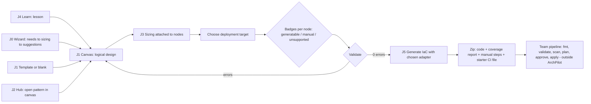

# ArchPilot / SystemsArchitect — Requirements v2 (re-scoped v1)

| | |
|---|---|
| **Author** | BA/QA Analyst (BA hat) |
| **Date** | 2026-09-24 |
| **Version** | 2.1 (Draft). Amends 2.0 after the Product Owner corrected the design scope to be provider-neutral (on-prem and public cloud). See the change log below. |
| **Status** | Draft for Product Owner review. The PO asked us to proceed automatically, so every open question in section 16 carries a recommended default that is treated as accepted unless the PO objects. |
| **Supersedes** | `docs/systemsarchitect-requirements.md` v0.1 for **scope and priorities only**. Its requirement IDs are cited where a new ID replaces or refines them. Its NFR-LEGAL-001/002 and `docs/pattern-content-policy.md` remain in force. |
| **Related docs** | `docs/systemsarchitect-requirements.md` · `docs/systemsarchitect-decisions.md` · `docs/pattern-content-policy.md` (approved, binding) · `docs/systemsarchitect-build-scope.md` v1.5 (what is built) · `docs/research/brainboard-feature-inventory.md` · `docs/research/sysdesai-gallery-analysis.md` · `docs/research/sysdesai-learn-analysis.md` · `docs/research/sysdesai-design-concept.md` · `docs/prototype/systemsarchitect-demo.html` · `contracts/archgraph.schema.json` (10 node types today) |
| **File location note** | The task asked for `docs/requirements-v2.md`. Existing docs in this repo are flat under `docs/`, not `docs/requirements/`, so this file follows the flat layout. |

### Change log

| Version | Date | Change |
|---|---|---|
| 2.0 | 2026-09-24 | First re-scoped v1: four pillars plus Terraform generation, AWS-centred. |
| **2.1** | 2026-09-24 | **(1)** Design scope is now IT systems in general (on-prem and public cloud). The AWS-specific palette is replaced by a provider-neutral **logical component taxonomy** (section 4.1) and a separate **deployment-target layer** with per-node coverage badges and re-targeting (section 4.2). **(2)** IaC is now behind a stable **adapter interface** (section 8). v1 ships two reference adapters: AWS Terraform and on-prem VMware vSphere Terraform. "AWS first" now applies only to the first adapter. The AWS mapping table is now the AWS adapter's table; a vSphere table is added. Unmapped components are flagged, never silently dropped. **(3)** New design-feature requirements from `sysdesai-design-concept.md`: rule-based design wizard (4.3), artifacts, outdated-step propagation, decision log, Markdown export, failure-domain attribute (4.4). **(4)** Schedule impact and cut lines (3.1). New conflicts C-11 to C-14, requirements NFR2-NEUT-001, acceptance criteria AC-21 to AC-27, scenarios SC-16 to SC-20, open questions Q-19 to Q-27. Q-1 to Q-18 defaults are kept, with Q-5 and Q-6 re-scoped to the AWS adapter. |

---

## 1. Executive summary

**English.** The Product Owner re-scoped v1 after studying Brainboard (a canvas that generates Terraform) and SysDesAI (a pattern gallery, an academy and an AI-driven design flow). v1 has four basic pillars: (1) system design for IT systems in general, on-prem and public cloud, on an interactive canvas, started from a template, a rule-based wizard or a blank page; (2) a knowledge hub of well-architected reference designs, written by us from primary company sources and linked out; (3) sizing; and (4) learning, with our own lessons and rule-based auto-checks. On top sits one capability: from a finished design, ArchPilot generates infrastructure as code (IaC) that a team can download as a zip and put in its own deploy pipeline. The design model is provider-neutral. A separate deployment-target layer maps each logical component to a concrete implementation (AWS, Azure, GCP, VMware vSphere, on-prem Kubernetes, bare metal) and shows a badge per node: generatable, manual or unsupported. IaC generators are pluggable adapters behind one interface. v1 ships two: AWS Terraform and vSphere Terraform. ArchPilot only writes code; it never runs `terraform apply` or `destroy`, never holds credentials, never hosts state, and uses no LLM. All earlier decisions stand except the schedule, which no longer fits (section 3.1).

**Tiếng Việt.** Chủ sản phẩm đã điều chỉnh phạm vi v1 sau khi nghiên cứu Brainboard (canvas sinh ra Terraform) và SysDesAI (thư viện mẫu, học viện và luồng thiết kế do AI điều khiển). v1 gồm bốn trụ cột cơ bản: (1) thiết kế hệ thống CNTT nói chung, gồm cả on-prem và public cloud, trên canvas tương tác, bắt đầu từ mẫu, từ trình hướng dẫn dựa trên quy tắc, hoặc từ trang trống; (2) thư viện tri thức gồm các thiết kế tham chiếu chuẩn, do chúng ta tự viết từ nguồn gốc của chính công ty và dẫn liên kết ra ngoài; (3) ước lượng năng lực (sizing); (4) học tập, với bài học do chúng ta viết và tự động chấm theo quy tắc. Phía trên là một khả năng: từ thiết kế hoàn chỉnh, ArchPilot sinh hạ tầng dưới dạng mã (IaC) để đội tải về dạng zip và đưa vào pipeline triển khai riêng. Mô hình thiết kế trung lập với nhà cung cấp. Một lớp "đích triển khai" riêng ánh xạ từng thành phần logic sang cách hiện thực cụ thể (AWS, Azure, GCP, VMware vSphere, Kubernetes on-prem, bare metal) và hiển thị nhãn cho từng nút: sinh được mã, làm thủ công, hoặc chưa hỗ trợ. Bộ sinh IaC là các adapter cắm thêm được sau một giao diện chung. v1 có hai adapter: Terraform cho AWS và Terraform cho vSphere. ArchPilot chỉ viết mã; không bao giờ chạy `terraform apply` hay `destroy`, không giữ thông tin xác thực, không lưu state và không dùng LLM. Mọi quyết định trước đó vẫn giữ nguyên, ngoại trừ tiến độ vốn không còn phù hợp (mục 3.1).

---

## 2. Context & objectives

**Why the change.** Brainboard shows that a design canvas becomes far more valuable when the design leads to deployable code. SysDesAI shows that a browsable gallery, a course and a guided design flow keep users engaged. Neither fits as-is: Brainboard is a cloud deployment platform (runners, state, drift, credentials, SSO); SysDesAI's design flow is LLM-driven and its "Real World" gallery entries are AI-generated from blogs; neither covers on-prem.

**Objective of v1.** A 2-4 person internal team can: learn the basics, design any IT system (on-prem, cloud or hybrid) from a wizard, a template or a blank page, size it with cited numbers, compare it with references, retarget the same design to another deployment target, and hand a validated IaC package to their own pipeline where a generator exists, with an honest list of what stays manual.

**Scope.** Requirements, user stories, acceptance criteria and test-relevant NFRs. Out of scope here: architecture, library choices, UI mock-ups (next stage).

### 2.1 Personas

| Persona | Who | What they need in v1 |
|---|---|---|
| **Engineer Emma** | Mid-level engineer, first big system | Answer a short questionnaire or pick a template, get a design, size it, hand over a checked design |
| **Tech Lead Tom** | Reviews designs | Compare a design with a reference; read the recorded reasons for each choice |
| **Architect Aisha** | Owns capacity and sign-off | Cited, range-based sizing that feeds the design, the spec and the code |
| **Learner Leo** | New hire / junior | Guided lessons with hands-on exercises that tell him whether he got it right |
| **DevOps Dana** | Owns the deploy pipeline | An IaC package that formats, validates, has no secrets, and slots into her pipeline unchanged |
| **Infra Ian** (new) | On-prem infrastructure engineer (virtualisation, network, storage) | Racks, VLANs, hypervisor clusters, SAN/NAS and firewalls modelled as first-class components; a vSphere package plus an honest manual checklist for hardware |
| **Author Cara** | Writes patterns, templates, lessons, wizard rules | A workflow that enforces the content-IP checklist and needs no code release |

### 2.2 Top user journeys

| ID | Journey (happy path) | Persona |
|---|---|---|
| **J0 Guided design** | Open "New design" -> Guided -> answer context and needs questionnaire (defaults become visible assumptions) -> see capacity numbers -> accept or dismiss suggested components with reasons -> canvas opens with accepted components and default edges -> review checklist | Emma |
| **J1 System design** | Open Canvas -> Blank or template -> add, nest, connect logical components -> set failure domains -> edit in inspector -> fix issues -> save | Emma, Ian |
| **J2 Knowledge hub** | Open hub -> filter -> read original write-up + attribution -> follow link to the company's post -> "Open in canvas" or "Compare with my design" | Tom, Leo |
| **J3 Sizing** | Sizing or a node's Sizing tab -> pick benchmark -> enter workload -> read numbers with formulas and ranges -> attach to a node | Aisha |
| **J4 Learning** | Learn -> next lesson -> read -> exercise on canvas or in sizing -> "Check" -> pass or a specific hint -> progress updates | Leo |
| **J5 Design to IaC to pipeline** | Finish design -> choose deployment target (or per-node) -> see coverage badges -> "Generate" with the target's adapter -> fix blocking errors -> review warnings and manual steps -> browse read-only files -> download zip, choose GitHub Actions or GitLab CI file -> commit -> pipeline runs fmt/validate/plan -> humans approve and apply outside ArchPilot | Emma, Dana, Ian |
| **J5b Retarget** | Same design -> switch target from AWS to vSphere -> badges recompute -> choose realisations for nodes that have options -> generate again | Ian, Tom |
| **J6 Authoring** | Cara drafts a pattern, lesson, template or wizard rule -> ticks the 5-box self-certification (content) -> publishes | Cara |
| **J7 Decide and hand off** | Record a decision on a node -> see outdated markers after an upstream change -> refresh artifacts -> export the Markdown spec for review | Tom, Aisha |

### 2.3 Scope split, v1 versus later

| Feature | v1 | Later | Skip (not planned) |
|---|---|---|---|
| Provider-neutral logical taxonomy incl. on-prem components | X | | |
| Deployment-target layer, badges, retargeting | X | | |
| Compare view (same design, two targets, side by side) | Should | X | |
| Rule-based design wizard (no LLM) | X | | |
| Outdated-step propagation, decision log, Markdown spec export | X | | |
| Data model, API list artifacts | Should | | |
| Flow-steps table | Could | | |
| Sequence-diagram editor, PDF export, Mermaid export | | X | |
| Interactive canvas, containers, edges, inspector | X | | |
| Template catalog; use / clone template | X | | |
| Publish own design as template | Should | X | |
| IaC: adapter interface + AWS Terraform + vSphere Terraform | X | | |
| IaC adapters for Azure, GCP, on-prem Kubernetes, Ansible | | X | |
| Read-only code viewer, zip download, starter CI file | X | | |
| **plan / apply / destroy execution by ArchPilot** | | | **X** |
| **Drift detection** | | | **X** |
| **Managed state hosting** (we emit backend config only) | | | **X** |
| **Two-way code editing** (code to diagram) | | X (only if demanded) | |
| **AI assistant / LLM autopilot or chat** | | X (own decision) | |
| **SSO / SCIM / orgs / RBAC beyond member-editor-admin** | | | **X** |
| Import from cloud account, Git, or existing infrastructure | | X | |
| Pull request push to Git | | X | |
| Visual CI/CD designer, runners, notifications | | | X |
| Modules (registry/Git), multi-provider in one package | | X | |
| Environments / multi-scope variables | | X | |
| Real-time co-editing | | X | |
| Cost estimation | | X | |
| On-prem sizing extensions (IOPS, rack units, power) | | X | |
| Hub: link-out catalog with original write-ups | X | | |
| Hub: crawling or copying sysdesai content | | | **X** (policy) |
| Public gallery, social share, community, leaderboard | | | X (2-4 users) |
| Learning: 1 track, deterministic auto-checks | X | | |
| Learning: certificate | | X | |
| Learning: streaks, leaderboard, AI mock interview | | | X |

---

## 3. Conflicts and changes versus earlier decisions (explicit flags)

| # | Item | Earlier position | Effect of new direction | Recommended resolution |
|---|---|---|---|---|
| C-1 | REQ-DESIGN-014 (IaC) | Won't (MVP) | Now **Must**, in v1 | Accepted per PO. REQ-IAC-* and REQ-ADP-* |
| C-2 | Learning module | Not in scope | Now in v1 | Accepted per PO. REQ-LRN-* |
| C-3 | **Schedule.** Decision 1(B) banked a 9-week plan (12 patterns, cuts). Scope has now grown twice (v2.0, then v2.1) | 9 weeks | The 9-week plan is **no longer valid** | See section 3.1 for cause, cut lines and recommendation. Architects re-plan |
| C-4 | **D3 (sizing arithmetic only in TypeScript; server never computes a sizing number)** versus server-side check evaluation (learn analysis) and versus where the wizard and generators run (they consume sizing results) | D3 binding | A server-side copy of the engine would create two implementations | Keep D3. `sizing` and `canvas_rule` checks and the wizard's capacity step use the TypeScript engine; the server stores results. Answer keys are visible to the client (accepted for 2-4 trusted users) |
| C-5 | `archgraph.schema.json` has 10 node types, no containment, no per-node config, no failure domain, no target mapping, and `properties` allows only string/number | Schema v1 | Much larger additive change (taxonomy, containers, attributes, target realisations, artifacts) | Flag to architects. Existing designs must still load (NFR2-EXT-004) using legacy aliases (section 4.1) |
| C-6 | Hub content source | Own team authoring, 12 patterns | Seeded from a sysdesai discovery list, **sysdesai is a pointer only** | Policy unchanged; primary company source required (REQ-KH-006); human re-reads sysdesai Terms first (Q-15) |
| C-7 | Tools needed to test generation | Not in CI | New **test-time** dependencies: `terraform` and the pinned providers (aws, vsphere) | CI job installs pinned versions with a provider cache. Runtime image needs none (NFR2-COR-001) |
| C-8 | "Apply to canvas" was Should (REQ-HUB-007) | Should | Core to "start from a template" | **Must** (REQ-TPL-003, REQ-KH-009) |
| C-9 | Sizing summary export | CSV cut (decision 1) | Spec and IaC need sizing traceability | Still no CSV. Sizing is in the Markdown spec, the capacity sheet, the generated README and the manifest |
| C-10 | Content language | English content assumed | VI/EN UI is decided | UI chrome VI/EN; authored content EN only in v1 (Q-8) |
| **C-11** | **AWS-specific palette and requirements (v2.0)** | AWS-only design vocabulary | PO: design is for IT systems in general | Replaced by neutral taxonomy + target layer. The AWS table survives only as the AWS adapter's mapping. Test: NFR2-NEUT-001 |
| **C-12** | sysdesai design is an **LLM-driven** 7-phase pipeline with chat and autopilot. v1 has **no LLM** | Decision 5/6 | Cannot copy chat/autopilot | Deterministic analogue: questionnaire + rule table + sizing engine (REQ-WIZ-*). Autopilot analogue = "start from template with defaults". Our step names and wording must be original (policy) |
| **C-13** | "Generatable" on-prem is narrow: Terraform can provision virtual machines and reference existing networks and datastores, but cannot configure bare metal, SAN/NAS, switches, firewalls or hardware load balancers | Implied broad IaC | Coverage will be partial by nature | Badges generatable / manual / unsupported; generated `COVERAGE.md` and `MANUAL-STEPS.md`; unmapped components are never silently dropped (REQ-ADP-004) |
| **C-14** | Sizing engine v2.0 models QPS, storage, node count. It has no IOPS, rack units, power or network-port sizing | Engine as built | On-prem sizing is thinner than on-prem design | On-prem physical sizing is Later (Q-22). v1 shows node counts and storage; rack/power are manual inventory fields (Could) |

No conflict found with: internal use, 2-4 users, local auth, self-certify policy, no LLM, on-prem Docker deployment, VI/EN UI.

### 3.1 Schedule impact and cut lines

**Cause.** Since decision 1(B) the scope has gained: IaC generation (v2.0); learning, templates and the AWS mapping (v2.0); and now a two-layer taxonomy with target layer and retargeting, a second (on-prem) adapter behind a stable interface, a rule-based wizard, an artifact model with outdated propagation, a decision log and a spec export (v2.1). The interactive canvas, which was already the largest open item, must now also handle many more component types, containers and attributes. This is BA judgement, not an estimate; architects give the estimate.

**Recommendation.** Do not extend the 9-week plan silently. Architects re-plan. Build in three tiers so a release is possible at the end of Tier 2 if time runs out.

| Tier | Contents | Release meaning |
|---|---|---|
| **1 Walking skeleton** | Taxonomy + AWS adapter for a three-tier design; canvas basics; coverage badges; generate and validate one template; sizing attach | Proves the riskiest path (design to validated IaC). Not releasable |
| **2 Minimum releasable** | All **Must** rows below, with: 2 adapters (AWS, vSphere reference subset), 5 templates, 12 patterns, lessons L1, L3, L4, wizard with at least 12 rules, outdated propagation, Markdown export, decision log (manual) | Meets section 12 |
| **3 Should / Could** | Compare view, hybrid packages, API list and data model editors, ADR auto-draft, more lessons, team templates, rule editor UI, Azure/GCP realisation catalogs | v1.1 |

**Cut order if Tier 2 slips (most expendable first):** wizard rule count above 12; hub pattern count (12 to 8, a change to decision 1 that needs PO approval); vSphere row coverage beyond VM + reference networks; templates 5 to 4. Not cuttable: NFR2-COR-001 per adapter, coverage flagging, determinism, no-secrets.

---

## 4. Requirements: Pillar 1 — System design

Priority = MoSCoW for **v1**. "Built" refers to `docs/systemsarchitect-build-scope.md` v1.5.

### 4.1 Logical component taxonomy and canvas (`REQ-DES-*`)

**Principle.** Two levels. A **logical role** says what a component does and is provider-neutral (for example "relational database", "firewall", "hypervisor cluster"). A **realisation** says how it is provided on a deployment target (section 4.2). The canvas shows the logical role. The neutral model contains no provider-specific field or value (NFR2-NEUT-001).

#### 4.1.1 Logical taxonomy (v1 palette)

| Layer | Logical roles | v1 palette priority |
|---|---|---|
| Edge and access | dns, cdn, api_gateway, waf, reverse_proxy, ddos_protection | dns, cdn, api_gateway Must; others Should |
| Network | load_balancer (L4/L7), firewall, router, switch, vpn_link, service_mesh | load_balancer, firewall Must; router, switch, vpn_link Should; service_mesh Could |
| Network containers | **site** (datacentre / region), **zone** (availability zone, room, rack row), **network_segment** (VLAN, subnet, VPC/VNet segment) | Must (containers) |
| Compute | bare_metal_host, hypervisor_cluster, virtual_machine, container_platform, function, batch_worker | virtual_machine, container_platform, bare_metal_host, hypervisor_cluster Must; function Should; batch_worker Could |
| Application | service (with `kind`: web, api, worker, scheduler), integration_bus | service Must; integration_bus Could |
| Data stores | relational_db, key_value_store, document_db, search_index, cache, time_series_db, data_warehouse | relational_db, key_value_store, cache Must; document_db, search_index Should; others Could |
| Storage | object_storage, block_storage, file_storage (NAS), san, backup_target | object_storage, block_storage, file_storage, san, backup_target Must |
| Messaging | queue, pubsub_topic, event_stream | queue Must; others Should |
| Security and identity | identity_provider, secrets_vault, key_management, siem_log_store, certificate_authority | identity_provider, secrets_vault Must; others Should |
| Observability and ops | monitoring (metrics, logging, alerting), ci_cd, artifact_registry | monitoring Should; others Could |
| Physical (on-prem) | rack, power_ups, cooling, out_of_band_mgmt | Could (annotation-grade in v1: carried in inventory, no code) |
| External and annotation | client, external_service, note, shape, text | Must |

Legacy aliases (so saved designs still load): `client`->client, `cdn`->cdn, `load_balancer`->load_balancer, `service`->service, `database`->relational_db, `cache`->cache, `queue`->queue, `object_store`->object_storage, `external_api`->external_service, `note`->note.

#### 4.1.2 Canvas requirements

| ID | Requirement | Priority | Replaces / status |
|---|---|---|---|
| REQ-DES-001 | A user can create a new blank design with a name. | Must | REQ-DESIGN-001. Backend built |
| REQ-DES-002 | The canvas palette offers the logical roles in 4.1.1, grouped by layer, searchable by name, provider-neutral. No AWS, Azure, GCP, VMware or other vendor term appears as a palette item. | Must | Replaces the v2.0 AWS palette |
| REQ-DES-003 | A user can drag a palette item onto the canvas, or add it by keyboard menu command, producing one node. | Must | |
| REQ-DES-004 | A user can nest components in containers (site > zone > network_segment > component; hypervisor_cluster > virtual_machine). Invalid nesting is refused with a message that names the rule. Nesting rules are data. | Must | New |
| REQ-DES-005 | A user can connect two nodes with a directional edge with label and **kind**: `flow` (visual only, no code) or `access` (source uses target; adapters may derive firewall rules, permissions and references). Edges may optionally carry protocol and port. | Must | REQ-DESIGN-003, refined |
| REQ-DES-006 | A user can rename, delete, move and resize nodes, and edit or delete edges. Deleting a container asks whether to delete or un-nest its children. | Must | REQ-DESIGN-004 |
| REQ-DES-007 | Selecting a node opens an inspector with a form for its logical role: common attributes (REQ-DES-024) plus role-specific attributes (for example engine family for relational_db, port list for firewall). Fields have types, allowed values and inline validation. | Must | New |
| REQ-DES-008 | Each node has a stable `codeName`, set at creation from its label. Renaming the label does not change it. Changing it needs an explicit action with a warning that it changes generated resource addresses. | Must | REQ-IAC-025 |
| REQ-DES-009 | A user can save a design (autosave plus explicit save) and reload it identically. A stale save is refused. | Must | REQ-DESIGN-005. Backend built |
| REQ-DES-010 | Undo/redo of at least 50 actions. | Must | REQ-DESIGN-009 |
| REQ-DES-011 | An **Issues** panel lists validation results (error / warning / info); clicking one selects the node. Nothing in it blocks saving. | Must | REQ-DESIGN-007 |
| REQ-DES-012 | A user can attach a rationale note to any node or edge. | Should | REQ-DESIGN-008 |
| REQ-DES-013 | A user can export a design as JSON (re-importable) and as SVG or PNG. | Must | REQ-DESIGN-006 |
| REQ-DES-014 | A user can attach a sizing result to a node; the node shows a badge with the result and whether it is stale. | Must | REQ-CALC-007 |
| REQ-DES-015 | A user can duplicate a design. | Should | REQ-DESIGN-010 |
| REQ-DES-016 | Annotation nodes (note, shape, text) and external nodes produce no code and are ignored by adapters, but appear in the coverage report as "annotation". | Must | New |
| REQ-DES-017 | Right-panel tabs on the canvas: Inspector, Issues, Sizing, Target (mapping and badges), Decisions, Code (viewer). | Must | |
| REQ-DES-018 | Snapshots: a user can save a named snapshot of a design and restore it. | Should | REQ-DESIGN-011 |
| REQ-DES-019 | A design has an attached Markdown readme. | Should | |
| REQ-DES-020 | A user can set a per-node target file name in generated code. | Could | |
| REQ-DES-021 | Reference nodes for existing infrastructure ("use the existing VLAN / cluster"). | Should | Was Could; on-prem designs mostly reference existing platforms |
| REQ-DES-022 | Edge styling subset (solid/dashed, colour). | Could | |
| REQ-DES-023 | Environments, multi-scope variables, real-time co-editing, AI-generated designs. | Later / Won't | |
| REQ-DES-024 | **Common node attributes:** `role` (Must), `replicas` (Must), `statefulness` stateless/stateful (Must), **`failureDomain`** (Must, see REQ-DES-025), `tier` (Should), `criticality` low/medium/high (Should), `dataClassification` (Should), `owner` (Should). | Must / Should | New |
| REQ-DES-025 | **Failure-domain attribute.** Each node has `failureDomainLevel` in {host, rack, zone, site, region} and a free `failureDomainLabel` (for example "rack-2", "zone-a"). Containers of type site and zone supply defaults to children. The level list is neutral: cloud zones and regions and on-prem racks and sites use the same field. | Must | New (C-5) |
| REQ-DES-026 | **HA rule (neutral).** If a stateful or high-criticality node has `replicas` >= 2 but all replicas share one failure-domain label at the stated level, or `replicas` is 1, the Issues panel shows a warning naming the node and level. The rule runs for every target, and adapters report which levels they can express (REQ-ADP-010). | Should | New |

### 4.2 Deployment targets and realisations (`REQ-TGT-*`)

**Model.** The design is logical first. A **deployment target** (AWS, Azure, GCP, VMware vSphere, on-prem Kubernetes, bare metal) is chosen afterwards, for the whole design or per node group. A **realisation** is the concrete implementation of a logical role on a target (for example relational_db on AWS = a managed relational database instance; on vSphere = virtual machines you run a database on; on bare metal = a physical server you install a database on). Realisations are catalog data, not code.

**Badges.** Each node shows one badge for the active target:

| Badge | Meaning |
|---|---|
| **generatable** | The target's adapter emits code for this node. A coverage note says what is and is not covered (for example "provisions the VM; installing the database is manual") |
| **manual** | A realisation is defined and described (with a checklist), but no adapter emits code for it |
| **unsupported** | No realisation is defined for this role on this target |

| ID | Requirement | Priority |
|---|---|---|
| REQ-TGT-001 | Targets in v1 catalog: `aws`, `vsphere` (on-prem VMware), `bare_metal`, `azure`, `gcp`, `k8s_onprem`, plus a `custom` target with free-text realisations. Target ids are data. | Must (aws, vsphere, bare_metal); Should (azure, gcp, k8s_onprem); Could (custom) |
| REQ-TGT-002 | A **realisation catalog** maps (logical role, target) to one or more named realisations with description, size-class guidance, and a manual checklist. Catalog entries exist for every Must role on aws, vsphere and bare_metal, and for Must roles on azure, gcp and k8s_onprem as text realisations (badge `manual`). | Must (aws, vsphere, bare_metal); Should (others) |
| REQ-TGT-003 | The design has an **active target** (default: unset, meaning logical only). A user can set it for the whole design, and override it per node (hybrid designs, for example database on-prem and web tier in cloud). | Must (design-wide); Should (per-node override) |
| REQ-TGT-004 | Every node shows its badge and coverage note for its effective target. The Target tab shows totals ("14 of 20 nodes generatable, 5 manual, 1 unsupported") and a list of non-generatable nodes with reasons. | Must |
| REQ-TGT-005 | **Retargeting.** A user can change the target of a design or node. Badges and mappings recompute immediately. Realisation choices made per target are remembered, so switching back restores them. No node, edge or attribute of the logical design is changed or lost by retargeting. | Must |
| REQ-TGT-006 | When a node has more than one realisation on the active target, the user picks one in the mapping panel; the panel shows the size class suggested from the attached sizing result. A default is pre-selected and recorded as an assumption. | Must |
| REQ-TGT-007 | A canvas "colour by target" toggle and a small target label on each node (text, not logos). | Should |
| REQ-TGT-008 | **Compare view:** the same design against two targets side by side: component count, badge totals, failure-domain levels expressible, and which parts lack code. No cost figures. | Should |
| REQ-TGT-009 | Hub patterns and templates are logical. Each carries a per-target coverage summary computed from the catalog and adapters (for example "generatable on aws: 9/9, on vsphere: 6/9"). | Must |
| REQ-TGT-010 | The design-wide constraints from the wizard (hosting intent, air-gap, data residency) can pre-select or restrict targets: an air-gapped constraint hides targets flagged as internet-dependent and warns when the active target needs internet. | Should |
| REQ-TGT-011 | Adding a target or a realisation is a data change plus, for generatable coverage, an adapter mapping. | Must |

### 4.3 Rule-based design wizard, no LLM (`REQ-WIZ-*`)

Step names and wording are our own (C-12). Rule text is original.

| ID | Requirement | Priority |
|---|---|---|
| REQ-WIZ-001 | "New design" offers **Guided** (wizard), **Template** and **Blank**. The wizard can be left at any time; the design keeps the wizard's stored answers linked. | Must |
| REQ-WIZ-002 | **Context step:** system name and purpose; hosting intent (cloud, on-prem, hybrid); data residency; air-gapped yes/no; existing platforms (for example VMware, Kubernetes); team skills; budget class. All pick-lists or short text. | Must |
| REQ-WIZ-003 | **Needs step (NFR questionnaire):** pick-lists and numbers for expected users, peak factor, read/write ratio, data volume and growth, latency target, availability target, RPO/RTO, consistency need, data sensitivity class, geographic spread, change frequency. Any unanswered question can be set to "use default"; each default is stored as a visible **assumption** with its value. | Must |
| REQ-WIZ-004 | **Capacity step:** answers feed the existing sizing engine (TypeScript, D3) with a chosen benchmark. Output shows the same formulas, ranges and confidence as the Sizing screen, and can be opened there. | Must |
| REQ-WIZ-005 | **Suggestion step:** a rule table maps answers (and graph predicates) to suggested components and edges. Each suggestion shows its reason with the triggering answers (for example "because availability = 99.95% and hosting = single site"). The user accepts or dismisses each; dismissals are stored. | Must |
| REQ-WIZ-006 | Rules are **data** in the form `when <predicate> then suggest <role or edge> because <reason text>`, added or changed without a release. v1 ships at least **12 rules** covering: availability high -> load balancer + at least 2 replicas + replicated data tier; read-heavy ratio -> cache; bursty or long work -> queue + worker; file payloads -> object storage; sensitive data -> secrets vault + key management; multi-site -> replication + DNS steering; regulated -> audit log store; on-prem hosting -> firewall + network segments + backup target; air-gap -> local artifact registry; and at least 3 further rules. | Must |
| REQ-WIZ-007 | **Target step:** the wizard asks for the deployment target (or "decide later") and shows the coverage summary for each choice before the user commits (REQ-TGT-004). | Must |
| REQ-WIZ-008 | **Canvas step:** accepted suggestions are placed on the canvas inside default containers with default edges from a small tier template. Each node records its origin (wizard rule id). The user edits freely afterwards. | Must |
| REQ-WIZ-009 | Determinism: same answers and same rule set version produce the same suggestions in the same order. | Must |
| REQ-WIZ-010 | Changing an answer marks dependent artifacts outdated (REQ-ART-002) and offers "re-run suggestions", which never deletes user-edited nodes. | Must |
| REQ-WIZ-011 | **Review step:** a checklist of unresolved suggestions, failing rules, outdated artifacts and non-generatable nodes, with a shortcut to Markdown export. | Should |
| REQ-WIZ-012 | The wizard rule engine and the lesson check engine (REQ-LRN-004) share one rule format and evaluator. | Should |
| REQ-WIZ-013 | A MoSCoW scope list can be captured on the Needs step. | Should |
| REQ-WIZ-014 | Rule editing UI for the editor role. (v1 = files/data only.) | Could |
| REQ-WIZ-015 | On-prem physical capacity (rack units, power, IOPS) in the Capacity step. | Later (C-14) |
| REQ-WIZ-016 | No free-text prompt, no chat, no LLM anywhere in the wizard. Contextual help and rule explanations are static content. | Must (constraint) |

### 4.4 Design artifacts, outdated propagation, decisions, export (`REQ-ART-*`)

**Dependency order.** Requirements sheet -> Capacity sheet -> Components (canvas) -> Target mapping and inventory -> {Data model, API list, Flow steps} -> {Decision log links, Scalability notes, Checks report} -> Markdown spec. The generated IaC package is a derived artifact of "Target mapping and inventory".

| ID | Requirement | Priority |
|---|---|---|
| REQ-ART-001 | A design has these artifacts, each with a status chip (not_started, current, outdated, blocked by missing input): Requirements sheet (wizard answers and assumptions), Capacity sheet, Components (canvas), Target mapping and component inventory, Decision log. The Checks report joins the set when REQ-ART-008 ships (Should). | Must |
| REQ-ART-002 | **Outdated propagation.** Each artifact stores the content hash of the inputs it was derived from. When an upstream artifact is saved with a changed hash, every downstream artifact becomes `outdated`, with a reason ("Requirements sheet changed at revision 7"). The user can review and press "Mark as current". Nothing is overwritten automatically. | Must |
| REQ-ART-003 | The outdated state appears within 1 s of the upstream save, without a page reload. | Must |
| REQ-ART-004 | The generated Terraform/IaC package shows "generated from design revision N; design is now revision M" when stale. | Must |
| REQ-ART-005 | **Component inventory** is generated from the canvas: name, logical role, effective target, chosen realisation, quantity (replicas), size class (from sizing), failure domain, coverage badge. It is exportable (Markdown table, JSON). It doubles as a bill of materials for on-prem. | Must |
| REQ-ART-006 | **Decision log (ADR, light).** A user can create, edit, and list decisions with: title, context, options considered, decision, consequences, status (proposed, accepted, superseded), linked node ids, author, date. Decisions show in the linked node's inspector. | Must |
| REQ-ART-007 | Accepting a wizard suggestion or choosing a realisation can auto-draft a decision (status "proposed") for the user to edit. | Should |
| REQ-ART-008 | **Checks report:** aggregate of design validation results, single points of failure, headroom warnings. Deterministic. | Should |
| REQ-ART-009 | **Scalability notes:** auto-generated bottleneck notes from rules over the sizing output (for example headroom under a threshold, single node on a hot path). | Should |
| REQ-ART-010 | **API list** artifact: table with method, path, auth, owner component, rate class. | Should |
| REQ-ART-011 | **Data model** artifact: entities, fields, keys, store type, owning component, retention. | Should |
| REQ-ART-012 | **Flow steps** artifact: ordered steps between components for a named scenario, as a table bound to nodes. | Could |
| REQ-ART-013 | Sequence-diagram editor and rendering. | Later |
| REQ-ART-014 | **Markdown spec export:** one file in our own phase order: context, needs and assumptions, capacity, components and inventory, targets and coverage, decisions, other artifacts present, checks, pointer to generated package. Deterministic; outdated artifacts are marked in the output. | Must |
| REQ-ART-015 | JSON export of the whole design bundle (artifacts included) re-importable. | Must |
| REQ-ART-016 | PDF export; Mermaid export. | Later |
| REQ-ART-017 | Editing wizard answers, capacity inputs, nodes, target choices or decisions each creates a design revision so the outdated state is reproducible. | Must |

### 4.5 Templates (`REQ-TPL-*`)

| ID | Requirement | Priority |
|---|---|---|
| REQ-TPL-001 | A "Templates" catalog lists templates with name, one-line description, tags, complexity (S/M/L), component count, and a **coverage summary per shipped adapter** (for example "AWS 9/9 generatable; vSphere 6/9"). | Must |
| REQ-TPL-002 | Filter by tag and by target coverage; search by keyword (VI diacritics folded); sort by name or update date. | Must |
| REQ-TPL-003 | "Use template" creates a new private design that is a copy. Editing it never changes the template. | Must |
| REQ-TPL-004 | v1 ships at least **5 starter templates**, all logical (no target chosen): (1) static site; (2) three-tier web app; (3) three-tier plus cache; (4) async worker (service, queue, worker, object storage); (5) HA web app across two failure domains. Each is 100% generatable on the AWS adapter and passes `terraform validate` there. At least **2** are generatable for their infrastructure nodes on the vSphere adapter (rest flagged manual) and pass `terraform validate` there. | Must |
| REQ-TPL-005 | A template records its author and a description of non-obvious decisions. If derived from a hub pattern it carries that pattern's attribution. | Must |
| REQ-TPL-006 | Hub patterns can be opened in the canvas (REQ-KH-009). Nodes without a realisation or adapter mapping on the active target are flagged by badge, never dropped. | Must |
| REQ-TPL-007 | Templates are data, added without a code release. | Must |
| REQ-TPL-008 | A user can publish a design to a shared "Team templates" list. A secret and account-id lint runs first. | Should |
| REQ-TPL-009 | A template preview (read-only diagram) is shown before use. | Should |
| REQ-TPL-010 | Template variables: a short wizard after "Use template" asks name, target, and key sizes. | Could |

---

## 5. Requirements: Pillar 2 — Knowledge hub (`REQ-KH-*`)

Content policy (`docs/pattern-content-policy.md`) applies to every requirement below. sysdesai.com is a **discovery pointer only**. Primary sources are the companies' own posts.

| ID | Requirement | Priority | Replaces / status |
|---|---|---|---|
| REQ-KH-001 | Browse published patterns as cards: title, source company, primary category, up to 3 secondary tags, one-line original summary. | Must | REQ-HUB-001 |
| REQ-KH-002 | Filter by primary category (Messaging, Social and feeds, Storage and CDN, Search and recommendation, Analytics and streaming, API platform, AI and ML, Payments and commerce) and by company. **No "Other".** | Must | REQ-HUB-003 |
| REQ-KH-003 | Keyword search across title, summary, tags, company; VI diacritics folded. | Must | REQ-HUB-004 |
| REQ-KH-004 | Sort by newest, alphabetical. | Should | REQ-HUB-006 |
| REQ-KH-005 | Detail shows our original write-up in fixed sections: requirements, scale and estimation, architecture (our own redrawn graph, using the neutral taxonomy), key flows, scaling and reliability, trade-offs, and a "well-architected view" (short notes on reliability, security, performance, cost, operations). | Must | REQ-HUB-002 |
| REQ-KH-006 | An **attribution strip** is always visible: source company, original post title, working link-out, source publish date, date read, author of record. `source.url` points to the **company's** post (or a named primary source), never to sysdesai. | Must | REQ-HUB-005. Schema constraint built |
| REQ-KH-007 | Optional footer "discovered via sysdesai.com" with a link. Never replaces the primary citation. | Could | |
| REQ-KH-008 | Numbers come from the primary source with an inline citation. Numbers from sysdesai are never used. | Must | |
| REQ-KH-009 | "Open in canvas" copies the pattern's logical graph into a new private design with provenance (`seededFromPatternId`). If the pattern is later unpublished, provenance attribution on derived designs is suppressed. | Must | REQ-HUB-007 (C-8) |
| REQ-KH-010 | "Compare with my design": choose my design and a pattern; see components and connections present in only one. | Should | REQ-HUB-008 |
| REQ-KH-011 | v1 launches with **12 published patterns** (decision 1 stands), covering at least 6 of the 8 categories, chosen from the 30-item reading list after a human confirms each primary source. Candidates without a confirmable primary source are dropped. | Must | Decision 1 |
| REQ-KH-012 | Each pattern shows per-target coverage (REQ-TGT-009). At least 3 of the 12 are fully generatable on at least one shipped adapter. | Should | New |
| REQ-KH-013 | Editorial states: candidate, source_confirmed, drafting, self_certified, published, unpublished. Publish is disabled until the 5-box self-certification is complete; `content_hash` invariant holds. A note field records whether sysdesai was consulted. | Must | Backend gate built |
| REQ-KH-014 | Report/takedown path per pattern; unpublish is one click. | Must | NFR-LEGAL-002 |
| REQ-KH-015 | "Quiz me" mode (hide a section, self-marked reveal). | Could | |
| REQ-KH-016 | Bookmark a pattern. | Could | |
| REQ-KH-017 | **Prohibited:** crawling or scripted fetching of sysdesai; storing sysdesai text, diagrams, counts, designer names, logos; storing company blog text or figures. Reading-list refresh is manual, at most quarterly. | Must (constraint) | |

---

## 6. Requirements: Pillar 3 — Sizing (`REQ-SIZ-*`)

Engine v2.0 and the Sizing screen are **built** (tasks 3.1-3.4). Only gaps and the new hooks are new work.

| ID | Requirement | Priority | Status |
|---|---|---|---|
| REQ-SIZ-001 | Inputs: request rate, record size, read:write ratio, retention, peak factor, replication factor, index overhead, compression, headroom, spare nodes. | Must | Built |
| REQ-SIZ-002 | Outputs: storage, ingress/egress, node count, each with formula, substituted formula and assumptions; ranges from benchmark confidence (measured +/-10%, declared +/-25%, estimated +/-50%, unverified +/-100%). | Must | Built |
| REQ-SIZ-003 | Benchmarks from `GET /api/benchmarks`; every measured or declared row has a citation; built-in fallback when the API is unreachable. | Must | Built |
| REQ-SIZ-004 | Live recompute under 500 ms; no server round trip for arithmetic (D3). | Must | Built |
| REQ-SIZ-005 | A sizing scenario can be saved against a design node and reopened from the node's Sizing tab. | Must | API scoped; UI open |
| REQ-SIZ-006 | Attached node count, cache node count or storage GiB become the default of the matching adapter variable (REQ-IAC-016) and mark the sizing stale if node inputs change afterwards. | Must | New |
| REQ-SIZ-007 | Workload profiles prefill inputs. | Should | |
| REQ-SIZ-008 | Deterministic review hints mirror engine warnings. | Must | Built |
| REQ-SIZ-009 | Lesson exercises and the wizard's Capacity step deep-link into Sizing with a preloaded workload. | Must | New |
| REQ-SIZ-010 | Sizing summary appears in the Markdown spec, capacity sheet, generated README and manifest. | Must | New (was Should) |
| REQ-SIZ-011 | Compare user numbers to a pattern's cited numbers. | Could | |
| REQ-SIZ-012 | CSV/PDF export; cost estimation; live pricing APIs. | Later / Won't | |
| REQ-SIZ-013 | Sizing never chooses an instance class, VM flavour, hardware model or price. Those are chosen by the user from the realisation's curated list, with a default. | Must (constraint) | |
| REQ-SIZ-014 | On-prem physical sizing (IOPS, rack units, power, network ports). | Later (C-14) | |

---

## 7. Requirements: Pillar 4 — Learning (`REQ-LRN-*`)

Structure follows `docs/research/sysdesai-learn-analysis.md`, with our own ordering and content. Lessons and checks are **provider-neutral** unless a lesson is explicitly about a target.

| ID | Requirement | Priority |
|---|---|---|
| REQ-LRN-001 | Hierarchy: track > module > lesson > check. v1 ships one track ("Design fundamentals with ArchPilot") with 3 modules: A Sizing, B Building blocks, C Reliability and delivery. | Must |
| REQ-LRN-002 | Lesson page: goal (2-3 measurable outcomes), concept text with one original diagram, worked example, exercise, checks, "go deeper" links, summary and next. Target 10-20 minutes. | Must |
| REQ-LRN-003 | Check types: `canvas_rule`, `sizing`, `mcq`, `reflect`. | Must |
| REQ-LRN-004 | `canvas_rule` checks evaluate declarative rules over the learner's saved design (for example "no edge from client to relational_db", "cache on the read path", "replicas >= 2 on stateful nodes in distinct failure domains"). Rules are data, reuse the design validation engine where one exists, and return a canned hint per failing rule. | Must |
| REQ-LRN-005 | `sizing` checks compare the learner's number with the engine's output for the lesson's preset workload within a per-check tolerance (default 15%). Answers are never stored constants. | Must |
| REQ-LRN-006 | `mcq` checks have a keyed answer and an explanation per option. `reflect` is self-marked. | Must |
| REQ-LRN-007 | Unlimited retries; store best result, attempt count, last-attempt time. | Must |
| REQ-LRN-008 | An exercise can open the canvas with a starter graph (or blank) and a pinned task card, or open Sizing with a preloaded workload. The attempt is saved as a normal design tagged with `lessonId`. | Must |
| REQ-LRN-009 | Lesson state per user: not_started, in_progress, completed. Module and track progress derived. "Next lesson" and a percent bar. | Must |
| REQ-LRN-010 | Prerequisites are advisory (warning, not block). | Must |
| REQ-LRN-011 | Content minimum: L1, L3, L4. Target: also L2, L5, L6, L9. Stretch: L7, L8 (section 7.1). | Must (L1, L3, L4) / Should (L2, L5, L6, L9) / Could (L7, L8) |
| REQ-LRN-012 | Lessons may link to hub patterns by slug; links to unpublished patterns are hidden at read time. | Must |
| REQ-LRN-013 | Lessons are data (Markdown + front matter + JSON check specs), imported idempotently, `draft -> published`, no code release. | Must |
| REQ-LRN-014 | Each lesson passes the 5-box self-certification against a `content_hash`. Lesson text, module order, exercises and quiz questions must not be re-worded copies of sysdesai. The author does not consult sysdesai while writing. | Must |
| REQ-LRN-015 | Completion stores the lesson `content_hash`; UI shows "updated since you completed" when it changes. | Should |
| REQ-LRN-016 | Every lesson has a reference solution that passes all its checks, run as a regression test whenever the validation, sizing or rule engines change. | Must |
| REQ-LRN-017 | Certificate, streaks, leaderboard, comments, AI-graded interview, enforced prerequisites. | Later / Won't |
| REQ-LRN-018 | UI text VI/EN; lesson content EN only in v1. | Must |

### 7.1 v1 lesson list (working)

| # | Lesson | Module | Check kinds | Priority |
|---|---|---|---|---|
| L1 | Reading a workload | A | sizing | Must |
| L2 | Latency and availability targets | A | sizing, mcq | Should |
| L3 | Your first three-tier design | B | canvas_rule | Must |
| L4 | Scaling reads with a cache | B | canvas_rule, sizing | Must |
| L5 | Async work with a queue | B | canvas_rule | Should |
| L6 | Removing single points of failure (failure domains: host, rack, zone, site) | C | canvas_rule | Should |
| L7 | Trade-offs and consistency in plain terms | C | mcq, reflect | Could |
| L8 | Capstone: design and size a service end to end | C | canvas_rule + sizing | Could |
| L9 | Ship it: from design to IaC (pick a target, read the coverage report) | C | canvas_rule (0 errors on a chosen target), mcq | Should |

---

## 8. Requirements: Pillar 5 — IaC generation with pluggable adapters (`REQ-IAC-*`, `REQ-ADP-*`)

**Shape.** One neutral design; one **adapter** per (target family, tool). An adapter takes the logical design plus the realisation choices and produces a file package. v1 ships two **reference adapters** behind the same stable interface: **AWS Terraform** and **on-prem VMware vSphere Terraform**. More adapters (Azure, GCP, on-prem Kubernetes, Ansible) are added later without changing the neutral model.

### 8.1 Adapter interface (`REQ-ADP-*`) — behaviour, not architecture

| ID | Requirement | Priority |
|---|---|---|
| REQ-ADP-001 | Every adapter is described by declared metadata: id, version, tool (for example terraform), the target ids it serves, the logical roles and levels it supports with a coverage class each (generatable / manual), its input-variable schema, the files it emits, its pipeline templates, its supported failure-domain levels, and its **validation command set** for CI. | Must |
| REQ-ADP-002 | **Coverage query without generation:** for a design and target, an adapter returns per-node coverage (badge, note, reason) without emitting files. The UI badges (REQ-TGT-004) and the coverage summaries (REQ-TGT-009) use only this query. | Must |
| REQ-ADP-003 | Generation is a pure function of (design revision, target and realisation choices, generator version, adapter version). No clock, randomness or environment input. | Must |
| REQ-ADP-004 | **No silent drops.** Every node and edge in the design appears exactly once in the coverage report as generatable, manual, unsupported, annotation, or assigned-to-another-target. A property test over random designs asserts this. Nodes that generate nothing are also listed in the generated `COVERAGE.md`, the README and the manifest. | Must |
| REQ-ADP-005 | Adapters are registered in a registry. Adding an adapter needs no edit to the neutral model, canvas, sizing, hub or learning code (proved by a stub adapter test). The adapter list shown in the UI comes from the registry. | Must |
| REQ-ADP-006 | Each **shipped** adapter has its own golden fixtures and its own CI validation gate (NFR2-COR-001); an adapter without them cannot be registered as shipped. | Must |
| REQ-ADP-007 | The adapter version and provider pins are recorded in the manifest. | Should |
| REQ-ADP-008 | Adapter-neutral validation rules (section 8.6, scope "All") run before any adapter; adapter-specific rules run after. | Must |
| REQ-ADP-009 | An adapter may be non-Terraform (for example Ansible later): the interface accepts its own file set and validation commands; the download, viewer and coverage features work unchanged. | Must |
| REQ-ADP-010 | An adapter declares which failure-domain levels it can express (AWS: zone, region; vSphere: host via anti-affinity, site via separate clusters or data centres; bare metal: none). A node using a level the adapter cannot express gets coverage note text and warning IAC-W08. | Must |
| REQ-ADP-011 | An adapter-supplied variable schema lets the UI collect adapter-specific inputs (for example region for AWS; datacenter, cluster, datastore, network, VM template for vSphere) without adapter-specific UI code. | Should |

### 8.2 Functional requirements (all adapters unless stated)

| ID | Requirement | Priority |
|---|---|---|
| REQ-IAC-001 | From a saved design with a target, a user can run "Generate". The design JSON is the source of truth. Generated code is a derived artifact, never edited back (one-way). | Must |
| REQ-IAC-002 | A user selects the adapter for the design's target (if several serve it). Generating for a target with no shipped adapter is refused with a message listing the coverage report (everything is manual), and the manual checklist is still downloadable as Markdown. | Must |
| REQ-IAC-003 | The package contains the common Must files: `COVERAGE.md`, `MANUAL-STEPS.md`, `.gitignore`, the chosen starter pipeline file, plus the adapter's own files (sections 8.3 to 8.5). `README.md` and `archpilot-manifest.json` are Should (REQ-IAC-017, REQ-IAC-020). | Must |
| REQ-IAC-004 | **Variables:** every environment-specific value is a variable with type, description and where safe a default. Values needed for a run go to `terraform.tfvars` (Terraform adapters). Variables flagged sensitive have no default and no value in files. | Must |
| REQ-IAC-005 | **Outputs:** useful identifiers and endpoints are outputs with descriptions. | Must |
| REQ-IAC-006 | **Provider file:** pins Terraform required version and exactly one provider version range per provider; no credentials, profiles or keys appear. | Must |
| REQ-IAC-007 | **Backend file:** declared by the adapter with **partial configuration** (nothing hard-coded; supplied at `init` via `-backend-config`), encryption and locking on where the backend supports them. An example `backend.hcl.example` is emitted. ArchPilot never creates or reads state. | Must |
| REQ-IAC-008 | **Validation before generation** (section 8.6). Errors block and list node, rule id and fix. Warnings do not block; they appear in the UI and in the README. | Must |
| REQ-IAC-009 | **Zip download:** `<design-codeName>-<adapter-id>-terraform.zip` (or `-<tool>` for other tools). Fixed entry timestamps, sorted entries. | Must |
| REQ-IAC-010 | **Read-only viewer:** the Code tab shows each file in a tab with syntax highlighting and copy-to-clipboard, with the same content as the zip. No editing. | Must |
| REQ-IAC-011 | **GitHub Actions starter** (`.github/workflows/terraform.yml`): on pull request `fmt -check`, `init -backend=false`, `validate`, `plan`; an `apply` job only behind a protected environment with manual approval, default branch only, using the saved plan. AWS: OIDC role assumption, role ARN in a repository variable. vSphere: credentials from repository secrets and a **self-hosted runner** with network reach to the vCenter (README says so). No static keys in files. No `destroy` job. | Must |
| REQ-IAC-012 | **GitLab CI starter** (`.gitlab-ci.yml`) with equivalent stages, `when: manual` apply on the default branch, ID tokens or CI variables, no stored keys, no destroy job. | Must |
| REQ-IAC-013 | The user chooses GitHub Actions, GitLab CI or none before download; only the chosen file is included. | Must |
| REQ-IAC-014 | **Determinism:** same design revision, target choices, generator and adapter version give byte-identical files and zip (NFR2-DET-001). | Must |
| REQ-IAC-015 | **No secrets** in any generated file (NFR2-SEC-001). AWS database credentials use the managed master secret option. vSphere credentials and guest passwords are sensitive variables with no defaults. | Must |
| REQ-IAC-016 | **Sizing hand-off:** an attached sizing result becomes the default of the adapter's sizing-bound variable (AWS: desired count, cache node count, allocated storage GiB rounded up; vSphere: VM count, disk GiB), with a comment naming the scenario and `formulaVersion`. | Must |
| REQ-IAC-017 | Generated `README.md`: design summary, file list, how to run, backend setup, required variables, generated companion resources, warnings, sizing summary and assumptions, coverage totals, and the statement that ArchPilot did not run or test the code against a real environment. | Should |
| REQ-IAC-018 | **Least privilege** (adapter-applicable): AWS IAM policies grant only actions each connected `access` edge needs, on the specific resource, with no `"*"` in `Action` and no `"*"` in `Resource` unless AWS requires it and it is commented. Network rules derive from `access` edges: only the needed port, source restricted to the source component, never `0.0.0.0/0` except an explicit internet-facing listener. vSphere: no rule opens all ports; VM resource permissions are documented in `MANUAL-STEPS.md` as least-privilege role suggestions. | Must |
| REQ-IAC-019 | **Secure defaults** on every generated resource of the AWS adapter (S3 public access block and encryption, RDS encrypted, non-public, deletion protection; ElastiCache encryption; SQS encryption; log retention). vSphere: thin/thick provisioning explicit, `allow_unverified_ssl` default false, no guest default passwords. Relaxing a default needs a named inspector option and raises a warning. | Must |
| REQ-IAC-020 | `archpilot-manifest.json`: design id and revision, generator version, adapter id and version, provider pins, file list with SHA-256, coverage totals. No timestamps or user names. | Should |
| REQ-IAC-021 | Security scan step (for example tflint plus a policy scanner) in starter pipelines. | Should |
| REQ-IAC-022 | An audit event for each generate and download (who, design id and revision, adapter, result, error count). | Must |
| REQ-IAC-023 | Nodes with no code (annotation, external, manual, unsupported) produce nothing in code but are listed in the viewer, `COVERAGE.md` and `MANUAL-STEPS.md` (REQ-ADP-004). | Must |
| REQ-IAC-024 | Generated files pass `terraform fmt -check` and `terraform validate` unmodified, for every shipped Terraform adapter. | Must |
| REQ-IAC-025 | Resource labels derive from `codeName` (REQ-DES-008), are unique, valid and stable across regeneration. | Must |
| REQ-IAC-026 | `MANUAL-STEPS.md` contains, per manual node: role, target, realisation, checklist steps from the catalog, and the linked decisions. | Must |
| REQ-IAC-027 | Hybrid designs: one package per adapter used, each covering its own nodes; cross-target edges are listed as manual connectivity items. | Should |
| REQ-IAC-028 | Per-node target file grouping. | Could |
| REQ-IAC-029 | OpenTofu compatibility statement and test. | Could |
| REQ-IAC-030 | Push to Git as PR; import existing IaC; registry modules; multi-provider in one package; two-way sync; Azure, GCP, Kubernetes and Ansible adapters. | Later |

### 8.3 AWS Terraform adapter (reference adapter 1): mapping

The logical role is what the user sees on the canvas (neutral). Priority is per row and applies to this adapter only.

| Logical role (attributes exposed) | Primary AWS resources | Companion resources | Priority |
|---|---|---|---|
| site / zone / network_segment (CIDR, AZ count, NAT: none / single / per zone; public / private tier) | `aws_vpc`, `aws_subnet` (one per zone), `aws_internet_gateway`, `aws_route_table`, `aws_route_table_association` | `aws_nat_gateway` + `aws_eip` (when selected), `aws_route` | Must |
| load_balancer (internet-facing / internal, listener, health check, certificate ARN variable) | `aws_lb`, `aws_lb_target_group`, `aws_lb_listener` | `aws_security_group` + `aws_vpc_security_group_ingress_rule` / `egress_rule` | Must |
| firewall (as rules) | derived rules on `aws_security_group` from `access` edges | | Must |
| service on container_platform (image, CPU, memory, port, desired count, env from edges) | `aws_ecs_cluster` (shared), `aws_ecs_task_definition`, `aws_ecs_service` | `aws_iam_role` (execution, task), `aws_iam_role_policy`, `aws_cloudwatch_log_group`, `aws_security_group` + rules | Must |
| function | `aws_lambda_function` | `aws_iam_role`, `aws_iam_role_policy`, `aws_cloudwatch_log_group` | Should |
| virtual_machine | `aws_instance` | `aws_security_group`, `aws_iam_instance_profile` | Should |
| relational_db (engine, version and class from curated lists, storage GiB, multi-AZ) | `aws_db_instance` (`manage_master_user_password = true`) | `aws_db_subnet_group`, `aws_security_group` + rules | Must |
| key_value_store | `aws_dynamodb_table` | IAM statements on connected services | Should |
| cache (engine, node type, node count) | `aws_elasticache_replication_group` | `aws_elasticache_subnet_group`, `aws_security_group` + rules | Must |
| queue (standard/FIFO, visibility timeout, retention, dead-letter) | `aws_sqs_queue` | dead-letter queue, redrive policy, IAM statements | Must |
| pubsub_topic | `aws_sns_topic` | `aws_sns_topic_subscription`, `aws_sqs_queue_policy` | Should |
| object_storage (versioning, lifecycle, public access always blocked) | `aws_s3_bucket` | `aws_s3_bucket_public_access_block`, `..._server_side_encryption_configuration`, `..._versioning`, `aws_s3_bucket_policy` when a cdn reads it | Must |
| cdn (origin object_storage) | `aws_cloudfront_distribution` | `aws_cloudfront_origin_access_control`, bucket policy | Must |
| cdn with load_balancer origin | `aws_cloudfront_distribution` | custom origin | Should |
| dns, secrets_vault, key_management (basic) | `aws_route53_zone`/`record`, `aws_secretsmanager_secret`, `aws_kms_key` | | Could |
| client, external_service, annotation | none | none (external_service: optional URL variable) | Must (no code) |
| bare_metal_host, hypervisor_cluster, san, file_storage, switch, router, hardware appliances | none | none: no AWS realisation, badge **unsupported** | n/a |
| Streams, API gateway, certificates as created resources | later mappings | | Later |

About 20 distinct `aws_*` types for Must rows; about 30 including Should. The QA golden suite covers every Must and Should row.

### 8.4 vSphere Terraform adapter (reference adapter 2, on-prem): mapping

**Why this on-prem path (recommendation, justification).** Options considered: Terraform `vsphere` provider or Ansible.

| Criterion | Terraform vSphere | Ansible |
|---|---|---|
| Same toolchain, tests, pipeline and skills as the AWS adapter | Yes: reuses fmt, validate, golden files, plan-based approval | No: new toolchain, different validation |
| Offline validation in CI | `terraform validate` works with no vCenter | `ansible-lint`/syntax check are weaker; module arguments are only fully checked when collections are installed and often only at run time |
| Preview of change before apply | `plan` shows a diff | Check mode is module-dependent |
| Determinism and idempotence of generated text | Declarative and easy to golden-test | Playbook text is easy to golden-test, but runtime idempotence depends on modules |
| Coverage of VMs, networks, datastores | Good (VMs, folders, resource pools, port groups, anti-affinity rules) | Good |
| Coverage of guest OS / app configuration and network or storage hardware | Poor | Good |

Recommendation: ship **Terraform vSphere** as the on-prem reference adapter, because it fits the acceptance criteria and tooling unchanged. Add **Ansible as a later adapter** for guest configuration and hardware. The adapter interface (REQ-ADP-009) already allows it. Assumption: on-prem virtualisation is VMware vSphere (Q-19); if it is Hyper-V, KVM or Proxmox, the same approach uses that platform's Terraform provider with no change to the interface.

| Logical role | Primary vSphere resources | Notes | Priority |
|---|---|---|---|
| virtual_machine; service, relational_db, cache, queue, etc. realised "on VMs" | `vsphere_virtual_machine` (clone from a template variable, CPU, memory, disk from variables, replicas as separate machines) | Provisions the VM only. Installing and configuring the software is **manual** (coverage note) | Must |
| hypervisor_cluster, existing site | data sources `vsphere_datacenter`, `vsphere_compute_cluster`, `vsphere_datastore`, `vsphere_resource_pool` | Reference existing infrastructure. Creating clusters is out of scope | Must |
| network_segment (VLAN) | data source `vsphere_network` for an existing port group; `vsphere_distributed_port_group` when the design says "create" | Physical VLAN and switch configuration is manual | Must (existing), Should (create) |
| failure domain level host | `vsphere_compute_cluster_vm_anti_affinity_rule` between replicas | Level `host` expressible | Should |
| VM grouping | `vsphere_folder` | | Should |
| block_storage (virtual disk) | `vsphere_virtual_disk` or disks on the VM | | Should |
| load_balancer, firewall, router, switch, san, file_storage, backup_target, bare_metal_host, rack, power_ups, hardware security | none | Badge **manual**; checklist in `MANUAL-STEPS.md` | n/a (manual) |
| container_platform | VMs for nodes are generatable; cluster bootstrap is manual | Kubernetes adapter is Later | Should (VM part) |
| client, external_service, annotation | none | annotation | Must |

Variables: `vsphere_server`, `vsphere_user` (sensitive), `vsphere_password` (sensitive), `datacenter`, `cluster`, `datastore`, `network`, `vm_template`, `folder`, `allow_unverified_ssl` (default false). Sensitive variables have no default and are not written to tfvars. Backend default is an S3-compatible partial configuration (Q-25).

### 8.5 Common generated file set

| File | Purpose | Priority |
|---|---|---|
| Adapter files: `main.tf`, `variables.tf`, `outputs.tf`, `providers.tf`, `backend.tf`, `terraform.tfvars` (Terraform adapters) | The code | Must |
| `backend.hcl.example`, `locals.tf` (if used) | Support | Should |
| `.gitignore` (`.terraform/`, `*.tfstate*`, `*.tfplan`, `crash.log`, secret tfvars) | Hygiene | Must |
| `.github/workflows/terraform.yml` or `.gitlab-ci.yml` | Starter pipeline (choice) | Must |
| `COVERAGE.md` | Per node: badge, note, reason, target | Must |
| `MANUAL-STEPS.md` | Checklist for every manual node and cross-target edge | Must |
| `README.md` | Run book, warnings, sizing summary | Should |
| `archpilot-manifest.json` | Provenance and checksums | Should |

AWS baseline variables: `project_name`, `environment`, `aws_region`, `tags`, `vpc_cidr`, per-tier CIDRs, per-service image/cpu/memory/desired_count, per-database engine_version/instance_class/allocated_storage_gib/multi_az, per-cache node_type/node_count, optional certificate ARN. Outputs: network id, load-balancer DNS, CDN domain, DB endpoint, DB secret ARN (sensitive), cache endpoint, queue URLs, bucket names.

### 8.6 Validation rules before generation

| Rule | Scope | Severity | Condition |
|---|---|---|---|
| IAC-E01 | All | Error | A code-bearing node is missing a required attribute |
| IAC-E02 | All | Error | Invalid containment |
| IAC-E03 | All | Error | CIDR malformed, outside its parent, or overlapping |
| IAC-E04 | All | Error | `codeName` missing, invalid or duplicate |
| IAC-E05 | All | Error | An edge references a missing node, or an `access` edge joins a pair with no defined mapping (for example client to relational_db) |
| IAC-E06 | All | Error | A secret-flagged field holds a literal |
| IAC-E07 | All | Error | Value outside the curated allowed list |
| IAC-E08 | All | Error | Design has no node the chosen adapter can generate |
| IAC-E09 | All | Error | No target chosen for the node set being generated |
| AWS-E01 | AWS | Error | Load balancer has fewer than 2 zones, or no `access` edge to a service |
| AWS-E02 | AWS | Error | Relational database would have fewer than 2 zones for its subnet group |
| AWS-E03 | AWS | Error | VPC-bound node not inside a network_segment in a zone |
| VSP-E01 | vSphere | Error | Virtual machine lacks a template, cluster, datastore or network reference (variable or reference node) |
| VSP-E02 | vSphere | Error | Replica count greater than 1 with an anti-affinity request but only one host-level domain defined |
| IAC-W01 | All | Warning | Orphan code-bearing node |
| IAC-W02 | All | Warning | Listener is HTTP only (no certificate) |
| IAC-W03 | All | Warning | Stateful node has 1 replica, or all replicas share one failure domain |
| IAC-W04 | All | Warning | No sizing attached, or attached sizing is stale |
| IAC-W05 | All | Warning | A secure default was relaxed |
| IAC-W06 | All | Warning | Cost-relevant choice (for example NAT per zone) |
| IAC-W07 | All | Warning | Nodes are manual or unsupported for this target; they are listed and excluded from code |
| IAC-W08 | All | Warning | Node uses a failure-domain level this adapter cannot express |
| IAC-W09 | All | Warning | Nodes assigned to another target are excluded from this package |
| IAC-I01 | All | Info | Annotation nodes ignored |

### 8.7 Explicit non-goals (IaC)

| # | ArchPilot will **not** |
|---|---|
| NG-1 | Run `terraform init`, `plan`, `apply` or `destroy` (or any Ansible run) against any environment |
| NG-2 | Store, request or proxy cloud, vCenter, Git or registry credentials |
| NG-3 | Host, read, migrate or lock state |
| NG-4 | Detect drift or import existing infrastructure |
| NG-5 | Parse edited code back into the design |
| NG-6 | Guarantee that a `plan` succeeds in the user's environment (quotas, permissions, naming, versions are theirs) |
| NG-7 | Estimate cost |
| NG-8 | Ship adapters other than AWS Terraform and vSphere Terraform in v1. Realisation catalog text for Azure, GCP, Kubernetes and bare metal exists as manual checklists only |
| NG-9 | Include a `destroy` job in any starter pipeline |
| NG-10 | Provide an AI assistant that edits the design or code |
| NG-11 | Configure physical hardware (switches, firewalls, SAN/NAS, bare metal) or guest software; these are manual and always listed |

---

## 9. Non-functional requirements

| ID | Category | Requirement |
|---|---|---|
| NFR2-COR-001 | Correctness | **For every shipped adapter** (AWS Terraform, vSphere Terraform), for every starter template it serves and every golden fixture (one per mapping row of Must and Should priority), CI runs its declared validation commands. For Terraform adapters: `terraform fmt -check -recursive`, `terraform init -backend=false`, `terraform validate`, on pinned Terraform and pinned provider versions, with zero diagnostics. Test-time dependency only; the runtime image needs no Terraform. A newly shipped adapter without this gate fails the release (REQ-ADP-006). |
| NFR2-COR-002 | Correctness | Golden-file tests per adapter: output equals a reviewed expected file set, byte for byte. Any change is a reviewed diff. |
| NFR2-COR-003 | Correctness | Residual risk is stated in the README and UI: `terraform validate` proves syntax and schema, not that a real `plan` succeeds. Curated enumerations reduce it. |
| NFR2-COR-004 | Correctness | Coverage integrity: for every design in the fixture set and in a randomised test, each node and edge appears exactly once in the coverage report (REQ-ADP-004). |
| NFR2-NEUT-001 | Neutrality | The neutral model, palette and taxonomy contain no provider-specific field, enum value or resource name. A test scans the graph schema, palette data and templates for a maintained token list (aws, azure, gcp, vmware, vsphere, ec2, s3, and so on) and fails on any hit; provider terms may appear only in the realisation catalog, adapters and target data. |
| NFR2-DET-001 | Determinism | The same design revision, choices, generator and adapter version yield byte-identical output (files and zip). No timestamps, random ids, map-order or locale dependence. |
| NFR2-DET-002 | Idempotence | Generate, save without change, regenerate: identical. Moving a node changes nothing in the output. Retargeting away and back gives the original output. |
| NFR2-DET-003 | Determinism | Renaming a node label changes no resource address. |
| NFR2-DET-004 | Determinism | The wizard, the coverage query and the Markdown spec export are deterministic for the same inputs. |
| NFR2-SEC-001 | Security | No secrets in generated code: CI scans every fixture for secret patterns and for any sensitive variable with a default. |
| NFR2-SEC-002 | Security | Least privilege per REQ-IAC-018: CI fails on `"*"` in IAM `Action`, undocumented `"*"` in `Resource`, or `0.0.0.0/0` outside an internet-facing listener. |
| NFR2-SEC-003 | Security | Designs, wizard answers, sizing, decisions, lesson attempts and packages are private to the owner (NFR-SEC-001). The starter pipelines never store long-lived keys. |
| NFR2-SEC-004 | Security | Templates published to the team list pass a secret and account-id lint. |
| NFR2-PERF-001 | Performance | Canvas interactions respond in under 150 ms for designs up to 100 nodes and 200 edges. |
| NFR2-PERF-002 | Performance | Coverage query and badge refresh after retargeting complete in under 500 ms for 100 nodes. "Generate" including validation completes in p95 under 2 s for up to 100 nodes, 3 concurrent users. Zip download starts within 1 s. |
| NFR2-PERF-003 | Performance | Template catalog, hub list, lesson pages and the wizard's suggestion step load in p95 under 2 s. |
| NFR2-PERF-004 | Performance | `canvas_rule` and `sizing` check results appear in under 500 ms after "Check". The outdated marker appears within 1 s of the upstream save (REQ-ART-003). |
| NFR2-A11Y-001 | Accessibility | WCAG 2.1 AA best-effort: every canvas action has a keyboard path (add node by menu, select, connect via inspector, delete, undo); visible focus; ARIA labels; colour never the only signal for badge or severity. |
| NFR2-A11Y-002 | Accessibility | Canvas content is available as a structured list of nodes and edges, including badges, for screen readers. The wizard is fully keyboard operable. |
| NFR2-EXT-001 | Extensibility | A new adapter (cloud, on-prem or non-Terraform) is added by writing the adapter and registering it. Core modules do not change. Proved by a stub adapter registered in a test. |
| NFR2-EXT-002 | Extensibility | A new resource mapping within an adapter is one mapping entry plus its golden fixture, with no edit to other mappings. |
| NFR2-EXT-003 | Extensibility | Templates, patterns, lessons, lesson rules, wizard rules, targets, realisation catalog and benchmarks are data. Adding one needs no code release. |
| NFR2-EXT-004 | Extensibility | Existing saved designs (10-type schema) load after the schema grows, via the legacy aliases in 4.1.1; a migration test uses legacy fixtures. |
| NFR2-LEGAL-001 | Licensing | Hub patterns: NFR-LEGAL-001/002 and the 5-box checklist unchanged. Lessons: same checklist. Templates derived from a pattern carry its attribution. Wizard rule text and realisation checklists are our own wording. |
| NFR2-LEGAL-002 | Licensing | No sysdesai text, diagrams, counts or logos stored; no crawlers. sysdesai's phase names, layout and Markdown export format are not copied; ours are original. Brainboard is studied for concepts only. Generated IaC is the user's work product. |
| NFR2-LEGAL-003 | Licensing | Provider and product names (AWS, Azure, GCP, VMware) appear as text only; no logos or vendor icon sets in v1 (Q-9). |
| NFR2-I18N-001 | Localisation | All UI strings VI and EN with a language toggle, including badge names and wizard questions; generated code, comments and README in EN. |
| NFR2-OBS-001 | Observability | Events logged: wizard started/completed, suggestion accepted/dismissed, template used, pattern opened, sizing attached, retarget, generate (success/blocked), download, decision created, lesson check attempt. |
| NFR2-DEP-001 | Deployment | Still one on-prem Docker container; no runtime internet access required for any pillar. |
| NFR2-AVAIL-001 | Availability | 99.5% monthly for browse, save and generate. |

---

## 10. User stories and acceptance criteria

**US-W1 Guided design.** As Emma, I want to answer questions and get suggested components, so that I do not start from nothing.
- Given I choose Guided and answer the needs questionnaire leaving "latency target" as default, then the Requirements sheet lists "latency target = <default>" as an assumption.
- Given availability = 99.95% and hosting = on-prem, when I reach Suggestions, then I see a load balancer, at least two application replicas, a replicated data tier and a firewall, each with its triggering answers as the reason; when I dismiss the firewall, then it is not placed on the canvas and the dismissal is remembered.
- Given I change "peak factor" later, then the Capacity sheet and every downstream artifact show "outdated" within 1 s.

**US-D1 Start from a template.** As Emma, I want to start from a template.
- Given Templates filtered by "generatable on vSphere", when I click Use on "Three-tier web app", then a private logical design opens; editing it does not change the template.

**US-D2 Build and retarget.** As Ian, I want to design logically and then choose where it runs.
- Given a design with load_balancer, two service replicas, relational_db, firewall and san, when I set the target to AWS, then load_balancer, service and relational_db show "generatable", firewall shows "generatable (as rules)" and san shows "unsupported".
- Given the same design, when I change the target to vSphere, then service and relational_db show "generatable" with a coverage note that software installation is manual, and load_balancer, firewall and san show "manual"; no node or edge of the logical design has changed.
- Given I switch back to AWS, then my earlier realisation choices are restored.
- Given two replicas in the same rack label, then IAC-W03 warns; with two distinct labels at level rack, it does not.

**US-K1 Read a reference design.** As Tom, I want an original, attributed write-up.
- Given a published pattern, when I open it, then I see the fixed sections, the attribution strip, a working link to the company's post, and per-target coverage.
- Given an empty attribution field, then publish is impossible (database constraint).

**US-S1 Size and attach.** As Aisha, I want to size a component and attach the result.
- Given 5,000 QPS, 2 KiB, 9:1, 12 months and an `estimated` benchmark, then every result shows formula, assumptions and a range.
- Given a result attached to a node, when node replicas change, then the badge shows "stale".

**US-L1 Learn by doing.** As Leo, I want an exercise that checks my work.
- Given lesson L3, when I press Start exercise, then the canvas opens with the task card pinned; with a client-to-relational_db edge, Check shows the failing rule and hint in under 500 ms; after I fix it, the check passes and progress updates.

**US-I1 Generate IaC.** As Dana, I want a validated package.
- Given a design with a shipped adapter for its target and 0 errors, when I click Generate, then I can browse files, choose GitHub Actions or GitLab CI, and download a zip containing `COVERAGE.md` and `MANUAL-STEPS.md`.
- Given a design with any error, then generation is refused with node, rule id and fix.
- Given the zip, when my CI runs `terraform fmt -check` and `terraform validate`, then both pass unedited.
- Given two runs without changes, then the zips are byte-identical.
- Given a node with no code on this target, then it appears in `COVERAGE.md` and `MANUAL-STEPS.md`; it is never absent.

**US-A1 Decide and hand off.** As Tom, I want decisions recorded and a spec to share.
- Given I accept a decision "Use a hypervisor cluster over bare metal" linked to a node, then it appears in that node's inspector and in the Markdown spec.
- Given I change the Requirements sheet, then the Capacity sheet, Components and the spec show "outdated"; when I mark them current, the chips clear.
- Given I export the Markdown spec twice without changes, then the files are identical.

**US-C1 Author content.** As Cara, I want to publish a pattern, lesson, template or wizard rule without a code change.
- Given a draft pattern with fewer than five boxes ticked, then Publish is disabled.
- Given a published pattern whose body I edit, then it reverts to draft and requires fresh self-certification.
- Given a new wizard rule file added to the data folder, then the next wizard run can use it with no release.

---

## 11. How the pillars connect: testable scenarios

| ID | Scenario | Given / When / Then | Pillars |
|---|---|---|---|
| SC-01 | Lesson to canvas | Given lesson L3, when I press "Start exercise", then the canvas opens tagged with `lessonId`, saved as a normal design that appears in My designs and resumes after reload | Learn, Design |
| SC-02 | Canvas check | Given my L3 design satisfies "LB before app", "app before database", "no client-to-database", when I press Check, then it passes and progress updates; if it violates one, that rule's hint is shown | Learn, Design |
| SC-03 | Lesson to sizing | Given lesson L1, when I press "Open in Sizing", then Sizing opens with the lesson preset; a figure within tolerance passes, outside fails with the expected band | Learn, Sizing |
| SC-04 | Canvas to sizing | Given a service node, when I open its Sizing tab, calculate and attach, then the node shows the badge and the scenario is saved | Design, Sizing |
| SC-05 | Sizing to IaC | Given a service with attached sizing of N nodes and a database with S GiB on the AWS target, when I generate, then `<service>_desired_count` defaults to N and `<db>_allocated_storage_gib` to ceil(S), each commented with scenario and `formulaVersion`. On the vSphere target the VM count defaults to N | Sizing, IaC |
| SC-06 | Stale sizing | Given attached sizing, when I change the node's replication input, then IAC-W04 warns "stale" and generation still succeeds | Sizing, IaC |
| SC-07 | Hub to canvas to IaC | Given a published pattern with coverage "aws 9/9", when I press "Open in canvas", set target AWS and generate, then a private design with `seededFromPatternId` is created and generation succeeds with 0 errors | Hub, Design, IaC |
| SC-08 | Unmapped never dropped | Given a pattern containing a san and a hardware firewall, when I set target vSphere and generate, then generation succeeds for VMs, and both nodes appear as manual in `COVERAGE.md`, `MANUAL-STEPS.md` and IAC-W07; if no node is generatable, IAC-E08 blocks and the manual checklist is still downloadable | Hub, IaC |
| SC-09 | Compare with hub | Given my design and a pattern, when I run Compare, then I see components and connections present in only one | Hub, Design |
| SC-10 | Lesson to hub | Given lesson L4 links a pattern, when the pattern is unpublished, then the link is hidden on next load | Learn, Hub |
| SC-11 | Takedown reach | Given a pattern is unpublished, when I open a design seeded from it, then the design works and attribution is suppressed on it | Hub, Design |
| SC-12 | Template to pipeline | Given the "three-tier web app" template, when I use it, choose AWS, generate, choose GitHub Actions and download, then unzipping and running `terraform fmt -check` and `terraform validate` succeed; the same with vSphere for a template that serves it | Templates, IaC |
| SC-13 | Engine drift guard | Given a change to the sizing, validation or rule engine, when CI runs, then every lesson reference solution and every wizard golden answer set still pass | Learn, Sizing, Design, Wizard |
| SC-14 | Ship-it lesson | Given lesson L9, when my exercise design has 0 IaC errors on a chosen target, then the canvas_rule check passes | Learn, IaC |
| SC-15 | Capstone (stretch) | Given L8, I choose components, size, validate and generate; the required check set turns green | All |
| SC-16 | Wizard to sizing to canvas | Given answers users = 2M, read:write = 9:1, availability = 99.95%, when I complete the Capacity step, then the numbers equal the Sizing screen's for the same inputs and benchmark; accepted suggestions appear on the canvas with origin = rule id | Wizard, Sizing, Design |
| SC-17 | Retarget round trip | Given a design generated on AWS, when I retarget to vSphere and back to AWS and generate, then the second AWS package is byte-identical to the first | Design, IaC |
| SC-18 | Adapter extension | Given a stub adapter registered in a test, when I select its target, then badges come from its coverage query and the neutral model, canvas and other adapters are unchanged | IaC |
| SC-19 | Outdated propagation | Given a design with all artifacts current, when I edit a wizard answer, then Capacity, Components, Inventory, spec show "outdated" with a reason; the generated package shows "generated from revision N; design is now M" | Wizard, Artifacts, IaC |
| SC-20 | Decision to spec | Given a decision linked to a node, when I export the Markdown spec, then the decision appears under the node and outdated artifacts are marked in the file | Artifacts |

---

## 12. Acceptance criteria for the v1 release

A build is releasable only when **all** of these are true and evidenced.

| # | Criterion | Verified by |
|---|---|---|
| AC-01 | All **Must** requirements in sections 4-8 are implemented and demonstrable | Traceability matrix, 0 Must rows "Not done" |
| AC-02 | Blank, template and guided starts all work; at least 5 starter templates exist and meet REQ-TPL-004 | Manual + automated UI tests |
| AC-03 | **Per shipped adapter** (AWS Terraform and vSphere Terraform): for every template it serves and every golden fixture, `terraform fmt -check`, `init -backend=false`, `validate` pass with zero diagnostics on pinned versions | CI job per adapter (NFR2-COR-001) |
| AC-04 | Generation is deterministic per adapter: two runs give byte-identical zips for all fixtures; retarget round trip (SC-17) is identical | CI test |
| AC-05 | Secret scan finds 0 secrets; 0 wildcard IAM actions; 0 unauthorised `0.0.0.0/0` rules; no sensitive variable has a default | CI test |
| AC-06 | Every rule IAC-E*, AWS-E*, VSP-E* has a test that blocks generation; every IAC-W* has a test that warns and allows | Automated |
| AC-07 | Zip contains the Must files of 8.5 plus the chosen pipeline file; both pipeline files parse as valid YAML and contain no `destroy` and no static keys | Automated |
| AC-08 | Hub has 12 published patterns, each with attribution to a primary source, 5 boxes ticked, matching `content_hash`; at least 6 of 8 categories | Publish-gate test + G3 audit of all 12 |
| AC-09 | Zero sysdesai text, diagrams, counts or logos in the repository or database, and no crawler code | Grep audit, review |
| AC-10 | Lessons L1, L3, L4 published with self-certification, reference solution and passing regression test | Automated + audit |
| AC-11 | Scenarios SC-01 to SC-14, SC-16 to SC-20 pass (SC-15 if L8 ships) | Automated where possible |
| AC-12 | Performance: NFR2-PERF-001..004 met with 3 concurrent users on the on-prem-like container | k6 or equivalent plus Playwright timing |
| AC-13 | Accessibility: keyboard-only walkthrough of J0, J1 and J5 completes; no critical axe issue on canvas, wizard, hub, learn, Code tabs | Manual + automated |
| AC-14 | VI/EN: every new string exists in both languages | Key-parity test + manual |
| AC-15 | Legacy saved designs and workspaces load after the schema change (NFR2-EXT-004) | Migration test |
| AC-16 | Extensibility: stub adapter registers without core edits (SC-18); adding a template, lesson, pattern, wizard rule and realisation by data only works | Automated |
| AC-17 | Owner-only access to designs, artifacts, sizing, attempts and packages: a second user gets 404 | Automated |
| AC-18 | No open Blocker or Critical defects; at least 90% line coverage on generators, adapters, validation, coverage query, rule and check evaluation; at least 70% on other new modules | Defect tracker, coverage report |
| AC-19 | Single Docker image builds and runs `healthy`; SPA and every new endpoint work with no internet | Docker smoke test |
| AC-20 | Each of the 2-4 users completes J1 to J5 once on a real or realistic design and gives feedback (decision 8) | PO session notes |
| **AC-21** | **Neutrality:** NFR2-NEUT-001 token scan passes on schema, palette and templates | CI test |
| **AC-22** | **Coverage integrity:** the randomised and fixture tests show each node and edge exactly once in the coverage report; a design with unmapped nodes never yields a package that omits them from `COVERAGE.md` | CI test (NFR2-COR-004) |
| **AC-23** | **Retargeting:** US-D2 passes: badges recompute, no logical data changes, choices restored on return | Automated UI/API test |
| **AC-24** | **Wizard:** at least 12 rules ship; golden answer sets produce the expected suggestion lists; same answers give identical output twice; no network or LLM call is made | Automated |
| **AC-25** | **Outdated propagation** (SC-19) works for every edge in the artifact dependency order; the marker appears within 1 s | Automated + timing |
| **AC-26** | **Decision log and Markdown spec** (SC-20): spec export is deterministic and includes decisions, assumptions, coverage and outdated marks | Automated |
| **AC-27** | **Failure domain:** attribute present on every node; IAC-W03 and IAC-W08 behave as specified; adapters declare supported levels | Automated |

**Not required for release:** Should and Could items (tracked for v1.1), certificate, cost estimate, any Later item, Azure/GCP/Kubernetes/Ansible adapters.

---

## 13. Traceability matrix (seed)

Design elements are blank until the architecture stage. Test ids are reserved for QA.

| Requirement | Design element | Test case (reserved) | Status |
|---|---|---|---|
| REQ-DES-001..011, 013, 014, 016, 017, 024, 025 | TBD (canvas, graph schema, taxonomy) | TC-FUNC-DES-*, TC-A11Y-* | Backend CRUD built; canvas open |
| REQ-DES-026 | TBD (neutral HA rule) | TC-FUNC-HA-* | Not started |
| REQ-TGT-001..006, 009, 011 | TBD (target catalog, realisation catalog, coverage query) | TC-FUNC-TGT-*, TC-XP-17 | Not started |
| REQ-WIZ-001..010, 016 | TBD (wizard, rule engine) | TC-FUNC-WIZ-*, TC-DET-WIZ-* | Not started |
| REQ-ART-001..006, 014, 015, 017 | TBD (artifact model, hashes, spec export) | TC-FUNC-ART-*, TC-XP-19, TC-XP-20 | Not started |
| REQ-TPL-001..007 | TBD | TC-FUNC-TPL-*, TC-IAC-TPL-* | Not started |
| REQ-KH-001..006, 008, 009, 011, 013, 014, 017 | TBD; backend schema built | TC-FUNC-KH-*, TC-COMPLY-001..003 | Backend partial |
| REQ-SIZ-001..004, 008 | `sizing.ts` v2.0, benchmarks API | Existing 34 + 22 + 12 tests | Built |
| REQ-SIZ-005, 006, 009, 010, 013 | TBD | TC-FUNC-SIZ-ATTACH-*, TC-XP-* | Not started |
| REQ-LRN-001..014, 016, 018 | TBD | TC-FUNC-LRN-*, TC-REG-LRN-* | Not started |
| REQ-ADP-001..006, 008..010 | TBD (adapter registry, coverage query) | TC-ADP-*, TC-XP-18 | Not started |
| REQ-IAC-001..010, 013, 014, 022..026 | TBD (generator, viewer, package) | TC-IAC-GOLD-*, TC-IAC-DET-*, TC-IAC-VAL-* | Not started |
| REQ-IAC-011, 012 | TBD (pipeline templates) | TC-IAC-CI-* | Not started |
| REQ-IAC-015, 018, 019 | TBD | TC-IAC-SEC-* | Not started |
| REQ-IAC-016 | TBD | TC-XP-05, TC-XP-06 | Not started |
| NFR2-COR-001..004 | CI job per adapter, pinned tool and providers | TC-IAC-FMT-VALIDATE-AWS, -VSPHERE, TC-COV-* | Not started |
| NFR2-NEUT-001 | Token-scan test | TC-NEUT-001 | Not started |
| NFR2-DET-001..004 | TBD | TC-IAC-DET-*, TC-DET-* | Not started |
| NFR2-PERF-001..004 | TBD | TC-PERF-* (k6 for generate and coverage endpoints) | Not started |
| NFR2-EXT-001..004 | TBD | TC-EXT-* | Not started |
| NFR2-LEGAL-001..003 | Existing content gate | TC-COMPLY-* | Partially built |
| SC-01..SC-20 | Cross-cutting | TC-XP-01..20 | Not started |

---

## 14. Step-by-step plan

Order is a walking skeleton first (Tier 1), so the riskiest path is proven early.

| # | Step | Owner | Expected outcome |
|---|---|---|---|
| 1 | PO reviews this document and the defaults in section 16 | PO | Objections logged or defaults accepted; v2.2 if changed |
| 2 | Architects design: neutral schema (taxonomy, containers, attributes, failure domain, targets), adapter interface and registry, realisation catalog, artifact and hash model, rule engine shared by wizard and lessons, where generation runs (respecting D3). **Re-plan the schedule (section 3.1)** | Solution architects | Design doc citing REQ IDs; new timeline with tiers |
| 3 | QA writes the test strategy: per-adapter golden suites, Terraform CI job with provider cache, determinism, secret and IAM scans, coverage integrity, neutrality scan, wizard goldens, k6 scripts | BA/QA | `docs/testing/` strategy; TC ids populated |
| 4 | **Tier 1** skeleton: taxonomy subset, AWS adapter for a three-tier design, badges, generate + zip, `terraform validate` in CI | Dev | AC-03/04 pass for one template on AWS |
| 5 | Interactive canvas: containers, inspector, issues, undo, failure domain | Dev | REQ-DES Must items |
| 6 | Deployment-target layer: catalog, badges, retargeting; vSphere adapter reference subset (VM, existing networks, datastore, cluster) | Dev | AC-03 for both adapters; AC-23 |
| 7 | Complete AWS mapping, validation rules, pipeline files, viewer, coverage and manual-steps files | Dev | AC-05..07, AC-22 |
| 8 | Sizing attach and hand-off | Dev | SC-04..06 |
| 9 | Artifacts: revisions, hashes, outdated propagation, decision log, inventory, Markdown spec | Dev | AC-25, AC-26 |
| 10 | Wizard with 12 rules, shared rule engine | Dev + Author | AC-24 |
| 11 | Content A: 5 templates. Content B: 12 hub patterns (human re-reads sysdesai Terms first). Content C: lessons L1, L3, L4, then Should lessons. Content D: wizard rules and realisation catalog text | Author (Cara) + Dev | AC-02, AC-08, AC-10 |
| 12 | Cross-pillar scenarios, a11y, i18n, performance | QA | AC-11..14 |
| 13 | G3 audit (PO + QA) of pattern and lesson content; release check against section 12 | PO + QA | Release decision |

---

## 15. Risks & assumptions

| # | Risk / assumption | Impact | Mitigation |
|---|---|---|---|
| R-1 | **Scope vs schedule (C-3).** Scope has grown twice since the 9-week plan | Missed date or quality cuts | Re-plan; tiers and cut order (3.1); skeleton first |
| R-2 | Neutral model hides target details (subnet groups, IAM, security groups, VM templates) | Generated code does not apply | Deterministic companions; curated enums; README lists companions; adapter variable schema |
| R-3 | `terraform validate` cannot prove `plan` succeeds (NG-6) | Users expect "it deploys" | Statement in UI and README; plan step in starter pipeline |
| R-4 | Provider version drift breaks golden files (aws, vsphere) | CI noise | Pin; deliberate upgrade task with golden diff review |
| R-5 | Registry access in CI | Flaky CI | Provider cache or filesystem mirror |
| R-6 | Schema change breaks saved designs (C-5) | Data loss | Additive change, legacy aliases, migration test AC-15 |
| R-7 | Hub content drifts toward sysdesai's AI wording | IP breach | Primary source first; note field; G3 audit; REQ-KH-017 |
| R-8 | Sysdesai Terms read only through a summarising tool | Wrong legal reading | Human re-reads in a browser, records date, before content authoring |
| R-9 | Single self-certifying author for content | Errors slip through | Accepted by PO; G3 audit is the one independent check |
| R-10 | Auto-checks too strict | Learner frustration | Rules test properties not topologies; tolerance; hints; unlimited retries |
| R-11 | Sizing-driven defaults imply more precision than exists | Misleading code | Range and confidence in README; user picks flavours (REQ-SIZ-013) |
| R-12 | Canvas complexity (taxonomy of 50+ roles, nesting, keyboard access, undo, badges) | Longest pole | Graph model first, tested; list view for a11y; palette priority (Must roles only first) |
| R-13 | Target accounts/environments differ (quotas, names, vCenter layout) | Plan fails outside ArchPilot | NG-6; variables for names and references |
| R-14 | Starter pipeline `apply` job could be misused | Unreviewed deploys | Manual approval, protected environment, default branch, saved plan, no destroy |
| **R-15** | **Rule-based wizard looks simplistic beside LLM output** | Low perceived value | Show reasons, assumptions and sizing numbers; rules are editable data; keep templates as fast path |
| **R-16** | **On-prem "generatable" is narrow (C-13)**; users may expect racks, SAN, switches to be coded | Disappointment, false confidence | Three badges; `COVERAGE.md`; `MANUAL-STEPS.md`; coverage shown before generation; no silent drops (REQ-ADP-004) |
| **R-17** | **Taxonomy sprawl**: too many roles, inconsistent attributes across roles | Unusable palette, inconsistent mappings | Priority tiers in 4.1.1; common attributes fixed; role-specific attributes only for Must roles in v1 |
| **R-18** | **Artifact hash model creates false "outdated" noise** (for example a node move triggering outdated) | User fatigue | Hash only semantic content (not positions); test that moves and cosmetic edits do not outdate |
| **R-19** | Copying sysdesai's design-phase wording and export layout too closely | Policy violation | Original step names, layout and rule text (NFR2-LEGAL-002); design research is second-hand (LLM-summarised) |
| **R-20** | vSphere adapter untested against a real vCenter | Runtime surprises | Explicit README statement; optional user-run `plan`; assumption Q-19 confirmed with Infra Ian's environment early |
| A-1 | Audience stays 2-4 named users | Policy lapses if wider | Revisit policy if audience grows |
| A-2 | Users have their own cloud accounts or vCenter, pipeline and state storage | Package unusable otherwise | README bootstrap notes |
| A-3 | Authored content English only (C-10) | VI users read EN | Confirm Q-8 |

---

## 16. Open questions, each with a recommended default

Work proceeds on these defaults unless the PO objects. Q-1 to Q-18 are from v2.0; Q-5 and Q-6 now apply to the AWS adapter only. Q-19 to Q-27 are new.

| # | Question | Recommended default |
|---|---|---|
| Q-1 | Schedule (C-3): new timeline and acceptable cuts? | Architects re-plan using the three tiers and cut order in 3.1. Minimum releasable = Tier 2. Should/Could go to v1.1 |
| Q-2 | Terraform and provider versions to pin? | Terraform >= 1.10 (S3-native locking), one AWS provider major range and one vSphere provider range, chosen at build time, recorded in each adapter and manifest |
| Q-3 | State locking style (AWS adapter)? | S3 native lockfile (`use_lockfile = true`); DynamoDB alternative noted in README |
| Q-4 | Starter pipeline `apply` job? | Yes, manual approval, default branch, saved plan; **no destroy**. ArchPilot never runs it |
| Q-5 | Default compute realisation on AWS for a container platform? | ECS on Fargate. Lambda and EC2 as Should. |
| Q-6 | Default AWS region? | `ap-southeast-1`, always overridable. Not a design-model concept, adapter default only |
| Q-7 | `terraform.tfvars` values or example? | Generate `terraform.tfvars` with non-secret values; never any secret |
| Q-8 | Content language | EN only in v1; UI chrome VI/EN |
| Q-9 | Icons on canvas | Our own neutral icons plus text names; no vendor logos in v1 |
| Q-10 | IaC-generatable patterns among the 12 | At least 3 fully generatable on one shipped adapter; others show honest coverage |
| Q-11 | Team templates in v1? | Should |
| Q-12 | Payments category | Include one only if a primary company post is found; 6 of 8 categories otherwise |
| Q-13 | Where do the generator, wizard and coverage query run? | Architecture decision. Constraint: deterministic, testable in CI, no runtime internet, D3 respected (C-4) |
| Q-14 | Lesson check evaluation location | Client-side per C-4; server stores results |
| Q-15 | Sysdesai Terms review before authoring | A human reads `/terms` in a browser and records the date; if a restriction appears, hub authoring pauses |
| Q-16 | Lesson L9 (Ship it) | Yes, Should |
| Q-17 | Takedown SLA, second reviewer | Unchanged: none |
| Q-18 | Success metric | Unchanged: qualitative adoption (AC-20) |
| **Q-19** | Is the on-prem virtualisation platform VMware vSphere? Terraform vSphere or Ansible for the on-prem reference adapter? | **Terraform vSphere**, justified in 8.4 (same toolchain, offline `validate`, plan preview). Ansible is a later adapter for guest and hardware. If the platform is Hyper-V, KVM or Proxmox, use that platform's Terraform provider with the same interface |
| **Q-20** | Second cloud adapter (Azure or GCP) in v1? | No. Text realisation catalogs (badge `manual`) only. Add the adapter in v1.1 for the cloud the team actually uses; Azure if unknown |
| **Q-21** | Wizard rule authoring UI in v1? | No. Rules are data files; editor UI is Could (REQ-WIZ-014) |
| **Q-22** | On-prem physical sizing (IOPS, rack units, power)? | Later. v1 shows node counts and storage; rack/power are optional manual inventory fields (Could) |
| **Q-23** | Coverage for bare metal, switches, firewalls, SAN/NAS, hardware load balancers? | Manual checklists only (badge `manual`); never generated (NG-11) |
| **Q-24** | Hybrid designs (mixed targets) | Modelled in v1 (per-node override, Should); generation produces one package per adapter with cross-target edges as manual items (REQ-IAC-027, Should) |
| **Q-25** | Default state backend for the vSphere adapter | S3-compatible backend with partial configuration (works with MinIO or any S3-compatible store); README lists http and pg as alternatives |
| **Q-26** | CI runner for the vSphere pipeline | Self-hosted runner with vCenter reach; credentials in CI secrets; stated in README |
| **Q-27** | Should ADR entries be auto-drafted from accepted suggestions? | Yes as Should; manual decision log is Must |

---

## 17. Next handoff

1. **Solution architects (next stage):** design the neutral graph schema and taxonomy, target and realisation catalogs, adapter interface and registry, artifact and hash model, shared rule engine (wizard and lessons), and where generation and checks run (respecting D3). Produce a **re-planned schedule** with the three tiers (section 3.1). Cite REQ and NFR ids.
2. **BA/QA (after design):** write `docs/testing/` strategy covering per-adapter golden suites and validation gates, determinism, coverage integrity, neutrality scan, wizard goldens, outdated propagation, cross-pillar scenarios SC-01..20, k6 scripts, a11y plan; fill the traceability matrix.
3. **Dev lead / devops-master:** CI job with pinned Terraform and provider cache for both adapters (test-time only); runtime image stays free of Terraform.
4. **Content (Author Cara / PO):** after the sysdesai Terms re-read (Q-15), start source confirmation for the 12 patterns; draft L1, L3, L4; draft the first 12 wizard rules and the realisation catalog text for aws, vsphere and bare_metal.
