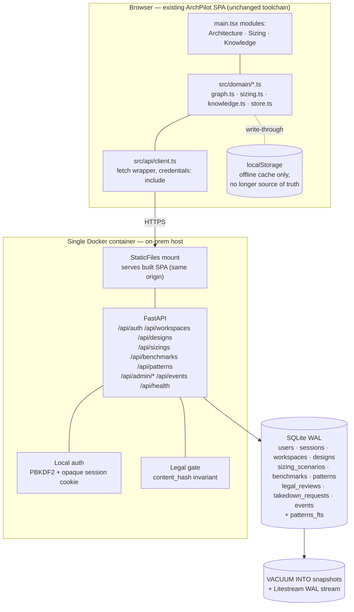
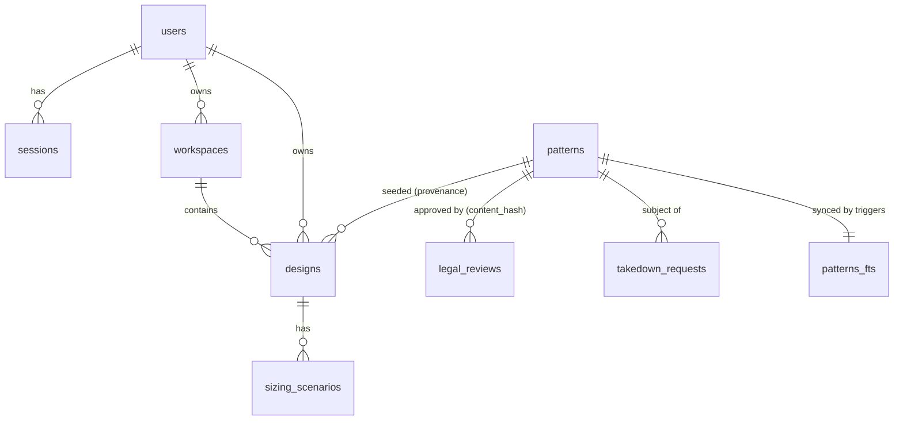

# SystemsArchitect in ArchPilot — Build Scope & Phase-0 Scaffold

| | |
|---|---|
| **Author** | Senior Developer #1 (Builder / Proposer) |
| **Date** | 2026-09-23 (v1.0) · 2026-09-23 (v1.2, post-review) · 2026-09-23 (v1.3, CI + `main.tsx` split) |
| **Version** | 1.3 |
| **Status** | Reviewed (`senior-developer-2`, approve-with-changes). Review findings closed; **all four red-team architecture blockers carried in code**; **CI now runs all three suites automatically (0.7)** and **`main.tsx` is split (1.1)**. Phase 1 routers are the next item. |
| **Language / stack** | Backend: Python 3.10+ (CI tests **3.12 and 3.10**; the image is 3.12), FastAPI, SQLite (stdlib-preferring, 3 runtime deps + 4 test/lint-only). Frontend: existing ArchPilot React 18 + TypeScript + Vite on **Node 24**, with `vitest` + `ajv` + `jsdom` as devDependencies. |
| **Code delivered with this doc** | `ArchPilot/backend/` · `ArchPilot/contracts/` · `ArchPilot/src/domain/sizing.ts` · `ArchPilot/src/contracts/` · `ArchPilot/src/{app,ui,features}/` · `.github/workflows/ci.yml` |
| **Related docs** | `docs/requirements/systemsarchitect-requirements.md` v0.1 · `docs/architecture/systemsarchitect-prototype-design.md` v0.1 · `docs/architecture/reviews/review-systemsarchitect-prototype.md` v1.0 · `docs/development/reviews/review-systemsarchitect-backend.md` v1.0 · `docs/development/systemsarchitect-contracts-and-sizing.md` v1.0 · `docs/requirements/systemsarchitect-decisions.md` v0.1 |

### Change log

| Version | Date | What changed |
|---|---|---|
| 1.0 | 2026-09-23 | Initial scope + Phase-0 backend scaffold (36 tests). |
| 1.1 | 2026-09-23 | `senior-developer-2` review: 14 findings fixed in code, backend suite 36 → 65. Wire format switched to camelCase (M-5). Two items handed back. |
| 1.2 | 2026-09-23 | The two handed-back items delivered: task **0.5/0.6** (`contracts/` + shared fixtures + envelope rules) and task **3.1/3.2** (corrected sizing engine, red-team B3). Backend 65 → **90 pytest**; frontend 0 → **57 vitest**. |
| 1.3 | 2026-09-23 | Task **0.7** (CI: `.github/workflows/ci.yml` runs ruff + pytest on Python 3.12 **and** 3.10, and `tsc -b` + vitest + `vite build` on Node 24) and task **1.1** (`main.tsx` 292 lines → 25 files under `src/app`, `src/ui`, `src/features/<module>/`, proved byte-identical by a 36-state DOM diff). Frontend 57 → **63 vitest**. Node images bumped 20 → 24 (Node 20 is EOL; jsdom 30 needs ≥ 22.22.2). |

---

## 1. Executive summary

**English.** SystemsArchitect is not a new application. It is the concrete
implementation of three modules ArchPilot's own Phase 1 roadmap already
planned: the architecture canvas, the sizing studio, and knowledge/pattern
search. ArchPilot today is frontend-only — React + TypeScript + Vite with a
`localStorage` store — so the work is to put a real backend behind it. That
backend is Python (FastAPI) with SQLite in a single on-prem Docker container,
matching this repo's stdlib-preferring `tools/` convention. Authentication is
simple local username/password for 2–4 internal users; there is no SSO and no
LLM anywhere in this version. This document reconciles the BA requirements, the
architects' proposal, the red-team's four blockers and the Product Owner's
decisions into one plan: the API surface, the SQLite schema, exactly what
changes in `store.ts`, `architecture.ts`, `sizing.ts` and `knowledge.ts`, and a
numbered 9-week task breakdown. The Phase-0 scaffold ships with this document
and already runs: migrations, a deep health check, local login, WAL-safe
backups, and **90 passing Python tests plus 63 passing TypeScript tests**, all
of them now run automatically by **GitHub Actions on every push and pull
request** (task 0.7). ArchPilot's `main.tsx` — one 292-line file holding all
sixteen screens — has been split into one file per screen (task 1.1), so the
canvas, sizing and pattern-hub work has somewhere to land.

**Honest status of the four red-team blockers (v1.0 of this document did not
make this clear enough, and the reviewer was right to say so).** At v1.0 only
**B4** (WAL-safe backups) was genuinely carried. **B1** was half-implemented —
the schema revoked an approval after an edit but did not gate publication.
**B2** had no live risk only because the seed script does not exist yet. **B3**
(the four sizing-formula defects) was untouched. As of **v1.2 all four are
carried in code**: B1 by `003_publish_gate.sql`, B3 by the rewritten
`src/domain/sizing.ts` with one unit test per corrected term, B4 as before, and
B2 is now structurally half-closed by the publish gate with written acceptance
criteria for the seed script (task C.5).

**Tiếng Việt.** SystemsArchitect không phải một ứng dụng mới. Đây là phần hiện
thực hóa cụ thể của ba module mà lộ trình Phase 1 của chính ArchPilot đã đặt ra:
canvas kiến trúc, studio ước lượng năng lực, và tìm kiếm tri thức/mẫu kiến
trúc. Hiện tại ArchPilot chỉ có frontend — React + TypeScript + Vite, lưu dữ
liệu bằng `localStorage` — nên công việc là xây một backend thật phía sau. Backend
đó dùng Python (FastAPI) với SQLite, chạy trong một container Docker duy nhất
trên máy chủ nội bộ, đúng theo quy ước ưu tiên thư viện chuẩn của thư mục
`tools/` trong repo này. Xác thực là đăng nhập nội bộ bằng tên người dùng và mật
khẩu cho 2–4 người dùng; không có SSO và không có LLM trong phiên bản này. Tài
liệu này hợp nhất yêu cầu của BA, đề xuất của các kiến trúc sư, bốn lỗi chặn từ
bản phản biện, và các quyết định của chủ sản phẩm thành một kế hoạch duy nhất:
danh sách API, lược đồ SQLite, thay đổi chính xác trong `store.ts`,
`architecture.ts`, `sizing.ts`, `knowledge.ts`, và phân rã công việc theo 9 tuần
có đánh số. Bộ khung Phase-0 đi kèm tài liệu này đã chạy được: migration, health
check sâu, đăng nhập nội bộ, sao lưu an toàn với WAL, và **90 test Python cùng
63 test TypeScript đang pass**, tất cả nay được **GitHub Actions chạy tự động
mỗi lần push và mỗi pull request** (công việc 0.7). Tệp `main.tsx` của ArchPilot
— một tệp 292 dòng chứa toàn bộ mười sáu màn hình — đã được tách thành mỗi màn
hình một tệp (công việc 1.1), để phần canvas, sizing và pattern hub có chỗ để
triển khai.

**Tình trạng thật của bốn lỗi chặn từ đội phản biện.** Ở bản v1.0 chỉ có **B4**
(sao lưu an toàn với WAL) là thực sự được khắc phục; **B1** mới làm một nửa,
**B2** chưa có rủi ro thực tế vì script seed chưa tồn tại, và **B3** hoàn toàn
chưa được sửa. Từ bản **v1.2, cả bốn đều đã được hiện thực trong mã nguồn**: B1
bằng `003_publish_gate.sql`, B3 bằng việc viết lại `src/domain/sizing.ts` kèm
một unit test cho từng số hạng đã sửa, B4 như cũ, và B2 được đóng một nửa về mặt
cấu trúc nhờ cổng xuất bản, phần còn lại là tiêu chí nghiệm thu cho script seed
(công việc C.5).

---

## 2. Context & objectives

### 2.1 What changed from the original architecture proposal

The architects' proposal (`systemsarchitect-prototype-design.md`) assumed a new
standalone app, a Node/Fastify backend, Entra ID SSO, 18 patterns, an LLM
co-pilot, and 50–200 users. Four of those are now wrong. This table is the
authoritative reconciliation; where this table and the proposal disagree, **this
table wins**.

| Topic | Architects proposed | Binding decision now | Source |
|---|---|---|---|
| Product boundary | New standalone `SystemsArchitect/` app | **Fold into `ArchPilot/`** as its Phase 1 canvas / sizing / knowledge modules. No second frontend. | PO, mid-session |
| Backend stack | Fastify + TypeScript + Kysely + better-sqlite3 | **Python 3.10+ / FastAPI / SQLite (stdlib `sqlite3`)** | PO stack decision |
| Frontend | New React+Vite SPA | **Keep ArchPilot's existing React 18 + TS + Vite SPA**; extend it | PO |
| Audience | Internal, ~50–200 users | **Internal, 2–4 users** | Decision 2 |
| Auth | Entra ID OIDC + PKCE | **Local username/password.** SSO cut entirely. | Decision 4 |
| Seed patterns | 18 | **12** | Decision 1 |
| Timeline | 9 weeks full scope (red-team: not available) | **9 weeks with the cuts banked** | Decision 1 |
| Legal review | Self-certify + independent countersign + originality tool | **Self-certify only.** No second reviewer, no originality tool. `content_hash` invariant retained. | Decision 3 + red-team B1 |
| Co-pilot | 2 LLM skills behind a flag | **No LLM at all.** Sizing review ships as deterministic rules; pattern-suggest deferred. | Decision 5/6 |
| Deployment | Internal Docker host / Azure | **On-prem Docker host, single container** | Decision 7 |
| Success metric | designs created, patterns applied | **Qualitative team adoption**, no numeric target | Decision 8 |
| CSV sizing export | In MVP (Should) | **Cut** | Decision 1 |

### 2.2 Module mapping — ArchPilot Phase 1 ↔ SystemsArchitect pillars

`ArchPilot/08-reference-synthesis-sysdesai.md` §2 lists 12 Phase-1 core modules.
Three of them are exactly the three SystemsArchitect pillars. Everything below
implements those three; the other nine ArchPilot modules are untouched.

| ArchPilot Phase-1 module | SystemsArchitect pillar | Requirement IDs |
|---|---|---|
| 4. Architecture canvas and pattern funnel | Pillar A — interactive design canvas | `REQ-DESIGN-001..009` |
| 8. Basic sizing studio | Pillar B — capacity calculator | `REQ-CALC-001..007` |
| 9. Knowledge and pattern search | Pillar C — reference pattern hub | `REQ-HUB-001..009` |
| 1. Workspace and project context | (enabler) server-side workspace | `REQ-DESIGN-005`, `NFR-SEC-001` |

Deliberately **not** in this build: 6R board, 6U brief, UCROPS gate, ADR module,
platform map, data-access workflow, document export, Investment/TCO. They stay
as they are.

### 2.3 What exists in ArchPilot today (verified by reading the code)

| File | Today | Verdict |
|---|---|---|
| `src/domain/store.ts` | `WorkspaceRecord` + sync `loadWorkspace`/`saveWorkspace` on `localStorage['archpilot.workspace.v1']` | Replace with an async API-backed repository |
| `src/domain/architecture.ts` | Flat `ArchitectureComponent[]` in `localStorage`, no edges, no positions | Extend to a real `ArchGraph` (nodes + edges + positions), persist server-side |
| `src/domain/sizing.ts` | `sizeApi`, `sizeStorage` — pure, already carry `range`/`confidence`/`warnings`/`formulaVersion`. **Currently dead code: `main.tsx` never imports it**; the Sizing screen is hard-coded HTML | Keep and extend. Wire it up. Fix the formulas per red-team B3 |
| `src/domain/knowledge.ts` | `searchKnowledge(records, query)` — pure in-memory substring filter with `toLocaleLowerCase('vi-VN')`. Records are hard-coded inside `main.tsx` | Keep as the client-side fallback; primary search becomes FTS5 over the API |
| `src/domain/model.ts` | `Confidence`, `Status`, `DeploymentTarget`, `EntityEnvelope`, `ArchitectureComponent/Connection` | Reuse as-is. `Confidence` is the vocabulary for benchmarks and sizing results |
| `src/domain/{requirements,review,export}.ts` | In use by `main.tsx` | Out of scope, unchanged |
| `package.json` | React, react-dom, vite, TS, lucide-react. **No test runner, no router, no canvas lib, no HTTP client** | Add `vitest`, `@xyflow/react`. No HTTP client — `fetch` is enough |

---

## 3. Detailed design

### 3.1 Integration shape



**One container, two artefacts.** The Dockerfile builds the Vite SPA in a Node
stage and copies `dist/` into the Python image as `backend/static/`. FastAPI
serves it at `/` when that directory exists. Same origin means no CORS in
production and a first-party session cookie. In development the Vite dev server
runs on `:5173` and CORS is configured for it.

### 3.2 Key decisions

| # | Decision | Rationale | Trade-off accepted |
|---|---|---|---|
| **D1** | Fold into `ArchPilot/`, do not build a second app | ArchPilot's Phase 1 already promises these three modules; a parallel app would fork the product | ArchPilot's `main.tsx` was one 292-line file with all screens inline. **Paid off at v1.3 (task 1.1):** it is now 21 lines of bootstrap, with one file per screen under `src/features/<module>/` |
| **D2** | Python/FastAPI backend, **not** Node/Fastify | PO decision; matches the repo's `tools/` Python convention; 3 runtime deps | **Loses the architects' "one shared `packages/core`" benefit (D1/C5 in their doc).** Mitigated by D3 below — this is the single biggest cost of the stack switch and reviewers should attack it first |
| **D3** | **Sizing arithmetic lives only in TypeScript. The server never computes a sizing number.** The server owns the *benchmark inputs* (with citations) and stores the client's result plus a benchmark snapshot | There is exactly one implementation, so client/server drift is impossible by construction, not by discipline. Also satisfies `NFR-PERF-002` (<500 ms) with no round trip | A malicious client could POST a fabricated sizing result. Acceptable: 2–4 trusted internal users, and the stored `benchmark_snapshot_json` + `formula_version` make any result reproducible and auditable |
| **D4** | **BUILT.** The `ArchGraph` shape *and three envelope rules* (camelCase casing, `{detail, requestId?}` errors, ISO-8601-UTC timestamps) are defined once in `contracts/archgraph.schema.json`; `jsonschema` in pytest and `ajv` in vitest validate **the same fixture files** off **one manifest**. Amended after review: envelope drift, not graph drift, is what actually caused a bug | Restores most of the shared-schema benefit without sharing a language, and both validators are standards-compliant 2020-12 implementations, so agreement is a property of the standard rather than of our discipline | A hand-maintained schema file plus two test harnesses (~120 lines each). One test-only dependency per language (`jsonschema`, `ajv`) — the backend's **runtime** dependency count stays at three. No OpenAPI, no codegen: reviewed and confirmed right-sized |
| **D5** | `localStorage` becomes a write-through **cache**, never the source of truth. One-time import of existing local data on first login | Existing prototype data is not thrown away; `REQ-DESIGN-005` (reload in the same state, on any machine) becomes true | A cache-invalidation path to get wrong. Kept trivial: cache is read only when the API call fails, and is cleared on logout |
| **D6** | Local auth = PBKDF2-HMAC-SHA256 (stdlib `hashlib`) + opaque session token, SHA-256 of the token stored server-side | No bcrypt/argon2/passlib dependency; a DB leak yields neither passwords nor replayable sessions | PBKDF2 is memory-cheap vs argon2id. Per-user `password_iterations` column allows raising the factor or swapping the scheme without a destructive migration |
| **D7** | Both layers enforce the legal gate: an application `content_hash` check **and** a SQLite trigger that resets `status` to `draft` on any content edit | Red-team B1. A trigger also catches a migration or a manual `sqlite3` session — the exact hole B1 described | An approval is revoked by a whitespace-only edit. Correct behaviour; the editor is told why |
| **D8** | No LLM, no vendor, no API key, no spend cap, no prompt logging | PO decision 5/6 | The "suggest 3 patterns" differentiator is deferred. At 12 patterns, facets + FTS5 answer the same question |
| **D9** | FTS5 tokenizer `unicode61 remove_diacritics 2` | ArchPilot is a bilingual VI/EN product; "kiến trúc" and "kien truc" must both match | Changing the tokenizer later needs an index rebuild. Set correctly now |

### 3.3 SQLite schema

Shipped as forward-only migrations in `ArchPilot/backend/app/migrations/`.
Full DDL is in those two files; this is the map and the invariants.



| Table | Migration | Purpose | Enforced invariant |
|---|---|---|---|
| `users` | 001 | Local accounts | `role IN (member, editor, admin)`; per-user KDF iterations |
| `sessions` | 001 | Opaque sessions | Only `sha256(token)` is stored; `expires_at` checked on every request |
| `workspaces` | 001 | Server home for `store.ts`'s `WorkspaceRecord` | Owner-scoped |
| `designs` | 001 | One `ArchGraph` JSON per design | `visibility` defaults `private` (`NFR-SEC-001`); `seeded_from_pattern_id` keeps takedown reach (`M10`) |
| `sizing_scenarios` | 001 | `REQ-CALC-007` | `benchmark_snapshot_json` + `formula_version` **NOT NULL** — a saved number stays reproducible when benchmarks change (`M8`) |
| `benchmarks` | 001 | Per-node capacity, editable without a deploy (`NFR-EXT-001`) | **Trigger: `confidence` in (`measured`,`declared`) requires a `source_url`** (`M7`) |
| `events` | 001 | `NFR-OBS-001` business analytics | Request logs go to stdout instead |
| `health_probe` | 001 | Deep health-check write target | `/api/health` writes here (`M12`) |
| `patterns` | 002 | Hub content | Attribution columns **NOT NULL + non-blank CHECK** (`REQ-HUB-005`); `content_hash` NOT NULL |
| `legal_reviews` | 002 | `NFR-LEGAL-001` audit trail | **`content_hash` NOT NULL** (`B1`); append-only triggers block UPDATE/DELETE |
| `takedown_requests` | 002 | `NFR-LEGAL-002` | `derived_design_count` recorded at resolution (`M10`) |
| `patterns_fts` | 002 | `REQ-HUB-004` | **Three sync triggers** (`M1`) + VI-diacritic-folding tokenizer |

**The B1 invariant, stated precisely.** `content_hash` = SHA-256 over a
length-prefixed canonical encoding of `title ‖ summary_one_line ‖ body_md ‖
graph_json ‖ categories_json ‖ source_company ‖ source_url ‖ source_title ‖
source_published_date`. JSON fields are re-serialised with sorted keys so an
incidental key reorder does not revoke a valid approval. Publish requires
`patterns.content_hash == legal_reviews.content_hash` for an `approved` review.
Any edit to those columns fires `trg_patterns_reset_status_on_content_change`,
which sets `status='draft'` and nulls `published_at`. Per PO decision 3 there is
**no** `reviewer_id != author_id` check — self-certification is allowed — but the
hash binding is not relaxed.

### 3.4 API surface

Bold = implemented in the Phase-0 scaffold. Everything else is scoped, not built.

| Method | Path | Auth | Requirement |
|---|---|---|---|
| **GET** | **`/api/health/live`** | none | liveness |
| **GET** | **`/api/health`** | none | `NFR-AVAIL-001`, `M12` — deep read+write probe, 503 on failure |
| **POST** | **`/api/auth/login`** | none | Decision 4 |
| **POST** | **`/api/auth/logout`** | session | — |
| **GET** | **`/api/auth/me`** | session | — |
| GET / PUT | `/api/workspaces/current` | session | ArchPilot module 1 |
| GET / POST | `/api/designs` | session | `REQ-DESIGN-001/005`; `POST {seededFromPatternId}` = `REQ-HUB-007` |
| GET / PUT / DELETE | `/api/designs/{id}` | session (owner) | `REQ-DESIGN-004/005`; non-owner gets **404, not 403** |
| GET | `/api/benchmarks` | session | `REQ-CALC-003`, `M7` — every row carries its citation |
| GET / POST | `/api/designs/{id}/sizings` | session (owner) | `REQ-CALC-007` |
| POST | `/api/sizings/review` | session | Deterministic rules only, **no LLM** (Decision 5) |
| GET | `/api/patterns` | session | `REQ-HUB-001/003/004/006` — `?q=&category=&company=&sort=`, published only |
| GET | `/api/patterns/{slug}` | session | `REQ-HUB-002/005` |
| POST | `/api/patterns/{slug}/report` | session | `NFR-LEGAL-002` |
| GET/POST/PUT | `/api/admin/patterns[/{id}]` | editor/admin | `REQ-HUB-009` |
| POST | `/api/admin/patterns/{id}/legal-review` | editor/admin | `NFR-LEGAL-001` — records `content_hash` |
| POST | `/api/admin/patterns/{id}/publish` | editor/admin | **409 unless the hash matches** |
| POST | `/api/admin/patterns/{id}/unpublish` | editor/admin | one-click takedown |
| GET/PATCH | `/api/admin/takedowns[/{id}]` | admin | `NFR-LEGAL-002` |
| POST | `/api/events` | session | `NFR-OBS-001` |

All search goes through one `search_published_patterns()` repository function
that joins `patterns_fts` to `patterns` and filters `status='published'`. Nothing
else may query `patterns_fts` directly (`M1`).

### 3.5 Frontend changes, file by file

#### 3.5.1 New files

| File | Responsibility |
|---|---|
| `src/api/client.ts` | `fetch` wrapper: base URL, `credentials: 'include'`, `x-request-id`, JSON encode/decode, typed `ApiError`, 401 → redirect to login. No HTTP library |
| `src/api/designs.ts`, `patterns.ts`, `sizings.ts`, `workspace.ts`, `auth.ts` | One thin module per resource; the only place a URL string appears |
| `src/domain/graph.ts` | `ArchGraph`, `ArchNode`, `ArchEdge`, `NodeType`, `PALETTE`, `validateGraph()`, `diffGraphs()`, `migrateGraph()` |
| `src/domain/benchmarks.ts` | Benchmark types + client-side defaults used only until `/api/benchmarks` responds |
| `src/features/canvas/*`, `src/features/sizing/*`, `src/features/patterns/*` | The three screens, extracted out of `main.tsx` |
| `contracts/archgraph.schema.json` | The one graph contract, validated by both languages (D4) |

#### 3.5.2 Changes to the four existing domain modules

| File | Change | Why | Breaking? |
|---|---|---|---|
| **`store.ts`** | `loadWorkspace(): WorkspaceRecord \| null` → `loadWorkspace(): Promise<WorkspaceRecord \| null>` calling `GET /api/workspaces/current`. `saveWorkspace(...)` → `Promise<WorkspaceRecord>` calling `PUT`. Keep the `localStorage` write as a read-only fallback cache, and add `importLegacyLocalWorkspace()` run once after first login. `revision` is now assigned by the server, not `previous.revision + 1` | Source of truth moves to SQLite; `revision` incremented client-side is wrong the moment two browsers exist | **Yes** — sync→async. Call site: `main.tsx` `useState(() => loadWorkspace())` becomes a `useEffect` load + loading state |
| **`architecture.ts`** | `ArchitectureComponent[]` becomes `ArchGraph` (`nodes` + `edges` + `position`). `loadComponents`/`saveComponents` → `loadDesign(id)`/`saveDesign(id, graph)` over `/api/designs/{id}`. `seedComponents` stays as the empty-canvas starter. `createComponent`'s `Date.now()` ID is replaced by a collision-safe `crypto.randomUUID()` | Edges and positions are `REQ-DESIGN-003/004/005`; the current model has neither. `Date.now()` collides on a fast double-click | **Yes** — shape change. A `migrateComponentsToGraph()` helper converts existing localStorage data in one pass (nodes laid out on a grid, no edges) |
| **`sizing.ts`** ✅ **done (v2.0)** | Keep `SizingResult`'s shape (it already has `range`/`confidence`/`warnings`/`formulaVersion` — better than the architects' proposal). Add the corrected engine (§3.6) with `assumptions: string[]` and `formula: string` **required** by the type. `sizeApi(peakRps, capacityPerInstance, ...)` is replaced by `sizeComponent(inputs, benchmarks)` taking **dual read/write capacity**. Benchmarks arrive from `GET /api/benchmarks`, not from a constant | The current single `capacityPerInstance` cannot consume the dual read/write benchmarks the design itself defines (`B3b`); `sizeStorage` has no compression term (`B3c`) and applies replication to storage only (`B3a`); neither applies a failure-domain spare (`B3d`) | **Yes** — but the module is currently *unused* by `main.tsx`, so there are no call sites to break. Cheapest possible moment to fix it |
| **`knowledge.ts`** | `searchKnowledge()` stays exactly as-is and becomes the **offline/fallback** path. Primary search becomes `GET /api/patterns?q=` (FTS5). `KnowledgeRecord` gains required `sourceUrl`, `sourceCompany`, `sourceTitle` (currently `source?: string`, optional and free-text) | `REQ-HUB-005`: no entry may render without attribution. Optional `source?: string` cannot enforce that | **Minor** — `source?` widening to three required fields. The 4 hard-coded records in `main.tsx` move into the seed content set |

#### 3.5.3 `main.tsx` was split first — **done (task 1.1, v1.3)**

`main.tsx` was 292 lines holding every screen as an inline function, with JSX
lines over 3,000 characters. Adding a canvas, a calculator and a hub to it was
not viable. It is now 21 lines of bootstrap:

| Path | Responsibility |
|---|---|
| `src/main.tsx` | bootstrap only — `createRoot`, `render`, the `__archPilotRoot` HMR guard |
| `src/app/App.tsx` | the shell: sidebar, topbar, VI/EN toggle, module switch, the two modals. Owns no screen content |
| `src/app/navigation.ts` | `ModuleKey` + `navItems`. One `ModuleKey` value ↔ one `src/features/` directory |
| `src/app/App.test.tsx` | 6 shell regression tests (jsdom): every module renders its own screen, the architecture module renders **both** panes, the language toggle, both modals |
| `src/ui/copy.ts` | `Copy`, `copy(vi, en)`, and the `TextFn` alias every screen takes |
| `src/ui/PageHeader.tsx`, `ModulePanel.tsx`, `DatabaseIcon.tsx` | the three components shared by more than one screen |
| `src/features/<module>/<Name>Screen.tsx` | one file per screen, 16 of them, keyed to `ModuleKey` |
| `src/features/architecture/ArchitectureEditor.tsx` | the second pane the architecture module renders alongside its screen |
| `src/features/investment/InvestmentModal.tsx`, `src/features/workspace/WorkspaceModal.tsx` | the two modals the shell owns |

Verification was a **before/after DOM diff**, not a screenshot: the real SPA was
booted in jsdom, all 16 modules walked in both languages and both modals opened
and closed, and the resulting 36 DOM states hashed. Before and after are
byte-identical (`sha256 c3d5f0bf…c442d62b`). The harness was thrown away; the
six tests in `App.test.tsx` are what stayed.

`src/features/sizing/SizingScreen.tsx` was moved **unchanged** and is still
hard-coded HTML with no import of `src/domain/sizing.ts`. Wiring it to the v2.0
engine is task 3.4 and is deliberately not part of this refactor.

### 3.6 Corrected sizing engine (red-team B3) — **implemented**

Units are in the names, and every conversion constant is stated (`m3`).
Shipped in `ArchPilot/src/domain/sizing.ts` as `formulaVersion: '2.0'`, tested by
`ArchPilot/src/domain/sizing.test.ts` (34 tests). Two deliberate refinements
against the pseudocode below, both explained in
`docs/development/systemsarchitect-contracts-and-sizing.md`:

1. `spareNodes` is added **outside** the confidence band, not inside it — how
   many nodes may fail is a policy the team picks, not something the benchmark
   is uncertain about.
2. Storage is driven by **average** write QPS, not peak. Peaks change how many
   nodes you need; they do not change how many bytes are retained.

```
// inputs: avgQps, avgRecordKiB, readWriteRatio, retentionMonths,
//         peakFactor (3.0), replicationFactor (3), indexOverhead (0.30),
//         compressionRatio (1.0 default, "compression not modelled"),
//         headroom (0.30), spareNodes (1)

writeFraction       = 1 / (1 + readWriteRatio)              // 9:1 -> 0.10
readQps             = avgQps * (1 - writeFraction)
writeQps            = avgQps * writeFraction
peakReadQps         = readQps  * peakFactor
peakWriteQps        = writeQps * peakFactor

// B3(a) replication amplifies WRITES, not only storage
effectiveWriteQps   = peakWriteQps * replicationFactor

avgRecordBytes      = avgRecordKiB * 1024                   // 1 KiB = 1024 B
retentionDays       = retentionMonths * 30.44               // 1 month = 30.44 d
bytesPerDay         = writeQps * avgRecordBytes * 86400

// B3(c) compression term; default 1.0 so the label stays honest
storageBytes        = bytesPerDay * retentionDays * replicationFactor
                      * (1 + indexOverhead) / compressionRatio

ingressBytesPerSec  = writeQps * avgRecordBytes
egressBytesPerSec   = readQps  * avgRecordBytes

// B3(b) dual capacity + B3(d) failure-domain spare
nodeCount = ceil( max( peakReadQps      / readCapacityPerNode,
                       effectiveWriteQps / writeCapacityPerNode )
                  * (1 + headroom) ) + spareNodes
```

Output is a **range, not a point** (`M8`), widened from the weakest input
benchmark's confidence tag: `measured` ±10%, `declared` ±25%, `estimated` ±50%,
`unverified` ±100%. The UI renders `14–30 instances (point estimate 20)`. The
disclaimer travels inside the JSON export envelope, not only on screen.

`sizeStorage`'s existing hard-coded `low: *0.8 / high: *1.3` band is replaced by
this confidence-derived band.

---

## 4. Step-by-step plan

**Team:** E1 (frontend-leaning), E2 (backend/full-stack), C (content editor,
50%), Q (BA/QA, 50%), PO. Effort in person-days (pd). 9 calendar weeks.

### Phase 0 — Foundations (7 pd) · **5.5 pd delivered, 1.5 pd open**

| # | Task | Owner | Depends on | Effort | Verification |
|---|---|---|---|---|---|
| 0.1 | ~~FastAPI skeleton, config, JSON logging, request IDs~~ | E2 | — | ~~1~~ **done** | `uvicorn app.main:app` starts; `/api/health` returns 200 |
| 0.2 | ~~SQLite migration runner + `001_core.sql` + `002_patterns_legal.sql`~~ | E2 | 0.1 | ~~1.5~~ **done** | `pytest` — migrations idempotent, WAL on |
| 0.3 | ~~Local auth: login/logout/me, PBKDF2, session cookie, throttle~~ | E2 | 0.2 | ~~1~~ **done** | 12 auth tests pass; unauth `/api/auth/me` → 401 |
| 0.4 | ~~`VACUUM INTO` backup script + verify + prune~~ | E2 | 0.2 | ~~0.5~~ **done** | `python -m scripts.backup --verify` → `integrity_check: ok` |
| 0.5 | ~~Add `vitest` to `ArchPilot/package.json`; first test for `sizing.ts`~~ | E1 | — | ~~0.5~~ **done** | `npm test` → **57 passed** (`vitest run`, 2 files). `npm run typecheck` and `npm run build` clean |
| 0.6 | ~~`contracts/archgraph.schema.json` + shared fixtures + contract test in **both** suites, **plus the three envelope rules**~~ | E2 | 0.5 | ~~1~~ **1.25 done** | 16 shared fixtures, 9 of them deliberately broken, run by `pytest` (jsonschema) **and** `vitest` (ajv) off one manifest. Negative control performed: weakening the casing rule failed the same fixture in both suites |
| 0.7 | ~~CI: `pytest`, `npm test`, `tsc -b`, `npm run build`~~ | E2 | 0.5 | ~~0.5~~ **done** | `.github/workflows/ci.yml`: job `backend` = `ruff check` + `pytest` on a **3.12 / 3.10 matrix** (M-9 closed — 3.12 is the image, 3.10 is the documented floor, both must pass); job `frontend` = `npm ci` → `tsc -b` → `vitest` → `tsc -b && vite build` on **Node 24**. `ruff` added and the codebase made clean (15 findings fixed). `mypy --strict` deliberately deferred, see §7.2 |
| 0.8 | Docker build of the combined image; run on the on-prem host | E2 | 0.1 | 1 | `docker run` → SPA at `/`, API at `/api/health` |

### Phase 1 — Persistence spine (9 pd) · depends on Phase 0

| # | Task | Owner | Depends on | Effort | Verification |
|---|---|---|---|---|---|
| 1.1 | ~~**Split `main.tsx`** into `src/features/*` — pure refactor~~ | E1 | 0.5 | ~~2~~ **done** | 292 lines → 25 files (`src/app/`, `src/ui/`, `src/features/<module>/`). **Proved** by a throwaway before/after jsdom diff of all 36 states (16 modules × VI/EN + 4 modal states): identical, `sha256 c3d5f0bf…c442d62b` on both sides. `tsc -b` clean; `vite build` clean. Six kept shell tests replace the throwaway harness |
| 1.2 | `src/api/client.ts` + `auth.ts`; login screen; 401 redirect | E1 | 0.3, 1.1 | 1.5 | Login from the SPA sets the cookie; refresh keeps the session |
| 1.3 | `GET/PUT /api/workspaces/current` | E2 | 0.2 | 1 | `pytest`: user B cannot read user A's workspace |
| 1.4 | Rewrite `store.ts` async + write-through cache + legacy import | E1 | 1.2, 1.3 | 1.5 | Existing `localStorage` workspace appears server-side after first login |
| 1.5 | `src/domain/graph.ts` — `ArchGraph`, palette, `validateGraph()` | E1 | 0.6 | 1.5 | Unit tests for the 4 validation rules |
| 1.6 | Designs CRUD API, owner-scoped, **404 for non-owners** | E2 | 1.3 | 1.5 | `pytest`: cross-user read returns 404, not 403 |

### Phase 2 — Pillar A: canvas (11 pd) · depends on Phase 1

| # | Task | Owner | Depends on | Effort | Verification |
|---|---|---|---|---|---|
| 2.1 | Add `@xyflow/react`; pan/zoom/minimap shell; 3-pane layout | E1 | 1.1 | 1.5 | Empty canvas renders |
| 2.2 | Palette → node create; 10 node types from `PALETTE` data (`REQ-DESIGN-002`) | E1 | 1.5, 2.1 | 1.5 | Dragging `service` creates a node |
| 2.3 | Labelled directional edges (`REQ-DESIGN-003`) | E1 | 2.2 | 1 | Two nodes connect with "writes to" |
| 2.4 | Inspector: rename/delete/move + rationale note (`REQ-DESIGN-004/008`) | E1 | 2.2 | 1.5 | Rationale survives reload |
| 2.5 | `architecture.ts` → API-backed; debounced autosave + `Ctrl+S` (`REQ-DESIGN-005`) | E1 | 1.6, 2.2 | 1.5 | Reload restores exact positions |
| 2.6 | Legacy `ArchitectureComponent[]` → `ArchGraph` migration | E1 | 2.5 | 0.5 | Existing components appear as nodes on a grid |
| 2.7 | Export JSON + SVG (`REQ-DESIGN-006`; SVG over PNG per `m5`) | E1 | 2.5 | 1 | Both files valid; JSON re-imports |
| 2.8 | Undo/redo depth 50 (`REQ-DESIGN-009`) | E1 | 2.4 | 1.5 | `Ctrl+Z` reverses 50 actions |
| 2.9 | Non-blocking validation warnings in the status bar (`REQ-DESIGN-007`) | E1 | 1.5 | 0.5 | Orphan node warns; save still succeeds |

### Phase 3 — Pillar B: sizing studio (8 pd) · **2.5 pd delivered** · depends on Phase 1, parallel with Phase 2

| # | Task | Owner | Depends on | Effort | Verification |
|---|---|---|---|---|---|
| 3.1 | ~~**Corrected engine in `sizing.ts`** — B3(a)(b)(c)(d) + required `formula`/`assumptions`~~ | E2 | 0.5 | ~~2~~ **done** | 34 tests, one group per B3 term with the v1.0→v2.0 delta asserted; worked example 5000 QPS / 2 KiB / 9:1 / 12 mo → **4 nodes, ~114.6 TiB uncompressed** |
| 3.2 | ~~Confidence-derived ranges replacing the fixed 0.8/1.3 band (`M8`)~~ | E2 | 3.1 | ~~0.5~~ **done** | `estimated` → ±50% (`3–6 node (point estimate 4)`); `measured` → ±10% (`4–5`). Folded into 3.1: leaving a hard-coded band inside a file being rewritten was not defensible |
| 3.3 | `benchmarks` seed + `GET /api/benchmarks`; every `declared` row cited (`M7`) | E2 | 0.2 | 1 | Trigger test already passing; seeding an uncited `declared` row fails |
| 3.4 | Sizing UI: two-column, live recompute, assumptions beside every number | E1 | 3.1, 1.1 | 2 | No number renders without its formula |
| 3.5 | 4 workload profiles (`REQ-CALC-005`) | E2 | 3.1 | 0.5 | Selecting a profile pre-fills; user can override |
| 3.6 | Attach scenario to a node + `benchmark_snapshot_json` pinning (`REQ-CALC-007`, `M8`) | E2 | 1.6, 3.3 | 1.5 | Reopening a design shows the attached sizing, unchanged after a benchmark edit |
| 3.7 | `POST /api/sizings/review` — deterministic rules, **no LLM** | E2 | 3.1 | 0.5 | Rules fire on `peakFactor = 1.0`, retention > 24 mo with `compressionRatio = 1.0` |

### Content track — 12 seed patterns (10 pd, weeks 1–7) · gated on G0.2

| # | Task | Owner | Depends on | Effort | Verification |
|---|---|---|---|---|---|
| C.1 | ~~**G0.2**: PO signs the 5-item content-IP policy~~ → `docs/pattern-content-policy.md`. **DONE 2026-09-23** — approved via chat, formal signature waived by PO, recorded in the doc's Sign-off section | PO | — | 0.5 | Policy committed |
| C.2 | Shortlist 12 patterns, one per category + 3 doubles, with source URLs | C + Q | C.1 | 1 | PO review |
| C.3 | Author 12 original summaries; diagrams written **as `ArchGraph` JSON by hand** (`M4` — do not wait for the canvas) | C | C.2, 0.6 | 7 | Word-count + self-check per entry |
| C.4 | Self-certify each entry against the checklist (`NFR-LEGAL-001`) | C | C.3 | 1 | 12 `legal_reviews` rows with a matching `content_hash` |
| C.5 | Idempotent import script: skip existing slugs; refuse to overwrite `published`/`unpublished` without `--force` **and** `CONFIRM_OVERWRITE_REVIEWED=1` (`B2`) | E2 | 0.2 | 0.5 | Re-running the seed cannot resurrect an unpublished pattern |

### Phase 4 — Pillar C: pattern hub, read side (7 pd) · depends on Phase 1

| # | Task | Owner | Depends on | Effort | Verification |
|---|---|---|---|---|---|
| 4.1 | `GET /api/patterns` — published-only filter, facets, sort | E2 | 0.2 | 1.5 | Test: a draft with a unique token returns 0 rows |
| 4.2 | FTS5 search via the single `search_published_patterns()` function (`M1`) | E2 | 4.1 | 1 | VI-diacritic test already passing |
| 4.3 | Gallery UI: cards, filter sidebar, search, sort; **attribution on every card** (`M10`) | E1 | 4.1, 1.1 | 2 | Filtering by a category shows only that category |
| 4.4 | Detail page: Markdown body, decision table, read-only graph render, non-collapsible attribution banner | E1 | 4.3, 1.5 | 2 | Every entry shows source name + resolving link |
| 4.5 | `knowledge.ts` widened to required attribution fields; fallback path retained | E1 | 4.1 | 0.5 | A record without `sourceUrl` fails `tsc` |

### Phase 5 — Editorial + legal gate (7 pd) · depends on Phase 4 + C.1

| # | Task | Owner | Depends on | Effort | Verification |
|---|---|---|---|---|---|
| 5.1 | Admin pattern CRUD + status state machine | E2 | 4.1 | 2 | New pattern publishable with no deploy (`NFR-EXT-001`) |
| 5.2 | **Legal-review endpoint recording `content_hash`; publish 409s on mismatch** (`B1`) | E2 | 5.1 | 1 | Edit-after-approval → `draft`; publish rejected |
| 5.3 | Admin UI: editor form + 5-item checklist (self-certify, no second reviewer) | E1 | 5.1 | 2 | Approve disabled until all 5 boxes are checked |
| 5.4 | Takedown: report form → `takedown_requests` → one-click unpublish; record `derived_design_count` and suppress attribution on derived designs (`M10`) | E2 | 5.1 | 1.5 | Unpublished pattern 404s within seconds; tabletop drill |
| 5.5 | Nightly one-way DB → `content/patterns/*.md` export for audit (`B2`) | E2 | C.5 | 0.5 | Export diffable in Git |

### Phase 6 — Integration (5 pd) · depends on Phases 2, 3, 4

| # | Task | Owner | Depends on | Effort | Verification |
|---|---|---|---|---|---|
| 6.1 | Apply to canvas — deep copy + new IDs + provenance (`REQ-HUB-007`) | E2 | 2.5, 4.1 | 1 | New editable design seeded from a pattern |
| 6.2 | Compare — **three-tier diff**: type counts, normalised labels, edge shapes (`M11`) | E2 | 6.1 | 2 | "Pattern has 2 caches, yours has 0" renders without label matching |
| 6.3 | `events` writes for `sizing_run`, `pattern_applied`, `pattern_viewed`, `design_saved` (`NFR-OBS-001`) | E2 | 1.6 | 0.5 | Rows appear after a scripted session |
| 6.4 | Read-only share link, expiry 30 days, session required, revocable (`M9`) | E2 | 1.6 | 1.5 | Revoked token 404s; page sends `Referrer-Policy: no-referrer` |

### Phase 7 — Hardening & launch (8 pd)

| # | Task | Owner | Depends on | Effort | Verification |
|---|---|---|---|---|---|
| 7.1 | Accessibility: keyboard canvas nav, ARIA labels, contrast (`NFR-A11Y-001`) | E1 | Phase 2 | 2.5 | axe-core: 0 critical; full keyboard pass |
| 7.2 | Performance: canvas < 150 ms on 100 nodes, recompute < 500 ms | E1 | Phases 2–3 | 1 | Profiler + unit benchmark |
| 7.3 | CSRF double-submit token for cookie-authenticated mutating routes | E2 | 1.2 | 1 | Cross-site POST without the token → 403 |
| 7.4 | Litestream WAL replication + point-in-time restore drill (`B4`) | E2 | 0.4, 0.8 | 1 | Restore to a timestamp; `/api/health` reports the expected schema |
| 7.5 | **G3 pre-launch legal audit** of all 12 entries | Q + PO | C.4, 5.2 | 1 | Signed audit, zero exceptions (MVP AC 4) |
| 7.6 | Usability check, Engineer-Emma profile (`NFR-USE-001`) | Q | Phase 6 | 0.5 | 3-component design in < 10 min |
| 7.7 | **Remediation buffer** for 7.5 / 7.6 findings | E1 + E2 | 7.5, 7.6 | 3 | Findings closed or explicitly deferred |
| 7.8 | Runbook + MVP sign-off | E2 + PO | all | 0.5 | Walk MVP AC 1–6 |

### Effort roll-up

| Track | pd | Calendar |
|---|---|---|
| Phase 0 foundations (**6 pd of 7 done** — only 0.8 Docker remains) | 7 | Week 1 |
| Phase 1 persistence spine (**2 pd of 9 done** — 1.1) | 9 | Weeks 1–2 |
| Phase 2 canvas (E1) | 11 | Weeks 2–5 |
| Phase 3 sizing (E2, parallel) | 8 | Weeks 2–4 |
| Content track (C, parallel) | 10 | Weeks 1–7 |
| Phase 4 hub read side | 7 | Weeks 4–6 |
| Phase 5 editorial + legal gate | 7 | Weeks 5–7 |
| Phase 6 integration | 5 | Weeks 7–8 |
| Phase 7 hardening + launch | 8 | Weeks 8–9 |
| **Engineering total** | **62 pd** (**55.5 remaining** after 0.1–0.7 and 1.1, 3.1, 3.2) | |
| **Content total** | **10 pd** | |

Two engineers × 9 weeks ≈ 90 pd of raw capacity; 62 pd of planned work is ~69%
utilisation, which leaves room for PR review, gate waits and the 3 pd
remediation line the red-team's `M5` asked for. **Critical path:** G0.2 → C.3
authoring → C.4 self-certify → 5.2 publish gate → 7.5 audit → launch. The canvas
and sizing pillars are not on it.

---

## 5. How to run & test (what I actually ran)

```bash
# backend
cd ArchPilot/backend
python -m venv .venv
.venv/Scripts/python.exe -m pip install -r requirements-dev.txt
.venv/Scripts/python.exe -m ruff check .          # same command CI runs
.venv/Scripts/python.exe -m pytest
ARCHPILOT_ADMIN_PASSWORD='local-dev-password-1' \
  .venv/Scripts/python.exe -m scripts.init_db --create-user admin --role admin
.venv/Scripts/python.exe -m uvicorn app.main:app --port 8000

# frontend (contract + sizing tests)
cd ArchPilot
npm install
npm test          # vitest run
npm run typecheck # tsc -b
npm run build     # tsc -b && vite build
```

Observed on 2026-09-23 (Windows 10, Python 3.10.11, SQLite 3.40.1, Node 24.18.0):

| Command | Result |
|---|---|
| `ruff check .` (v1.3) | `All checks passed!` — 15 findings existed before and were fixed, not suppressed |
| `pytest` (v1.3) | **90 passed**, 1 warning (a starlette-internal `anyio` deprecation), 11.8 s |
| `npm test` (v1.3) | **63 passed**, 3 files (`sizing.test.ts` 34, `contract.test.ts` 23, `App.test.tsx` 6), 3.0 s |
| `npm run typecheck` (v1.3) | clean, no output |
| `npm run build` (v1.3) | `✓ 1906 modules transformed` · `built in 671ms` · `dist/assets/index-*.js 296.81 kB (gzip 87.52 kB)` |
| before/after DOM diff of the `main.tsx` split | 36/36 states identical, `sha256 c3d5f0bf…c442d62b` on both sides, 0 differing entries |
| `pytest` (v1.2, historical) | **90 passed**, 11.7 s |
| `npm test` (v1.2, historical) | **57 passed**, 2 files, 0.8 s |
| `pytest` (v1.0, historical) | **36 passed**, 4.12 s |
| `python -m scripts.init_db --create-user admin --role admin` | `migrations applied this run: ['001', '002']` · `created user admin (admin) id=usr_…` |
| `curl /api/health` | `200` · `{"status":"ok","version":"0.1.0","env":"development","schemaVersion":"003","checks":[{"name":"sqlite_read","status":"ok","detail":"schema 003","latencyMs":2.52},{"name":"sqlite_write","status":"ok","latencyMs":0.06}]}` — camelCase since v1.1 (review M-5) |
| `curl -X POST /api/auth/login` (correct password) | `200` · `{"user":{"id":"usr_…","username":"admin","displayName":"…","role":"admin"},"expiresAt":"2026-09-23T06:26:52+00:00","csrfToken":"…"}` + `Set-Cookie: archpilot_session=…; HttpOnly; SameSite=lax` |
| `curl /api/auth/me` with the cookie | `200` · the admin user |
| `curl -X POST /api/auth/login` (wrong password) | `401` · `{"detail":"invalid username or password"}`, **378 ms vs 369 ms** for the success path — no timing oracle |
| `curl /api/auth/me` with no cookie | `401` · `{"detail":"authentication required"}` |
| `python -m scripts.backup --verify` | `backup written: …/archpilot-20260922T182752Z.db (208896 bytes)` · `integrity_check: ok` |
| stdout logs | one JSON line per request with `request_id`, `method`, `path`, `status`, `duration_ms` |

**What the 36 tests cover.** Deep health (read-broken → 503, write-broken → 503,
request-id propagation); login success/failure, case-insensitive usernames,
bearer fallback, expired sessions, logout revocation, throttling after 8
failures, `extra="forbid"` on the login body, weak-password rejection; migration
idempotence and WAL mode; `VACUUM INTO` backup + `integrity_check` + prune; and
the invariants — edit-after-approval resets to `draft`, status-only updates do
not, hash stability under JSON key reordering, append-only `legal_reviews`,
blank attribution rejected at both the app and storage layers, FTS insert/update
sync, Vietnamese diacritic folding, drafts invisible to published-only search,
and an uncited `declared` benchmark rejected.

**What is scaffolded vs. still a stub:** see §7.

---

## 6. Risks & mitigations

| # | Risk | Likelihood | Impact | Mitigation | Owner |
|---|---|---|---|---|---|
| R1 | Content drifts toward verbatim reproduction — and PO decision 3 removed the second reviewer, so a single author self-certifies | Med | **Very high** | `content_hash` binding (B1, both layers); G3 pre-launch audit by Q **and** PO together — the only remaining independent check; attribution NOT NULL in storage | PO + Q |
| R2 | Content track is the critical path at 12 entries with a 50% editor | High | High | Diagrams authored as `ArchGraph` JSON from week 1 (`M4`), so authoring never waits for the canvas; launch with 9 if 12 slips | C + PO |
| R3 | ~~`main.tsx` refactor (1.1) regresses existing ArchPilot screens~~ | ~~Med~~ **Closed** | Med | **Done and evidenced.** Pure refactor, no behaviour change, verified by a before/after DOM diff of all 36 states rather than a screenshot (`sha256` equal on both sides), landed before any new feature. Six shell tests in `App.test.tsx` and `tsc -b` now run in CI on every push | E1 |
| R4 | Python/TypeScript split lets the contract drift (the cost of D2) | ~~Med~~ **Low** | High | **Mitigated.** `contracts/archgraph.schema.json` + 16 shared fixtures asserted by **both** suites, including 9 that must fail on a named keyword; three envelope rules cover the drift that actually happened (casing, error shape, timestamps); the Python suite also validates live API responses. Negative control run: weakening the casing rule broke the same fixture in both languages. The sizing engine exists in TS only, so formulas cannot drift at all. **Residual closed at v1.3:** `.github/workflows/ci.yml` runs both halves of the contract suite on every push and pull request, so the guard no longer depends on someone remembering to run it | E2 |
| R5 | Local auth is weaker than SSO — no MFA, no central revocation | Med | Med | 2–4 known users on an internal network; 12-char minimum, PBKDF2 600k, throttling, server-side revocable sessions, 12 h TTL. **Re-open if the audience grows** | E2 |
| R6 | SQLite write contention | Low | Low | WAL + 5 s busy timeout; 2–4 users is orders of magnitude below the limit | E2 |
| R7 | Single container is a single point of failure | Med | Low | Deep health check + `restart: unless-stopped`; `VACUUM INTO` nightly + Litestream (7.4) takes RPO from 24 h to seconds | E2 |
| R8 | Rollback after a forward-only migration | Low | High | Rollback = restore-from-backup, **never** an image rollback. Backup before migrate. Documented in `backend/README.md` and the 7.8 runbook | E2 |
| R9 | 9 weeks is the schedule the red-team called unavailable at full scope | Med | Med | All the cuts are banked (no LLM −5 pd, no SSO −2 pd, 12 not 18 patterns −3 pd, no CSV −1 pd, no second reviewer −1 pd) and a 3 pd remediation line is in Phase 7 | PO |
| R10 | Sizing numbers pasted into a budget as if exact | Med | High | **Partly mitigated in code.** `SizingResult` now requires `assumptions: string[]` and `formula: string` — the type makes an unexplained number unrepresentable — and `range` is derived from the weakest input benchmark's confidence tag, not a hard-coded band. **Still to do:** the disclaimer inside the export envelope (task 2.7) and the UI rendering ranges rather than points (task 3.4) | E2 |

---

## 7. Status board — done vs still open

Updated 2026-09-23 after the `senior-developer-2` review and the two
handed-back tasks. This section supersedes the v1.0 stub list.

### 7.1 Done and tested

| Area | What is real |
|---|---|
| Backend platform | Config, JSON logging with request IDs, CORS (production refuses loopback origins), forward-only migration runner with **backup-before-migrate**, deep read+write health check, `VACUUM INTO` backup/verify/prune, Dockerfile |
| Auth | PBKDF2 local login, opaque server-side sessions, role dependency, throttling with a bounded map, no user-enumeration timing oracle, expired-session purge on startup and on login |
| CSRF | Double-submit token enforced centrally in middleware, so a router added later cannot forget it. Bearer clients exempt |
| Legal gate (B1) | `003_publish_gate.sql`: publish requires an `approved` `legal_reviews` row whose `content_hash` matches the row being published; a reviewed pattern cannot be deleted |
| Backups (B4) | `VACUUM INTO` + `integrity_check` + prune that never deletes a pre-migration snapshot |
| **Wire contract (D4 / task 0.6)** | `ArchPilot/contracts/archgraph.schema.json` + 16 shared fixtures (9 deliberately broken) + `fixtures/index.json` manifest, run by **both** suites. Three envelope rules enforced: camelCase casing, `{detail, requestId?}` errors, ISO-8601-UTC timestamps. Python additionally validates **live API responses**, not just fixtures |
| **Sizing engine (B3 / tasks 3.1, 3.2)** | `ArchPilot/src/domain/sizing.ts` v2.0: replication on writes, dual read/write benchmarks, compression term, failure-domain spare, confidence-derived ranges, `formula` + `assumptions` required by the type |
| **CI (task 0.7)** | `.github/workflows/ci.yml`. Job `backend`: `ruff check` + `pytest` on a **Python 3.12 / 3.10 matrix**, `fail-fast: false`, plus a step that records the interpreter, the SQLite build and that the FTS5 `unicode61 remove_diacritics 2` tokenizer exists on the runner. Job `frontend`: `npm ci` → `tsc -b` → `vitest` → `tsc -b && vite build` → assert `dist/index.html` exists, on **Node 24**. `contents: read` only; `cancel-in-progress` concurrency |
| **Backend lint (task 0.7)** | `ArchPilot/backend/ruff.toml` — `E W F I B UP C4 SIM BLE RUF`, `target-version = "py310"` (the floor, not the image, so ruff never suggests syntax 3.10 rejects). 15 pre-existing findings fixed in code, including 7 dead `# noqa` directives that were claiming protection they no longer gave |
| **`main.tsx` split (task 1.1)** | 292 lines → 25 files: `src/main.tsx` (bootstrap), `src/app/` (shell + nav + tests), `src/ui/` (`copy`, `PageHeader`, `ModulePanel`, `DatabaseIcon`), `src/features/<module>/` (16 screens + editor + 2 modals). Byte-identical DOM across all 36 states |
| Test suites | **90 pytest** (`ArchPilot/backend`) · **63 vitest** (`ArchPilot`: 34 sizing + 23 contract + 6 shell) · `ruff check`, `tsc -b` and `vite build` clean — **and all of it runs in CI** |

### 7.2 Still open — engineering

| # | Item | Task | Note |
|---|---|---|---|
| 1 | **No routers for designs, workspaces, sizings, patterns or admin.** Tables, triggers and indexes exist; the HTTP layer does not | 1.3, 1.6, 3.3, 3.6, 4.1, 5.1–5.4 | **This is now the top engineering item.** Unblocked twice over: the casing decision is made and the contract guards it (so these routers will not have to be re-cased), and CI enforces the contract on every push. Order: **1.3** workspaces → **1.6** designs CRUD → **3.3** benchmarks |
| 2 | **No search endpoint.** `patterns_fts` is populated and tested; `search_published_patterns()` is specified (§3.4), not written | 4.2 | All search must route through this one function (`M1`) |
| 3 | **No frontend wiring.** `src/api/client.ts`, `auth.ts`, `store.ts` async rewrite, `graph.ts` — all specified in §3.5, none implemented. `sizing.ts` is corrected but still has **no call site**, and `src/features/sizing/SizingScreen.tsx` is still hard-coded HTML | 1.2, 1.4, 1.5, 3.4 | Now fully unblocked: the sizing gate ("no sizing screen before 3.1 + 3.2") is cleared **and** the file to edit is 1 screen, not 1/16th of a 292-line file |
| 4 | ~~**`main.tsx` is still one 292-line file**~~ | 1.1 | **Done at v1.3.** See §3.5.3 |
| 5 | ~~**No CI.**~~ **`mypy --strict` and `ruff format --check` are still not in CI** | 0.7 (partial) | **CI done at v1.3** (`ruff check` + `pytest` × {3.12, 3.10}, `tsc -b` + vitest + `vite build` on Node 24). Two deliberate gaps: (i) `ruff format --check` would rewrite **16 of 26** Python files, and a whole-tree reformat landing with a refactor makes both unreviewable — run `ruff format .` once on its own, then add the check; (ii) `mypy --strict` (m12) was not attempted and its cost is unmeasured. Both are ~0.25 pd each |
| 5b | **Nothing in CI builds the Docker image or runs a container** | 0.8 | The image was bumped `node:20-alpine` → `node:24-alpine` in both Dockerfiles (Node 20 is EOL 2026-04-30; jsdom 30 needs ≥ 22.22.2) and **that change is unverified** — no Docker daemon was available. `devops-master` should `docker build -f backend/Dockerfile .` before trusting it. Undo is one line per Dockerfile |
| 6 | **Litestream is not configured.** `VACUUM INTO` alone leaves RPO at the backup interval | 7.4 | Devops. Also M-8: `ARCHPILOT_BACKUP_DIR` currently defaults to the same volume as the database |
| 7 | **No seed script.** B2's acceptance criteria are written (review §7.3) but unimplemented | C.5 | Gated on the content track |
| 8 | Login throttling is in-process and keyed on `(ip, username)` | — | Accepted for 2–4 users; revisit with `login_attempts` if the audience grows |
| 9 | PBKDF2, not argon2id | — | Deliberate (stdlib only); per-user `password_iterations` is the upgrade seam |
| 10 | `/api/health` is unauthenticated and verbose | — | Deliberate; decide the production redaction with devops-master |
| 11 | Referential integrity of `ArchGraph` (dangling edges, duplicate node ids) is **not** in the JSON Schema | 1.5 | JSON Schema cannot express it. It belongs in `validateGraph()`; do not let that boundary blur |

### 7.3 Still open — blocking gates

| Gate | Owner | Blocks |
|---|---|---|
| ~~G0.2 — content-IP policy sign-off~~ (`docs/pattern-content-policy.md`, task C.1) | **CLEARED 2026-09-23** — chat approval, formal signature waived | The content track (C.2–C.5) is now unblocked to start |
| G3 — pre-launch legal audit of all 12 entries (task 7.5) | Q + PO | Launch |
| Open question: deletion of reviewed patterns is now structurally impossible | PO / legal | Confirm takedown-as-unpublish satisfies a rights-holder demand |

**Where I would attack this design if I were reviewing it now:** D3 (the server
still stores a client-computed sizing number — the cheap hardening is to
validate `benchmark_snapshot_json` against real `benchmarks` rows when task 3.6
lands), R5 (local auth with no MFA), and R1 (a self-certifying author with no
independent check is the weakest control in the product, and it is the one the
Product Owner explicitly chose). D2 is no longer the top answer: `contracts/`
now has teeth, and the negative control proves it.

---

## 8. Open questions

1. **PO** — Does the 30-day share link (task 6.4) still make sense at 2–4 users,
   or should it be cut to save 1.5 pd? It was justified for a 50–200-user org.
2. **PO** — With no independent reviewer, should G3 (7.5) require **both** Q and
   PO to sign, to keep at least one non-author in the loop? My recommendation:
   yes, and the plan assumes it.
3. **PO / C** — Are the four hard-coded knowledge records currently in
   `main.tsx` (transactional outbox, "when not to use Redis", active-passive DR,
   queue vs event-driven) intended to become seed patterns, or are they a
   separate internal-notes corpus? They lack source URLs today.
4. **Devops** — Is Litestream permitted on the on-prem host, or is a scheduled
   `VACUUM INTO` to a file share the only option? This sets RPO at seconds vs
   hours.
5. **E1 / PO** — ArchPilot's UI is bilingual VI/EN via the `copy(vi, en)` helper.
   Do the three new screens need full Vietnamese strings for MVP, or is English
   acceptable with VI to follow? This is ~1 pd across Phases 2–4.
6. **Q** — Confirm the seed count once C.2 lands: 12 is the decision, but can a
   50% editor deliver 12 at ~0.8 pd each inside 7 weeks?

---

## 9. References & next handoff

### References

- `docs/requirements/systemsarchitect-requirements.md` v0.1 — source of every
  `REQ-*` / `NFR-*` ID cited here.
- `docs/architecture/systemsarchitect-prototype-design.md` v0.1 — shared-graph
  idea (D1), screen layouts, formula baseline. Superseded on stack, auth,
  audience, co-pilot and seed count by §2.1.
- `docs/architecture/reviews/review-systemsarchitect-prototype.md` v1.0 —
  blockers B1–B4 and majors M1, M3, M4, M5, M7, M8, M9, M10, M11, M12 are
  carried into this plan and named at each task.
- `docs/requirements/systemsarchitect-decisions.md` v0.1 — decisions 1–9.
- `ArchPilot/08-reference-synthesis-sysdesai.md` §2 — the Phase 1 module list
  this work implements.
- Code read: `ArchPilot/src/domain/{store,architecture,sizing,knowledge,model}.ts`,
  `ArchPilot/src/main.tsx`, `ArchPilot/package.json`, `ArchPilot/vite.config.ts`,
  `ArchPilot/Dockerfile`.

### Files created by this deliverable

| Path | Responsibility |
|---|---|
| `docs/development/systemsarchitect-build-scope.md` | this document |
| `ArchPilot/backend/README.md` | run/test/operate the backend |
| `ArchPilot/backend/requirements.txt`, `requirements-dev.txt` | 3 runtime deps, 2 test deps |
| `ArchPilot/backend/pytest.ini`, `.gitignore`, `.env.example` | dev + config hygiene |
| `ArchPilot/backend/Dockerfile` | SPA build stage + Python runtime, single container |
| `ArchPilot/backend/app/main.py` | FastAPI factory, request IDs, CORS, SPA mount |
| `ArchPilot/backend/app/config.py` | env-driven frozen settings |
| `ArchPilot/backend/app/db.py` | connection tuning + forward-only migration runner |
| `ArchPilot/backend/app/security.py` | PBKDF2 hashing, session tokens (stdlib) |
| `ArchPilot/backend/app/content_hash.py` | canonical pattern hashing — the B1 invariant |
| `ArchPilot/backend/app/schemas.py` | pydantic request/response models |
| `ArchPilot/backend/app/dependencies.py` | `DbConn`, `CurrentUser`, `require_role` |
| `ArchPilot/backend/app/logging_config.py` | JSON logs to stdout |
| `ArchPilot/backend/app/migrations/001_core.sql` | identity, workspaces, designs, sizing, benchmarks, events |
| `ArchPilot/backend/app/migrations/002_patterns_legal.sql` | patterns, legal gate, takedowns, FTS5 + triggers |
| `ArchPilot/backend/app/repositories/users.py` | user + session SQL |
| `ArchPilot/backend/app/routers/health.py` | shallow + deep health |
| `ArchPilot/backend/app/routers/auth.py` | login / logout / me |
| `ArchPilot/backend/scripts/init_db.py` | migrate + create a user |
| `ArchPilot/backend/scripts/backup.py` | `VACUUM INTO` snapshot, verify, prune |
| `ArchPilot/backend/tests/` | health, auth, invariants, migrations, backup, CSRF, legal gate, contracts — **90 tests** |

### Files added after the review (v1.1 / v1.2)

| Path | Responsibility |
|---|---|
| `ArchPilot/backend/app/migrations/003_publish_gate.sql` | publish requires a matching approved review; a reviewed pattern cannot be deleted (B1) |
| `ArchPilot/backend/app/repositories/patterns.py` | publish/unpublish/`resync_content_hash` |
| `ArchPilot/backend/app/csrf.py` | double-submit CSRF, enforced in middleware |
| `ArchPilot/contracts/archgraph.schema.json` | **the one wire contract** — ArchGraph shape + 3 envelope rules (D4 / task 0.6) |
| `ArchPilot/contracts/fixtures/index.json` | shared fixture manifest, read by both suites |
| `ArchPilot/contracts/fixtures/*.json` | 16 fixtures: 7 must validate, 9 must fail on a named keyword |
| `ArchPilot/contracts/README.md` | what the contract covers, who enforces it, how to change it |
| `ArchPilot/backend/tests/test_contracts.py` | Python half: fixtures + live-response envelope checks (25 tests) |
| `ArchPilot/src/contracts/contract.test.ts` | TypeScript half: same fixtures via ajv (23 tests) |
| `ArchPilot/src/domain/sizing.ts` | **rewritten** — corrected engine v2.0 (red-team B3 a/b/c/d + M8) |
| `ArchPilot/src/domain/sizing.test.ts` | 34 tests, one group per corrected term with the v1.0→v2.0 delta |
| `ArchPilot/vitest.config.ts`, `package.json` | `npm test` / `npm run test:watch` / `npm run typecheck` |
| `docs/development/systemsarchitect-contracts-and-sizing.md` | build note for the two tasks above |

### Files added / changed at v1.3 (tasks 0.7 and 1.1)

| Path | Responsibility |
|---|---|
| `.github/workflows/ci.yml` | **new.** The whole of task 0.7: two jobs, five commands, a 3.12/3.10 Python matrix and Node 24 |
| `ArchPilot/backend/ruff.toml` | **new.** Lint rule set, `target-version = "py310"`, and the written reason `ruff format --check` is not in CI yet |
| `ArchPilot/backend/requirements-dev.txt` | `ruff==0.14.6` added, lint-only |
| `ArchPilot/backend/app/config.py`, `app/main.py`, `scripts/backup.py`, `scripts/init_db.py`, `tests/conftest.py`, `tests/test_auth.py`, `tests/test_csrf.py` | 15 ruff findings fixed. No behaviour change: `pytest` is 90 passed before and after |
| `ArchPilot/Dockerfile`, `ArchPilot/backend/Dockerfile` | SPA build stage `node:20-alpine` → `node:24-alpine`. **Unverified — no Docker available** |
| `ArchPilot/src/main.tsx` | **reduced to 21 lines** of bootstrap |
| `ArchPilot/src/app/App.tsx` | the shell, extracted |
| `ArchPilot/src/app/navigation.ts` | `ModuleKey` + `navItems` |
| `ArchPilot/src/app/App.test.tsx` | **new.** 6 jsdom shell regression tests |
| `ArchPilot/src/ui/copy.ts`, `PageHeader.tsx`, `ModulePanel.tsx`, `DatabaseIcon.tsx` | the shared primitives |
| `ArchPilot/src/features/{overview,lifecycle,user,requirements,architecture,decisions,platform,ucrops,patterns,data-model,knowledge,sizing,deployment,operations,innovation,investment,workspace}/*.tsx` | 19 files: 16 screens + `ArchitectureEditor` + 2 modals |
| `ArchPilot/vitest.config.ts` | `include` widened to `*.test.tsx`; jsdom opted into per-file, so the domain suites stay on `node` |
| `ArchPilot/package.json`, `package-lock.json` | `jsdom` added as a devDependency (shell test only) |
| `docs/development/systemsarchitect-build-scope.md` | this document — §3.5.3, §5, §7.1, §7.2 and the task tables carry the v1.3 record; there is no separate build note |

### Next handoff

| Agent / role | What they need to do |
|---|---|
| **senior-developer-2** | **Done** — review delivered as `docs/development/reviews/review-systemsarchitect-backend.md` v1.0, approve-with-changes, 14 findings fixed in code. **Next:** re-review the two handed-back deliverables (`ArchPilot/contracts/` and `src/domain/sizing.ts` v2.0). Specific things to attack: the decision to close `archNode`/`archEdge` with `additionalProperties: false` against NFR-EXT-002's "readers ignore unknown fields"; whether `spareNodes` belongs outside the confidence band; and whether storage should use average rather than peak write QPS |
| **ba-qa-analyst** | `TC-COMPLY-002`/`003` are green; `TC-COMPLY-005` (publish with no approval refused at the storage layer) and `TC-COMPLY-006` (a reviewed pattern cannot be deleted) are now testable. **`TC-FUNC-CALC-010` (replication applied to write throughput) is unblocked and already has an automated equivalent** — `sizing.test.ts` "a 3x replicated write path needs 3x the write capacity"; write the manual/acceptance form of it plus the other three B3 terms. `TC-COMPLY-004` still needs the seed script |
| **security-architect** | STRIDE pass on local auth (D6), session lifecycle, the share token (6.4), CSRF (7.3), the admin role boundary, and Markdown → HTML rendering on the pattern detail page |
| **dba-master** | Validate `001`/`002`: the FTS5 external-content trigger set, the `content_hash` reset trigger under `recursive_triggers = OFF`, index coverage for the facet queries, and the `VACUUM INTO` + Litestream restore design |
| **devops-master** | **CI (0.7) is delivered** — review `.github/workflows/ci.yml` rather than build it. Still yours: **task 0.8** (`docker build -f backend/Dockerfile .` — the `node:24-alpine` bump is unverified), Docker Compose for the on-prem host, secrets handling (`.env`, `chmod 600`, rotation owner), M-8 (`ARCHPILOT_BACKUP_DIR` must not default to the database volume), backup cron + Litestream (7.4), restore-as-rollback runbook. Also decide whether `ruff format` and `mypy --strict` are worth their one-off cost |
| **Product Owner** | Answer §8 questions 1, 2 and 5; sign gate G0.2 (task C.1) — it is the critical-path dependency |
