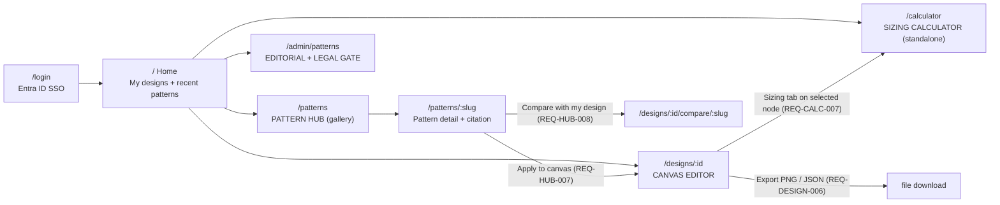
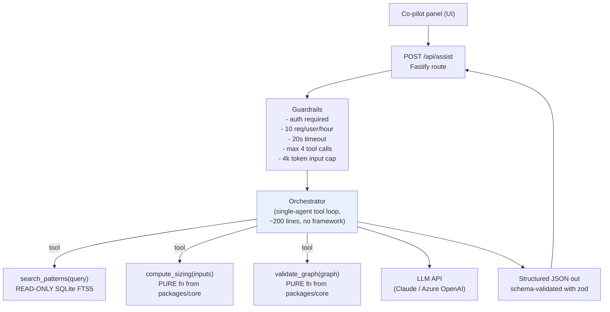
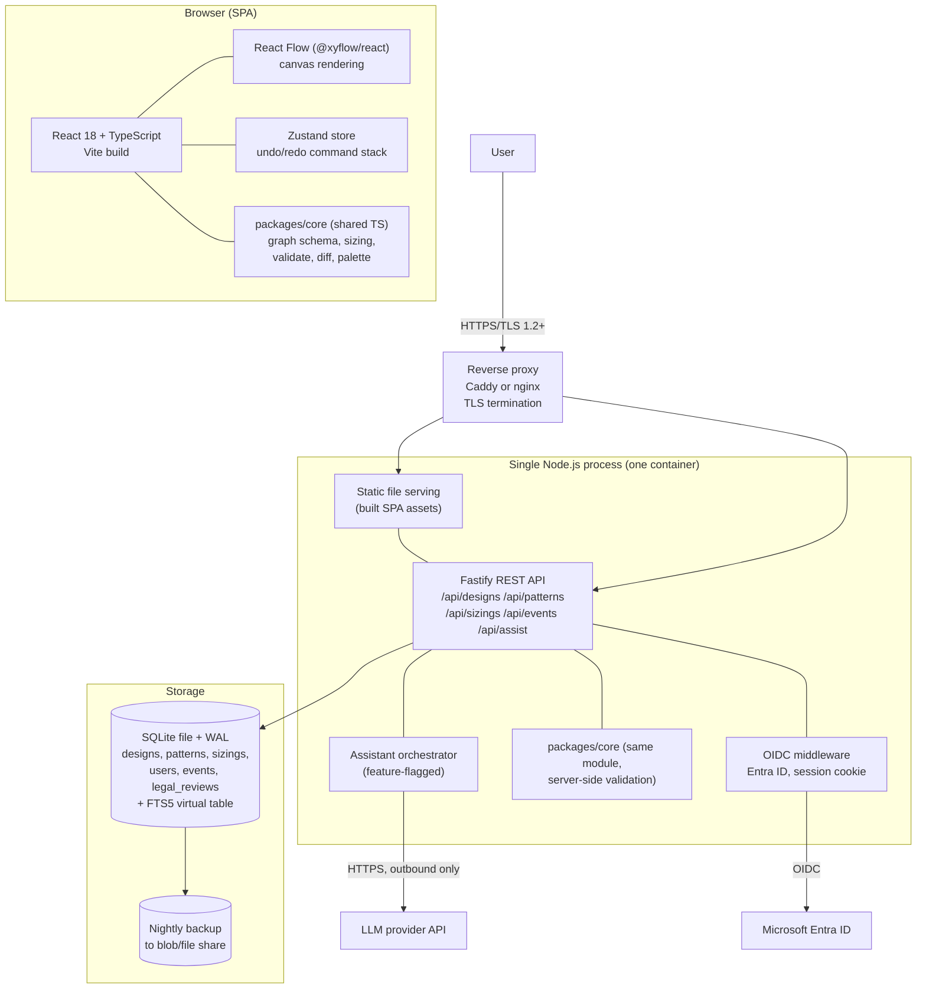
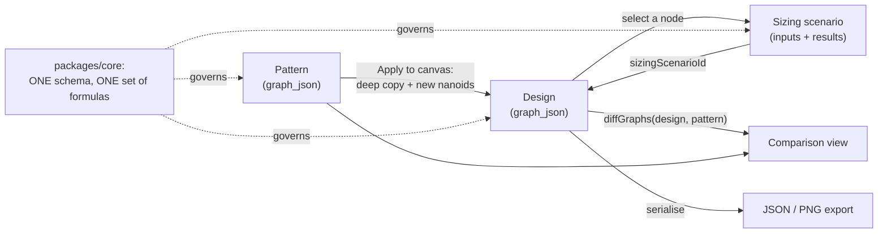

# SystemsArchitect — Prototype Architecture & Design Proposal

| | |
|---|---|
| **Author** | Solution Architect #1 (Proposer) |
| **Date** | 2026-09-23 |
| **Version** | 0.1 (Draft — first proposal, pre-challenge) |
| **Status** | In Review |
| **Reviewers** | Solution Architect #2 (challenger), BA/QA Analyst, Product Owner (dungvow@gmail.com) |
| **Related docs** | `../requirements/systemsarchitect-requirements.md` (v0.1), `./topology-tool-design.md` (prior art: graph model + renderers), `../../ArchPilot/src/domain/` (prior art: TypeScript sizing + architecture model) |
| **Traceability** | Every design section names the `REQ-*` / `NFR-*` IDs it satisfies |

---

## 1. Executive summary

**English.** SystemsArchitect is one web application with three connected
pillars: a drag-and-drop design canvas, a sizing calculator that always shows
its formulas, and a curated pattern hub of original, cited summaries of
real-world architectures. The key design idea is a **single shared graph
schema**: a saved design and a reference pattern are stored in exactly the same
shape, so "apply a pattern to my canvas" becomes a copy and "compare my design
to a pattern" becomes a set difference — no extra machinery. I recommend
building it as **one deployable app**: a React + TypeScript + Vite single-page
frontend (matching the existing `ArchPilot/` convention), a small Fastify +
TypeScript API, and SQLite for storage — deliberately not microservices, because
this is a prototype for a small team. I recommend adding a **tightly scoped AI
co-pilot** with exactly two jobs: suggest three relevant patterns from a text
description, and sanity-check sizing inputs. The co-pilot sits behind a feature
flag, never writes published content, and can be switched off without breaking
the MVP. The hard legal constraint (NFR-LEGAL-001/002) is enforced as a database
state machine — a pattern cannot reach `published` without a recorded human legal
review, and an unpublish takedown is a single runtime action, not a redeploy.

**Tiếng Việt.** SystemsArchitect là một ứng dụng web duy nhất gồm ba trụ cột
liên kết với nhau: canvas thiết kế kéo-thả, máy tính ước lượng năng lực luôn
hiển thị công thức, và thư viện mẫu kiến trúc gồm các bản tóm tắt nguyên gốc có
trích dẫn nguồn. Ý tưởng thiết kế cốt lõi là **một lược đồ đồ thị dùng chung**:
bản thiết kế của người dùng và mẫu kiến trúc tham chiếu được lưu với cùng một
cấu trúc, nên "áp dụng mẫu vào canvas" chỉ là thao tác sao chép, còn "so sánh
thiết kế với mẫu" chỉ là phép hiệu tập hợp — không cần thêm cơ chế phức tạp.
Tôi đề xuất xây dựng thành **một ứng dụng triển khai duy nhất**: frontend React
+ TypeScript + Vite (giống quy ước sẵn có trong `ArchPilot/`), API nhỏ gọn bằng
Fastify + TypeScript, và lưu trữ bằng SQLite — cố ý không dùng microservices vì
đây là bản prototype cho một nhóm nhỏ. Tôi đề xuất bổ sung một **lớp trợ lý AI
có phạm vi rất hẹp** với đúng hai nhiệm vụ: gợi ý ba mẫu kiến trúc phù hợp từ
mô tả bằng văn bản, và kiểm tra tính hợp lý của các thông số ước lượng. Trợ lý
này nằm sau một feature flag, không bao giờ ghi nội dung xuất bản, và có thể tắt
đi mà không ảnh hưởng MVP. Ràng buộc pháp lý bắt buộc (NFR-LEGAL-001/002) được
thực thi bằng một máy trạng thái trong cơ sở dữ liệu — một mẫu kiến trúc không
thể chuyển sang trạng thái `published` nếu chưa có bản ghi rà soát pháp lý do
con người thực hiện, và việc gỡ bỏ theo yêu cầu chỉ là một thao tác lúc chạy,
không cần triển khai lại mã nguồn.

---

## 2. Context & objectives

### 2.1 Problem restated

Engineers have methodology docs (SystemsArchitect.io) and worked examples
(SysDesAI, 643 write-ups) but no tool that takes them from "rough idea" to
"sized, pattern-informed design". We build that tool. We differentiate by being
**interactive** (unlike SystemsArchitect.io) and by letting users **design their
own system** (unlike SysDesAI's read-only gallery).

### 2.2 Success criteria (measurable, from the BA doc)

| # | Criterion | Source |
|---|---|---|
| S1 | All `Must` items in REQ-DESIGN / REQ-CALC / REQ-HUB demonstrable end-to-end | MVP AC 1 |
| S2 | Full loop works: browse hub → apply pattern → edit canvas → size a component → save → export | MVP AC 2 |
| S3 | ≥ 18 seed patterns published, each with attribution populated | MVP AC 3 + Open Q3 (my proposed answer) |
| S4 | Zero patterns published without a recorded legal-review record | NFR-LEGAL-001, MVP AC 4 |
| S5 | New user builds a 3-component connected design in < 10 min, unaided | NFR-USE-001 |
| S6 | Canvas interaction < 150 ms; pattern detail p95 < 2 s; recompute < 500 ms | NFR-PERF-001/002 |

### 2.3 Assumptions (the BA's open questions, answered so design can proceed)

These are **assumptions, not decisions**. Each maps to a BA open question and
must be confirmed by the Product Owner. I state them so the design is concrete.

| # | BA open Q | My working assumption | Impact if wrong |
|---|---|---|---|
| A1 | Q1 audience | Internal-only, behind org SSO, ~50–200 users | Public release raises legal risk sharply; would need legal counsel, not a checklist |
| A2 | Q2 legal process | BA/content author self-certifies against a written checklist; a second person (Tech Lead) counter-signs; no in-house counsel | If counsel is required, add ~5 working days per batch to the content track |
| A3 | Q3 seed count | **18 patterns** across 9 categories (2 each) | Lower = weak hub; higher = content track becomes the critical path |
| A4 | Q4 sizing data | Published rules-of-thumb + engineering-blog figures, each tagged with a `confidence` field and shown to the user; user can override every benchmark | If internal benchmarks are mandated, add a benchmark-capture sub-project |
| A5 | Q5 auth | Hub browsing requires login too (internal tool, single SSO gate). Entra ID OIDC | Anonymous hub access would need a public route + rate limiting |
| A6 | Q6 a11y | WCAG 2.1 AA **best-effort** for MVP; keyboard nav + ARIA labels are in scope, full audit is not | A hard AA bar adds ~5 person-days and an audit |
| A7 | Q7 notation | Simple custom node/edge model, **C4-compatible in spirit** (component-level only). Not full C4 | Full C4 needs 4 diagram levels — 2–3x canvas effort |
| A8 | Q8 metrics | Track designs created, patterns applied, sizings run (NFR-OBS-001 gives us the data) | — |
| A9 | Q9 sharing | Read-only share link **in scope as a Should**, because design review is the core use case | If cut, users export PNG instead — acceptable |

### 2.4 Constraints

- **Team size:** assume 2 engineers + 0.5 content editor + 0.5 BA/QA.
- **Hard legal gate:** NFR-LEGAL-001/002 — no scraping, no verbatim text, every
  entry cited, takedown path required.
- **Prototype, not platform:** optimise for time-to-first-demo and ability to
  throw code away, not for 10,000 users.

---

## 3. Detailed design

### 3.1 The central idea — one shared graph schema

Everything hinges on this decision.

| Decision | Rationale | Trade-off |
|---|---|---|
| A user design and a reference pattern use the **identical** `ArchGraph` JSON schema | REQ-HUB-007 ("apply to canvas") collapses to a deep copy with new IDs. REQ-HUB-008 ("compare") collapses to a set diff on `type` + normalised `name`. REQ-DESIGN-006 JSON export is the same serialiser. | Patterns cannot carry pattern-only fields inside the graph — they carry them in an outer envelope instead. Acceptable. |

```typescript
// packages/core/src/graph.ts  — schemaVersion pinned for NFR-EXT-002
export type NodeType =
  | 'client' | 'cdn' | 'load_balancer' | 'service' | 'database'
  | 'cache' | 'queue' | 'object_store' | 'external_api' | 'note';

export interface ArchNode {
  id: string;                 // nanoid, stable across saves
  type: NodeType;             // fixed palette — REQ-DESIGN-002
  label: string;              // REQ-DESIGN-004
  position: { x: number; y: number };
  rationale?: string;         // REQ-DESIGN-008 free-text decision note
  sizingScenarioId?: string;  // REQ-CALC-007 link to a sizing result
  props?: Record<string, string | number>; // extensible, additive only
}

export interface ArchEdge {
  id: string;
  source: string; target: string;
  label: string;              // e.g. "writes to" — REQ-DESIGN-003
  direction: 'forward' | 'bidirectional';
  rationale?: string;
}

export interface ArchGraph {
  schemaVersion: '1.0';       // NFR-EXT-002: readers must ignore unknown fields
  nodes: ArchNode[];
  edges: ArchEdge[];
}
```

**Extensibility rule (NFR-EXT-002):** adding a `NodeType` or a `props` key is
additive and never breaks a saved design. Renaming or removing one requires a
`schemaVersion` bump plus a migration function in `packages/core/src/migrate.ts`.
Unknown node types render as a generic grey box with the raw type string, so an
old client never crashes on a new design.

### 3.2 UI — screens and how they connect

#### 3.2.1 Navigation map



Three pillars, four primary routes, two cross-pillar jumps. A user is never more
than two clicks from any pillar because the left rail is always present.

#### 3.2.2 Screen 1 — Canvas Editor (`/designs/:id`)

Three-pane layout. This is the most-used screen, so it gets the most care.

```
+----------------------------------------------------------------------------+
| TOP BAR:  [< My designs]  "Checkout service v2"  (autosaved 12s ago)        |
|           [Undo] [Redo] | [Validate] | [Export v: PNG / JSON] | [Share]     |
+-------------+------------------------------------------+-------------------+
| PALETTE     |                CANVAS                    | INSPECTOR         |
| (REQ-D-002) |            (React Flow viewport)         | (context panel)   |
|             |                                          |                   |
| [O] Client  |    +--------+   "sends HTTP"   +-------+  | Tabs:             |
| [#] CDN     |    | Client | ---------------> |  LB   |  | (Properties)      |
| [=] LB      |    +--------+                  +-------+  | (Sizing)          |
| [ ] Service |                                    |      | (Notes)           |
| [D] Database|                                    v      |                   |
| [C] Cache   |                               +--------+  | Name: [Orders API]|
| [Q] Queue   |                               | Orders |  | Type: service     |
| [S] Object  |                               |  API   |  | Rationale:        |
| [E] Ext API |                               +--------+  | [ multiline ... ] |
| [N] Note    |                                           |                   |
|             |   [+ / - / fit]  minimap (bottom-right)   | Sizing: 4 nodes   |
|             |                                           | [Open calculator] |
+-------------+------------------------------------------+-------------------+
| STATUS BAR: 2 warnings - "Cache has no connections", "No client entry point"|
|             (non-blocking, REQ-DESIGN-007)            [x dismiss] [details] |
+----------------------------------------------------------------------------+
```

| Interaction | Requirement | Implementation note |
|---|---|---|
| Drag palette item onto canvas | REQ-DESIGN-002 | HTML5 drag-drop → `addNode` at drop coords |
| Drag from a node handle to another node | REQ-DESIGN-003 | React Flow connection handles; edge label prompt appears inline, defaults to `"calls"` |
| Double-click a node label to rename; `Del` to delete; drag to move | REQ-DESIGN-004 | Direct manipulation; all mutations go through the undo stack |
| `Ctrl+Z` / `Ctrl+Shift+Z` | REQ-DESIGN-009 | Command-pattern stack, depth 50, in memory only |
| Autosave (debounced 2 s) + explicit `Ctrl+S` | REQ-DESIGN-005 | `PUT /api/designs/:id` with full graph; optimistic UI |
| `Validate` button and on-save | REQ-DESIGN-007 | Pure function `validateGraph(g): Warning[]` in `packages/core`; warnings only, never blocks save |
| `Export → PNG` | REQ-DESIGN-006 | `html-to-image` `toPng()` on the viewport DOM, client-side. No headless browser on the server. |
| `Export → JSON` | REQ-DESIGN-006 | `Blob` of the `ArchGraph` + envelope; same file re-importable |
| Keyboard: `Tab` cycles nodes, `Enter` opens inspector, arrow keys nudge 8 px | NFR-A11Y-001 | Every node gets `role="button"` + `aria-label="service Orders API, 3 connections"` |

**Palette is data, not code (NFR-EXT-002).** The palette renders from
`packages/core/src/palette.ts` — an array of `{type, label, icon, defaultProps}`.
Adding a component type is a one-line array entry.

#### 3.2.3 Screen 2 — Sizing Calculator (`/calculator`, and embedded as a tab)

Two-column, live-recompute, assumptions always visible. Same React component in
both places; when embedded it is bound to the selected node.

```
+----------------------------------------------------------------------------+
| Sizing calculator        Profile: [ Read-heavy web app  v ]  (REQ-CALC-005) |
|                          Sizing for: node "Orders API" (linked)             |
+---------------------------------+------------------------------------------+
| INPUTS (REQ-CALC-001)           | RESULTS (live, <500ms, REQ-CALC-006)     |
|                                 |                                          |
| Average QPS   [ 5000 ]  (-==-)  | +--------------------------------------+ |
| Avg record    [ 2    ] KB       | | STORAGE at 12 months                 | |
| Read:Write    [ 9 ]:[ 1 ]       | |   22.7 TB                            | |
| Retention     [ 12   ] months   | |   Formula: writeQPS x size x 86400   | |
| Peak factor   [ 3.0  ] x        | |     x retentionDays x replicas       | |
| Replicas      [ 3    ]          | |     x (1 + indexOverhead)            | |
| Index overhead[ 0.30 ]          | |   Assumptions: writeQPS = 500 (1/10  | |
| Headroom      [ 0.30 ]          | |     of 5000); replicas = 3;          | |
|                                 | |     index overhead 30%; no compression| |
| Per-node capacity (override):   | |   Confidence: estimated  [why?]      | |
|  service  [ 1000 ] rps          | +--------------------------------------+ |
|  database [ 8000 ] read qps     | +--------------------------------------+ |
|           [ 2000 ] write qps    | | THROUGHPUT                           | |
|  cache    [ 80000] ops/s        | |   read 4,500 qps / write 500 qps     | |
|  queue    [ 50   ] MB/s         | |   ingress 1.0 MB/s, egress 9.0 MB/s  | |
|                                 | |   Formula + assumptions shown...     | |
| [ Reset to profile defaults ]   | +--------------------------------------+ |
|                                 | +--------------------------------------+ |
|                                 | | NODE COUNT (service)                 | |
|                                 | |   20 instances                       | |
|                                 | |   Formula: ceil(avgQPS x peakFactor  | |
|                                 | |     / perNodeRps x (1 + headroom))   | |
|                                 | |   = ceil(5000 x 3 / 1000 x 1.3) = 20 | |
|                                 | |   Benchmark source: industry rule of | |
|                                 | |     thumb, 4 vCPU JSON API, p99<50ms | |
|                                 | +--------------------------------------+ |
|                                 | [ Attach to node "Orders API" ]  (C-007)|
|                                 | DISCLAIMER: rough estimate, not a        |
|                                 | capacity guarantee. Validate with a load |
|                                 | test before committing budget.           |
+---------------------------------+------------------------------------------+
```

**No black-box numbers (REQ-CALC-004, NFR-USE-002).** Every result card is
rendered from a `SizingResult` object that *structurally requires* a `formula`
string, an `assumptions: string[]`, and a `confidence` field. A developer cannot
add a new output without supplying them — the TypeScript type makes it
impossible. This is the enforcement mechanism, not a code-review convention.

#### 3.2.4 Screen 3 — Pattern Hub (`/patterns` and `/patterns/:slug`)

Gallery view: left filter sidebar, top search + sort, card grid.

```
+----------------------------------------------------------------------------+
| [ Search patterns...                    ]  Sort: [ Newest v ]  (HUB-004/006)|
+---------------+------------------------------------------------------------+
| FILTERS       |  18 patterns                                                |
| (REQ-HUB-003) |  +---------------------+  +---------------------+           |
|               |  | Netflix             |  | Uber                |           |
| Category      |  | Adaptive video      |  | Real-time dispatch  |           |
| [x] Messaging |  | streaming at scale  |  | matching            |           |
| [ ] Storage   |  |                     |  |                     |           |
| [ ] Real-time |  | One-line summary... |  | One-line summary... |           |
| [ ] Search    |  |                     |  |                     |           |
| [ ] Analytics |  | #streaming #cdn     |  | #realtime #geo      |           |
| [ ] Social    |  | Source: Netflix Tech|  | Source: Uber Eng    |           |
| [ ] E-commerce|  +---------------------+  +---------------------+           |
| [ ] API Plat. |                                                             |
| [ ] AI/ML     |  [ AI: describe your problem -> suggest 3 patterns ] (flag) |
|               |                                                             |
| Company       |                                                             |
| [ ] Netflix   |                                                             |
| [ ] Uber ...  |                                                             |
+---------------+------------------------------------------------------------+
```

Detail view (`/patterns/:slug`) sections, top to bottom:

1. **Title + source company badge + category tags** (REQ-HUB-001).
2. **Attribution banner, always visible, never collapsible** — *"Original
   summary by the SystemsArchitect team. Source: [Netflix Technology Blog —
   article title](url), published YYYY-MM-DD. Not affiliated with or endorsed by
   Netflix."* (REQ-HUB-005, NFR-LEGAL-001).
3. **Problem & requirements** — our own words (REQ-HUB-002).
4. **Key design decisions** — a table of decision → rationale → trade-off.
5. **Diagram** — rendered from the pattern's own `ArchGraph` using the same
   read-only canvas renderer. We draw it ourselves; we never embed the source's
   image (NFR-LEGAL-001).
6. **Actions:** `Apply to canvas` (REQ-HUB-007), `Compare with my design`
   (REQ-HUB-008), `Report an issue / request correction` (NFR-LEGAL-002 — opens
   a form that files a takedown ticket).

#### 3.2.5 Screen 4 — Admin / Editorial (`/admin/patterns`, role-gated)

This screen *is* the NFR-LEGAL-001 control. It exists so publishing a pattern
needs no code deployment (NFR-EXT-001).

```
Pattern editor                                     Status: DRAFT -> [Submit]
-----------------------------------------------------------------------------
Title        [ Adaptive video streaming at scale                            ]
Source company [ Netflix ]   Source URL [ https://netflixtechblog.com/...   ]
Source title [ ... ]  Source date [ 2023-06-14 ]   Licence note [ blog, ToS ]
Categories   [x] Storage/CDN  [x] Real-time
Summary (one line) [ .......................................................]
Body (Markdown, our own words) [ ......................................... ]
Diagram: [ open graph editor ]  (same canvas component, read-only on publish)

LEGAL REVIEW GATE  (required before Publish)  -- NFR-LEGAL-001
 [ ] I wrote/edited this summary myself; no sentence is copied from the source
 [ ] No source diagram, screenshot, or logo image is reproduced
 [ ] Source is cited by name AND link, and the link resolves
 [ ] Quoted material (if any) is <= 25 words and in quotation marks
 [ ] No claim of affiliation or endorsement
 Reviewer: [ name ]  Date: [ auto ]   [ Approve for publish ]
 (Approve is disabled until all 5 boxes checked AND reviewer != author)
```

### 3.3 Function list mapped to MVP scope

| Requirement | Feature shipped in MVP | Where |
|---|---|---|
| REQ-DESIGN-001 | Create named design | Home → `New design` |
| REQ-DESIGN-002 | 10-type fixed palette, drag to add | Canvas left pane |
| REQ-DESIGN-003 | Labeled directional edges | Canvas |
| REQ-DESIGN-004 | Rename / delete / reposition | Canvas + inspector |
| REQ-DESIGN-005 | Save + reload exact state (autosave + explicit) | API `PUT/GET /designs/:id` |
| REQ-DESIGN-006 | Export PNG **and** JSON | Toolbar, client-side |
| REQ-DESIGN-007 (Should) | 4 non-blocking rules: orphan node, no client entry, no datastore, self-loop | `validateGraph()` |
| REQ-DESIGN-008 (Should) | Rationale note on node and edge | Inspector Notes tab |
| REQ-DESIGN-009 (Should) | Undo/redo, depth 50 | Command stack |
| REQ-DESIGN-010/011 (Could) | **Deferred to Phase 2** | — |
| REQ-DESIGN-012/013/014 (Won't) | **Not built.** See §3.5 on why the co-pilot does not violate 013. | — |
| REQ-CALC-001..004 | Inputs, storage, throughput, node count, assumptions | `packages/core/src/sizing.ts` |
| REQ-CALC-005 (Should) | 4 profiles: read-heavy web, write-heavy OLTP, high-throughput event stream, media/object storage | `profiles.ts` |
| REQ-CALC-006 (Should) | Live recompute on every keystroke (pure client function, ~0.1 ms) | React `useMemo` |
| REQ-CALC-007 (Should) | Attach scenario to node | `sizingScenarioId` on `ArchNode` |
| REQ-CALC-008 (Should) | CSV export of assumptions + outputs (CSV only; PDF deferred) | Client-side `Blob` |
| REQ-CALC-009 (Could) / 010 / 011 (Won't) | **Deferred** | — |
| REQ-HUB-001..004 | Browse, detail, filter (category + company), keyword search | SQLite FTS5 |
| REQ-HUB-005 | Attribution mandatory at the schema level (`NOT NULL`) and at the publish gate | DB + admin |
| REQ-HUB-006 (Should) | Sort newest / alphabetical | Client-side |
| REQ-HUB-007 (Should) | Apply to canvas = deep copy of pattern graph | Shared schema |
| REQ-HUB-008 (Should) | Compare = set diff by `(type, normalisedName)` | `diffGraphs()` |
| REQ-HUB-009 (Should) | Admin editorial UI, no code deploy | `/admin/patterns` |
| REQ-HUB-010 (Could) / 011 (Won't) | **Not built.** No scraper exists in the codebase — by design. | — |
| NFR-LEGAL-002 | `Report an issue` form + admin one-click `Unpublish` (takedown SLA 2 business days, proposed) | Admin |
| NFR-OBS-001 | `events` table: `sizing_run`, `pattern_applied`, `pattern_viewed`, `design_saved` | API middleware |

### 3.4 Sizing engine — concrete formulas and defaults

Banned phrase check: here are the actual numbers.

```
writeFraction = 1 / (1 + readWriteRatio)          // ratio 9:1 -> 0.10
readQps       = avgQps * (1 - writeFraction)
writeQps      = avgQps * writeFraction
peakQps       = avgQps * peakFactor                // default peakFactor = 3.0

bytesPerDay   = writeQps * avgRecordBytes * 86400
storageBytes  = bytesPerDay * retentionDays * replicationFactor
                * (1 + indexOverhead)              // default indexOverhead = 0.30

ingressBps    = writeQps * avgRecordBytes
egressBps     = readQps  * avgRecordBytes

nodeCount     = ceil( peakQps / perNodeCapacity * (1 + headroom) )
                                                   // default headroom = 0.30
```

**Default per-node benchmarks** (every one is user-overridable and carries a
`confidence` tag shown in the UI — this is my proposed answer to BA Open Q4):

| Component type | Default capacity | Basis | Confidence tag |
|---|---|---|---|
| `service` (4 vCPU, JSON API) | 1,000 rps @ p99 < 50 ms | industry rule of thumb | `estimated` |
| `database` (8 vCPU, NVMe, Postgres-like) | 8,000 read qps / 2,000 write qps | rule of thumb | `estimated` |
| `cache` (Redis, single shard) | 80,000 ops/s | published Redis benchmarks | `declared` |
| `queue` (Kafka broker) | 50 MB/s sustained write | published Kafka sizing guidance | `declared` |
| `object_store` | throughput not limiting; size only | — | `declared` |

The `confidence` enum (`measured | declared | estimated | unverified`) is lifted
directly from the existing `ArchPilot/src/domain/model.ts` — reuse, not
invention.

### 3.5 The agentic co-pilot — recommendation and tight scope

**Recommendation: yes, build it — but as a two-skill, read-only, feature-flagged
assistant, and never on the MVP critical path.**

#### Why this does not violate REQ-DESIGN-013 / the "Won't" list

The BA marked *"auto-generates a full design from a natural-language prompt"* as
Won't. I agree and am not proposing it. The distinction:

| Rejected (REQ-DESIGN-013) | Proposed |
|---|---|
| AI **generates** a design | AI **retrieves and ranks** patterns a human already wrote |
| Output is new architecture content | Output is a ranked list of existing pattern IDs + a one-line reason each |
| Unbounded prompt → unbounded artefact | Bounded: exactly 3 results, from a closed corpus of 18 entries |

#### Skill 1 — `suggestPatterns(description) → 3 patterns + reason each`

Pipeline, deliberately simple for a prototype:

1. Retrieve: SQLite FTS5 keyword search + (Phase 4b) embedding cosine similarity
   over pattern summaries, take top 10 candidates.
2. Re-rank: one LLM call with the 10 candidate titles/summaries and the user's
   description; instruction is *"choose the 3 most relevant; return JSON
   `[{patternId, reason}]`; `patternId` MUST be one of the supplied IDs; if none
   are relevant return an empty array."*
3. Validate: server rejects any `patternId` not in the candidate set and falls
   back to plain FTS5 ranking. **The model cannot invent a pattern.**

#### Skill 2 — `reviewSizing(inputs, results) → warnings[]`

Deterministic rules run first and carry the warnings (e.g. *"peak factor 1.0
implies perfectly flat traffic — unusual for a user-facing system"*, *"retention
> 24 months with no compression assumption"*). The LLM only rewrites those
warnings into one friendly paragraph. **If the LLM is unavailable, the raw rules
still display.** Sizing correctness never depends on a model.

#### Agent architecture



| Guardrail | Value | Why |
|---|---|---|
| Tool allow-list | exactly 3, all read-only or pure | No write path → the model can never publish or mutate content (protects NFR-LEGAL-001) |
| Max tool-call loop | 4 iterations | Bounds cost and latency; these tasks need 1–2 |
| Output contract | zod-validated JSON, IDs must exist | No hallucinated patterns reach the UI |
| Rate limit | 10 requests / user / hour | Caps spend at a known ceiling |
| Feature flag | `ENABLE_COPILOT=false` by default | MVP sign-off does not depend on it |
| Data sent to LLM | user's typed description + our own pattern summaries only. **Never** a user's saved design without an explicit click. | NFR-SEC-001 privacy |
| Logging | prompt hash, latency, tokens, chosen IDs — not full prompt text | Observability without storing user content |

**Why no LangGraph / AutoGen / CrewAI for MVP.** Those frameworks earn their
keep with multi-agent handoffs, durable state, and branching workflows. We have
a single agent, three tools, and a one-shot request. A ~200-line tool loop using
the provider SDK directly is less code, fewer dependencies, easier to debug, and
zero framework lock-in. If Phase 3+ introduces genuine multi-agent workflows
(e.g. a "design reviewer" agent critiquing a canvas, handing off to a "sizing
auditor"), **then** adopt LangGraph — the orchestrator interface is small enough
to swap. This is a deliberate "not yet", not a rejection.

**Alternative I considered and rejected:** no AI at all, keyword search only.
Cheaper and zero risk, but it leaves the hub's core value (finding the *right*
pattern from a vague problem statement) as a tag-hunting exercise, and it
forfeits the differentiator against SysDesAI's static gallery. The flagged,
fallback-first design gives us the upside with an off-switch.

### 3.6 System architecture



#### Component table

| # | Component | Technology | Responsibility | Why this choice |
|---|---|---|---|---|
| C1 | SPA frontend | React 18 + TypeScript + Vite | All three pillar UIs | Matches `ArchPilot/` exactly — same toolchain, same team skills, zero new learning |
| C2 | Canvas renderer | `@xyflow/react` (React Flow), MIT | Nodes, edges, pan/zoom, minimap, handles | Purpose-built; gives us ~70% of Pillar A for free. Writing our own SVG canvas is 3+ weeks we don't have. MIT licence is safe for internal + future commercial use. |
| C3 | Client state | Zustand + custom command stack | Canvas state, undo/redo, dirty tracking | ~1 KB, no boilerplate; React Flow already ships with Zustand internally |
| C4 | PNG export | `html-to-image` | REQ-DESIGN-006 | Client-side; avoids a server-side headless Chrome (which would triple container size and add a security surface) |
| C5 | Shared core | `packages/core` — plain TypeScript, no deps | Graph schema, sizing formulas, validation, graph diff, palette, profiles | **Single source of truth** used by browser AND server. Formula drift between client and server becomes structurally impossible. |
| C6 | API | Fastify 4 + TypeScript | REST CRUD, auth, events, assist | Fastify over Express: built-in JSON-schema validation and ~2x throughput; same language as the frontend so one person can own both |
| C7 | Database | SQLite (WAL mode) + `better-sqlite3` + FTS5 | Designs, patterns, sizings, events, legal reviews, full-text search | Prototype scale (< 200 users, < 5k rows). Zero ops, one file, trivial backup, synchronous driver = simplest code. **Migration path to Postgres is a connection-string change if we use Kysely as the query builder.** |
| C8 | Search | SQLite FTS5 virtual table over title+summary+tags | REQ-HUB-004 | Sub-5 ms at this corpus size. Elasticsearch here would be pure over-engineering. |
| C9 | Auth | Entra ID OIDC auth-code + PKCE; `httpOnly`, `Secure`, `SameSite=Lax` session cookie | NFR-SEC-002 | Org already has M365; no password storage, no user table to breach |
| C10 | Assistant | Custom ~200-line tool loop + provider SDK + `zod` | §3.5 | See framework rationale above |
| C11 | Reverse proxy | Caddy | TLS termination (automatic certs), gzip/brotli, static caching | One-line TLS. nginx is the alternative if the org standardises on it. |
| C12 | Packaging | Docker, multi-stage, ~120 MB final image | Deployment unit | One container, one volume |

#### Repository layout (npm workspaces monorepo)

```
SystemsArchitect/
  package.json            # workspaces: ["packages/*", "apps/*"]
  packages/core/          # shared TS: graph.ts sizing.ts validate.ts diff.ts
                          #            palette.ts profiles.ts migrate.ts
  apps/web/               # React + Vite SPA (Canvas, Calculator, Hub, Admin)
  apps/api/               # Fastify server, routes/, db/, assist/
  content/patterns/       # seed pattern Markdown + front-matter (authoring source)
  scripts/seed-patterns.ts# imports content/ -> DB, enforces attribution fields
  docker/Dockerfile
```

#### Data model (SQLite DDL, abbreviated)

```sql
CREATE TABLE designs (
  id TEXT PRIMARY KEY, owner_id TEXT NOT NULL, name TEXT NOT NULL,
  graph_json TEXT NOT NULL,               -- ArchGraph, schemaVersion inside
  schema_version TEXT NOT NULL DEFAULT '1.0',
  seeded_from_pattern_id TEXT,            -- provenance for REQ-HUB-007
  visibility TEXT NOT NULL DEFAULT 'private',   -- NFR-SEC-001
  share_token TEXT UNIQUE,                -- A9: read-only link, nullable
  created_at TEXT, updated_at TEXT
);

CREATE TABLE sizing_scenarios (
  id TEXT PRIMARY KEY, design_id TEXT, node_id TEXT,   -- REQ-CALC-007
  inputs_json TEXT NOT NULL, results_json TEXT NOT NULL,
  formula_version TEXT NOT NULL, created_at TEXT
);

CREATE TABLE patterns (
  id TEXT PRIMARY KEY, slug TEXT UNIQUE NOT NULL, title TEXT NOT NULL,
  summary_one_line TEXT NOT NULL, body_md TEXT NOT NULL,
  graph_json TEXT NOT NULL,               -- SAME ArchGraph schema as designs
  categories_json TEXT NOT NULL,
  -- attribution: NOT NULL enforces REQ-HUB-005 at the storage layer
  source_company TEXT NOT NULL,
  source_url TEXT NOT NULL,
  source_title TEXT NOT NULL,
  source_published_date TEXT,
  status TEXT NOT NULL DEFAULT 'draft',   -- draft|in_legal_review|approved|published|unpublished
  author_id TEXT NOT NULL,
  created_at TEXT, updated_at TEXT
);

CREATE TABLE legal_reviews (                 -- NFR-LEGAL-001 audit trail
  id TEXT PRIMARY KEY, pattern_id TEXT NOT NULL,
  reviewer_id TEXT NOT NULL,               -- app rejects reviewer_id = author_id
  checklist_json TEXT NOT NULL,            -- all 5 items must be true
  decision TEXT NOT NULL,                  -- approved | rejected
  notes TEXT, reviewed_at TEXT NOT NULL
);

CREATE TABLE takedown_requests (             -- NFR-LEGAL-002
  id TEXT PRIMARY KEY, pattern_id TEXT NOT NULL, requester_contact TEXT,
  reason TEXT NOT NULL, status TEXT NOT NULL DEFAULT 'open',
  received_at TEXT NOT NULL, resolved_at TEXT, resolution TEXT
);

CREATE TABLE events (                        -- NFR-OBS-001
  id INTEGER PRIMARY KEY AUTOINCREMENT, user_id TEXT, event_type TEXT NOT NULL,
  target_id TEXT, payload_json TEXT, occurred_at TEXT NOT NULL
);

CREATE VIRTUAL TABLE patterns_fts USING fts5(
  title, summary_one_line, body_md, categories, source_company,
  content='patterns', content_rowid='rowid'
);
```

**Legal state machine — the enforcement point for NFR-LEGAL-001:**

```
draft --submit--> in_legal_review --approve(+legal_reviews row)--> approved
                                  --reject--> draft
approved --publish--> published --takedown/unpublish--> unpublished
```

`GET /api/patterns` filters `status = 'published'` and nothing else. The
transition `approved → published` is rejected by the API unless a
`legal_reviews` row exists with `decision='approved'` and
`reviewer_id != author_id`. It is a database-and-API invariant, not a process
reminder.

### 3.7 How the three pillars share data



Three integration points, all trivially implementable because of the shared
schema decision in §3.1:

1. **Hub → Canvas (REQ-HUB-007):** `POST /api/designs {seededFromPatternId}` —
   server deep-copies `patterns.graph_json`, regenerates node/edge IDs,
   preserves labels and positions, records provenance.
2. **Canvas → Calculator (REQ-CALC-007):** the selected node's `type` picks the
   default per-node benchmark; the resulting `sizing_scenarios.id` is written
   back to the node's `sizingScenarioId`.
3. **Canvas ↔ Hub compare (REQ-HUB-008):** `diffGraphs(a, b)` in
   `packages/core` returns `{onlyInA, onlyInB, common}` keyed on
   `type + lowercase(label)`; rendered as two columns.

### 3.8 Non-functional design

| NFR | Target | How this design meets it | How we verify |
|---|---|---|---|
| NFR-PERF-001 | canvas < 150 ms | All canvas mutations are local React state — zero network in the interaction path. Autosave is debounced and off the critical path. | React Profiler on a 100-node graph; budget: < 16 ms per interaction render |
| NFR-PERF-001 | pattern detail p95 < 2 s | SQLite point read ~1 ms; SPA client-side route change; Markdown pre-rendered to HTML on save, not on read | k6 script, 20 virtual users |
| NFR-PERF-002 | recompute < 500 ms | Pure synchronous TS function, ~0.1 ms, no server call at all — 5000x margin | unit benchmark asserting < 5 ms |
| NFR-USE-001 | 3 components in 10 min | Empty-state canvas ships with a 3-step inline coach mark; "Apply a pattern" offers a 1-click head start | Moderated test, 5 users, Phase 5 |
| NFR-EXT-001 | no deploy to add a pattern | Admin UI writes to DB; seed script is for the initial batch only | Add a pattern in staging with no rebuild |
| NFR-EXT-002 | palette/profile extensible | Array-driven palette + additive-only schema + unknown-type fallback render | Load a v1.0 design in a build with a new node type |
| NFR-LEGAL-001 | zero verbatim | 5-item checklist + second-person approval + DB invariant; no scraper code in the repo | Pre-launch audit of all 18 entries (§4 gate G3) |
| NFR-LEGAL-002 | takedown actionable | `Report an issue` form → `takedown_requests` row → admin one-click unpublish. **Proposed SLA: acknowledge 1 business day, unpublish-or-correct within 2 business days.** | Tabletop drill in Phase 5 |
| NFR-SEC-001 | designs private by default | `visibility='private'` default; every design query filtered by `owner_id` from the session; share link needs an explicit action to mint a `share_token` | Test: user B gets 404 (not 403) on user A's design |
| NFR-SEC-002 | TLS + auth | Caddy TLS 1.2+; all `/api/*` except `/api/health` require a session | `testssl.sh`; unauthenticated request returns 401 |
| NFR-AVAIL-001 | 99.5% monthly (= 3.6 h/month downtime budget) | Single container is sufficient for 99.5%. Docker `restart: unless-stopped`, healthcheck on `/api/health`, nightly backup. **RPO 24 h, RTO 2 h** for the prototype. | Uptime check every 60 s |
| NFR-A11Y-001 | best-effort WCAG 2.1 AA | ARIA labels on nodes/edges, full keyboard canvas nav, focus rings, 4.5:1 contrast, palette not colour-only (icon + text) | axe-core in CI; manual keyboard pass |
| NFR-OBS-001 | log every sizing + apply | `events` table written by API middleware; simple `/admin/analytics` count view | Query the table after a scripted session |

### 3.9 Threat model (STRIDE, abbreviated — deep pass belongs to security-architect)

| Threat | Vector | Mitigation |
|---|---|---|
| **S**poofing | Session cookie theft | `httpOnly`+`Secure`+`SameSite=Lax`, 8 h idle expiry, Entra ID as sole IdP |
| **T**ampering | Client posts a malformed `ArchGraph` | Server re-validates with the same `packages/core` schema; Fastify JSON-schema on every route |
| **R**epudiation | "I never approved that pattern" | `legal_reviews` append-only row with reviewer ID and timestamp |
| **I**nfo disclosure | User A reads user B's design | Row-level `owner_id` filter; share tokens are 32-byte random, revocable |
| **D**oS | Assistant endpoint abuse / cost blowout | 10 req/user/hour, 20 s timeout, 4k token cap, global monthly spend cap with hard cutoff |
| **E**levation | Non-editor reaches `/admin` | Role claim from Entra ID group membership, checked server-side on every admin route (not just hidden in the UI) |
| **Prompt injection** | A pattern summary contains "ignore previous instructions" | Pattern text is authored by us and legal-reviewed; assistant output is ID-validated against the candidate set, so injected instructions cannot produce a valid rogue result |

### 3.10 Alternatives considered

| Option | Description | Why not chosen |
|---|---|---|
| **Alt A — Static site + Git content, no backend** | Patterns as Markdown in Git, designs in browser `localStorage`, no server | Cheapest and fastest (saves ~10 person-days). Rejected because: designs would not survive a browser cache clear or move between machines (fails REQ-DESIGN-005 in spirit), NFR-EXT-001 would require a non-engineer to use Git, and NFR-LEGAL-002 takedown would need a redeploy rather than a click. **Keep as the fallback if the timeline is halved.** |
| **Alt B — Microservices (canvas svc, sizing svc, hub svc) + Postgres + Kafka** | Proper service decomposition | Rejected outright. Three services for a 2-person prototype multiplies ops cost and deployment complexity with zero benefit at < 200 users. Revisit only if a pillar develops an independent scaling or release cadence. |
| **Alt C — Buy: Miro/Excalidraw embed + Notion for patterns** | No build | Fails the differentiator entirely: no shared graph schema means no apply-to-canvas, no compare, no sizing link. We would ship a link farm, not a product. |
| **Alt D — Custom SVG canvas instead of React Flow** | Full control, no dependency | ~3 extra weeks to reach parity on pan/zoom/handles/minimap. Not justified for a prototype. |
| **Alt E — Multi-agent framework (LangGraph/CrewAI) from day one** | Richer agent workflows | Premature: one agent, three tools, one-shot request. Adopt when a genuine second agent appears (§3.5). |

---

## 4. Step-by-step implementation plan

Team assumption: **E1** (frontend-leaning engineer), **E2** (full-stack
engineer), **C** (content editor, 50%), **Q** (BA/QA, 50%), **PO** (product
owner). Effort in person-days (pd). Calendar assumes the two engineers run in
parallel; the content track runs alongside from week 1.

### Gate G0 — before any content work (week 0, blocking)

| # | Step | Owner | Prerequisite | Action | Expected outcome | Verification |
|---|---|---|---|---|---|---|
| 0.1 | Confirm assumptions A1–A9 | PO | §2.3 | Answer BA open questions 1–9 | Requirements doc → v0.2 | Written sign-off |
| 0.2 | **Approve the content-IP policy** | PO (+ legal if available) | A2 | Sign off the 5-item checklist in §3.2.5 and the 2-business-day takedown SLA | Policy document approved | Checklist stored in repo at `docs/legal/pattern-content-policy.md` |
| 0.3 | Approve this design | Architect #2 → PO | this doc | Challenge round, converge, update decision log | v1.0 Approved | Review doc under `docs/architecture/reviews/` |

**G0 blocks Phase 3 and the content track. It does not block Phases 0–2.** That
sequencing matters: engineering can start on day 1 while legal policy is settled.

### Phase 0 — Foundations (4 pd, no dependencies)

| # | Step | Owner | Action | Expected outcome | Verification |
|---|---|---|---|---|---|
| 1.1 | Scaffold monorepo | E2 | `npm init -w packages/core -w apps/web -w apps/api`; Vite React-TS template for `apps/web` mirroring `ArchPilot/` | `npm run dev` serves a blank app | Browser loads at `localhost:5173` |
| 1.2 | `packages/core` skeleton | E2 | `graph.ts` types, `palette.ts`, `migrate.ts` stub; vitest configured | `npm test -w packages/core` green | 1 passing test |
| 1.3 | Fastify + SQLite | E2 | DDL from §3.6, `better-sqlite3`, Kysely query builder, `/api/health` | API returns `{"status":"ok"}` | `curl localhost:3000/api/health` |
| 1.4 | Entra ID OIDC | E2 | App registration, auth-code+PKCE, session cookie, `requireAuth` hook | Login redirects and returns to `/` | Unauthenticated `/api/designs` → 401 |
| 1.5 | CI | E2 | GitHub Actions: typecheck, vitest, `npm run build`, axe-core smoke | Green pipeline on PR | First PR passes |

### Phase 1 — Pillar A: Canvas (12 pd; depends on Phase 0)

| # | Step | Owner | Action | Outcome | Verification |
|---|---|---|---|---|---|
| 2.1 | React Flow shell | E1 | Install `@xyflow/react`; pan/zoom/minimap; 3-pane layout | Empty canvas renders | Manual |
| 2.2 | Palette + custom nodes (REQ-D-002) | E1 | 10 node types with icon + shape from `palette.ts`; drag-drop add | Drag `service` creates a node | TC-FUNC-DESIGN-002 |
| 2.3 | Labeled edges (REQ-D-003) | E1 | Connection handles, inline label edit, arrow markers | Two nodes connect with "writes to" | TC-FUNC-DESIGN-003 |
| 2.4 | Inspector + CRUD (REQ-D-004/008) | E1 | Rename/delete/move; Properties + Notes tabs | Rationale text persists | TC-FUNC-DESIGN-004 |
| 2.5 | Persistence (REQ-D-005) | E2 | `POST/GET/PUT /api/designs`; debounced autosave; owner filter | Reload restores exact positions | TC-FUNC-DESIGN-005 |
| 2.6 | Export (REQ-D-006) | E1 | `html-to-image` PNG at 2x; JSON download + re-import | Both files produced and valid | TC-FUNC-DESIGN-006 |
| 2.7 | Undo/redo (REQ-D-009) | E1 | Command stack, depth 50 | `Ctrl+Z` reverses last 50 actions | TC-FUNC-DESIGN-009 |
| 2.8 | Validation (REQ-D-007) | E2 | `validateGraph()` 4 rules; status-bar warnings | Orphan node warns, save still succeeds | TC-FUNC-DESIGN-007 |
| 2.9 | Perf check | E1 | Profile 100-node graph | Interaction < 150 ms | TC-PERF-001 |

### Phase 2 — Pillar B: Calculator (7 pd; depends on 1.2, parallel with Phase 1)

| # | Step | Owner | Action | Outcome | Verification |
|---|---|---|---|---|---|
| 3.1 | Sizing engine (REQ-C-001..004) | E2 | Formulas from §3.4 in `packages/core/src/sizing.ts`; `SizingResult` type *requires* `formula` + `assumptions` + `confidence` | Unit tests cover the worked example (5000 QPS, 2 KB, 9:1, 12 mo) | TC-FUNC-CALC-002/003 |
| 3.2 | Benchmark table | E2 | `benchmarks.ts` with §3.4 defaults + confidence tags, all overridable | Overriding changes output | TC-FUNC-CALC-003 |
| 3.3 | Calculator UI | E1 | Two-column layout; result cards render assumptions inline; disclaimer | No number appears without its formula | TC-FUNC-CALC-004 |
| 3.4 | Live recompute (REQ-C-006) | E1 | `useMemo` on inputs; sliders for QPS/retention | Typing recomputes instantly | TC-PERF-002 (< 500 ms) |
| 3.5 | Profiles (REQ-C-005) | E2 | 4 profiles in `profiles.ts` | Selecting a profile pre-fills, user can override | TC-FUNC-CALC-005 |
| 3.6 | Attach to node (REQ-C-007) | E2 | `sizing_scenarios` row + `sizingScenarioId` on node | Reopening the design shows the attached sizing | TC-FUNC-CALC-007 |
| 3.7 | CSV export (REQ-C-008) | E1 | Client-side CSV of inputs + outputs + assumptions | File opens in Excel | TC-FUNC-CALC-008 |

### Content track — Seed patterns (9 pd, runs weeks 1–6; **depends on G0.2**)

| # | Step | Owner | Action | Outcome | Verification |
|---|---|---|---|---|---|
| 4.1 | Category + source shortlist | C + Q | Pick 9 categories × 2 entries = 18; choose source articles from public engineering blogs (Netflix, Uber, Stripe, Meta, Discord, Shopify, Airbnb, Cloudflare, Slack) | Backlog of 18 with URLs | PO review |
| 4.2 | Author entries | C | For each: read source → write **original** summary in our words → draw our own `ArchGraph` diagram → fill attribution fields | 18 drafts in `content/patterns/` | Word-count + originality self-check |
| 4.3 | **Gate G1 — per-entry legal review** | Q (reviewer ≠ author) | Run the 5-item checklist per entry; record decision | 18 `legal_reviews` rows, `decision='approved'` | Admin UI blocks publish without it |
| 4.4 | Import | E2 | `scripts/seed-patterns.ts` loads `content/` → DB; fails loudly on any missing attribution field | 18 patterns at status `approved` | Script exits non-zero if a field is empty |

### Phase 3 — Pillar C: Hub + editorial (10 pd; depends on Phase 0 + G0.2)

| # | Step | Owner | Action | Outcome | Verification |
|---|---|---|---|---|---|
| 5.1 | Pattern API + FTS5 | E2 | `GET /api/patterns` (published only), `/:slug`, `?q=&category=&company=&sort=` | Filter + search work | TC-FUNC-HUB-003/004 |
| 5.2 | Gallery UI (REQ-H-001/003/004/006) | E1 | Card grid, filter sidebar, search box, sort | Filtering by Messaging shows only Messaging | TC-FUNC-HUB-001 |
| 5.3 | Detail page (REQ-H-002/005) | E1 | Markdown body, decision table, read-only graph render, **non-collapsible attribution banner** | Every entry shows source + link | TC-COMPLY-001 |
| 5.4 | Admin editor (REQ-H-009) | E2 | CRUD form + status state machine + checklist gate; approve disabled when `reviewer == author` | New pattern published with no deploy | TC-FUNC-HUB-009 |
| 5.5 | Takedown path (NFR-LEGAL-002) | E2 | `Report an issue` form → `takedown_requests`; admin one-click unpublish | Unpublished pattern 404s within seconds | Tabletop drill |

### Phase 4 — Integration + co-pilot (8 pd; depends on Phases 1–3)

| # | Step | Owner | Action | Outcome | Verification |
|---|---|---|---|---|---|
| 6.1 | Apply to canvas (REQ-H-007) | E2 | Deep copy + ID regeneration + provenance | New editable design seeded from a pattern | TC-FUNC-HUB-APPLY-001 |
| 6.2 | Compare (REQ-H-008) | E2 | `diffGraphs()` + two-column view | Missing components listed both ways | TC-FUNC-HUB-APPLY-002 |
| 6.3 | Events (NFR-OBS-001) | E2 | Middleware writes `events` rows for 4 event types | Rows appear after a scripted session | Query |
| 6.4 | Share link (A9) | E2 | `share_token` mint/revoke; read-only route | Token opens read-only; revoke 404s | TC-FUNC-DESIGN-SHARE |
| 6.5 | **Co-pilot skill 1** | E2 | `/api/assist/suggest-patterns`; FTS5 candidates → LLM re-rank → zod + ID validation; flag off by default | 3 suggestions with reasons; fallback works with flag off | Golden set of 10 descriptions; ≥ 7 judged relevant by Q |
| 6.6 | **Co-pilot skill 2** | E2 | `reviewSizing` — deterministic rules first, LLM phrasing second | Warnings shown even with the LLM disabled | Unit tests on rules |
| 6.7 | Guardrails | E2 | Rate limit, timeout, token cap, spend cap, structured logging | 11th request in an hour returns 429 | Load script |

### Phase 5 — Hardening & launch (7 pd)

| # | Step | Owner | Action | Outcome | Verification |
|---|---|---|---|---|---|
| 7.1 | Accessibility pass | E1 | Keyboard canvas nav, ARIA labels, contrast, focus order | axe-core: 0 critical | TC-A11Y-001 |
| 7.2 | Performance validation | E2 | k6 on hub, profiler on canvas, benchmark on sizing | All NFR-PERF targets met | TC-PERF-001/002 |
| 7.3 | Security pass | E2 | Cross-user access tests, TLS scan, dependency audit | 0 high findings | Handoff to security-architect |
| 7.4 | **Gate G3 — pre-launch legal audit** | Q + PO | Re-verify all 18 published entries: originality, citation resolves, no reproduced imagery | Signed audit record, zero exceptions | MVP AC 4 |
| 7.5 | **Usability test (NFR-USE-001)** | Q | 5 Engineer-Emma-profile users, unaided, timed | ≥ 4 of 5 build a 3-component design in < 10 min | TC-UX-001 |
| 7.6 | Deploy + runbook | E2 | Docker Compose on the internal host, Caddy TLS, nightly backup cron, healthcheck | Running at the internal URL | Restore drill from backup |
| 7.7 | MVP sign-off | PO | Walk MVP AC 1–6 | Prototype accepted | Signed |

### Summary of effort and critical path

| Track | Effort | Calendar |
|---|---|---|
| Phase 0 | 4 pd | Week 1 |
| Phase 1 (canvas) | 12 pd | Weeks 1–4 (E1) |
| Phase 2 (calculator) | 7 pd | Weeks 2–4 (E2, parallel) |
| Phase 3 (hub) | 10 pd | Weeks 4–6 |
| Content track | 9 pd | Weeks 1–6 (C, parallel) — **gated by G0.2** |
| Phase 4 (integration + co-pilot) | 8 pd | Weeks 6–8 |
| Phase 5 (hardening + launch) | 7 pd | Weeks 8–9 |
| **Total** | **~57 pd engineering + content** | **~9 weeks** with 2 engineers |

**Critical path:** G0.2 (legal policy) → content authoring → G1 (per-entry
review) → Phase 3 seed → Phase 4 apply/compare → G3 audit → launch. If the
policy sign-off slips, the *content* slips and the hub demo slips — the canvas
and calculator do not. Cutting the co-pilot (6.5–6.7, 5 pd) is the cheapest
descope and removes zero MVP acceptance criteria.

---

## 5. Risks, trade-offs & mitigations

| # | Risk | Likelihood | Impact | Mitigation | Owner |
|---|---|---|---|---|---|
| R1 | **Content drifts toward verbatim reproduction** (NFR-LEGAL-001 breach) | Med | **Very high** — legal exposure, product pulled | 5-item checklist, reviewer ≠ author enforced in code, DB invariant on publish, pre-launch audit G3, no scraper in the codebase at all | PO + Q |
| R2 | **Scope dilution** — three pillars in 9 weeks | **High** | High | Must-only per pillar; co-pilot flagged and descopable; Alt A (static fallback) kept ready; weekly demo of one walkable slice | Architect #1 |
| R3 | **Sizing numbers mistaken for guarantees** | Med | High (credibility) | Assumptions structurally required by the `SizingResult` type; `confidence` tag on every benchmark; persistent disclaimer; user can override every input | E2 |
| R4 | Content track becomes critical path (18 entries at 0.5 pd each while the editor is 50%) | **High** | Med | Start at week 1; allow launch with 12 entries if 18 slips; PO may author 4 entries | C + PO |
| R5 | SQLite hits a concurrency wall | Low | Med | WAL mode handles many readers + one writer; at < 200 users this is far from the limit. Kysely keeps the Postgres migration to a dialect swap. | E2 |
| R6 | React Flow API churn or licence change | Low | Med | Pin exact version; MIT licence is irrevocable for the pinned release; canvas state lives in our own `ArchGraph`, so React Flow is a *renderer*, not our data model — replaceable | E1 |
| R7 | Co-pilot cost or latency blowout | Med | Low | Hard rate limit, monthly spend cap with cutoff, 20 s timeout, feature flag, deterministic fallback | E2 |
| R8 | Co-pilot suggests irrelevant patterns, eroding trust | Med | Med | ID-validated against a retrieved candidate set (no hallucination possible); ship only if ≥ 7/10 golden-set relevance; always show "why this pattern" | E2 + Q |
| R9 | Single container = single point of failure | Med | Low | 99.5% target permits 3.6 h/month. Healthcheck + auto-restart + nightly backup. RPO 24 h / RTO 2 h stated and accepted. | E2 |
| R10 | Entra ID app registration blocked by IT | Low | High (blocks all auth) | Request the registration in week 1; fallback is a signed-cookie dev login for internal pilot only, never for production | E2 |
| R11 | PNG export quality poor on large graphs | Med | Low | Export at 2x device pixel ratio with `fitView` first; JSON export is the lossless path | E1 |
| R12 | Prompt injection via pattern text | Low | Med | Our text, legal-reviewed; output constrained to a validated ID set | E2 |

### Weakest points of this design, stated plainly

1. **The content track, not the code, is the real risk.** 18 original summaries
   by a half-time editor is the tightest constraint in the plan, and it is
   gated by a legal sign-off we do not yet have.
2. **SQLite + single container will not survive success.** If this prototype
   gets adopted org-wide, we will need Postgres and a second instance. I have
   kept the migration cheap (Kysely, stateless API) but not free.
3. **The co-pilot's value is unproven.** I recommend it, but I have deliberately
   made it the easiest thing to delete.
4. **No real-time collaboration** means design-review meetings still need
   screen-sharing or the share link. That is a genuine UX gap the BA already
   accepted as Won't-for-MVP.
5. **Client-side PNG export** will render differently across browsers. JSON is
   the artefact of record.

---

## 6. Open questions / decisions needed

| # | Question | Needed by | Default if unanswered |
|---|---|---|---|
| Q1 | Confirm assumptions A1–A9 (§2.3), especially **A1 internal-only** and **A2 who reviews for IP** | Before G0.2 / week 1 | Proceed with A1–A9 as written |
| Q2 | Is the **2-business-day takedown SLA** (NFR-LEGAL-002) acceptable to PO/legal? | G0.2 | 2 business days |
| Q3 | **18 seed patterns** — confirm, or set a different number | G0.2 | 18; degrade to 12 if the content track slips |
| Q4 | **Build the co-pilot in MVP, or defer to Phase 2?** My recommendation: build, flagged off, decide at launch based on the golden-set score | End of Phase 3 | Build flagged; ship only if ≥ 7/10 relevance |
| Q5 | LLM provider — Claude API vs Azure OpenAI (data-residency and procurement differ) | Before 6.5 | Azure OpenAI if the org is already M365/Azure; otherwise Claude API |
| Q6 | Where does this deploy — internal VM, Azure Container Apps, or on-prem Docker host? | Before 7.6 | Internal Docker host behind the corporate network |
| Q7 | Is **read-only share link** (A9) in MVP or Phase 2? | Phase 4 | In MVP — it is 1 pd and unblocks design reviews |
| Q8 | Does the org mandate nginx over Caddy, or a specific base image? | Before 7.6 | Caddy |
| Q9 | Who owns the pattern-editor admin role (Entra ID group)? | Phase 3 | A new group `SA-Pattern-Editors` |

---

## 7. Cost & licensing notes

### 7.1 Software licensing — all chosen components

| Component | Licence | Cost |
|---|---|---|
| React, TypeScript, Vite, Fastify, Zustand, Kysely, zod, html-to-image | MIT / Apache-2.0 | $0 |
| `@xyflow/react` (React Flow) | **MIT** (the Pro tier is paid *support*, not paid code) | $0 |
| SQLite, `better-sqlite3` | Public domain / MIT | $0 |
| Caddy | Apache-2.0 | $0 |
| Docker Engine | Apache-2.0 | $0 |

No paid software licence is required for the MVP.

### 7.2 Microsoft 365 — E3 vs E5 for this product

The only M365 dependency is **identity** (Entra ID OIDC, §3.6 C9).

| Capability we use or might want | Included in | Needed for MVP? |
|---|---|---|
| Entra ID app registration, OIDC/OAuth2 sign-in | **Free tier / any M365 plan** | **Yes — E3 is more than enough** |
| Group-based app role assignment (`SA-Pattern-Editors`) | **Entra ID P1, included in M365 E3** | Yes — E3 covers it |
| Conditional Access (e.g. require compliant device to reach the admin route) | **Entra ID P1 → included in M365 E3** | Optional, E3 covers it |
| **Risk-based** Conditional Access / Identity Protection (block sign-in on anomalous risk) | **Entra ID P2 → E5 only** | No |
| **PIM** (Privileged Identity Management) — just-in-time elevation for the pattern-editor admin role | **Entra ID P2 → E5 only** | No |
| Purview auto-labelling of exported design documents | **E5 only** | No |
| Power BI Pro for the usage analytics from `events` | **E5 only** (or £/$ ~10 per user per month standalone) | No |

**Verdict: E3 is sufficient. No E5 upgrade is justified by this product.**

**E3-only fallbacks for the E5 features we skip:**
- Instead of PIM for the editor role: keep the `SA-Pattern-Editors` group small
  (2–3 people), review membership quarterly, and log every admin action to the
  `events` table.
- Instead of risk-based Conditional Access: apply a standard P1 Conditional
  Access policy requiring MFA for the admin route, plus the server-side role
  check in §3.9.
- Instead of Power BI Pro: a simple `/admin/analytics` page with SQL `COUNT`
  queries over `events`, plus CSV export for anyone who wants a spreadsheet.

### 7.3 FinOps — cost shape

**Cost drivers, in order:** (1) engineering time, (2) LLM tokens if the co-pilot
ships, (3) compute, (4) storage — which is rounding error.

| Item | Sizing | Monthly cost (order of magnitude) |
|---|---|---|
| Compute — 1 VM / container (2 vCPU, 4 GB) | Single container, one process | **$25–45** (Azure B2s ≈ $30; Container Apps consumption similar; **$0** if an existing internal Docker host is used) |
| Storage — SQLite + backups | < 1 GB for 200 designs + 18 patterns; nightly snapshots, 30-day retention | **< $1** |
| Egress | Internal users, PNG exports only; < 5 GB/mo | **< $1** |
| TLS certificates | Caddy + Let's Encrypt | **$0** |
| LLM (co-pilot), **if enabled** | ~4k input + 500 output tokens per call; 200 users × 10 calls/mo cap = 2,000 calls/mo worst case | **$15–40** at current mid-tier model pricing |
| M365 licensing delta | None — E3 already owned | **$0** |
| **Total** | | **~$40–90 / month**, or **~$15–40 / month** if hosted on an existing internal host |

**Cheaper option that still meets the requirement:** deploy on an existing
internal Docker host and leave `ENABLE_COPILOT=false`. That is **< $5/month** in
marginal cost and still satisfies every MVP acceptance criterion, because no
`Must` requirement depends on the co-pilot.

**Waste to watch:**
- Do not provision a managed Postgres ($50–150/mo) for 18 patterns and a few
  hundred designs. SQLite is the right call until the user count is 10x.
- Do not run a staging environment 24/7. Spin it up for release weeks only, or
  run staging as a second container on the same host (~$0).
- Cap LLM spend with a hard monthly cutoff, not an alert. An alert does not stop
  a runaway loop; a cutoff does.
- Do not enable per-user Power BI Pro for usage stats we can get from a `COUNT`
  query.

---

## 8. Decision log

| # | Decision | Rationale | Trade-off accepted |
|---|---|---|---|
| D1 | One shared `ArchGraph` schema for designs and patterns | Makes REQ-HUB-007 a copy and REQ-HUB-008 a set diff | Patterns cannot embed graph-level custom fields |
| D2 | Single deployable (SPA + API + SQLite in one container) | Prototype, 2 engineers, < 200 users; ops cost near zero | Will need Postgres + a second instance if adopted widely |
| D3 | React + TypeScript + Vite | Matches the existing `ArchPilot/` stack exactly | None material |
| D4 | React Flow as renderer, not as data model | 70% of Pillar A for free; our schema stays portable | A dependency on the canvas hot path |
| D5 | Sizing runs **client-side** in shared TS | NFR-PERF-002 met with a 5000x margin; no server round trip | Formulas are visible to users — which is a feature, per REQ-CALC-004 |
| D6 | `SizingResult` type *requires* `formula` + `assumptions` | Makes a black-box number a compile error | Slightly more verbose engine code |
| D7 | Patterns in the DB with an admin UI, not Markdown-in-Git | NFR-EXT-001 (non-engineer editor, no deploy) and NFR-LEGAL-002 (runtime takedown) | Needs an admin screen (~3 pd) |
| D8 | Legal gate as a DB/API invariant, not a process step | A process reminder can be skipped; an API 409 cannot | Slightly slower publishing |
| D9 | Co-pilot = 2 read-only skills, flagged, deterministic fallback | Captures the agentic upside without touching REQ-DESIGN-013 or the legal gate | Adds 5 pd and an external dependency |
| D10 | No agent framework (LangGraph/CrewAI) for MVP | One agent, three tools, one-shot request | Revisit when a second agent genuinely appears |
| D11 | Entra ID OIDC, no local accounts | Zero credential storage; org already on M365 E3 | Hard dependency on an IT app registration (R10) |

---

## 9. References & next handoff

### References
- `docs/requirements/systemsarchitect-requirements.md` v0.1 — the source of every
  `REQ-*` / `NFR-*` ID cited here.
- `ArchPilot/src/domain/model.ts`, `sizing.ts` — reused `Confidence` enum,
  `SizingResult` shape, and component-type vocabulary.
- `docs/architecture/topology-tool-design.md` — prior art for the node/edge model
  and type→shape mapping; the canvas palette follows the same taxonomy.
- Inspiration (concepts only, no content reuse): SystemsArchitect.io
  (methodology framework — we differ by being interactive); SysDesAI gallery
  (read-only learning gallery — we differ by adding a design canvas and sizing);
  `github.com/gtzheng/Awesome-Agentic-System-Design` (agentic patterns — informed
  the bounded tool-loop design in §3.5 and the decision to *defer* multi-agent
  frameworks).

### Next handoff

| Agent / role | What they need to do | Input from this doc |
|---|---|---|
| **solution-architect-2** | **Immediate next step.** Challenge this proposal — especially D2 (single deployable), D7 (DB vs Git content), D9/D10 (co-pilot scope and no-framework call), and the 9-week estimate. Produce `docs/architecture/reviews/review-systemsarchitect-prototype.md`. | §3, §5 weakest points, §8 decision log |
| **security-architect** | Full STRIDE pass on the assistant endpoint, session handling, share tokens, and the admin role boundary. §3.9 is a starter, not a deliverable. | §3.9, §3.6 |
| **dba-master** | Validate the SQLite schema, the FTS5 configuration, the Postgres migration path, and backup/restore (RPO 24 h / RTO 2 h). | §3.6 DDL |
| **devops-master** | Container build, CI/CD, Caddy TLS config, healthcheck + restart policy, backup cron, and a deeper FinOps model than §7.3. | §4 Phase 5, §7.3 |
| **ba-qa-analyst** | Fill the traceability matrix (design elements are now named), write `TC-FUNC-*`, `TC-PERF-*`, `TC-COMPLY-001`, and own the usability test in 7.5 and the legal audit in G3. | §3.3 mapping table, §4 verification columns |
| **Product Owner** | Answer Q1–Q9 in §6, and sign the content-IP policy at gate G0.2 — this is the single biggest schedule dependency. | §6 |
