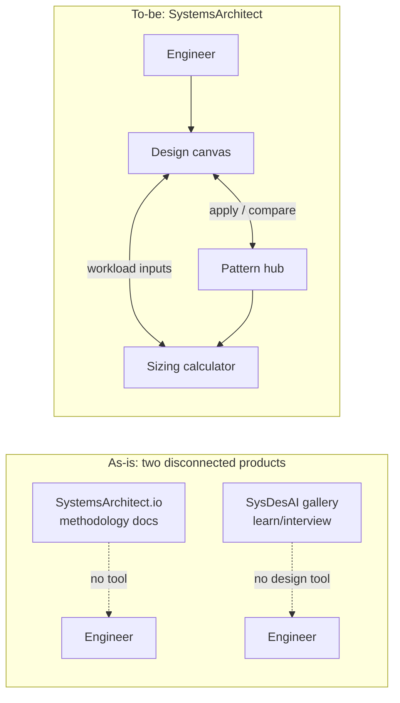

# SystemsArchitect — Requirements Analysis

| | |
|---|---|
| **Author** | BA/QA Analyst (BA hat) |
| **Date** | 2026-09-23 |
| **Version** | 0.1 (Draft) |
| **Status** | In Review |
| **Related docs** | None yet — this document is the input to the next pipeline stage (solution architects). No design/tech-stack doc exists yet. |

## Executive summary

**English.** SystemsArchitect is a proposed internal tool that helps engineers
design software systems interactively, size the infrastructure they need, and
draw on a curated library of real-world reference architectures while they
work. Two products inspired this idea but neither covers the full need:
SystemsArchitect.io is a documentation-only methodology site with no
interactive tool, and SysDesAI is a learning/interview-prep gallery with no
tool to design your own system. Our product's differentiator is combining
three pillars — an interactive design canvas, a capacity/sizing calculator
grounded in real numbers, and a pattern hub the canvas can pull from — into
one connected workflow. This document defines the problem, functional and
non-functional requirements (MoSCoW-prioritized), user stories, MVP
acceptance criteria, and open questions the product owner must resolve
before design starts. It intentionally does not propose UI, architecture,
or a tech stack — that is the next stage's job.

**Tiếng Việt.** SystemsArchitect là một công cụ nội bộ được đề xuất, giúp kỹ
sư thiết kế hệ thống phần mềm một cách trực quan, ước tính hạ tầng cần
thiết, và tham khảo một thư viện kiến trúc tham chiếu thực tế được tuyển
chọn ngay trong quá trình thiết kế. Ý tưởng lấy cảm hứng từ hai sản phẩm
nhưng không sản phẩm nào đáp ứng đủ nhu cầu: SystemsArchitect.io chỉ là
trang tài liệu phương pháp luận, không có công cụ tương tác; còn SysDesAI là
thư viện học tập/luyện phỏng vấn, không có công cụ để tự thiết kế hệ thống
của riêng mình. Điểm khác biệt của sản phẩm chúng ta là kết hợp ba trụ cột —
canvas thiết kế tương tác, máy tính ước lượng năng lực dựa trên số liệu
thực tế, và thư viện mẫu kiến trúc mà canvas có thể sử dụng — thành một quy
trình liền mạch. Tài liệu này xác định vấn đề, yêu cầu chức năng và phi
chức năng (ưu tiên theo MoSCoW), user story, tiêu chí nghiệm thu cho MVP, và
các câu hỏi mở mà chủ sản phẩm cần trả lời trước khi bắt đầu thiết kế. Tài
liệu **không** đề xuất UI, kiến trúc hay công nghệ — đó là việc của giai
đoạn tiếp theo.

## Context & objectives

**Why build this.** Engineers designing a new system today either (a) read
generic methodology docs with no way to apply them to their actual system
(SystemsArchitect.io), or (b) browse worked examples for interview practice
with no way to build their own design or size it (SysDesAI). Neither product
lets a user go from "I have a rough idea" to "here is a sized, pattern-informed
design of my system." That gap is what SystemsArchitect fills.

**Who it's for (personas).**

| Persona | Role | Primary need |
|---------|------|---------------|
| **Engineer Emma** | Mid-level backend/full-stack engineer, first time designing a system at this scale | A guided way to sketch her design, avoid obvious mistakes, and get a rough infra size without asking a senior every time |
| **Tech Lead Tom** | Tech lead / staff engineer reviewing designs in design-review meetings | A way to compare a proposed design against known-good reference patterns and spot gaps fast |
| **Architect Aisha** | Solutions/principal architect responsible for cost and capacity sign-off | Defensible, numbers-based sizing estimates she can sanity-check and attach to a design doc |
| **Learner Leo** (secondary) | Junior engineer or new hire ramping up on system design | A browsable gallery of real patterns to learn from, independent of designing anything yet |

**Scope of this document.** Requirements and acceptance criteria only, for a
first prototype/MVP and a short list of later-phase items. No UI mockups, no
system architecture, no technology choices — those are out of scope here and
are the responsibility of the next pipeline stage (solution architects).

**Gap analysis vs. reference products**

| Capability | SystemsArchitect.io | SysDesAI gallery | Our product |
|---|---|---|---|
| Interactive canvas to design *your own* system | No (docs only) | No (interview practice, not a design tool) | **Must have (MVP)** |
| Sizing/capacity calculator | No | No | **Must have (MVP)** |
| Curated real-world pattern library | No | Yes (643 designs, learning-focused) | **Must have (MVP)**, smaller curated set to start |
| Apply a pattern to your own design | N/A | No | **Should have** |
| Compare your design against a pattern | N/A | No (interview mode is separate, not a diff) | **Should have** |
| Community/leaderboard/gamification | No | Yes | **Won't (MVP)** — not our differentiator |

## Functional requirements

Requirement IDs are grouped by pillar: `REQ-DESIGN-*` (interactive tool),
`REQ-CALC-*` (sizing calculator), `REQ-HUB-*` (pattern hub). Priority uses
MoSCoW for the **first prototype**: Must / Should / Could ship in the
prototype scope window; Won't is explicitly deferred past the prototype.

### Pillar A — Interactive design/architecture tool

| ID | Requirement | Priority |
|----|-------------|----------|
| REQ-DESIGN-001 | A user can create a new, empty design ("canvas") and give it a name. | Must |
| REQ-DESIGN-002 | A user can add components to the canvas from a fixed component palette (e.g., service, database, cache, queue/message broker, load balancer, CDN, client/user, external API). | Must |
| REQ-DESIGN-003 | A user can connect two components with a labeled, directional edge (e.g., "writes to", "publishes to") representing a data/call flow. | Must |
| REQ-DESIGN-004 | A user can rename, delete, and reposition components and edges on the canvas. | Must |
| REQ-DESIGN-005 | A user can save a design and reload it later in the same state (components, edges, labels, positions). | Must |
| REQ-DESIGN-006 | A user can export a design as a shareable artifact (at minimum: an image/PNG or a structured JSON file). | Must |
| REQ-DESIGN-007 | The tool flags basic structural issues on save/validate (e.g., a component with no connections, a client with no entry point) as non-blocking warnings, not hard errors. | Should |
| REQ-DESIGN-008 | A user can attach a free-text note/decision rationale to any component or edge (e.g., "chose Postgres over Dynamo because of relational queries"). | Should |
| REQ-DESIGN-009 | A user can undo/redo the last N edit actions on a canvas. | Should |
| REQ-DESIGN-010 | A user can duplicate an existing design as a starting point for a new one. | Could |
| REQ-DESIGN-011 | A user can see a version history of a design and revert to a prior saved version. | Could |
| REQ-DESIGN-012 | Two or more users can co-edit the same canvas in real time. | Won't (MVP) |
| REQ-DESIGN-013 | The tool auto-generates a full design from a natural-language prompt. | Won't (MVP) |
| REQ-DESIGN-014 | The tool generates deployable infrastructure-as-code from a design. | Won't (MVP) |

### Pillar B — Sizing / capacity-estimation calculator

| ID | Requirement | Priority |
|----|-------------|----------|
| REQ-CALC-001 | A user can enter core workload inputs for a design or a single component: request rate (QPS/RPS), average request/record size, read:write ratio, and data retention period. | Must |
| REQ-CALC-002 | Given the inputs in REQ-CALC-001, the calculator outputs estimated storage volume (current + at N months of retention) and estimated throughput (requests/sec, bytes/sec). | Must |
| REQ-CALC-003 | Given the inputs in REQ-CALC-001, the calculator outputs a rough estimated node/instance count for the sized component, with the assumptions (e.g., per-node capacity benchmark used) shown alongside the number. | Must |
| REQ-CALC-004 | Every calculator output states its assumptions and formula in plain language next to the number (no black-box results). | Must |
| REQ-CALC-005 | A user can select a pre-built workload profile (e.g., "read-heavy web app," "high-throughput event stream") that pre-fills reasonable default inputs, which the user can then override. | Should |
| REQ-CALC-006 | A user can adjust an input (e.g., QPS) and see outputs recompute live ("what-if" sensitivity), without re-submitting a form. | Should |
| REQ-CALC-007 | A user can attach a sizing result to a specific component on the design canvas so the two stay linked. | Should |
| REQ-CALC-008 | A user can export a sizing summary (assumptions + outputs) as a standalone document (PDF or CSV). | Should |
| REQ-CALC-009 | The calculator can show how the user's sizing inputs compare numerically to the published numbers cited in a selected reference pattern (e.g., "your QPS is 3x the Netflix example you're comparing to"). | Could |
| REQ-CALC-010 | The calculator estimates multi-cloud-provider infrastructure cost (AWS/GCP/Azure) from the sizing output. | Won't (MVP) |
| REQ-CALC-011 | The calculator integrates with a live cloud billing/pricing API. | Won't (MVP) |

### Pillar C — Reference pattern hub / gallery

| ID | Requirement | Priority |
|----|-------------|----------|
| REQ-HUB-001 | A user can browse a list of reference architecture pattern entries, each showing: title, source company (attribution), category tag(s), and a one-line summary. | Must |
| REQ-HUB-002 | A user can open a pattern's detail page showing: an original-summary description of the problem/requirements (not a verbatim copy of the source article), key design decisions, a simple diagram, category tags, and a citation linking to the original source post. | Must |
| REQ-HUB-003 | A user can filter the pattern list by category (e.g., Messaging, E-commerce, Social, Storage/CDN, Real-time, Search, Analytics, API Platform, AI/ML) and by source company. | Must |
| REQ-HUB-004 | A user can search patterns by keyword across title, summary, and tags. | Must |
| REQ-HUB-005 | Every pattern entry visibly displays its source attribution and a link to the original article; no pattern is published without an attribution field populated. | Must |
| REQ-HUB-006 | A user can sort the pattern list (e.g., newest added, alphabetical). | Should |
| REQ-HUB-007 | A user can take a pattern's structure and seed a new design canvas with it ("Apply to canvas"), pre-populating components and connections that the user can then edit. | Should |
| REQ-HUB-008 | A user can select one of their own designs and a reference pattern and see a component-level comparison (what's present in one but not the other). | Should |
| REQ-HUB-009 | The hub supports adding a new pattern entry via an internal content/editorial workflow (no code change required to publish a new pattern). | Should |
| REQ-HUB-010 | External users/community can submit new pattern entries for editorial review. | Could |
| REQ-HUB-011 | The hub auto-scrapes or auto-imports blog content from external sites into pattern entries. | Won't (MVP) — see NFR-LEGAL-001; content must be authored/summarized by a human, not scraped. |

## Non-functional requirements (NFRs)

| ID | Category | Requirement |
|----|----------|-------------|
| NFR-PERF-001 | Performance | Design canvas interactions (add/move/connect a component) respond in < 150 ms perceived latency; pattern-detail pages load in **p95 < 2 s**. |
| NFR-PERF-002 | Performance | Sizing calculator recomputation on input change (REQ-CALC-006) completes in **< 500 ms**. |
| NFR-USE-001 | Usability | A first-time user (Engineer Emma persona) can create a design with ≥ 3 connected components within **10 minutes** of first opening the tool, unaided. |
| NFR-USE-002 | Usability | All calculator outputs must show their assumptions in plain language (see REQ-CALC-004) — no unexplained numbers, to build user trust in the estimate. |
| NFR-EXT-001 | Extensibility | Adding a new reference pattern or a new source (blog/company) to the hub must not require an application code deployment — content is managed as structured content, editable by a non-engineer editor. |
| NFR-EXT-002 | Extensibility | The component palette (REQ-DESIGN-002) and workload profiles (REQ-CALC-005) must be extensible (new component types, new profiles) without a breaking change to saved designs. |
| NFR-LEGAL-001 | IP / content licensing | Every pattern entry must be an **original summary written/edited by our team**, citing the source by name and link. Verbatim reproduction of third-party blog text, diagrams, or substantial excerpts is **prohibited**. This is a hard gate before any pattern entry is published (see also REQ-HUB-005, REQ-HUB-011). |
| NFR-LEGAL-002 | IP / content licensing | The product must provide a takedown/correction path: a source company (e.g., Netflix, Uber) can request correction or removal of a pattern entry referencing them, and the request must be actionable within a defined SLA (see Open Questions — SLA to be confirmed with legal/product owner). |
| NFR-SEC-001 | Security | User-created designs and sizing inputs are private to the creating user (and explicitly shared collaborators, once sharing exists) by default; no design is publicly visible without explicit user action. |
| NFR-SEC-002 | Security | All traffic over TLS; authentication required to create/save designs (exact auth mechanism is a design-stage decision, not specified here). |
| NFR-AVAIL-001 | Availability | Pattern hub content (read-only browsing) target **99.5%** monthly availability for an internal-tool MVP; design-tool save/load target the same. |
| NFR-A11Y-001 | Accessibility | Canvas and hub pages meet baseline keyboard-navigation and screen-reader labeling for interactive elements (exact conformance level, e.g. WCAG 2.1 AA, to be confirmed — see Open Questions). |
| NFR-OBS-001 | Observability | Every sizing calculation and pattern-apply action is logged (who, when, which pattern/inputs) to support later analytics on which patterns/features are actually used. |

## User stories / key user journeys

**US-1 — Design a new system from scratch (REQ-DESIGN-001..006, 008)**
> As Engineer Emma, I want to sketch my system on a canvas and save it, so that I have a shareable design artifact for review.
- **Given** I am logged in, **when** I create a new design and add a client, an API service, and a database with labeled connections, **then** the design saves and reloads with the same layout.
- **Given** I add a component with no connections, **when** I save, **then** I see a non-blocking warning, not an error (REQ-DESIGN-007).
- **Given** I finish a design, **when** I export it, **then** I get a PNG or JSON file I can attach to a design-review doc.

**US-2 — Browse the pattern hub for inspiration (REQ-HUB-001..006)**
> As Learner Leo, I want to browse real-world reference architectures by category, so that I can learn how companies solved similar problems.
- **Given** I open the hub, **when** I filter by category "Messaging," **then** I see only patterns tagged Messaging, each showing title, source company, and a one-line summary.
- **Given** I open a pattern's detail page, **when** I read it, **then** I see an original summary (not copied text) with a clear citation link to the source article (REQ-HUB-002, REQ-HUB-005).

**US-3 — Size my system's infra (REQ-CALC-001..004, 006)**
> As Architect Aisha, I want to enter my expected QPS and data size and get a rough infra size, so that I have a defensible starting estimate for capacity planning.
- **Given** I enter QPS = 5,000, avg record size = 2 KB, read:write = 9:1, retention = 12 months, **when** I submit, **then** I see estimated storage, throughput, and node count, each with its assumption stated next to it.
- **Given** I already have a result, **when** I change QPS to 10,000, **then** the outputs recompute within 500 ms without a page reload (NFR-PERF-002).

**US-4 — Compare my design against a reference pattern (REQ-HUB-007, 008)**
> As Tech Lead Tom, I want to compare a proposed design against a known reference pattern, so that I can spot missing pieces in design review.
- **Given** I have a saved design and select a reference pattern to compare, **when** I run the comparison, **then** I see a list of components present in the pattern but missing from my design (and vice versa).
- **Given** I like a pattern's structure, **when** I click "Apply to canvas" on it, **then** a new design is seeded with that pattern's components and connections, editable immediately (REQ-HUB-007).

## Acceptance criteria — MVP scope vs. later phases

**MVP (first prototype) — must all be true to call the prototype "done":**
1. All `Must` items under REQ-DESIGN-*, REQ-CALC-*, and REQ-HUB-* are implemented and demonstrable end-to-end (US-1, US-2, US-3 fully walkable; US-4's "apply to canvas" may be Should-scope, see below).
2. A user can complete the full loop: browse hub → apply a pattern to a new canvas → edit the canvas → enter sizing inputs for a component → see a sized estimate with assumptions shown → save and export the design.
3. The pattern hub launches with a **minimum seed set of reference patterns** (exact number — see Open Questions) each with populated attribution per NFR-LEGAL-001.
4. NFR-LEGAL-001 (no verbatim reproduction, source cited) passes an explicit content review before launch — zero exceptions.
5. NFR-USE-001 (10-minute first design) is validated with at least one unmoderated or lightly moderated usability check against the Engineer Emma persona.
6. No `Should`/`Could` item blocks MVP sign-off; they are tracked for Phase 2.

**Phase 2+ (explicitly out of MVP):**
- Real-time co-editing (REQ-DESIGN-012), version history/revert (REQ-DESIGN-011), duplicate-as-template (REQ-DESIGN-010).
- Comparison against a pattern's numeric benchmarks (REQ-CALC-009), sizing export to PDF/CSV (REQ-CALC-008), multi-cloud cost estimate (REQ-CALC-010/011 — Won't even in Phase 2 pending a dedicated pricing-data decision).
- Community pattern submission and editorial queue (REQ-HUB-010).
- AI-assisted design generation, IaC generation (REQ-DESIGN-013/014) — explicitly Won't for the foreseeable roadmap unless re-scoped.

## Traceability matrix (seed — completed by QA and solution architects)

| Requirement | Design element | Test case | Status |
|-------------|-----------------|-----------|--------|
| REQ-DESIGN-001..006 | *TBD — design-tool component (next stage)* | TC-FUNC-DESIGN-* | Pending |
| REQ-CALC-001..004 | *TBD — sizing-calculator component (next stage)* | TC-FUNC-CALC-* | Pending |
| REQ-HUB-001..005 | *TBD — pattern-hub content service (next stage)* | TC-FUNC-HUB-* | Pending |
| REQ-HUB-007, 008 | *TBD — canvas/hub integration (next stage)* | TC-FUNC-HUB-APPLY-* | Pending |
| NFR-LEGAL-001, 002 | *TBD — editorial/content workflow (next stage)* | TC-COMPLY-001 | Pending |
| NFR-PERF-001, 002 | *TBD* | TC-PERF-001, TC-PERF-002 | Pending |
| NFR-USE-001 | *TBD* | TC-UX-001 (usability test) | Pending |

*Design elements are intentionally blank — they are populated once the solution-architect stage produces a design that references these REQ/NFR IDs.*

## Step-by-step plan

1. **Review and sign off requirements** with the product owner (dungvow@gmail.com) — *owner: Product Owner; outcome: this document approved or returned with change requests.*
2. **Resolve open questions** (below), especially the legal/IP review process and MVP pattern-count target — *owner: Product Owner + Legal (if available); outcome: answers logged, document updated to v0.2.*
3. **Hand off to solution architects** to design the interactive canvas, calculator, and hub referencing REQ/NFR IDs — *owner: BA → Solution Architect; outcome: design doc under `docs/architecture/` citing these IDs.*
4. **QA builds test plans** from this document once design exists — *owner: QA; outcome: docs under `docs/testing/` with the traceability matrix filled in.*
5. **Content team drafts the seed pattern set** in parallel with design, following NFR-LEGAL-001 review — *owner: Content/Editorial; outcome: N reference patterns ready and legally reviewed before MVP launch.*

## Risks & assumptions

- **Risk (high): IP/attribution exposure.** "Inspired by" real blog posts is inherently a copyright/trademark-adjacent risk if summaries drift toward verbatim reproduction or if company names/logos are used without permission for endorsement-implying purposes. *Mitigation: NFR-LEGAL-001/002, mandatory editorial review gate before any pattern entry is published, and legal sign-off on the "cite by name, summarize don't copy" policy before MVP launch.*
- **Risk: scope dilution.** Building all three pillars (design tool + calculator + hub) at once for an MVP is ambitious; each pillar alone is a nontrivial product. *Mitigation: MVP acceptance criteria above intentionally cap each pillar to its Must-only subset and defer everything else.*
- **Risk: sizing-calculator credibility.** Rough capacity formulas can mislead users if presented as precise. *Mitigation: NFR-USE-002 and REQ-CALC-004 mandate that every output shows its assumptions; consider an explicit "rough estimate, not a guarantee" disclaimer (see Open Questions).*
- **Assumption:** this is an internal tool for the IT Delivery Sub-Agents team and possibly the wider engineering org, not a public/commercial product — affects auth, hosting, and legal posture. *To be confirmed.*
- **Assumption:** English is the primary content language for pattern entries; Vietnamese localization is not required for MVP. *To be confirmed given the team is Vietnam-based.*
- **Assumption:** "reference pattern" entries are authored by our own team (or the product owner) rather than sourced live from the internet at runtime — this is required for NFR-LEGAL-001 to be enforceable.

## Open questions

1. **Audience & distribution:** Is SystemsArchitect strictly internal (this team/org), or intended for eventual external/public release? This changes the legal risk profile of NFR-LEGAL-001/002 significantly.
2. **Legal process:** Who reviews pattern entries for IP compliance before publish — is there in-house legal counsel, or does the BA/content author self-certify against a checklist?
3. **Seed pattern count:** How many reference patterns should the MVP hub launch with (e.g., 15–20 vs. 50+) and who authors them?
4. **Sizing data source:** What "real numbers" should the calculator's default benchmarks (e.g., per-node throughput) be grounded in — public engineering-blog figures, internal benchmarks, or industry rules of thumb? This affects REQ-CALC-003/005 credibility.
5. **Auth & accounts:** Is a full account system required for MVP, or can browsing the hub be anonymous with only design-saving requiring login?
6. **Accessibility bar:** Is a specific WCAG conformance level (e.g., 2.1 AA) a hard requirement for MVP, or best-effort?
7. **Diagram notation:** Should the design tool support/align with an existing notation standard (e.g., C4 model) or is a simple custom node/edge model acceptable for MVP? (Noted for the next stage, not decided here.)
8. **Success metrics:** What defines MVP success post-launch — number of designs created, number of patterns applied, qualitative feedback from a pilot group? Needed to validate NFR-USE-001 and plan Phase 2 priorities.
9. **Sharing/collaboration:** Even without real-time co-editing (Won't for MVP), is read-only sharing of a saved design (e.g., a link) needed for MVP design reviews?

## Next handoff

**Solution architects (next pipeline stage)** — produce the design (canvas
data model, calculator engine, pattern-hub content model, and how the three
integrate) referencing the REQ-DESIGN-*, REQ-CALC-*, REQ-HUB-*, and NFR-* IDs
in this document. UI, system architecture, and technology stack decisions
belong to that stage, not this one.
